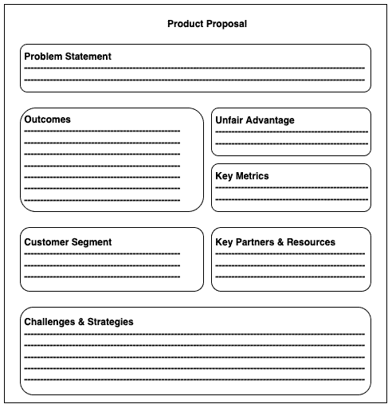

# 提出将人工智能平台作为一种产品

> 原文：<https://towardsdatascience.com/proposing-ai-platform-as-a-product-18f38ed7c099>

## 如何通过客户和利益相关者研究为企业组织中的 AI 平台产品准备建议书？

人工智能平台，最好以自助服务产品的形式提供，对于企业组织的人工智能愿景的成功展示至关重要。交付这样一个产品需要一个可靠的、令人兴奋的提案作为文档。在本文中，我们将介绍如何生成这样一个文档的高级框架。这样的文档需要很好地理解产品生命周期以及与人工智能生态系统中的团队/社区和利益相关者一起做研究的机制。

主要想法是确定人工智能产品的阶段，然后如何在企业人工智能生态系统的目标群体中进行研究。

图 1:人工智能产品生命周期的阶段。图片由作者提供。

像任何其他产品一样，企业组织中的 AI 平台产品有五个阶段，如图 1 所示。

*   **开始**:在这个阶段，人工智能平台产品处于未知领域。平台产品团队需要在很多假设下工作。验证假设的方法是分析假设，快速制作原型，并测试原型。成功的验证定义了产品范围内的特性。这个阶段的最终结果是一个最小可行的平台产品，被一小组高影响力的 AI 团队喜欢和使用。保证这样一个成功的结果具有很高的不确定性和风险，需要通过对产品范围的仔细试验来减轻这些风险。
*   **扩展**:在这个阶段，目标是成熟一个最小可行的平台产品，以扩展到尽可能多的人工智能团队。平台产品团队需要对活动进行优先排序，以解决大规模适应问题。这些活动可以分为两种类型。第一个活动是关于提炼、重组或删除特性，以改善人工智能团队的用户体验。第二个活动是关于改进设计模式和底层系统架构，以处理来自不断增加的人工智能团队的负载，等等。这个阶段的主要成果是一个精炼的核心产品，它被高度评价这个平台的大量用户所采用。
*   **扩展:**在这一阶段，核心平台产品的新机会被发掘出来，这些机会可以通向产品。这些机会通常转化为与人工智能社区一起为新的客户群开发/测试新功能。这可以通过重新利用现有功能或创建新功能来实现。成功的功能将核心产品线扩展到更广泛的客户。扩大人工智能平台产品的范围具有适度的风险。新的特性至少会疏远当前客户的人工智能团队，最糟糕的是会导致糟糕的体验。然而，如果做得好，关键的结果是一个被组织广泛使用的丰富的产品。
*   **维护:**在这一阶段，产品与市场的契合最终得以实现，在平台产品的增长和留存方面存在强大的网络效应。该团队不需要执行任何主要的功能展示，但它需要确保用户体验不断改善。这需要人工智能团队的系统参与，并调整平台产品功能，以推动高影响力的参与。这一阶段的最终结果是一个稳定但不断改进的产品，对其庞大的客户群具有高度影响力。
*   **中止:**生命周期的最后阶段包括结束平台产品的生命，这需要仔细的策略和计划。尽管它令人失望，但该产品需要从市场上撤下，因为它可能不再相关，或者很难让它与人工智能团队保持相关。人工智能技术格局正在迅速变化。因此，当平台依赖于与行业不再相关的技术时，考虑这样一个阶段非常重要。在这个阶段，团队需要引导使用平台的人工智能团队轻松、安全地离开。这个阶段的最终结果是向作为产品客户的 AI 团队发布一个关于产品停产的发布说明。这封信不应该让他们感到惊讶或担心，但可能会有点宽慰。

# 产品提案框架

产品提案通常是由推动产品开发的人员撰写的文档，例如项目经理、产品所有者等。然而，它绝不应该单独完成。提案所有者在起草文档时应该从组织(或地区级)文档和演示文稿中获得灵感。此外，该提案应基于来自平台团队、潜在客户团队或社区细分市场以及人工智能生态系统中的利益相关者的反馈和见解。这些反馈应该来自有针对性的访谈、调查、研究、讨论以及与上述各方的集思广益会议。在广泛共享该文档之前，开发团队和客户群的一些成员应该对其进行审查和评估。

图 2:产品提案框架。图片由作者提供。

图 2 显示了产品提案的结构。本文档的各个部分如下所述。

*   **问题陈述:**产品团队要解决哪些 MLOPs 或 AI 问题。
*   **成果:**产品团队采用的解决方案的价值主张是什么。
*   **不公平优势:**产品团队相对于竞争团队有什么优势，比如外部厂商，现成的解决方案等。
*   **关键指标:**产品团队将使用哪些绩效指标来衡量影响和改进产品。
*   **客户细分:**客户群的特征是什么，并举例说明有代表性的用户/团队。
*   **关键合作伙伴&资源:**在产品处理中有哪些支持合作伙伴、见解和技术，以及如何利用它们来推出解决方案。
*   **挑战&策略:**在产品的生命周期阶段，开发和采用解决方案的挑战是什么，团队将使用什么策略来应对挑战。

请注意，文档的长度应受到限制，例如 2-3 页。

# 进行客户研究

文档的一个关键组成部分是问题陈述和解决方案取得的成果。在定义产品提案时，专业团队通常关注的是这些，而不是解决方案的功能。对于人工智能平台团队来说，这一切都始于非常好地了解人工智能团队和社区的问题。该团队需要进行探索性研究来找出这一点，并提出一个解决方案方法，该领域的一些团队愿意测试和使用该解决方案。团队和社区共享的问题往往是比实际问题更大的问题的症状，这要求平台团队在收集和分析问题信息时保持开放的思维。同样的研究可用于收集客户细分以及挑战和战略信息。

产品团队在研究过程中需要使用的关键概念是理解角色和人物角色。就角色而言，团队需要与购买者和用户打交道。对于人工智能平台产品，买方是产品所有者或人工智能团队的工程经理，他们最终决定团队是否要使用/测试该产品。用户对产品的使用有着细致入微的看法，并且经常提供关于产品特性的核心输入。通常情况下，产品团队与用户一起进行客户研究，确定问题范围，设计解决方案，从用户那里获得解决方案的价值主张，并在 AI 团队的路线图中协商平台产品使用/测试的性质。

人物角色适用于用户。角色可以基于技能学科，例如，数据科学家、机器学习工程师、数据分析师等。它可以基于职责，例如读者、作者、管理员等。也可以根据能力等级，如新手、高级初学者、精通等。在进行客户研究时，平台团队需要找出哪些人物角色是定义产品交付范围所必需的。团队还需要用正确的问题集与目标人物角色中的人交流，以提取设计解决方案方法所需的信息。应该从不同的人物角色类型中提取不同的信息，以确保从讨论中获得更广泛的见解。

重要的是研究要分阶段进行。首先，它应该专注于定义问题陈述。然后，它应该专注于识别客户群，这包括更详细地了解用户和角色。然后，它应该关注解决方案方法的范围以及采用解决方案时的挑战，这有助于确定结果和策略。

如何从客户那里收集信息取决于产品的生命周期。在**开始阶段**，平台团队应该询问关于目标人工智能团队工作方式的痛点，这些痛点属于解决方案方法的范围。因为还没有任何东西存在，所以洞察力的收集必须非常广泛，并且需要针对不同的利益相关者。

在**扩展阶段**，需要对访谈进行范围界定。要收集的关键信息是可用性和用户体验需求，以及团队的潜在路线图。讨论不需要局限于平台的现有用户。然而，对于潜在用户来说，在参与讨论之前，应该对平台的当前状态进行一些培训。在这个阶段，团队应该开始建立系统收集平台使用信息的流程。

对于**扩展阶段**，团队需要执行两种不同类型的洞察收集。首先，它需要像开始阶段一样，从潜在用户那里收集新产品范围的信息。然而，与此同时，平台团队需要研究新产品范围如何影响当前范围。因此，团队需要接触现有用户，探索扩大的产品范围如何影响他们。

对于**维护阶段，**团队需要从平台交互中收集信息，以便系统地优化用户体验。一些信息可以通过监控平台使用情况自动收集。定性信息可以通过调查收集。

对于**停产阶段**，团队需要从当前客户那里收集信息，了解在一段时间后平台是否会停产。

# 进行利益相关者研究

人工智能平台产品的利益相关者包括:

*   **人工智能团队/社区**:他们通过提供价值和优先级信息来规定产品的范围
*   **技术专家:**他们帮助理解与产品相关的技术堆栈
*   数据、IT 和云平台团队:他们决定产品的集成模式、治理过程和部署过程
*   **AI、数据、云、IT 和业务开发领域的高管:T** 他们共同确保开发平台的预算获得批准，并在关键会议和讨论中提及该平台。
*   **技术供应商:**他们提供平台解决方案的核心构件。他们还可以从与其他组织的合作中了解采用挑战和缓解策略。
*   **劳动力供应商:**他们提供劳动力来开发和交付平台的 MVP 版本，特别是当平台存在于组织中缺乏能力或者没有足够的员工来推动计划的领域时。
*   **商业协调员:**他们通过对技术和劳动力供应商进行适当的尽职调查，帮助签订合同
*   **学习/能力发展团队:**他们提供支持，通过学习之旅、培训和研讨会提高组织内的平台使用能力

与其他现有的或现成的解决方案相比，上述利益相关者集体提供了平台产品在组织内可能具有的不公平优势。他们还提供与产品相关的关键合作伙伴和资源信息。

为了弄清楚这一点，不同类型的讨论需要与不同类型的利益相关者进行。人工智能团队/社区需要对他们未来将如何从产品中受益感到兴奋。**技术专家**需要详细理解问题陈述，以便理解技术堆栈的需求。数据、IT 和云平台领域的不同**技术团队**需要将他们的技术方法和发布时间表与产品的技术方法和发布同步。高管们需要了解资源是如何使用的，投资的潜在回报是什么。**技术供应商**需要了解解决方案方法、时间表、所需组件和性能规格。**劳动力供应商**需要了解解决方案方法、时间表和期望的能力。**商业服务商**需要知道供应商名单、时间表和交付规格。**学习和能力发展团队**需要了解使用平台的核心能力以及时间表，以便能够正确设计和规划学习计划。

# 评论

人工智能产品提案必须对其应用领域和用户群有充分的了解。不这样开始会导致产品团队在黑暗中漫游，场景可能是虚构的、有偏见的、不相关的。提案必须基于收集或更新上述关键输入的前期工作。虽然它没有为需要的每一个上下文做好准备，但是它们涵盖了一些最重要的上下文。如果你觉得设计中应该包含其他东西，请分享。