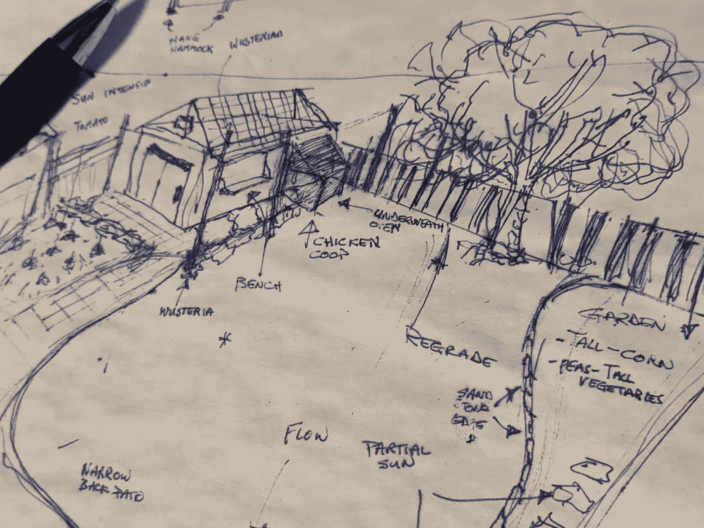

# 保护自己免受数据咨询项目中最大问题的困扰

> 原文：<https://towardsdatascience.com/protecting-yourself-against-the-biggest-problem-in-data-consulting-projects-16d76b779821>

## 清楚地定义你的可交付成果以避免项目漂移

大足石刻。中国重庆。图片由作者提供。

作为我专业工作的一部分，我在法律和非营利部门做了大量的数据咨询。这项工作通常涉及分析管理数据，从大量文本文档中提取信息，以及构建可视化和仪表板。我喜欢这份工作，因为它的灵活性、学习新事物的机会和经济收益。与此同时，数据咨询可能具有挑战性。本文讨论了如何保护自己免受我认为所有数据咨询项目中最大的问题:项目漂移。

# 什么是项目漂移？

项目漂移是指项目的目标和范围随着时间的推移而改变。有时项目漂移在项目启动时立即开始。或者问题慢慢出现，并随着时间的推移而积累。

通常，项目偏离是由于你的客户对要解决的问题不清楚。项目漂移表现为一系列探索性的活动，这些活动不会导致特定的可交付成果。有时，项目中会出现新的想法，这会导致对新的分析或向仪表板添加另一个功能的请求。有些请求简单快捷，所以我不介意免费提供。其他看似很小的请求，比如添加一个“按钮”来过滤数据，可能是一项非常耗时的任务。

项目漂移对客户和顾问都有影响。对客户来说，这意味着为不能解决原始问题的工作付费。对于顾问来说，这意味着做更多的工作却没有得到适当的补偿。

# 保护您自己和您的项目

如果你对数据咨询感兴趣，你需要战略性地考虑保护每个项目——和你自己——不受项目漂移的影响。

## 定义您的可交付成果

避免项目漂移的最好方法是清楚地定义可交付成果。花尽可能多的时间去弄清楚对你的客户来说成功是什么样的。如果你的客户不能定义成功，你可能还没有准备好启动这个项目。在他们试图解决的问题和你的分析将如何导致可行的见解或解决方案之间建立清晰的联系。

当被要求分析一个数据集时，要清楚你将回答哪些问题以及如何格式化。与出版物质量的图形或交互式数据可视化相比，提供格式良好的输出是一种完全不同的交付方式。在阐明可交付成果时，要尽可能具体。了解结束项目需要什么。如果你的项目永远不会结束，你就不能建立一个可持续的数据咨询实践。

## 明确合同中的可交付成果

我最大的菜鸟错误之一是在口头同意交付细节的情况下接受数据仪表板项目。还是那句话，尽可能具体，把一切都写下来。因此，当你收到额外的超出范围的工作请求时，你可以将对话带回书面合同，而不是试图回忆最初的协议。

处理请求的一个方法是创建一个不同想法的列表，以确保你的客户感到被倾听。当您将对话引向实际交付成果时，您可以讨论这些想法如何成为补充合同的一部分。

从头到尾的项目说明书。图片由作者提供。

## 创建项目时间表

拥有一个项目时间表有助于进一步界定你的工作范围。通过概述将交付的内容以及何时可以帮助管理客户期望。与客户一起使用项目管理工具是确保所有工作透明的一个很好的方法。有许多优秀的工具可以达到这个目的。我已经成为 Airtable 的忠实粉丝，它有一个非常棒的免费增值选项。您可以使用此[附属链接](https://airtable.com/invite/r/RzqQwLhD)创建一个帐户。

## 结构化项目会议

围绕可交付成果保持导向的另一个重要方法是召开结构化的项目会议。我喜欢在所有咨询项目会议中使用以下议程:

*   回顾自上次会议以来的成就
*   讨论下一次会议的交付内容
*   定义谁在做什么
*   识别可能影响交付成果完成的障碍
*   根据需要审查其他问题

关键是确保每个人都与项目目标和可交付成果保持一致。当你从数据中发现真知灼见时，小心不要让太多的讨论涉及探索有趣的途径。“有趣的”和“有用的”之间存在着显著的差异——而且许多这样的对话并没有让你更接近可交付成果。

作者的第一次正式项目会议。

## 助手的自主权

我经常让助手参与到我的项目中，给他们机会来建立使用真实世界数据的数据技能。当我和助手们一起工作时，我会经常检查以确保我们保持在正轨上。不熟悉数据处理的助手可能会很快偏离主题，有时会从事不属于商定的可交付成果的活动。我强烈建议在与助手一起工作时，尽可能使用实时通信工具。我更喜欢 Slack，因为它可以让我在不同的项目中集中所有的交流。

# 总结

最终，成功的项目需要高度的结构化。为了避免项目漂移，您必须清楚地定义可交付成果，并积极地管理项目活动以保持在正确的轨道上。