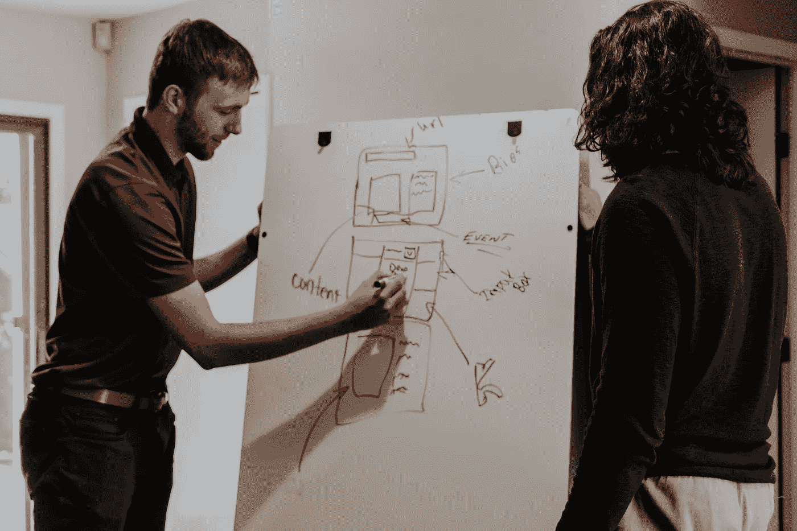

# 有效可视化和 Web 分析应用的原型

> 原文：<https://towardsdatascience.com/prototyping-for-effective-visualizations-web-analytics-applications-fc2dec8f8568>

## 使用原型设计增强您的设计思维技能和生产力

[万花筒](https://unsplash.com/es/@kaleidico?utm_source=unsplash&utm_medium=referral&utm_content=creditCopyText)在 [Unsplash](https://unsplash.com/?utm_source=unsplash&utm_medium=referral&utm_content=creditCopyText) 上拍摄的照片

# 概观

使用视觉图像来讲述一个强有力的故事，并提供可操作的见解，这既是一门艺术，也是一门科学。虽然有几种商业智能工具可供使用，但一些数据爱好者更喜欢创建独一无二的可视化和图表来传达他们的故事。许多可视化专家更喜欢使用 Javascript 中的开源库，如 Chart.js 和 D3.js，或者使用 Gleam、Altair 和 Python 中的其他可视化库来创建引人入胜的可视化效果。有些人走得更远，将这些可视化捆绑到一个漂亮的网络分析应用程序中。这种解决方案可能比实现标准的商业智能解决方案更便宜，尤其是对于中小型公司。

在选择定制的可视化解决方案时，可能会出现利益相关者犹豫不决的情况。这可能是因为它对他们来说仍然是一个抽象的概念。这时应该向他们展示使用定制可视化解决方案的切实好处。在某些情况下，利益相关者可能已经知道了好处，但是希望得到某种保证，以便能够信任专家并为项目发放资金。这就是快速原型法的用处。

让我们来讨论为什么快速原型是开发伟大可视化的可行选择。

# 利益相关者偏见

图片来自[穆罕默德·哈桑](https://pixabay.com/users/mohamed_hassan-5229782/?utm_source=link-attribution&utm_medium=referral&utm_campaign=image&utm_content=3233158)来自 [Pixabay](https://pixabay.com//?utm_source=link-attribution&utm_medium=referral&utm_campaign=image&utm_content=3233158)

有时，一个可视化或 web 分析项目可能涉及多个利益相关者；他们中的每一个都可能想要结合不同的元素。即使是正式的业务需求收集会议也可能无法解决利益相关者相互冲突的期望。在许多情况下，项目可能会因为利益相关者的冲突请求而超时。最终的可视化结果可能不会令利益相关者和最终用户满意。因此，在开发可视化之前，将原型开发作为一项活动来添加是很重要的。原型可以很快地被修改，在相对较短的时间内融合不同涉众的需求。

# 迭代设计和开发成本

原型可以减少与迭代设计和开发以及后续的重新设计/返工相关的时间和金钱。如果实际的可视化工作涉及到需要在每次业务需求改变时修改的几行代码，这一点尤其正确。当增加额外的需求时也是如此。另一方面，原型需要相对较少的时间来进行修改。一旦涉众为每个迭代签署了原型，就可以开始该迭代的开发。

里卡多·迪亚斯在 [Unsplash](https://unsplash.com/s/photos/time-and-money?utm_source=unsplash&utm_medium=referral&utm_content=creditCopyText) 上的照片

# 厌恶改变

当试图修改现有的产品或流程时，通常会出现厌恶改变的情况。当一个产品在功能上被修改或视觉上被重新设计时，随之而来的变化会在用户中产生负面反应。虽然厌恶改变是完全自然的，但是包含最终用户反馈的早期原型策略将确保更好的采用。这也将确保利益相关者和最终用户确信他们是变革的一部分。

照片由[罗斯·芬登](https://unsplash.com/@rossf?utm_source=unsplash&utm_medium=referral&utm_content=creditCopyText)在 [Unsplash](https://unsplash.com/s/photos/change-reaction?utm_source=unsplash&utm_medium=referral&utm_content=creditCopyText) 拍摄

# 原型工具

在这里，我们来看两个原型工具，它们提供了很好的特性，并且拥有一个共享大量想法和资源的活跃用户社区。

## 菲格玛

Figma 是一个工具，可用于开发各种应用程序的原型，从 web 应用程序和移动应用程序的用户界面设计到线框可视化和报告。下面是一个使用 Figma 创建的样本原型

作者图片

Figma 有一个活跃的用户社区，他们通过提供免费和付费的插件、小部件和 UI/UX 组件为该工具做出贡献。Figma 还提供了一个具有 API 和集成支持的开发平台，能够创建新的插件、小部件和应用程序。具体来说，在可视化和报告的上下文中，Figma 有一些插件，使您能够创建 KPI 图块、趋势线和各种图表，这些图表可以帮助您快速创建可视化的原型。Figma 还提供协作工具和白板，使团队能够聚集在一起并参与原型制作会议。许多用户使用 Figma 构建线性原型，并构建相关的自动化流程。

# Axure

Axure 是另一个快速原型开发工具，可以帮助创建网站、应用程序和可视化的原型，而无需代码。Axure 提供了一个独立的桌面应用程序和一个云平台。它有一个强大的小部件库，用于流行的开源可视化库，如 chart.js. Axure 支持与吉拉、Confluence、微软团队和 Slack 的集成，从而确保团队成员随时了解任何新的变化。

# 素描

Sketch 是另一个强大的工具，可用于构建原型，以可视化使用标准商业智能工具难以可视化的用户和客户旅程。Sketch 也可以用于 A/B 测试活动，在这些活动中，您可以轻松地向测试人员展示您的原型的多个版本，并立即获得反馈。

# 结束语

虽然我只谈到了这三种原型工具，但市场上还有很多可供尝试的工具。在这里提到这些产品并不意味着我在推广或认可它们。我只是在传达这样一个事实，即对于构建优秀的可视化和 web 分析应用程序来说，这样的原型工具可能是一个有价值且高效的选择。