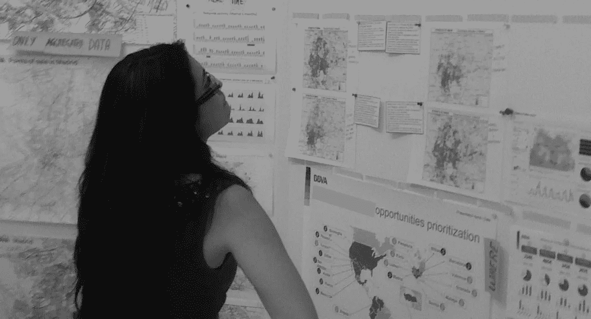
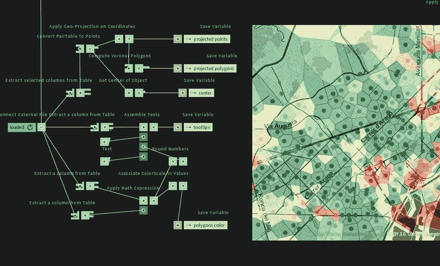
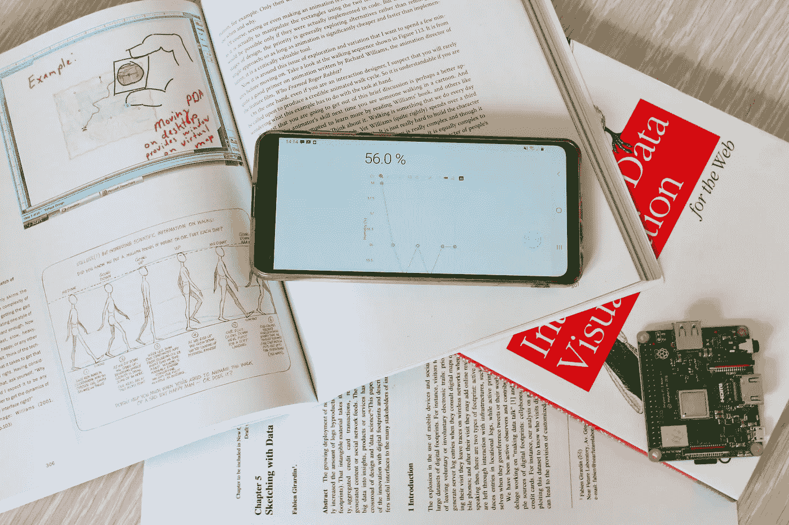
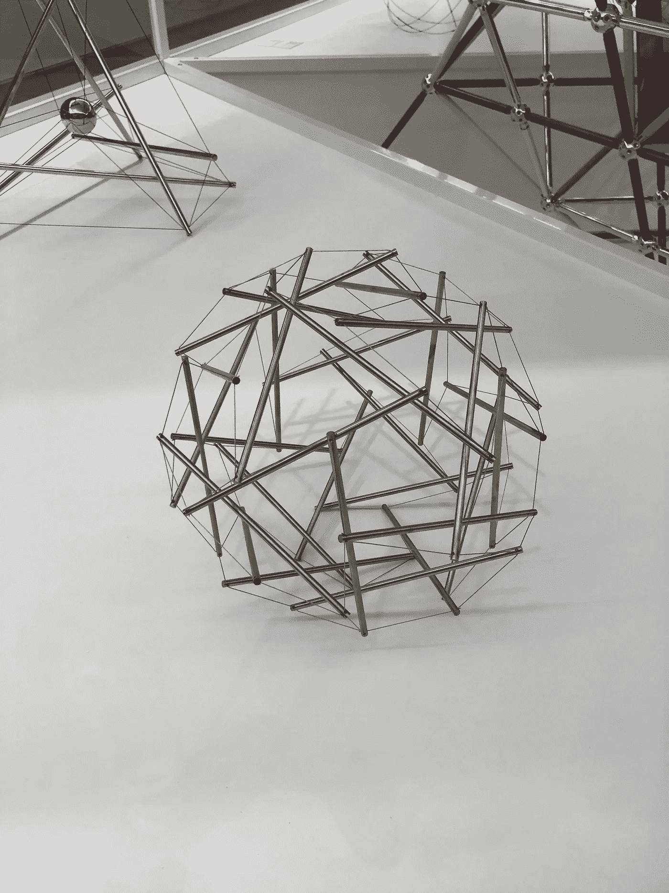

# 数据科学中的原型

> 原文：<https://towardsdatascience.com/prototyping-in-data-science-32ceb118caf8>

## Jose A. Rodriguez 和杨奇煜·吉拉尔丁关于数据科学家如何超前思考的对话

图片由生殖艺术家 Iskra Velitchkova 提供。

数据科学家的定义在不断发展，尤其是随着领域专业化程度的提高。我不反对专业化，除了我认为不是所有的数据科学家都应该被归类到解决特定问题或自动化特定流程的角色中。数据科学实践的相当一部分是关于探索尚未成型的想法。它是关于好奇，测试假设，寻找没有人在看的地方，最重要的是，它是关于理解该做什么，而不是跟随当前的“生产东西”的技术文化。这就提出了一个问题，即如何给数据科学家空间，让他们超前思考。

在与 BBVA[人工智能工厂](https://www.bbvaaifactory.com/)的高级数据科学家和项目经理 Jose A. Rodriguez-Serrano 的对话中，我们引入了术语“发现驱动的原型开发”来描述数据科学中的原型开发如何导致探索决策的可能路径。

*👋你好！我的名字是* [*杨奇煜*](https://girardin.org/fabien) *。每周，我都会留出几个小时与任何人(如学生、同事、朋友、其他专业人士等)进行视频通话。)谈论任何与数据科学和/或设计相关的话题。这些对话提供了时间来思考和反思我们的实践和项目，远离围绕数据和人工智能工作的持续宣传。这是其中一次幕后讨论的大致记录。*

*📅* [*在我的日历上预定一个 45 分钟的时间段*](https://calendly.com/fabiengirardin/office-hours)

创意公司作者图片。

**法比安**:不久前，你推荐我读皮克斯的联合创始人艾德·卡姆尔的《创造力公司:克服阻碍真正灵感的看不见的力量》。有一句话让我印象深刻:

> 选择一条路是不够的，你必须沿着这条路走下去。这样做，你会看到你刚开始时不可能看到的东西；你可能不喜欢你所看到的，其中一些可能会令人困惑，但至少你会像我们喜欢说的那样，“探索邻近地区。”这里的关键点是，即使你决定你在错误的地方，仍然有时间走向正确的地方。”——艾德·卡姆尔

这种心态与我实践数据科学的方式产生了很好的共鸣。随着该领域专业化的增加，我经常听到对组织中数据科学职能角色的狭隘定义。我观察那些埋头苦干的团队，忙于小的改进或短期需求。他们的范围仅限于解决特定的业务问题或优化现有的流程。

但是当问题基于假设或者没有很好的定义时会发生什么呢？如果优化系统的设计没有考虑其影响(如偏差、质量)，会发生什么？当没有人真正知道什么样的基础设施或数据集是必要的时，会发生什么？当一个想法在会议中只被抽象的观点讨论过，会发生什么？

我相信数据科学实践的一部分旨在解决这些问题。它的目的是在路径未知时“探索邻居”。它旨在发现未知的未知，通过创建可能的路径(如原型、实验)来指导决策。

你同意这个观点吗？

用数据探索社区。图片作者。

**何塞**:完全同意。*创意公司*擅长论证企业探索和实验的必要性。用简单的话来说，你提到的那句话是:只有在让一个好的团队为之努力之后*，你才会看到某些想法的价值，而在此之前*不会。**

这本书让我相信，当满足三个特定条件时，这种方法是有意义的:首先，在一个创造力是区分因素的行业工作；第二，在不断变化的环境中工作；第三，与高技能团队合作。虽然这本书谈到了电影行业，但大多数在科技行业工作的人，尤其是数据科学家，都会在他们的工作环境中认识到这三个条件。

然而，我也相信数据科学团队可以超越他们的实验思维。类似于*creative，Inc* 的论点，我认为在数据科学项目中有两种“深度”的探索。第一个是众所周知的:如果我们想到数据科学家的“典型一天”，实验自然会出现在探索性数据分析、验证新假设或优化资源的创造性任务中。称之为“解决方案驱动的原型”。第二个是关于*发现没人注意的地方*。称之为“发现驱动的原型”。这种深度探索了这样的问题:我们确定没有完全不同的更好的方法来设计这种服务吗？我们是否忽略了使用当前数据或能力的新产品功能？

因为大多数数据科学家来自科学或工程背景，我认为解决方案原型对我们来说是很自然的。但是，正如你所建议的，在数据科学中，发现驱动的原型还有很大的空间。在 BBVA AI 工厂，我们[有几项探索性的举措](https://www.bbvaaifactory.com/category/data-processing/)。最近，我们启动了一项关于数据科学原型的计划，以扩大这种思维模式，并发现正在进行的项目之外的价值。

我知道你长期以来一直倡导一种跨越数据科学和设计界限的[实践](https://girardin.medium.com/experience-design-in-the-machine-learning-era-e16c87f4f2e2)，那么所有这些是否与你的经历有共鸣？

是的，但是我从来没有那样想过你的原型范畴。这让我想起了 Alexander Osterwalder 和其他商业理论家如何谈论组织的[“利用”和“探索”功能](https://www.strategyzer.com/blog/posts/2016/12/19/innovation-is-dead-long-live-innovation)。开拓意味着改善一个成功建立的业务，而探索则是拓展组织核心活动的边界。他们将一家能够实现这两个目标的公司描述为一个“双手并用的组织”。

所以——是的，[我一直在思考开发双手通用的数据科学功能](/the-mindset-for-innovation-with-data-science-fc51605a4867)。

我也有工程背景，但我已经学会了通过设计的语言来处理数据。在麻省理工学院的研究过程中，我意识到原型驱动思维对于技术专家超前思考的价值。那时，我提出了“[用数据](http://www.girardin.org/fabien/publications/girardin_sketching_with_data_pre-editing_2014.pdf)画草图”的概念，试图描述我们在那里用数据和软件(如可视化、地图、算法、交互界面、模型)为需要“探索社区”的组织快速产生有形结果的实践。

2014 年用可视化编程平台 [Quadrigram](https://www.quadrigram.com/) 绘制数据草图。图片作者。

在工程和数据科学领域，原型意味着快速试验技术，看看它是否可行，但在设计领域，一个好的原型还提供了第二功能。它通过创造一个“东西”来帮助愿景超越假设和松散的想法。结果讲述了一个关于“可能是什么”的故事。它不一定是为了建立一个商业案例或展示一个技术解决方案，但它必须揭示问题的空间。例如，几年前，在不久的将来实验室，我们为一个客户制作了他们的第一个推荐系统的原型。其结果不是一个硬业务问题的解决方案，而是组织内的某种特洛伊木马，以发现数据中的缺点、他们缺乏的特定知识集以及如果有一天决定开发大规模推荐系统的影响。

**JOSE:** 首先，我承认我很喜欢你的措辞“用数据画草图”。它带回了“草图”的概念，这在设计中表示一个非常初步的产品版本，以快速和廉价的方式生产。它的目标是进一步“思考”产品，并分享和讨论产品创意以完善它，正如巴克斯顿的[草图用户体验](https://www.goodreads.com/book/show/980280.Sketching_User_Experiences)中突出解释的那样。

图片作者。

巴克斯顿[区分草图和原型](https://www.cs.cmu.edu/~bam/uicourse/Buxton-SketchesPrototypes.pdf)，对我来说，数据科学原型属于*快速廉价*，甚至*一次性*工件。为什么？使用数据进行编码和编程比 15 年前(巴克斯顿的书写出来的时候)更容易、更快、更便宜，因此原本要在纸上画草图的概念可以在计算机屏幕上用一些数据进行真实测试(例如，参见基于可视化工具的[原型聊天机器人界面](https://dev.to/propelauth/rapid-prototyping-a-gpt-3-app-with-flask-and-propelauth-2jne)或[客户关怀洞察](https://www.paulprae.com/data-science-prototypes/)、Flask 之类的 python 库和对第三方 NLP APIs 的调用)。

我认为我们正在接近一个时代，在这个时代，你可以在构思过程的早期就制作原型，这些原型是用真实的软件和真实的数据构建的，作为一种早期思考和讨论产品想法的方式。或者正如亚马逊的应用科学家尤金·严所说:

> *“有时，由大量研究和数据支持的深思熟虑的提议无法说服决策者。但是一个简单原型的演示会让他们兴奋并准备好投入。我很惊讶这种情况经常发生。”—* 尤金·严

或者就像设计师和城市学家丹·希尔说的那样:“[让原型做决定](https://benholliday.medium.com/the-prototyping-mindset-320de6ec79c8)”。

我对发现驱动的原型开发有更广泛的定义，不仅仅是编写代码。事实上，原型可以是任何讲述尚不存在的服务的真实故事的东西:一个[快速入门指南](https://shop.nearfuturelaboratory.com/products/helios-pilot-quick-start-guide)，一个拆箱视频，一个城市指南，[产品目录](https://shop.nearfuturelaboratory.com/products/tbd-catalog)，一个[地图](https://blog.nearfuturelaboratory.com/2019/10/21/a-map-of-geneva-for-autonomous-vehicles/)，一个 FAQ 页面，一个维修手册，[新闻文章](https://shop.nearfuturelaboratory.com/collections/artefact-from-the-future/products/winning-formula)等等。最近，我们为一家初创企业制作了他们的年度报告《来自未来》。该原型为联合创始人提供了一种独特的方式，在编写任何代码之前，预先设想他们想法的机会、风险和后果。受我的同事朱利安·布里克(Julian Bleecker)的启发，他在 2020 年写了他的初创公司的年度报告——从 2024 年开始(T9)，该报告鼓励就公司对数据的使用和数据科学的作用进行详细的决策讨论。你不是向未来前进，而是从未来回来报告，就好像它已经发生了一样。在不久的将来实验室，我们称这种方法为设计虚构。

OMATA 2024 年年报…写于 2020 年。图片由[朱利安·布里克](https://www.julianbleecker.com/)提供。

除了设计虚构之外，我还观察到了在主要组织中应用的不同风格的发现驱动原型。例如，在谷歌担任工程总监时，阿尔贝托·赛唯雅曾经谈到过预打字。亚马逊首席技术官沃纳·威格尔在 2006 年就已经阐明了公司的“逆向工作”惯例。

这些组织的共同点是，他们都明白决策的目的是框定形势，而不是选择最佳方案。他们擅长观察周围的角落，而不是做出最好的决定。他们探索出可供选择的方案。然而，即使有这些例子，仍然很难说服那些只依赖 ROI 和 KPI 来管理组织的人。

发现驱动的原型的影响很难在电子表格中报告，但是实践对于“去风险”(例如，快速识别和纠正错误的决策)是必不可少的。想想尽早发现你的假设是错误的价值。或者，预测数据中的盲点对组织有什么价值？错过一个机会有什么价值？所以，探索是有成本的:做的成本和不做的成本。而且，正如你之前强调的，制作原型的成本从未像今天这样便宜。

我理解一个企业短期 KPI 和激励机制的局限性，但你与怀疑主义斗争的经验是什么？

**JOSE:** 在选择原型策略时，有许多挑战需要克服，从团队如何组织到沟通。我解释了发现驱动的原型开发的主要目的是确保有价值的想法进入下一个阶段(反过来，在深入开发阶段之前，不太好的想法可以被停止或改进)。有效的方法因组织而异。

我听说过一些公司[在 5 天的“高峰期”](https://medium.com/convergeml/rapid-prototyping-in-machine-learning-ffe79f023aec)开发原型，或者其他公司遵循[成熟的原型框架](https://www.ifm.eng.cam.ac.uk/news/reducing-the-risk-of-failure-in-new-product-development/)。这些都是准时的例子；我确实相信，每个组织都必须进行试验，找到自己喜欢的“收获”创意和消除风险的方式。

在 BBVA 人工智能工厂，我在过去几年里一直领导着与应用研究、创新或水平能力相关的项目。我已经提出了一系列在建立原型项目之前可以应用的良好实践，这些实践对以后会产生影响:

*   **转换语言**:把重点放在传达原型带来的差异化优势上，而不是原型本身或底层技术上。或者，[如哈潘](https://hpdailyrant.medium.com/letter-to-a-young-designer-wax-on-wax-off-b9457dcca568) : *“爱上问题，而不是爱上解决方案。问‘我们如何优化购物流程’和问‘我们如何优化购物流程’有很大的区别。vs，“我们如何帮助用户重复购买？”。*
*   **有一个采用计划**:根据目前的假设，当原型工件完成时，谁会是它的用户？他们将开始体验什么好处？
*   **参与**:与这些潜在用户就计划达成一致，让他们尽早参与讨论、决策，甚至成为原型开发团队的一员。
*   **期望责任**:必须指定至少一个人来“关心”原型的采用。

最后，虽然这看起来是可有可无的，但我倾向于强烈主张将原型计划的结果“民主化”(一般来说，任何创新和研究计划的结果)。这可以是简单的行动，如内部“展示和讲述”和外部交流(我非常喜欢[快速前进实验室](https://blog.fastforwardlabs.com)传播他们的发现)，但也可以包括通过内部源代码库提供原型供内部重用。因为原型是关于学习的，通过使结果大众化，你希望其他人在你的工作的基础上产生更多的学习。

法比安:最后一点让我想起了建筑师、设计师和未来学家巴克明斯特富勒是如何将实验设计成获取知识的途径以及知识的网络生产和传播的。那是 70 年前的事了(！)他已经强调了过度专业化的问题:

> “当然，我们的失败是许多因素造成的，但可能最重要的一个因素是，社会运作的理论是专业化是成功的关键，而没有意识到专业化排除了全面的思考。”—巴克明斯特·富勒

围绕短程线圆顶的巴克明斯特富勒实验。图片作者。

**继续对话……**

你可以通过正规的网络终端与我联系。每周我都会留出几个小时用于[办公时间的视频电话](https://calendly.com/fabiengirardin/office-hours)让任何人谈论任何与数据科学或设计相关的事情。我们可以讨论你的早期项目，我们可能合作的方式，最近的阅读，你面临的挑战，等等。📅你可以在我的日历上预定一个 45 分钟的时间段。

杨奇煜·吉拉尔丁是一位双手灵巧的思想家/实干家，他在远见、技术和设计之间来回跳跃。他是[不久的将来实验室](https://www.nearfuturelaboratory.com/)的创始合伙人，这是一个由以设计小说先锋闻名的成功实践者组成的分布式网络。BBVA 数据分析公司前联合首席执行官，麻省理工学院研究员。🧑之父🏻‍🚀和🌙。你可以[在 Twitter](https://twitter.com/fabiengirardin) 和 [LinkedIn](https://www.linkedin.com/in/fabiengirardin/) 上关注他，或者直接[联系](https://girardin.org/fabien)。

**Jose a . Rodriguez-Serrano**是 [BBVA 人工智能工厂](https://www.bbvaaifactory.com/)的高级数据科学家和项目经理。以前，他是施乐公司的区域经理和研究科学家。几年前，我们在金融服务公司 BBVA 合作开发了一个“Edge”项目。我们的目标是通过开发具有机器学习新兴趋势的原型来拓展组织核心能力的边界。阅读[他与人合著的一些帖子](https://www.bbvaaifactory.com/author/joseantonio-rodriguez-serrano/)，或者在 [Twitter](https://twitter.com/qupixel) 和 [LinkedIn](https://www.linkedin.com/in/jose-a-rodriguez-serrano-46505653/) 上关注他。