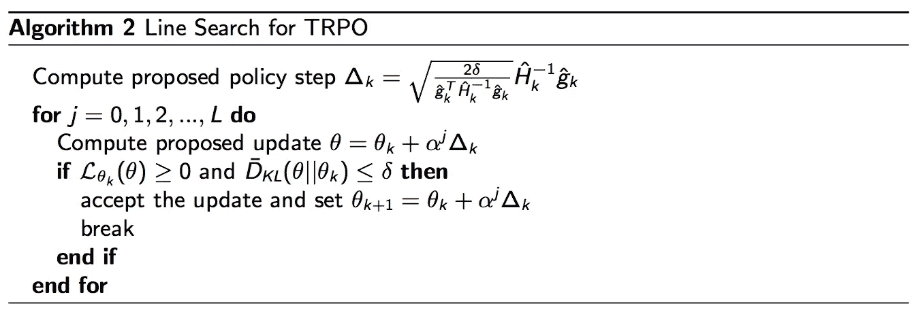
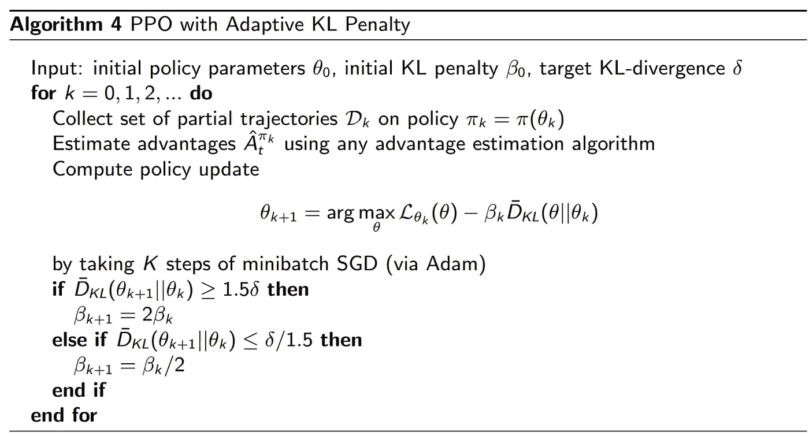
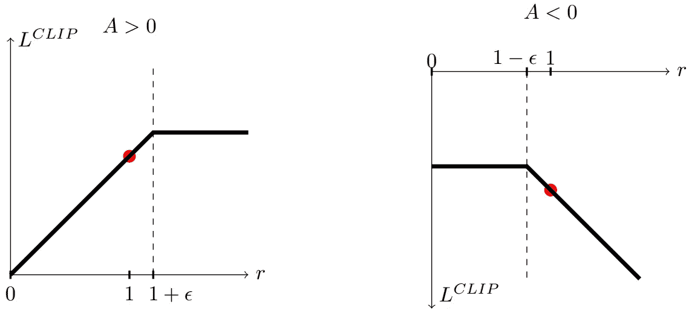
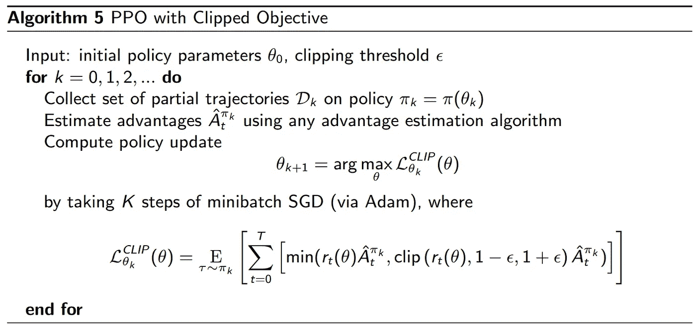

# 解释了最近策略优化(PPO)

> 原文：<https://towardsdatascience.com/proximal-policy-optimization-ppo-explained-abed1952457b>

## 从强化到连续控制中的 go-to 算法

诺亚·布舍尔在 [Unsplash](https://unsplash.com?utm_source=medium&utm_medium=referral) 上的照片

最近策略优化(PPO)目前被认为是强化学习的最新发展。OpenAI 在 2017 年推出的算法似乎在性能和理解之间取得了正确的**平衡**。从经验上看，它与质量基准具有竞争力，甚至在某些任务上远远超过它们。同时，对于广泛的用户的实际采用来说，它是足够简单的，这不能对每个 RL 算法都这样说。

从表面上看，传统的政策梯度法(如加强法)和 PPO 的差别并不大。基于这两种算法的伪代码，你甚至可以说它们有点相似。然而，这一切背后都有丰富的理论，需要充分欣赏和理解算法。

我将简要讨论策略梯度方法、自然策略梯度和信任区域策略优化(TRPO)的要点，它们共同构成了走向 PPO 的垫脚石。

# 普通政策梯度

*要理解这篇文章，很好地理解政策梯度方法是必要的。如果还没有，你可能想先看看这篇文章:*

 [## 强化学习中的策略梯度解释

### 了解所有关于基于似然比的政策梯度算法(加强):直觉，推导，和…

towardsdatascience.com](/policy-gradients-in-reinforcement-learning-explained-ecec7df94245) 

在 RL 的上下文中，策略 *π* 只是一个函数，它返回给定状态 *s* 的可行动作。在基于策略的方法中，函数(如神经网络)由一组可调参数*θ**定义。***我们可以调整这些参数，观察所得奖励的差异，并朝着产生更高奖励的方向更新 *θ* 。这一机制是所有政策梯度方法概念的基础。

策略 *π_θ(a|s)* 是随机的，这意味着参数规定了动作 *a* 的**采样概率，从而影响跟随轨迹 *τ=s_1，a_1，…s_n，a_n* 的概率。这样，我们可以表示依赖于 *θ* 的目标函数:**

目标函数，产生与随机政策成比例的国家行动轨迹。

在随机策略中，我们用相应的概率对各种行为进行采样——这样我们就可以衡量回报的差异。观察到的奖励，结合行动概率，产生一个奖励信号。为了**确定改进目标函数的更新方向**，策略梯度方法依赖于梯度 *∇_θ* (导数的向量)。这产生了以下更新函数:

传统的策略梯度更新函数，基于目标函数梯度∇_θJ(θ和步长α更新策略权重θ

虽然我们有奖励信号和更新*方向*，但是我们不知道到*我们应该更新多少*政策。**选择正确的学习率 *α*** 是一个挑战。权重更新的不一致影响加剧了这个问题。考虑以下两种策略同等幅度的权重更新。显然，左边的分布比右边的分布受影响更大。但是，欧几里德距离(即参数距离)是一样的！

正态分布对的比较。左边有μ_1=0，μ_2=1，σ_1=σ_2=0.3。右边有μ_1=0，μ_2=1，σ_1=σ_2=3.0。虽然两对之间的欧几里德距离是 1，但是很明显右边的一对比左边的一对更相似。[图片由作者提供]

由于政策变化大的风险，**样本仅使用一次**。然后，我们使用更新后的策略进行重新采样，这是相当低效的。另一个问题是回报轨迹可能变化很大，导致更新的波动。

总之，政策梯度存在重大缺陷:

*   **样品低效—** 样品仅使用一次。此后，更新策略，并使用新策略对另一个轨迹进行采样。由于采样通常很昂贵，这可能会令人望而却步。然而，在一次大的政策更新后，旧样本根本不再具有代表性。
*   **不一致的策略更新—** 策略更新往往会超过并错过奖励高峰，或者过早停止。特别是在神经网络结构中，消失和爆炸梯度是一个严重的问题。该算法可能无法从糟糕的更新中恢复。
*   **高回报差异—** 政策梯度是一种蒙特卡罗学习方法，考虑了完整的回报轨迹(即完整的一集)。这样的轨迹经常遭受高方差，阻碍了收敛。*【这个问题可以通过添加一个评论家来解决，这超出了本文的范围】*

# **自然政策梯度**

*不熟悉自然政策梯度？先看这篇文章:*

 [## 解释强化学习中的自然策略梯度

### 传统的政策梯度方法存在固有的缺陷。自然梯度收敛得更快更好，形成…

towardsdatascience.com](/natural-policy-gradients-in-reinforcement-learning-explained-2265864cf43c) 

Amari (1998)和 Kakade，S. M. (2001)提出的自然政策梯度解决了选择适当学习率的问题。为此，该方法嵌入了**二阶导数**，量化了更新权重时梯度的敏感度。

Kullback-Leibner (KL)背离衡量政策 *π_θ* 因更新而改变的程度。请记住，策略是由概率分布表示的，它决定了选择给定操作的概率。 **KL 散度**定义如下:

KL-divergence，量化权重更新前后政策之间的距离。

现在，如果我们将更新的散度限制为不超过 *ϵ，*我们可以使用以下方案来更新权重:

权重更新方案，最大 KL 偏差由ϵ设定上限

上述方案实际上是不可用的，因为 RL 使用采样观测值。为了将发散考虑在内，使用了修改后的目标函数上的**泰勒展开**。我们对目标执行一阶展开，并对 KL 散度执行二阶展开。经过一些数学努力，下面的更新公式出现了:

自然政策梯度的权重更新公式

总之，难以确定的学习速率 *α* 已经被一个**动态学习速率**所取代，这取决于目标函数的局部灵敏度。这种灵敏度由费希尔信息矩阵 *F(θ)* 表示。当部署时，自然梯度更新公式允许在不敏感区域(例如，平台)进行较大的更新，而在弯曲区域(例如，接近奖励峰值)进行较小的更新。

理论上，自然梯度允许以适当的步长确保稳定的更新。由于限制了策略改变的幅度，我们也可以**多次重复使用样本**，提高样本效率。然而，在现实中，自然梯度表现出许多缺点:

*   **对费希尔矩阵 *F* 求逆比较繁琐——**矩阵求逆是一种运算复杂度为 *O(N )* 的运算。鉴于神经网络通常包含数千个参数，这通常是禁止的。此外，由于所做的近似引入的数值不稳定性，反演可能会失败。
*   ****KL 约束可能不满足—** 泰勒展开式只是理论目标函数的近似值。因此，分析得出的步长通常太大，并且仍然表现出过冲行为。**
*   ****政策改进未得到验证** —尽管自然梯度提供了所有令人放心的理论保证，但该方法并不检查更新是否实际产生了改进。同样，由于近似值，情况可能并非如此。**

# **信任区域策略优化(TRPO)**

***作为 PPO 的直接前身，补上 TRPO 可能会不错:***

** [## 解释了信任区域策略优化(TRPO)

### 强化学习算法 TRPO 建立在自然策略梯度算法的基础上，确保更新保持…

towardsdatascience.com](/trust-region-policy-optimization-trpo-explained-4b56bd206fc2) 

自 1990 年代后期自然政策梯度出现以来，已经取得了一些进展。这些最佳实践已经被结合在流行的 **TRPO 算法**中，由舒尔曼*等人*于 2015 年推出。

为了简洁起见，我将再次省略许多细节。不过，有两个等式至关重要。首先，替代优势*𝓛_π_θ(π_θ+δθ)——*根植于重要性抽样*——*反映了更新的**预期优势:**

替代优势𝓛的定义，使用来自策略π_θ的样本描述更新策略π_θ+δθ的预期优势

第二，我们可以通过更新前后策略之间的最坏情况 KL-divergence 来限制替代优势的近似误差。这产生了以下不等式:

描述更新后目标值最小变化的不等式。右手边表示下限，考虑到对发散误差进行了修正的替代优势。

罚分 *C* 已经过分析推导，产生了一个相当严重的发散罚分。如果我们遵循理论上的 TRPO 方法，我们会有非常小的更新和缓慢的收敛。

因此，实际的 TRPO 算法在一些关键点上不同于理论基础。区分 TRPO 的**理论模型** **(基于惩罚)和实际实现(基于约束)**是很重要的——这种区别在后面讨论 PPO 时是相关的。

具体而言，TRPO 的实际实施通过以下三个调整改进了自然梯度:

*   **共轭梯度法**—自然政策梯度计算只需要乘积*f^-1∇logπ_θ(x)*我们实际上对逆矩阵本身不感兴趣。共轭梯度可以比矩阵求逆更快地逼近这个乘积，从而大大加快了更新过程。
*   **线搜索** —由于简化，为自然政策梯度导出的分析步长可能违反 KL-divergence 上限。TRPO 从最初建议的步长开始，但是在更新之后测量是否不违反发散约束。如果是，它迭代地和指数地收缩信赖域(使用收缩参数 *α^j* )，直到满足散度约束。
*   **改进检查**——最终，我们希望我们的更新能够改进政策。TRPO 通过在接受替代损失(𝓛(θ)之前，实际验证替代损失在更新之后是否有所改善，来认可这种观点。回想一下，由于近似值，理论保证不再成立。

后两种改进在下面的算法片段中都可以看到:

线搜索算法。该算法确保更新不会违反发散约束(使用指数衰减α^j)，并且更新不会降低策略的性能[来源: [Joshua Achuam，UC Berkeley](http://rail.eecs.berkeley.edu/deeprlcourse-fa17/f17docs/lecture_13_advanced_pg.pdf)

TRPO 解决了许多与自然政策梯度相关的问题，并获得了 RL 群体的广泛采用。然而，仍然存在一些缺点，特别是:

*   **无法处理大型参数矩阵** —尽管部署了共轭梯度法，TRPO 仍然难以处理大型 Fisher 矩阵，即使它们不需要求逆。不幸的是，深度神经网络包含许多参数，精确逼近 *F* 需要大量样本。
*   **二阶优化速度慢**—TRPO 的实际实现是基于约束的，需要计算前述的 Fisher 矩阵，这大大降低了更新过程的速度。此外，我们不能利用(一阶)随机梯度优化器，如亚当。
*   **TRPO 很复杂** — TRPO 很难解释、实施和调试。当培训没有产生预期的结果时，很难确定如何提高绩效。因此，它不是最用户友好的 RL 算法。

# 近似策略优化(PPO)

2017 年，舒尔曼*等人*在 TRPO 基础上引入了近似政策优化(PPO)。给定所有的背景信息，PPO 比以前的算法做得更好和不同的是什么？

PPO 有两个主要的变种**要讨论(都在 2017 年的论文中介绍过):PPO 罚分和 PPO 夹分。我们将首先看一看基于惩罚的变体，它在概念上最接近于 TRPO。**

## PPO —具有自适应 KL 惩罚的变体

TRPO 的理论基础将 KL 偏差封装为软惩罚——如前一节所述——然而实际实现是基于*约束*的。理论上的 TRPO 通过分析得出一个与偏离相乘的罚值，然而在实践中，这个罚值通常过于严格，只能产生非常小的更新。因此，问题是如何**可靠地确定缩放参数*β*以允许有意义的更新，同时避免过度漂移:**

该约束的问题是**很难确定适用于多个问题设置的 *β*** 的单个值。事实上，即使是同一个问题，特征也可能随着时间而改变。由于我们没有对分歧设置硬性限制，有时我们会比其他时候更严厉地处罚。

PPO 以务实的方式解决了这个问题。它设置了一个**‘目标散度’***δ*；我们希望我们的更新在这个分歧的附近。目标差异应该大到足以实质性地改变策略，但又小到足以使更新稳定。

每次更新后，PPO 都会检查更新的大小。如果实现的偏离超过目标偏离超过 1.5，对于下一次迭代，我们通过加倍 *β* 来更严厉地惩罚偏离。反过来，如果更新太小，我们就将 *β* 减半，有效地**扩展了信任区域**。你可以在这里看到 TRPO 的线搜索的一些相似之处，然而 PPO 的搜索是双向的。

如您所料，基于超过某个目标阈值的 1.5 倍将β加倍和减半并不是精心证明的结果；这些值是启发式地确定的。我们将**不时地违反约束**，但是通过调整β可以相当快地纠正它。根据经验，PPO 似乎对数值设置相当不敏感。总之，为了实用主义，我们牺牲了一些数学的严谨性。

PPO 的基于惩罚的变体概述如下。请注意，它非常类似于 TRPO 的理论模型，但使用了一些启发式近似，使其也可实际应用。

> 由于 PPO 更新相当小，在一定程度上重复使用生成的样本是可能的，用重要性采样项来校正更新的动作概率。PPO 执行 K 个更新步骤；当超过某个偏离阈值时，实现通常部署早期停止。

PPO，罚变。目标函数嵌入了对 KL 散度的惩罚。基于相对于目标散度的测量散度动态更新相应的权重β_ k[来源:[舒尔曼等人 2017](https://arxiv.org/pdf/1707.06347.pdf)

PPO 比自然梯度和 TRPO 更容易**实现**，不需要分析结果、基于约束的程序或二阶导数。相反，我们可以使用流行的随机梯度下降算法(如 ADAM)来执行更新，并在更新过大或过小时调整惩罚。

总之， **PPO 比 TRPO** 更容易合作，同时也更有竞争力，甚至经常超越它。让我们看看我们是否能做得更好。

## PPO —具有剪切物镜的变体

修剪过的 PPO 是目前流行的变体，也是我们在讨论“PPO”时通常所指的。它通常优于基于惩罚的变体，并且更易于实现。

我们不再费心去改变惩罚，而是简单地限制政策可以改变的范围。由于剪辑范围之外的更新所获得的优势不用于更新目的，我们提供了保持相对接近现有策略的激励。目标函数仍然依赖于代理优势，但现在看起来是这样的:

这里， *ρ_t* 是重要抽样比:

项 *(1-ϵ)⋅A* 和 *(1+ϵ)⋅A* )不依赖于 *θ* ，因此产生的梯度为 0。因此，**可信区域之外的样本被有效地丢弃**，阻止过大的更新。因此，我们没有明确地约束策略更新本身，而是简单地忽略了过度偏离策略所带来的好处。和以前一样，我们可以简单地使用 ADAM 这样的优化器来执行更新。

在 PPO 的这种变体中，替代优势被削减了。如果更新后的策略与原始策略的偏差超过ϵ，则样本产生的梯度为 0。这种机制避免了策略的过大更新，将其保留在可信区域内[图片由[舒尔曼等人 2017](https://arxiv.org/pdf/1707.06347.pdf) ]

> *‘为什么是最小运算符？’*，你可能会问。为什么不直接剪辑？问得好。在积极优势的情况下，当更新的政策与旧政策偏离太大时，我们总是会进行剪辑。赢的时候，我们倾向于谨慎。失败时，有一种情况需要特别注意:优势 a 为负，1+ϵ为负。换句话说，我们进行了一次大规模更新，增加了采取更糟糕行动的可能性。在这种情况下，无界优势 *r_t ⋅ A* 比削波优势 *(1+ϵ) ⋅ A* 低*。当我们取两者的最小值时，我们使用无界信号来执行更新，允许更大的更新来纠正我们的错误更新。这种形式的回溯是一种非常漂亮的修正机制，允许快速撤销错误方向的更新。*

有六种具有相应更新行为的重要情况(即，策略应该不同且优势非零)。为了理解 PPO，最好花点时间来理解下表中总结的案例:

PPO 剪切目标的六个非平凡案例的总结。修剪后，梯度为零，无助于训练，不利于大规模政策更新[作者表格，基于 [Bick，2021](https://fse.studenttheses.ub.rug.nl/25709/1/mAI_2021_BickD.pdf) ]

为了实现期望的行为，我们应该调整 *ϵ* ，作为对 KL 发散的**隐式限制。根据经验， *ϵ=0.1* 和 *ϵ=0.2* 是运行良好的值。这些值与自然政策梯度的理论基础有些偏离(该理论建立在假设 *π_θ=π_θ_k* 的局部近似基础上)，但从经验上看，它完成了工作。**

完整的算法详述如下。

PPO，剪切的客观变体。新旧政策之间的最大差异被缩小了。如果策略偏离得太远，它们的样本就不会用于更新，从而阻碍了大规模更新。注意，文中用 *ρ_t 代替 r_t 来描述重要性抽样比*【来源:[舒尔曼等 2017](https://arxiv.org/pdf/1707.06347.pdf) 】

## PPO2？

你可能听说过 PPO2 这个术语。我们还需要更多的数学吗？

幸运的是，PPO2 只是 Open AI 发布的算法的更新版本。PPO2 是一个矢量化环境的实现，它针对 GPU 进行了**优化，并更好地支持并行训练**。它还有许多其他不同之处(例如，优势被自动规范化，值函数也被裁剪)，但使用了本文中概述的相同数学基础。如果您计划直接使用 OpenAI 实现，只需记住 PPO 已经过时，现在应该使用 PPO2。

# 结束语

自 2017 年推出以来，PPO 已迅速成为连续控制问题中的**最佳算法。五年对于机器学习来说是一段很长的时间，但在基准问题(主要是经典控制问题和雅达利游戏)的类别中，它仍然具有很高的竞争力。**

看来 PPO 在速度、谨慎和可用性之间取得了恰当的平衡。尽管缺乏自然梯度和 TRPO 所具有的理论保证和数学技巧，PPO 比其竞争对手收敛得更快更好。有些矛盾的是，在深度强化学习中，简单似乎是有回报的。** 

***今天的强化学习还没做完吗？看看下面的文章吧！***

** [## 为什么强化学习不需要贝尔曼方程

### 强化学习中著名的贝尔曼方程和 MDP 公式的再评价

towardsdatascience.com](/why-reinforcement-learning-doesnt-need-bellman-s-equation-c9c2e51a0b7)  [## TensorFlow 2.0 中离散策略梯度的最小工作示例

### 一个训练离散演员网络的多兵种土匪例子。在梯度胶带功能的帮助下…

towardsdatascience.com](/a-minimal-working-example-for-discrete-policy-gradients-in-tensorflow-2-0-d6a0d6b1a6d7)  [## TensorFlow 2.0 中连续策略梯度的最小工作示例

### 一个简单的训练高斯演员网络的例子。定义自定义损失函数并应用梯度胶带…

towardsdatascience.com](/a-minimal-working-example-for-continuous-policy-gradients-in-tensorflow-2-0-d3413ec38c6b) 

# 进一步阅读

**论文**

*   阿马里，S. I. (1998 年)。[自然梯度在学习中很有效。](https://d1wqtxts1xzle7.cloudfront.net/32944066/Amari_-_Natural_Gradient_works_efficiently_in_learning-with-cover-page-v2.pdf?Expires=1662047457&Signature=KiOeWpPHdAWivpd0vlFhsg4bbZt~AmV1GA5ZL9ZwUMdjDPzzLB7fMeFiaBOQ11wYGgW5MKXX-gGgGgqQms3aHjpGYivUeN~U0xeXBwceDoz6jh4~7i8G--7rdavlU0HVj1sxX1vrQUSk~qVXqbsjKm-wCtwuk9o6jXUfeJql1PGTv65T70akN6rWVPUb3mW7Xw8drbgBfDsUh1AWCrczpSuWUIZG4n~gCzmGzfqb~Jfj3zBy~WbzSLNFUgMoT3FsrI-fq0~gMkmyXKThnd~4gY00k445Y0HKQmHjNq5RO9~OCr9~kx1tTvks6Zd9BBjtUBmHPAywLiQzPHWPEAf0-A__&Key-Pair-Id=APKAJLOHF5GGSLRBV4ZA) *神经计算*， *10* (2)，251–276。
*   比克博士(2021)。*(硕士论文)对最近的政策优化提供一个连贯的自足的解释。格罗宁根国立大学。*
*   *Kakade，S. M. (2001 年)。[自然的政策梯度。](https://proceedings.neurips.cc/paper/2001/file/4b86abe48d358ecf194c56c69108433e-Paper.pdf) *神经信息处理系统的进展*， *14* 。*
*   *舒尔曼，j .，莱文，s .，阿贝耳，p .，乔丹，m .，莫里茨，P. (2015)。[信任区域策略优化。](http://proceedings.mlr.press/v37/schulman15.pdf)参加*机器学习国际会议。**
*   *舒尔曼，j .，沃尔斯基，f .，德里瓦尔，p .，拉德福德，a .，&克里莫夫，O. (2017)。[近似策略优化算法](https://arxiv.org/pdf/1707.06347.pdf)。 *arXiv 预印本 arXiv:1707.06347* 。*

***讲座幻灯片***

*   *高级政策梯度(CS 285)。加州大学柏克莱分校。*
*   *Achiam，J. (2017 年)。[高级政策梯度方法。加州大学伯克利分校。](http://rail.eecs.berkeley.edu/deeprlcourse-fa17/f17docs/lecture_13_advanced_pg.pdf)*
*   *自然政策梯度，TRPO，PPO (CMU 10703)。卡内基梅隆。*
*   *舒尔曼，J. (2017)。[高级政策梯度方法:
    自然梯度、TRPO 等。](https://drive.google.com/file/d/0BxXI_RttTZAhMVhsNk5VSXU0U3c/view?resourcekey=0-6NrgDm29IIPlXsPESX2w4w) OpenAI。*

***网站***

*   *自然渐变(TRPO，PPO)。[ [链接](https://julien-vitay.net/course-deeprl/notes/3.6-PPO.html)*
*   *OpenAI (2018)。信任区域策略优化。[ [链接](https://spinningup.openai.com/en/latest/algorithms/trpo.html#id2)*
*   *拥抱脸(2022)。很深。[ [链接](https://huggingface.co/blog/deep-rl-ppo)*
*   *稳定基线(2021 年)。PPO2。[ [链接](https://stable-baselines.readthedocs.io/en/master/modules/ppo2.html)***