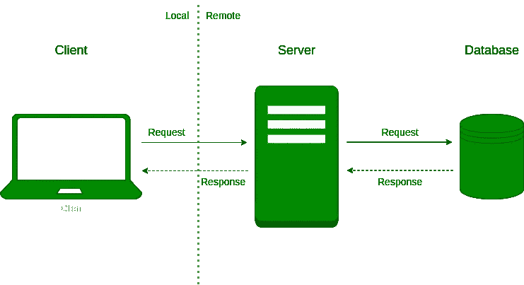

# 将您的 ML 模型从服务器中拉出:数据库解决方案

> 原文：<https://towardsdatascience.com/pull-your-ml-model-out-of-your-server-the-database-solution-a00b212f5e0d>

## 何时将模型放入数据库，如何放置，为什么

本杰明·雷曼在 [Unsplash](https://unsplash.com?utm_source=medium&utm_medium=referral) 上的照片

在上一篇文章中，我们看到了您希望使用 Streamlit 和 Gradio 等工具来快速部署和部署许多版本的机器学习(ML)应用程序的一个极好的理由。

  

我们看到了服务器模型架构的优势，以及为什么您在构建原型时一定要走这条路。这是从信任的测试人员的私人圈子中获得快速反馈和评估你的产品想法的市场可行性的最简单的方法。

然而，我们的结论是，当进入生产阶段时，您需要重新考虑您的设计，并将您的 ML 模型从您的应用服务器中取出。有几个问题，比如编程语言、不同的扩展需求和独立的更新周期，使得服务器架构模型方法对于生产来说不是一个好主意。

那么我们能做什么呢？如果我们重新查看简单的 web 应用程序架构图，我们会看到有三个选项:

*   将您的模型放入数据库中
*   将您的模型放入它自己的推理服务器
*   将您的模型放在边缘(即更靠近您的客户)

一个通用的 web 服务架构——作者图片

在这个故事中，我们将研究如何让第一个选项发生，当你想要走向这个解决方案时，以及这个方法的优点和缺点。

> [Learning Rate](https://www.dimpo.me/newsletter?utm_source=medium&utm_medium=article&utm_campaign=model-in-db) 是一份时事通讯，面向那些对 AI 和 MLOps 世界感到好奇的人。你会在每个月的第一个星期六收到我关于最新人工智能新闻和文章的更新和想法。订阅[这里](https://www.dimpo.me/newsletter?utm_source=medium&utm_medium=article&utm_campaign=model-in-db)！

# 将您的 ML 模型移入数据库

将您的 ML 模型移入您的数据库是一种黑客行为。你不用在你的数据库系统中运行任何代码。相反，您可以定期对新数据离线运行模型，将结果保存在本地，并遵循标准的 ETL(提取-转换-加载)过程将预测存储在数据库中。

这是将模型投入生产时您能想到的最简单的设计。您不必维护模型运行的基础设施，您不必真正关心它的性能，并且您不会因为每个请求的延迟而失眠。

因此，这似乎是完美的解决方案，但是，正如你所想象的，这不是一个银弹。这种方法适用于特定的用例:

*   推荐系统
*   营销自动化

如果你的推荐系统每天只为每个用户做一个预测，我们正在谈论的设计是完美的。想象一个顾客走进一家商店。一进门，他们的智能手机就会收到一条推荐信息，告诉他们哪些产品符合他们的偏好。

在这个用例中，您可以每天运行您的模型，将每个用户的预测存储在您的数据库中，然后完成它。然而，它并不与每个推荐系统相关。如果您需要在动态环境中进行实时预测，数据库中的模型体系结构将无法满足您的需求。话虽如此，今天生产中的许多推荐系统都是这样工作的。所以，如果你的情况很合适，不要犹豫。

对于营销自动化，比如客户细分，在数据库中移动模型可能会更好。例如，考虑这样一种情况，您想要运行某种无监督学习算法来识别用户群，并随后针对他们开展促销活动。您可以运行一次该算法，并将每个用户的组标识符存储在数据库中。就是这样！

## 你为什么要这么做？

那么，这种方法的优点是什么？首先，也是最重要的，它实现起来很简单。我们看到，您不需要关心基础架构或性能之类的东西。您甚至可以在笔记本电脑上运行您的模型，并将预测存储在 CSV 文件中。然后将 CSV 加载到您的数据库中。

它也很容易扩展。您依赖于几十年来对数据库系统的创新和工程设计，使它们能够适应数百万的请求。出于同样的原因，你(通常)为你的用户获得低延迟。

## 你为什么不应该做它？

坏处呢？第一个缺点是这种方法不能扩展到复杂的输入类型。如果你的用户想要得到一张图片或者一段文字的信息，该怎么办？这个问题根本没有办法解决。

然后，在训练过程中，您的模型会暴露在推断时可能不相关的数据点中。因此，您的用户无法获得最新的预测，并且您的模型经常变得陈旧。

# 结论

数据库中的模型方法是将 ML 模型从 web 服务器中取出来的一种途径。我们看到了这种方法覆盖的用例类型以及它的优缺点。我的建议是，如果你的情况是这种设计的候选，从这里开始。它很容易实现，没有理由过度设计。

下一篇文章将介绍何时应该将模型放入自己的推理服务器，以及如何做。这可以说是最常见的架构设计，几乎涵盖了所有用例。

# 关于作者

我叫[迪米特里斯·波罗普洛斯](https://www.dimpo.me/?utm_source=medium&utm_medium=article&utm_campaign=model-in-db)，我是一名为[阿里克托](https://www.arrikto.com/)工作的机器学习工程师。我曾为欧洲委员会、欧盟统计局、国际货币基金组织、欧洲央行、经合组织和宜家等主要客户设计和实施过人工智能和软件解决方案。

如果你有兴趣阅读更多关于机器学习、深度学习、数据科学和数据运算的帖子，请关注我的 [Medium](https://towardsdatascience.com/medium.com/@dpoulopoulos/follow) 、 [LinkedIn](https://www.linkedin.com/in/dpoulopoulos/) 或 Twitter 上的 [@james2pl](https://twitter.com/james2pl) 。

所表达的观点仅代表我个人，并不代表我的雇主的观点或意见。