# 通过统计过程控制推动您的销售

> 原文：<https://towardsdatascience.com/push-your-sales-with-statistical-process-control-52321f329405>

## 质量控制图是一个被低估的销售分析概念吗？

使用 SPC 识别随机噪声或系统漂移(法国海岸，图片由作者提供)

统计学的一个子领域是统计过程控制(SPC)。在任何有关数据科学的书籍中，SPC 几乎从未被提及。最重要的是，SPC 很少用于销售数据。我认为 SPC 在这个分析概念中被错误地定位了。实际上，SPC 可以作为探索性数据分析(EDA)和——顾名思义——过程控制的有力补充。本文将解释使用 Python 对销售数据进行 SPC 的基本概念，并为您提供一个现成的 Excel 模板，其中包括质量控制图(QCC)和箱线图，以便快速直观地了解。

我们要做的是:

*   分析销售时间序列的趋势和残差
*   建立一个 QCC 来检测“失控”的销售事件
*   通过分解成更有意义的次级销售过程来提高 QCC

SPC 是如何工作的？

SPC 简而言之就是控制过程稳定可靠地运行，以保证达到规范目标[1]。这可以很好地应用于“受控环境”，如生产车间过程或实验室条件下。至于销售，那就更难了。我们现在将发现原因。

**地点:**

让我们假设我们的销售人员每天能够卖出这么多商品:

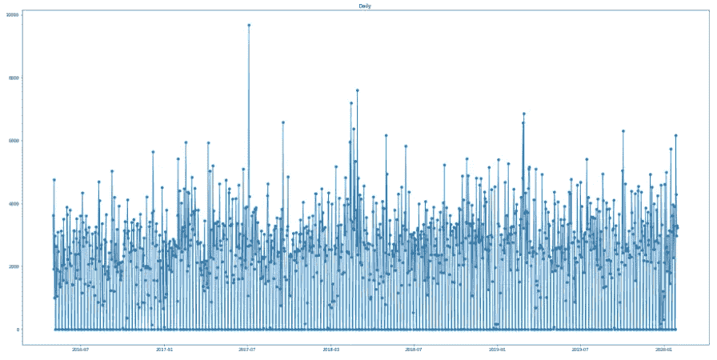

在日常销售中，很难只见树木不见森林。

看到这里，我们能知道我们的销售流程做得好不好吗？显然，在这个细节层次上，这真的很难做到。问题是，当我们按月汇总时，是否会丢失销售流程的重要信息:

每月总销售额

这已经让我们对销售结果有了更清晰的了解。我们甚至可以通过采用月平均值而不是总和来进一步平滑吗？

每月平均销售额。

均值并不平滑，事实上它指出似乎有三个时间序列具有相似的平均销售额。这一见解将有助于我们以后建立 QCC。

我们一眼就可以看出总体趋势是积极的。2016 年初，我们的销售额相对较低。在 2018 年 2 月，我们面临着异常高的销售额。从 2019 年开始，我们达到了最高的平均销售额。

我们的目标是让我们的 salesforce 同事快速了解他们的销售活动进展情况。他们给我们的反馈是每日分析是两个细节。另一方面，如果只看月销售额或平均销售额，他们担心会失去对销售活动的重要洞察。他们是绝对正确的，因为例如离群值对平均销售额有很大的影响。中位数受异常值的影响较小，但是中位数本身也不能给我们一个公平的销售发展观点。因此，我们觉得需要在我们的合计值中添加一些东西，以便更好地说明整体销售流程的运行情况，同时不要用过高的粒度使其过载。

**离散度:**

平均值或总数本身并不能告诉我们太多关于销售过程的信息，但我们必须至少加上标准偏差才能看到月销售额的变化:

每月标准偏差

让我们计算连续几个月之间的差异，看看我们能否发现销售发展中的任何季节性模式:

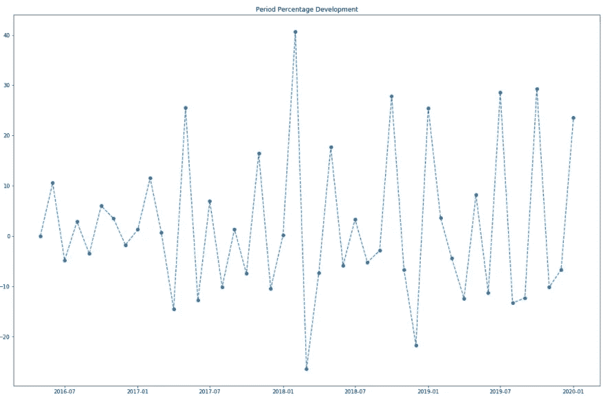

逐月发展百分比。

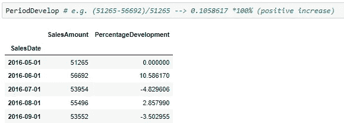

查看月份之间的销售额增加或减少。

将这些平均百分比绘制为每月的总体发展情况，我们可以看到 1 月(1)和 2 月(2)与前一个月相比是销售额增长最高的月份。另一方面，与前一个月相比，3 月(3)、4 月(4)和 12 月(12)的下降幅度最大。

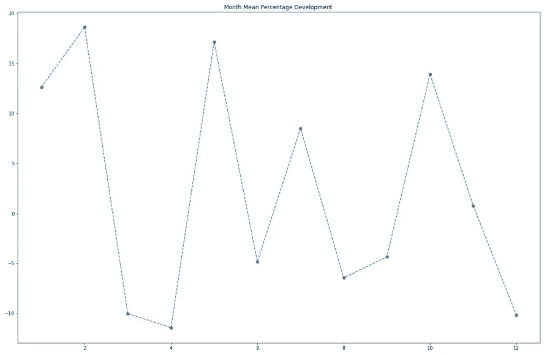

逐月增加或减少的平均百分比。

箱线图对于直观检查标准差、最小值和最大值非常有用。范围是最小值和最大值之差。每个百分点代表 25%的数据。Q1 是从分钟开始的 25%的数据。Q2 涵盖了 50%的数据。这就是为什么盒子里的线代表中间值。如果平均值和中间值接近，这可能是正态分布的一个标志(我们将看到为什么这可能是特别有趣的)。通过计算第 25 个(Q2)、第 50 个(中间值)和第 75 个(第 3 季度)百分点，我们可以计算出中间 50%的数据。这个箱线图指标被称为四分位距(IQR= Q3-Q1 ),它给出了关于平均值的平均方差的指示。让我们选择一个特定的月份，查看详细信息:

我们正在使用 Plotly Express 创建一个交互式的方框图

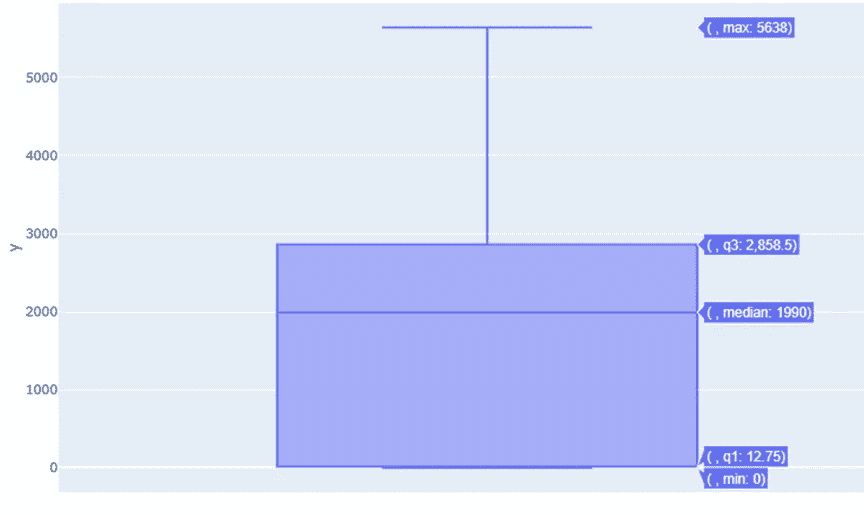

如果箱线图背后的计算对您来说是新的，您也可以查看 Excel 公式来交叉检查上面的 Plotly Express 公式:

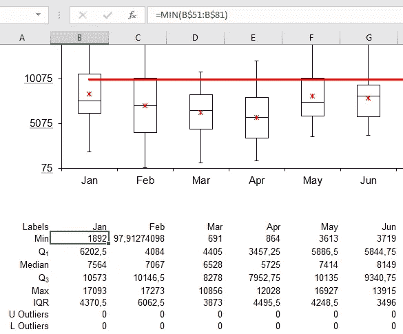

Excel 公式可能有助于新手更快地理解箱线图计算

**描述性统计解释:**

现在，让我们用一个更深刻的统计基础来确认我们的视觉检查:

只有我们的时间序列的系统观测、趋势、季节和剩余(噪声)成分可以被建模。在我们的例子中，趋势与时间序列的斜率增加有关(总体趋势是积极的)。当我们将销售过程分成更有意义的连续子过程(关于时间框架)时，趋势分析非常重要，我们稍后会看到这一点。季节性是由重复的短期周期引起的与平均值的偏差。我们正面临着二月份的季节性高峰。残差也很有趣，显示了 2017 年 9 月至 11 月、2018 年 1 月至 3 月以及 2018 年 9 月至 11 月期间的较高可变性。噪声是序列中的随机变化。

到目前为止，我们主要计算描述性统计数据来描述我们的销售历史。下一步，我们希望设置警报，一旦我们的销售结果超出历史发展的预期，就会触发警报。因此，我们现在将弄清楚如何将月总和、平均值、标准差和预警全部放在一个图表中。

## 质量控制图:

一般的六适马[2]方法是使用三倍标准差(+/-)来计算平均值的控制上限和下限。这种技术背后的想法是，我们估计 99.73%的数据将落在这些控制上限和下限之间(假设特定的分布，我们将在后面更详细地讨论)。因此，如果数据点不时失控，也没关系。那只是正常的噪音。只要随后的数据点落在控制范围内，该过程仍然可以被描述为稳定的。但是一旦太多的点超出了控制范围，这就强烈地表明过程开始失控。这将在该过程用尽随机噪声时给我们一个早期指示。我们稍后会看到，在没有事先进行分布分析的情况下，是否允许使用 3 倍标准差。

为 X 和 QCC 先生策划 UCL 和 LCL

如果 QCC 背后的计算对你来说是新的，你也可以看看 Excel 公式来交叉检查上面的 Python 代码:

如果小于 0，将 mR 图表中的 LCL 设置为 0 是不常见的。由于这是一个控制销售的 QCC(而不是医疗设备)，我相信为了我们的目的稍微调整一下 SPC 背后的统计数据是可以的。

在 X 图中，显示了每月的总和(黑线)。控制上限和下限(UCL 和 LCL)按平均值(蓝线)的 3 倍标准差+/-计算:

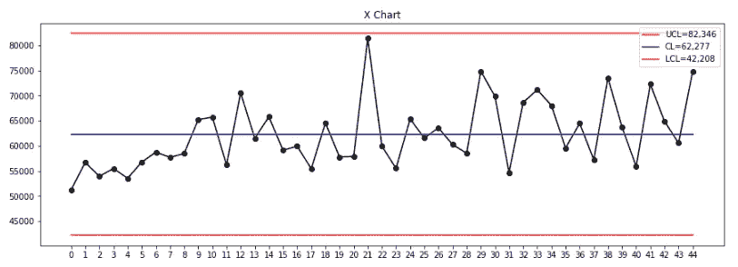

在 X 图表中使用月销售总额..

使用控制图，我们可以很容易地看到转变中的变化。因为通常所有的数据点都应该平均分布。虽然我们仍在控制范围内，但平均值在整个时间段内发生了系统性的变化。在 mR 图表中，我们可以看到不同月份之间的离差非常不同:

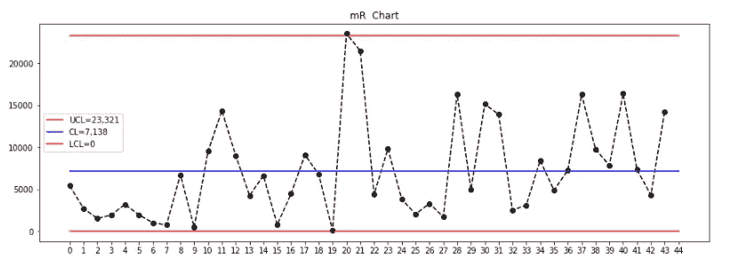

..并结合月度波动范围的 mR 图表。

> 通过持续的监控，我们可以确保我们能够尽早发现流程中的变化。我的过程能满足规格要求吗？虽然这听起来像是生产流程的必要要求，但我们也可以用它来衡量我们的销售。当然，我们不会不高兴收到高于控制上限的销售。这就是为什么没有控制上限的控制图也是可能的。但我更喜欢保留它们，因为它有助于我们的眼睛更容易发现系统的变化。

我们已经看到，我们的销售呈现出整体积极的趋势。在建立统计流程图时，趋势是违反直觉的。这就是为什么我们不应该尝试在整个销售时间框架内使用一个控制图的原因。但相反，我们应该将销售分成更有意义的子流程。

## QCC 的改进:

我们不会用一张控制图来控制整个销售。原因是数据点彼此差异很大。例如，一开始销售新产品通常与销售已经在市场上销售了很长时间的产品是非常不同的销售过程。

我们还没有涉及的一件事是数据的分布。当涉及到 QCC 和任何类型的统计建模时，了解分布是至关重要的。

## 分发:

只有当我们找到一个模型——来自数据的分布——足够公平地描述我们的销售数据时，我们才能设置有意义的控制限制。

让我们计算一些指标来更精确地说明分布情况:

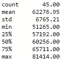

绘制销售金额直方图:

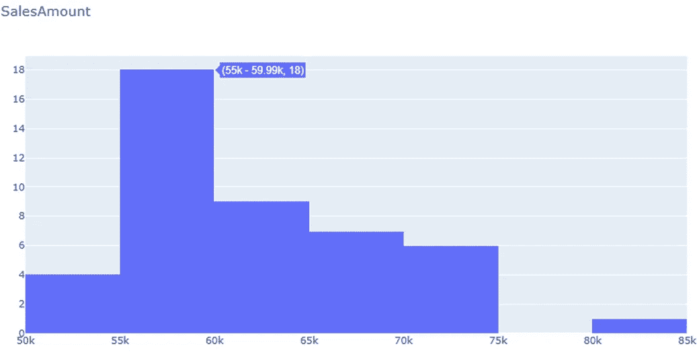

直方图描述了销售分布。

除了上面的直方图之外，添加偏度和峰度以进一步了解分布的形状:

甚至均值和中位数也有很大差异，这也表明我们的数据不符合正态分布。

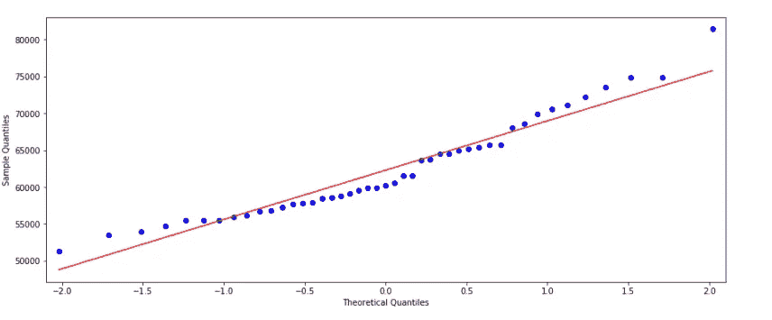

这也与我们之前绘制的残差相匹配:

残差表示噪声信号。

因此，我们的销售时间序列不能被描述为正态分布也就不足为奇了:

这清楚地表明，不要像我们刚刚做的那样，对完整的时间序列使用一个具有 3 倍标准差的 QCC。我们需要更详细地检查我们的时间序列。

**异常值检测:**

调查数据的分布总是与异常值检测密切相关。因为这篇文章的主题不是发现异常值，所以我们不会详细讨论这个问题。你可能想读一下我的先知帖子，在那里我给出了一个例子，关于如何发现不寻常的销售数据点。

 [## 循环中的先知

### 我们将使用脸书的先知来预测销售时间序列数据。已经有很多很棒的教程了…

towardsdatascience.com](/prophet-in-a-loop-a875516ef2f9) 

蓝色阴影置信区间外的黑点可视为异常值。

控制图是用来控制你的过程的。这意味着在失控时采取对策。为了以富有成效的方式建立控制图，您需要预先决定在计算控制极限时应该考虑哪些数据。原因是您不想让错误输入或异常数据伪造您的控制范围。因为我们正在谈论销售数据(而不是技术生产过程)，我们将考虑所有的销售数据。

**子流程:**

我们现在将把我们的销售历史分成三个子流程。为什么是三个？还记得我们之前画的月平均销售额吗？

每月平均销售额。

很明显，至少有三个平均数，而不是一个。第一个销售子流程从开始持续到 2017 年 1 月:

这个时间序列现在可以描述为正态分布:

遵循正态分布并不意味着它确实是正态分布。

我们现在做得很好，预计销售额将在平均销售额的+或- 3 倍标准差范围内。因此，如果下个月 salesforce 高于控制上限，他们就完成了一项非凡的工作。而如果他们在下面，他们一定可能对这一意外事件有特殊的原因:

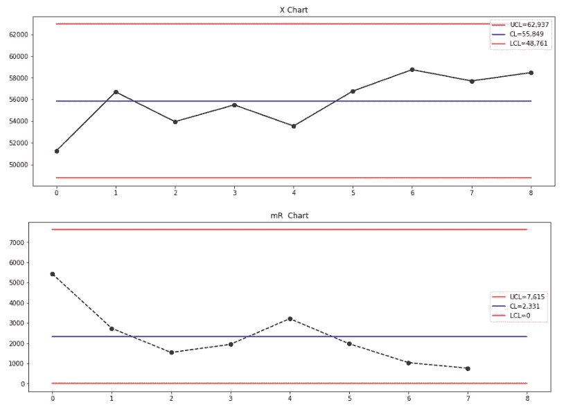

让我们对其他两个子流程重复一下:

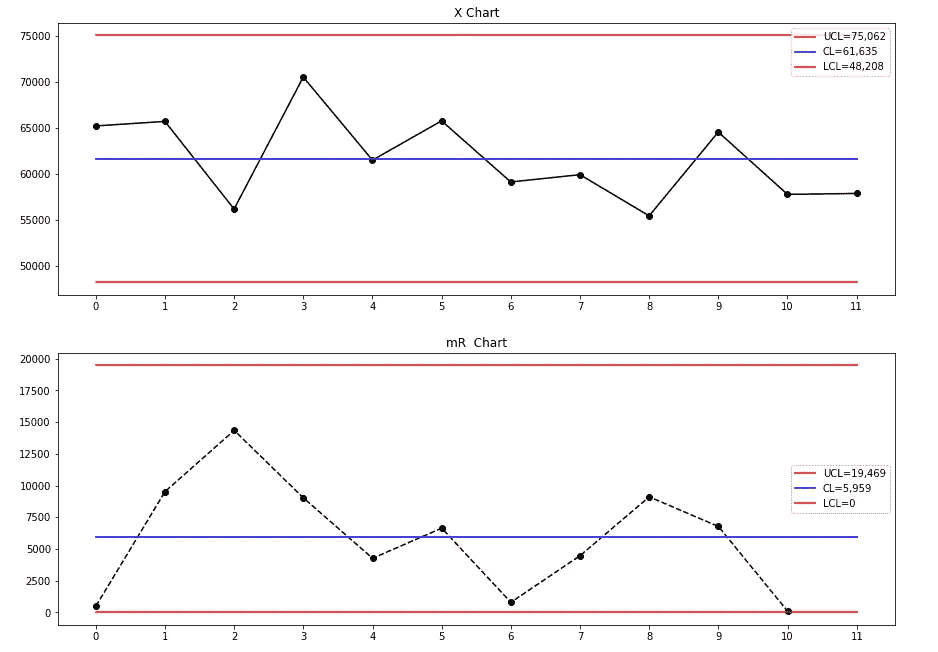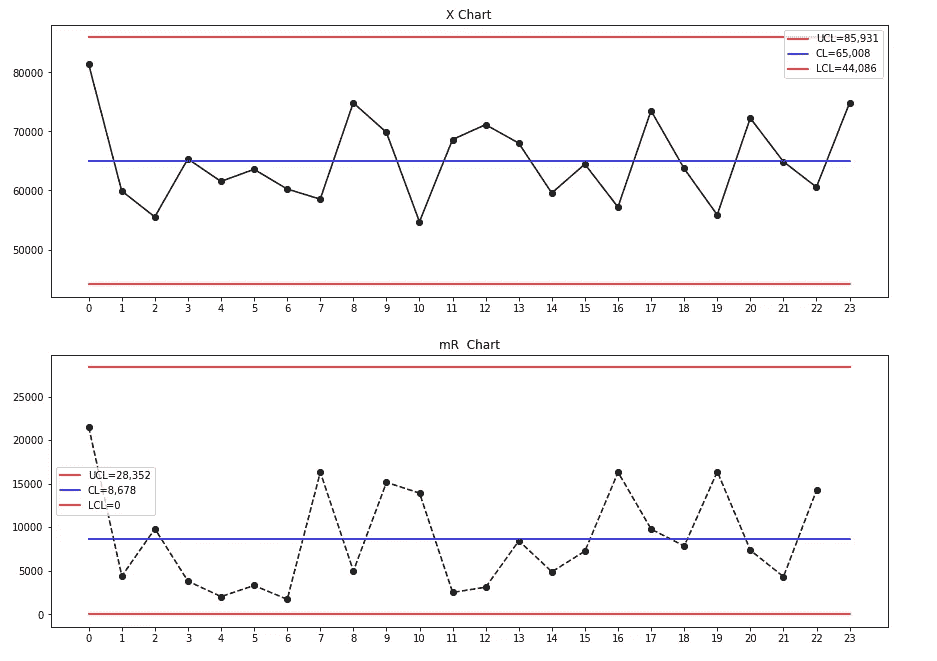

这让我们对销售过程中的位置和分布有了更清晰的了解。

## 结论:

那么在销售分析中，质量控制图是否被低估了呢？将 SPC 用于销售背后的想法是，我们正在寻找系统性转变的迹象。SPC 判断销售过程运行是否稳定可靠。控制范围内的所有数据点都分布在正常噪声中。但是销售失控的限制表明了系统性的转变。可能的原因是多方面的，可能是由于特殊的促销活动导致了更高的销售额等..不时出现一个失控点并不一定意味着你的销售过程已经“失控”。假设正态分布，我们估计所有销售数据点的 99.7%应该在控制范围内。而另一方面，0.3%的人被认为是没有控制的，这很好。因此，只有当你面对控制范围之外的连续数据点时，才能告诉你你的销售过程已经发生了重大变化(或者根本的分布没有得到很好的理解)。

SPC 不是控制收入的最直观的方法。我们的销售同事可能会问，他们为什么要关心销售额是否超过控制上限？一方面，销售人员通常不太熟悉除了总和与平均值之外的统计数据(无意冒犯同事)。他们完全正确，我们都想比过去卖得更多。另一方面，销售商品往往不太严格地遵循任何规范。说白了，售出商品的数量是高度不稳定的，例如，在生产工厂制作肉饼，可以而且必须非常精确地锁定目标。因此，如果你现在认为 SPC 是一种对销售数据进行过多理论统计的方法，而没有增加太多的支持，我认为密切关注销售的位置和可变性确实非常重要。例如，你的销售同事中有多少人在谈论他们的总销售额或平均销售额，却从来没有提到标准差？关注箱线图和质量控制图可以帮助您的销售人员在压缩图表上更好地了解他们的销售位置和分布情况。即使您可能决定不向您的 salesforce 同事传播(质量)控制图，您仍然可以采用这种方法，并在其中添加更多“实际销售的生命消化率”。

非常感谢您的阅读！希望这篇文章对你有帮助。请随时在 [LinkedIn](https://de.linkedin.com/in/jesko-rehberg-40653883) 、 [Twitter](https://twitter.com/DAR_Analytics) 或[工作室](https://jesko-rehberg.medium.com/virtual-reality-vr-for-education-a532aa5b6272)与我联系。

 [## 通过我的推荐链接加入 Medium-Jesko Rehberg

### 阅读杰斯科·雷伯格(以及媒体上成千上万的其他作家)的每一个故事。您的会员费直接支持…

jesko-rehberg.medium.com](https://jesko-rehberg.medium.com/membership) 

你可以在我的 Github 资源库中找到完整的 [Jupyter 笔记本和 Excel 模板](https://github.com/DAR-DatenanalyseRehberg/SPC)。

参考:

[1]工业中的统计过程控制，SPC 的实施和保证，Does，R.J .，Roes，C.B .，Trip，a .，1999:[https://www.springer.com/de/book/9780792355700](https://www.springer.com/de/book/9780792355700)

[2]James r . Persse 博士的《过程改进要点》, 2006 年 9 月发布，出版商:O'Reilly Media，Inc .，ISBN: 9780596102173