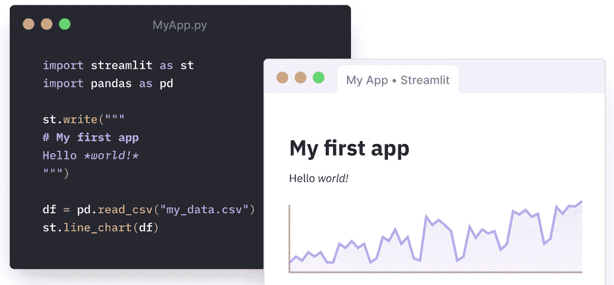

# PyCon US 2022 概述

> 原文：<https://towardsdatascience.com/pycon-us-2022-recap-2bbf2e59801e>

## 一些我们最喜欢的演讲和要点


PyCon 2022 标志。图片由 PyCon US 2022 提供。

从 2022 年 4 月 27 日到 5 月 1 日，我们参加了第一届[PyCon](https://us.pycon.org/2022/)——Python 编程语言最大的年度大会。每年，PyCon 在世界各地举行几次会议，我们参加了在犹他州盐湖城举行的美国会议。这真是一次非常棒的经历。

虽然常规与会者说人群是前疫情派孔斯的一半，我们仍然发现活动充满了伟大的人和谈话。因此，我们想回顾一些我们最喜欢的与数据科学相关的演讲。

如果你不能参加 PyCon，不要担心！PyCon 计划让每个人都能在他们的 [YouTube 频道](https://www.youtube.com/c/PyConUS?app=desktop)上欣赏这些演讲。不幸的是，PyCon 在录制研讨会时遇到了一些[技术困难](https://pycon.blogspot.com/2022/05/pycon-us-2022-recordings-update.html)，无法在 YouTube 上发布我们的 NLP 研讨会。所有其他讲座链接如下。

以下是我们将涉及的演讲的简要概述:

1.  自然语言处理导论——莉亚·辛普森和雷·麦克兰登
2.  [Lukasz Langa 的主题演讲](https://youtu.be/wbohVjhqg7c)
3.  [王蒙杰的主题演讲](https://youtu.be/qKfkCY7cmBQ)
4.  [如何在整个企业中成功使用 Python——Greg Compestine](https://youtu.be/1zRv5vAQCKk)
5.  [利用快照提高应用性能— Juan Gonzalez](https://youtu.be/0cNBVt8UvI8)
6.  [测试机器学习模型——卡洛斯·基德曼](https://youtu.be/UHbBU8gz7Dw)
7.  [使用 DVC 和 Streamlit 为 Python 编码人员提供灵活的 ML 实验跟踪系统——Antoine Toubhans](https://youtu.be/EGIzJIfAy7g)
8.  [写更快的 Python！常见的性能反模式—安东尼·肖](https://youtu.be/YY7yJHo0M5I)
9.  雷·麦克伦登的闪电谈话

## 自然语言处理导论— [莉亚·辛普森和雷·麦克伦登](https://www.linkedin.com/company/data-science-rebalanced)

在会议开始前两天，PyCon 提供了几个不同的教程，涉及各种各样的主题。这些教程是与会者了解某个主题并实际应用 Python 实例的好方法。

我们很高兴被选中去做一个关于 Python 中自然语言处理(NLP)的三小时初级研讨会。我们涵盖了从文本预处理技术到主题建模的所有内容。与会者通过分析谷歌 Colab 笔记本中的 500 篇亚马逊家居和厨房产品评论获得了现实世界的经验。

不幸的是，PyCon 在我们的研讨会期间遇到了技术困难，无法按计划发布到 YouTube 上。然而，我们在 [Skillshare](https://skl.sh/3x4lDnu) 上有一个浓缩的一小时版本的研讨会。如果你想读一篇文章，我们在这里为你准备了。

现在，让我们深入到会议中我们最喜欢的一些演讲中。

## 主题演讲— [卢卡斯·兰加](https://www.linkedin.com/in/llanga/)

Python 的 [Black](https://black.readthedocs.io/en/stable/) formatting library 的创始人 Lukasz Langa 以关于 Python 中类型注释的重要性的主题演讲开始了第一天的会议。类型注释用于描述变量的数据类型和函数的输入/输出。文档，尤其是类型注释，通常是开发人员或数据科学家最不想做的事情，所以很高兴看到 Lukasz 在这方面有所建树。


照片由[西格蒙德](https://unsplash.com/@sigmund?utm_source=medium&utm_medium=referral)在 [Unsplash](https://unsplash.com?utm_source=medium&utm_medium=referral) 上拍摄

让类型注释变得非常复杂很有诱惑力，但是 Lukasz 强调难看的类型注释暗示着难看的代码。它们不会产生额外的复杂性，而是暴露已经存在的复杂性。重要的是，类型注释要尽可能简单，以便人们能够理解它们。如果别人不能理解你的类型注释，你可以考虑重构。

Lukasz 在他的主题演讲中给出了各种各样的提示和技巧，但是我们最喜欢的一个是一个 **str** (string)类型的注释通常可以更加具体。例如，字符串可能是电子邮件地址、文件路径或姓氏。

## 主题演讲— [王蒙杰](https://www.linkedin.com/in/pzwang/)

Anaconda 首席执行官王蒙杰分享了他和他的团队开发的令人兴奋的新框架，名为 [PyScript](https://pyscript.net/) 。他们的网站称 PyScript“允许用户使用 HTML 的界面在浏览器中创建丰富的 Python 应用程序。”

PyScript 让数据科学家们兴奋不已，因为它可能允许他们共享他们的模型和 HTML 文件中的结果，当在浏览器中打开该文件时，将执行该文件。


Firmbee.com 在 [Unsplash](https://unsplash.com?utm_source=medium&utm_medium=referral) 上[的照片](https://unsplash.com/@firmbee?utm_source=medium&utm_medium=referral)

Peter 还描述了 PyScript 对 STEM 教育的巨大影响。因为几乎每个人都可以访问网络浏览器，PyScript 可以帮助孩子们更快地开始编程，而没有任何基础设施障碍。

到目前为止，可能已经有很多关于 PyScript 的文章，但是要了解更多信息，我们推荐 Anaconda 的这篇文章[。](https://anaconda.cloud/pyscript-python-in-the-browser)

## **如何跨企业成功使用 Python—**[**Greg Compestine**](https://www.linkedin.com/in/gregcompestine)

虽然这次演讲没有特别关注数据科学，但它确实击中了我们的要害。如果你是一个大型组织的数据科学家，并且你是唯一使用 Python 的部门或领域之一，这个演讲是为你准备的。

不熟悉 Python 的组织对数据科学家来说是一个严峻的挑战，因为他们试图通过 IT、法律和任何其他提供繁文缛节的部门获得所需的工具和环境。如果让 Python 在本地机器上运行是一场战斗，那么等到您必须让它在生产环境中工作时再说。

正如 Greg 所解释的，要想在整个企业中取得成功，您需要对 Python 的支持。提供支持的一种方式是在您的组织中创建一个 Python 公会。Greg 给出了创建一个成功的公会的几个建议，包括确保宽松的公会成员要求。任何对 Python 感兴趣的人(不管技能水平如何)都应该被允许成为公会成员。


由[布鲁克·卡吉尔](https://unsplash.com/@brookecagle?utm_source=medium&utm_medium=referral)在 [Unsplash](https://unsplash.com?utm_source=medium&utm_medium=referral) 拍摄的照片

公会成员将是任何负责构建工具的基础设施团队的关键。它也代表了 It 部门在测试新 Python 版本发布时可以接触到的一个群体。我们实际上已经看到了企业范围内的 Python 推送，这些推送没有提前在一个小团队中进行测试，结果导致虚拟环境崩溃。公会可以作为这类更新的测试者。

在演讲的后面，格雷格提到了一个非常关键的问题。为了更好地参与到工会中，你应该将它作为使用 Python 的员工的预期职责的一部分。太多时候，员工被赋予堆积如山的工作，还被“鼓励”参加这样的社区。这种方法我们一直不太成功。在你的软件开发人员、数据工程师、数据科学家或机器学习工程师的职责中包含社区参与是一个更好的方法。这将确保公会有多元化的参与者，可以给他们所依赖的各个团队很大的反馈。

## 利用快照提高应用性能— [胡安·冈萨雷斯](https://www.linkedin.com/in/juan-gonzalez-10233348/)

在这个演讲中，Juan 讨论了由于使用对象关系映射器(ORM)的数据库查询而导致的缓慢性能。你可能熟悉 Python 中的 ORM，如 [SQLAlchemy](https://docs.sqlalchemy.org/en/14/orm/) 或 [Django](https://docs.djangoproject.com/en/4.0/topics/db/models/) 。虽然 ORM 可以让您的代码更 Pythonic 化，但是它们也有一些严重的缺点。

一个缺点是，您可能不知道 ORM 生成的实际 SQL 查询是什么样子的。我们的查询对我们隐藏的事实意味着我们不能调试它。

Juan 引入了一个名为 [snapshot_queries](https://pypi.org/project/snapshot-queries/) 的库，允许您查看 ORM 生成的所有 SQL 查询。下面是该库 GitHub 的一些代码，展示了它是如何工作的。

```
from django.contrib.auth import get_user_model
from snapshot_queries import snapshot_queries

User = get_user_model()
with snapshot_queries() as queries_executed:
    User.objects.only('email').get(id=1)
    User.objects.only('email').get(id=7)

queries_executed.display()
```

在使用 ORM 展示了看似非常简单的查询之后(见上文)，Juan 使用 snapshot_queries 库展示了实际在幕后运行的 SQL。谈话中的每个人都清楚实际的查询是多么低效。在这个库的帮助下，您可以调整您的查询，并有可能降低您的基础设施成本。我们怎么推荐这个演讲都不为过。我们在下面包含了一些示例输出来说明库的结果。

```
Query 1
---------
2 ms

/path/to/module.py:5 in function_name

User.objects.only('email').get(id=1)

SELECT "auth_user"."id",
       "auth_user"."email"
FROM "auth_user"
WHERE "auth_user"."id" = 1

Query 2
---------
< 1 ms

/path/to/module.py:6 in function_name

User.objects.only('email').get(id=7)

SELECT "auth_user"."id",
       "auth_user"."email"
FROM "auth_user"
WHERE "auth_user"."id" = 7
```

## **测试机器学习模型—** [**卡洛斯·基德曼**](https://www.linkedin.com/in/carlos-kidman/)

卡洛斯在强调传统软件和机器学习之间的差异方面做得非常出色。Carlos 介绍了在正确测试机器学习模型时要考虑的架构、数据和模型。具体的数据考虑事项包括确定数据来自哪里、存储在哪里，以及数据是流数据还是批处理数据。

卡洛斯强调，模型应该进行行为、公平性和可用性测试，而不是只使用学术界教授的经典指标，如准确性、精确度和召回率。我们需要知道用户是如何体验这个模型的。

如果你还不熟悉测试机器学习的所有概念，这绝对是适合你的谈话。正如卡洛斯在演讲中强调的那样，缺乏适当的测试可能会导致你的组织成为下一个 [Zillow](https://insidebigdata.com/2021/12/13/the-500mm-debacle-at-zillow-offers-what-went-wrong-with-the-ai-models/) ，一家使用机器学习来预测何时买卖房屋的公司。他们因糟糕的数据质量和测试而遭受巨大损失的故事是对所有人的警示。

## **使用 DVC 和 Streamlit 为 Python 编码人员提供灵活的 ML 实验跟踪系统—** [**安托万·图班斯**](https://www.linkedin.com/in/antoine-toubhans-92262119/)

安托万轻松地提供了一个最聪明的谈话。首先，他实际上使用了 [Streamlit](https://streamlit.io/) 来构建他的演示文稿。从那时起，这个话题就充满了价值。虽然我们在这次演讲之前没有使用过 Streamlit，但我们非常希望在这次演讲之后开始使用它。



Streamlit 网站截图:[https://streamlit.io/](https://streamlit.io/)

安托万开始使用数据版本控制( [DVC](https://dvc.org/doc) )跟踪他所有的机器学习实验。这个库通常被数据科学家用来对 Git 中的数据进行版本控制。然而，我们还没有看到很多人像 Antoine 那样使用 DVC 构建[有向无环图(DAGs)](https://airflow.apache.org/docs/apache-airflow/stable/concepts/dags.html) 来运行机器学习管道。阿帕奇气流通常被用来制造 Dag，但是 Antoine 能够纯粹在 DVC 制造它们。

虽然这本身是一个很好的功能，但是 Git 并没有让数据易于交互。这就是 Streamlit 来拯救我们的地方。Antoine 能够轻松地构建一个漂亮的 UI 来显示他所有的机器学习实验结果。这包括一个简单的滑块，用于显示模型在某个预测置信度范围内的预测。

但是我们最喜欢的部分是能够从你的实验数据集中比较任意两个模型。通过几个下拉菜单，您可以选择任意两个模型，并查看这两个模型之间预测的所有差异。说一个很棒的功能！

## **写更快的 Python！常见表现反模式—** [**安东尼·肖**](https://www.linkedin.com/in/anthonypshaw/)

Anthony 讲述了如何让您的 Python 代码更快。如果你熟悉测试驱动开发(TDD)，你就会知道任何初始编码都应该尽快完成。重点应该放在节省你的时间上，因为你的时间可能比电脑的时间更贵。但是一旦你写出了有效的代码，就该重构了。当我们重构时，我们并不试图改变代码的行为。我们仍然希望它做和以前一样的事情，但是我们希望它更快、更易读、更易维护。

Anthony 做了很好的工作，介绍了如何使用分析器来帮助加速您的代码。他还就何时针对速度和可读性进行优化给出了很好的建议。此外，他给出了最好的数据结构以及最好的分析器。我们一直使用 Python 自带的标准分析器，但是 Anthony 共享了库 [Austin](https://github.com/P403n1x87/austin) 和 [Scalene](https://github.com/emeryberger/scalene) 作为高级分析器。它们比现成的 Python 分析器运行得更快，并且它们提供逐行的性能数据，而不是函数级的性能数据。似乎这还不够，Anthony 还提供了一系列关于如何加速代码的技巧。很明显，安东尼是这方面的专家。

## **行为驱动的机器学习—** [**雷·麦克伦登**](https://skl.sh/3xd5dcX)

虽然这不是会议计划中的演讲之一，但是这篇文章的作者之一(Ray)做了一个非常有趣的闪电演讲！在 PyCon 上，闪电谈话是与会者在最多五分钟的时间里在舞台上展示他们所感兴趣的任何东西的机会。

在这个演讲中，Ray 解释了他在学校被教导如何构建机器学习模型与他现在在行业中如何构建它们之间的差异。虽然他被教导在构建模型时使用整个数据集，但这种方法存在一些问题。在他的演讲中，他分享了一种迭代方法来建立一个优秀的模型，在这个模型中，你不需要使用所有的数据。

# 结论

总的来说，我们在 PyCon 上玩得很开心，也喜欢和其他与会者交流。我们一定会回来的！虽然我们对机器学习讲座更感兴趣，但我们在面向通用软件开发的会议中发现了一些很好的信息和技术。如果您是一名数据科学家，正在寻找参加 Python 会议的机会，如果您有兴趣成为一名更全面的程序员并学习更多关于软件开发的知识，我们推荐您参加这个会议。