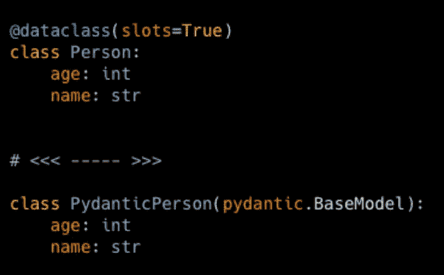

# Pydantic 还是 dataclasses？为什么不两者都要？在它们之间转换

> 原文：<https://towardsdatascience.com/pydantic-or-dataclasses-why-not-both-convert-between-them-ba382f0f9a9c>

## 在 FastAPI 项目中使用 dataclasses，并加速您的 pydantic 模型操作

图片作者。

Python 数据类非常棒。Pydantic 太棒了。如果我们真的面临选择一个或另一个，这是一个艰难的选择。我会说，比较这两个伟大的模块就像比较梨和苹果，尽管在某些方面相似，但总体上不同。

**Pydantic 的竞技场是数据解析和净化**，而 **dataclasses a 是一个快速且内存高效的**(尤其是使用 slots，Python 3.10+) **通用数据容器**。查看这个故事，在这里我彻底比较了 Python 数据容器，包括 pydantic 和 dataclasses。

然而，有时，似乎某些代码依赖试图让我们做出选择。一个很好的例子是使用 FastAPI 时；它建立在 pydantic 之上。如果我们的应用程序很简单，我们也可以用 pydantic 做所有的数据模型，避免任何兼容性问题。另一个例子是当我们继承一个已经在使用 dataclasses 的代码库时。为什么我们在使用 FastAPI 时会错过数据类的性能呢？当我们需要使用 FastAPI 实现 web API 时，如何将我们的 dataclasses 模式转换为 pydantic 模式呢？顺便说一下，FastAPI 也很棒。

在这个故事中，我们使用一些简单的技巧将动态平面数据类转换成 pydantic，反之亦然。最后，我们将使用一个 FastAPI 测试这种实际转换的实现。

## 故事结构

*   数据类(无默认值)转换为 pydantic
*   默认为 pydantic 的数据类
*   数据类中的 pydantic(无默认值)
*   数据类中有默认值的 pydantic
*   构建工具:数据类到 pydantic
*   构建工具:从 pydantic 到 dataclass
*   FastAPI 示例

## 数据类(无默认值)到 pydantic

问题是:

为了解决这个问题，我们使用 pydantic 的实用程序来动态创建模型， *pydantic.create_model* 。我们需要为这个函数提供一个动态创建的模型的名称。我们还需要为 kwargs(每个关键字参数都是动态创建的模型中的属性名称)提供一个属性类型和默认值的元组(如果没有默认值，那么使用…代替)。

为了获得 pydantic 模型所需的信息，我们使用 dataclasses 模块中的*字段*实用程序；使用*字段*，我们可以访问属性的特性。

现在，我们可以创建动态生成的 pydantic 模型的实例:

打印模型及其类型:
name = ' Diego ' age = 33
<class ' pydantic . main . dynamicpydanticancer '>

所以我们在这里是金色的。

## 数据类中的 pydantic(无默认值)

问题是:

我们现在使用 dataclasses 实用程序来动态创建类( *dataclasses.make_dataclass)，*其中需要动态创建的类的名称和每个属性的元组列表；每个元组应该包含属性的名称和类型。

我们可以从 dataclasses 模块中用 *is_dataclass* 来检查这个类是否确实是一个 dataclass。所以我们这样做并实例化这个类:

prints:
True
dynamic person(姓名='Diego '，年龄=33 岁)

这是我们预期的结果。

## 默认为 pydantic 的数据类

现在我们来看看 dataclass 有默认值的情况，我们想把它转换成 pydantic。

问题是:

这个想法类似于没有违约的情况；然而，现在我们需要将…替换为默认值。此外，为了检查 dataclass 的字段中的默认值是否丢失(没有默认值)，我们检查字段 default 是否是 dataclasses 模块中的 *_MISSING_TYPE* 类的实例(这里有点麻烦，但是我们需要把事情做好)。

我们继续测试我们的*dynamicpydanticancer:*

打印数据类及其类型:

使用默认:
age = 33 name = ' Jane '
<class ' pydantic . main . dynamicpydanticancer '>

覆盖默认:
age = 33 name = ' Diego '
<class ' _ _ main _ _。PydanticPerson' >

正如我们所料。

## 数据类中有默认值的 pydantic

问题是:

请注意默认字段。

这种情况与没有违约的情况非常相似。如果属性有默认值，则每个属性的元组有三个元素，而不是两个，第三个元素是默认值( *_field.required* 表示没有默认值):

测试它实际上是一个数据类，以及 default 和 default override 的实例:

prints:
True
dynamic person(年龄=33 岁，姓名='John')
DynamicPerson(年龄=33 岁，姓名='Diego ')

我们准备好了。

## 构建工具:数据类到 pydantic

我们将数据类转换成 pydantic 模型的代码片段是成功的，有默认值和没有默认值。现在是时候用更有用的工具来包装它们了。一个为我们完成转换的函数:

我们来测试一下。
目标数据类:

将其转化为 pydantic:

印刷品:

> PydanticPerson
> 
> 年龄=33 姓名= '简'

注意 __name__ 取自原始数据类(Person)的名称，前缀“Pydantic”是通过转换函数中的 f 字符串添加的。也可以选择提供自定义名称。

## 构建工具:从 pydantic 到 dataclass

将数据类转换为 pydantic 的函数:

我们来测试一下。
目标分解模型:

将其转换为数据类:

印刷品:

> DataClassPerson
> 
> DataClassPerson(年龄=33 岁，姓名= '约翰')

注意 __name__ 取自原始 pydantic 模型类(Person)的名称，并且在转换函数中添加了前缀“DataClass”。这是默认行为，或者可以将自定义名称传递给转换函数。

## FastAPI 示例

最后给出了一个使用 FastAPI 的例子。这个简单的例子展示了在 FastAPI 中使用 dataclass 是多么容易。要使此示例生效，请将前两节中的代码保存到名为“dataclass_to_pydantic.py”的文件中，并将其放在运行以下示例的同一目录中。下面的例子应该被命名为“fast_api_example.py”，这对 uvicorn 服务器在脚本中运行非常重要。

我们创建一个数据类 *FooQuery* ，然后将其转换为 pydantic，作为类型传递给 *foo* 端点:

为了测试它，我们执行脚本并使用*请求*模块对 foo 端点进行简单测试:

一切按预期运行。

## 最后的话

现在我们知道了如何以简单的方式将平面 pydantic 转换为 dataclasses，反之亦然。这种转换在几种情况下可能很方便，包括将 dataclasses 与 FastAPI 一起使用。

然而，我认为首先要仔细考虑你的应用程序的架构，尽量避免不必要的转换。pydantic 和 dataclasses 都有很多特性和定制，其中大部分在翻译时会丢失。

最后，关于嵌套模型，它们的转换很棘手。使用故事中的代码中的工具转换成嵌套模型的实例非常简单。但是要转换成一个类型(非实例化类)，我们必须首先声明所有嵌套模型的转换。如我所说，这部分很棘手。

我希望这个故事对你有用。如果你想知道更多类似的故事，请订阅。

  

喜欢这个故事吗？通过我下面的推荐链接成为一个媒体成员来支持我的写作。无限制地访问我的故事和许多其他内容。

 