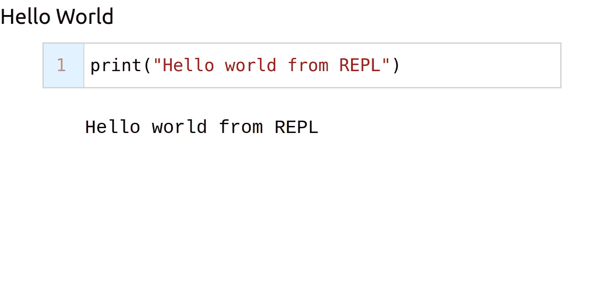
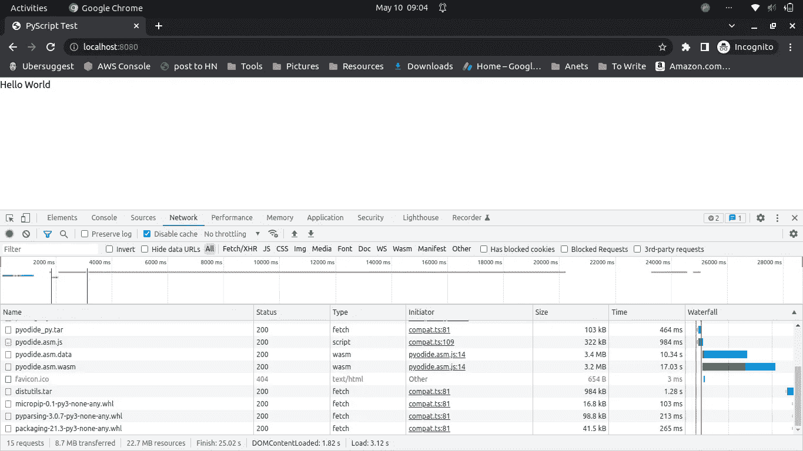
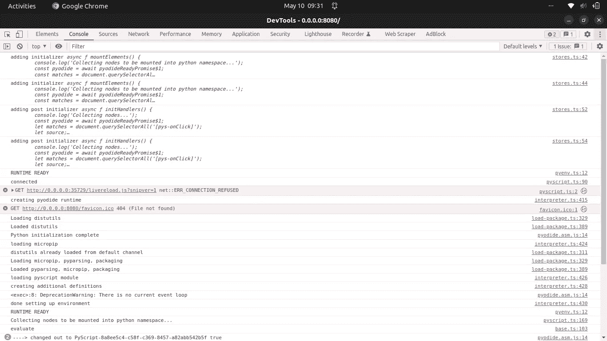

# 我在浏览器上尝试 Python 的第一印象

> 原文：<https://towardsdatascience.com/pyscript-tutorial-a8fba77abd1b>

## 让 Python 成为通用编程语言的唯一缺失部分就在这里


来自[佩克斯](https://www.pexels.com/photo/person-s-hands-with-paint-1428171/?utm_content=attributionCopyText&utm_medium=referral&utm_source=pexels)的[莎伦·麦卡琴](https://www.pexels.com/@mccutcheon?utm_content=attributionCopyText&utm_medium=referral&utm_source=pexels)的照片

每当我们与其他开发人员讨论最佳编程语言时，我们都会谈论 JavaScript 和 Python 几个小时。

两者都是强大、灵活的语言，主导着当今世界。但是 Python 的一个死结是它不能在浏览器上运行。

有了节点的[发现，JavaScript (JS)几乎可以在任何平台上运行。它甚至有](https://kinsta.com/knowledgebase/what-is-node-js/)[模块来构建机器学习](https://analyticsindiamag.com/top-10-javascript-machine-learning-libraries/)算法。JS 有潜力成为未来事实上的编程语言。

Python 是一门美丽的语言。超级简单易学；工作起来超级给力。还没有。它不能在浏览器上运行，这使它远离了许多应用程序。

这一差距现已弥合。Python 现在可以在浏览器上运行。

您可以使用 Pandas 开始构建复杂的数据操作，构建机器学习模型，进行数据可视化，以及在 HTML 页面中进行更多操作。

[](/advanced-pandas-plots-e2347a33d576) [## 在一行代码中创建令人惊叹的可视化熊猫数据框架

### 一个简单的技巧，使您的图表具有交互性和视觉吸引力

towardsdatascience.com](/advanced-pandas-plots-e2347a33d576) 

在本帖中，我们将讨论:

*   在边缘设备上运行 Python 的好处；
*   PyScript 入门；
*   完全在浏览器上运行的 ml 模型，以及；
*   我使用 PyScript 的第一印象。

# 为什么我们在浏览器上需要 Python？

出于许多原因，我们更喜欢在客户端进行计算。我们现在最流行的客户端设备是浏览器。

这里有一些客户端的 PyScript 可以帮助我们。

将数据发送回服务器和接收预测可能会比较慢。您可以通过在浏览器上进行计算来防止 [**网络延迟**](https://www.cloudflare.com/learning/performance/glossary/what-is-latency/) 。

假设你开发了一个探测火灾的系统。发生火灾时，它对网络问题有什么帮助？

此外，我们更喜欢**保持敏感数据不进入云端**。现在，您可以在不离开客户端设备的情况下进行必要的计算。

最后，将计算转移到边缘设备也能带来**成本效益**。除了前期的架构成本，你还可以计划投资扩展应用。

# 在您的浏览器上开始使用 py script-Python。

PyScript 不需要特殊的安装就可以开始。我们只需要将一些 web 资源导入到我们的 HTML head 标签中。

让我们创建一个名为`index.html`的 HTML 文件并导入它们。将这些放在结束的`</head>`标签之前。

由[作者编写的代码片段。](https://thuwarakesh.medium.com)

PyScript 提供了三个 HTML 标签来编写 Python 脚本。

您可以在一个 **py-env** 标签中指定要导入到您的运行时环境中的模块。理想情况下，它需要在我们前面讨论的两个导入标签之后的 HTML 头部。

这些还没有导入到您的脚本中。把它想象成`pip install.`

您仍然需要在 py-script 中导入它，下面的 py-script 标记。

Py-script 标签是你的 Python 脚本所在的地方。你可以把它放在 HTML 主体的末尾。

您还会得到一个 **py-repl** 标签。它允许浏览器执行用户输入的任意 Python 脚本。

这是一个带有 REPL 的完整 hello world 示例。

由[作者编写的代码片段。](https://thuwarakesh.medium.com)

现在，您可以启动 python 开发服务器，并在浏览器中访问它。以下命令将启动服务器。

```
python -m 'http.server' 8080
```

你可以在你的浏览器上访问`[http://localhost:8080](http://localhost:8080)`来看看它的运行。它应该看起来像下面的。



[作者截图。](https://thuwarakesh.medium.com)

我们的 py-script 标记中的 print 语句出现在浏览器中，就像它出现在终端窗口中一样。

一个很好的替代方法是将我们的 python 文件链接到 py-script 标记，而不是将它写在 HTML 块中。在下一节中，我们将使用这个特性来构建一个功能更加丰富的应用程序。

# 浏览器上的一些机器学习

我们已经在浏览器上成功运行了 Python 脚本。它不需要预先安装 Python 或任何依赖项。

但是 Python 的真正威力并没有在简单的 HTML 操作中显露出来。让我们进入稍微高级的工作。

[](/running-election-campaigns-with-k-means-clustering-ecc40a91135a) [## 用 K-均值聚类进行竞选活动。

### K-均值聚类实用介绍。

towardsdatascience.com](/running-election-campaigns-with-k-means-clustering-ecc40a91135a) 

让我们构建一个 K-Means 算法，完全在浏览器中对数据点进行聚类。

我们将把 python 代码放在一个单独的文件中，并将其链接到 py-script。让我们在工作目录的根目录下创建一个名为 script.py 的文件，其内容如下。

[作者的代码片段。](https://thuwarakesh.medium.com)

让我们也调整我们的 HTML 文件。在下面的文件中，我们添加了一个单独的 div 来呈现脚本文件的输出。注意，py-script 标记的输出属性是我们的 div 的 id。

此外，我们不是直接用 HTML 编写 Python 脚本，而是在一个单独的常规 Python 文件中编写它。然后，我们将 py-script 标记的 src 属性设置为新脚本文件的路径。

由[作者编写的代码片段。](https://thuwarakesh.medium.com)

如果我们在浏览器上再次尝试访问该 URL，您将看到以下输出。


浏览器输出中的 K-Means 聚类——由[作者截屏。](https://thuwarakesh.medium.com)

在上面的例子中，我们从外部 URL 下载数据。然后我们使用流行的 scikit-learn 库进行了 K-Means 聚类。

然而，这些都不需要预先安装软件包。它完全在浏览器上运行。

# 我对 PyScript 的第一印象。

PyScript 是 Python 发展过程中令人印象深刻的一步。然而，我不会很快在项目中使用它。

此时，如果我想用 Python 开发 web 应用程序，我会使用 Dash 或 Streamlit。

[](/plotly-dashboards-in-python-28a3bb83702c) [## 这就是我如何纯粹用 Python 创建令人眼花缭乱的仪表盘。

### Plotly dash 应用程序是用 python 构建生产级仪表板的最快方式。

towardsdatascience.com](/plotly-dashboards-in-python-28a3bb83702c) [](/how-to-create-stunning-web-apps-for-your-data-science-projects-c7791102134e) [## 如何为您的数据科学项目创建出色的 Web 应用程序

### 数据科学家不必学习 HTML、CSS 和 JavaScript 来构建网页。

towardsdatascience.com](/how-to-create-stunning-web-apps-for-your-data-science-projects-c7791102134e) 

这并不意味着我不喜欢这种事情发生。我不打算切断它，因为它开始跳跃。但是，我期待很快会有更多的进展。

如果您正在使用 PyScript，这些将帮助您获得一个想法。

## PyScript 非常慢。

在屏幕上打印东西不应该花这么长时间。

在一台像样的电脑上显示“你好，世界”信息需要 25 秒。在开发人员控制台上，我们可以看到出现这种情况的原因。

即使没有第三方包导入，PyScript 仍然从 web 上下载了大约 22.7MB 的资源。如果在浏览器上启用了兑现，后续请求将在大约 4 秒钟内加载。4 秒在 web 开发者中仍然被认为是有缺陷的。



PyScript 的网络延迟——[作者截图。](https://thuwarakesh.medium.com)

同样，你也不知道它还在加载。您需要打开开发人员控制台才能看到它。在它完全加载之前，你只会看到一个空白页。

一件好事是所有的 Python 模块都异步加载。它们在所有其他页面组件加载后在后台加载。

## 浏览器控制台调试对 PyScript 帮助不大。

前端开发人员依赖浏览器控制台输出进行调试。

如果打开浏览器控制台，PyScript 会打印一些日志。但是没有办法进入这个 API，并把我们的自定义控制台日志。



PyScript 在浏览器控制台中打印日志。但是他们不通融。我们无法添加客户控制台日志。—[作者](https://thuwarakesh.medium.com)截图。

我也不能在 PyScript 上使用 VSCode 调试器。如果我们有一些技术来做到这一点，可能会有所帮助。

因此，我们现在能做的最好的事情就是编写完全独立于 HTML 的 Python 脚本，并通过 py-script 标签的 src 属性链接它。

## 远离 HTML 代码格式化程序。

如果使用 VSCode 或任何其他现代 IDE，也可以使用代码格式化。

我有经常按格式化快捷键的习惯。

当你在 HTML 中使用 PyScript 代码时，你的 ide 会假设它是一个普通的 HTML 来格式化它。但是，在 Python 中，缩进就是一切。

所以，如果你像我一样，经常使用代码格式化程序，请使用外部脚本文件。

## 缺少关于 PyScript 用法的文档。

PyScript 还没有官方文档页面。你可以在他们的 [GitHub repo](https://github.com/pyscript/pyscript) 上找到[入门](https://github.com/pyscript/pyscript/blob/main/GETTING-STARTED.md)指南。

我很难从外部来源读取数据。

我花了几个小时才明白我们应该使用来自 [Pyodide](https://pyodide.org/en/stable/) 的‘open _ URL’方法。我不得不浏览 GitHub 上提供的[示例列表来找出答案。文档可以节省我的时间。](https://github.com/pyscript/pyscript/tree/main/pyscriptjs/examples)

# 最后的想法

PyScript 是一个很好的倡议。然而，它还太不成熟，不能用于任何项目。希望我发现的小缺口能很快被填补。

此外，在客户端运行 Python 脚本有几个好处。我们可以发挥 Python 的全部潜力，而不必像在 [Tensorflow](https://www.tensorflow.org/js) 中那样将其转换成 JS。

目前，我会坚持使用 Dash 应用程序或 Streamlits。如果那不可能，那么纯粹用 JS 来做还是比较好的。

希望 Python 社区支持 PyScript，进一步完善。

> 感谢阅读，朋友！看来你和我有许多共同的兴趣。我很乐意在[**LinkedIn**](https://www.linkedin.com/in/thuwarakesh/)[**Twitter**](https://twitter.com/Thuwarakesh)和 [**Medium**](https://thuwarakesh.medium.com/) 上与您联系
> 
> 还不是中等会员？请使用此链接 [**成为会员**](https://thuwarakesh.medium.com/membership) 因为，在不为你额外付费的情况下，我为你引荐赚取一小笔佣金*。*