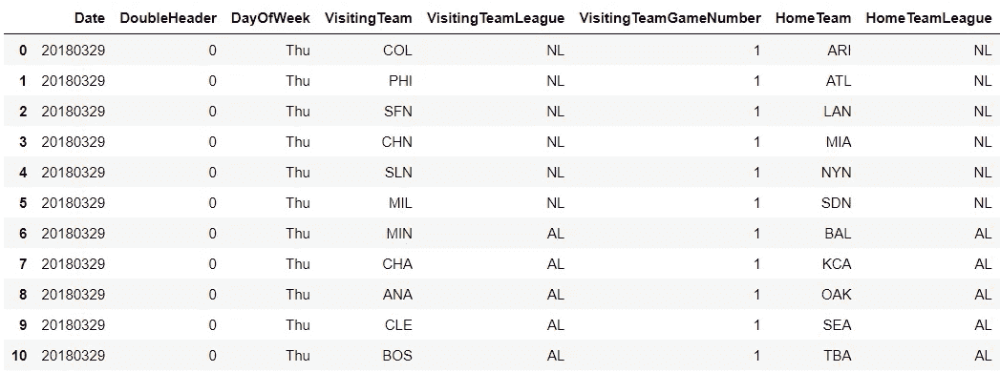
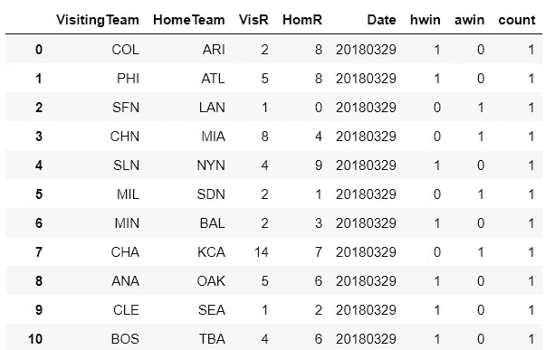
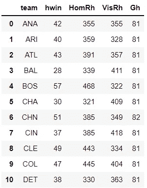
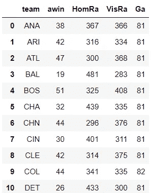
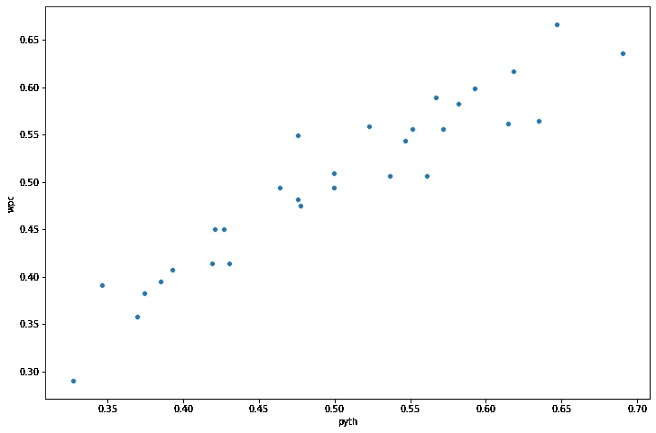
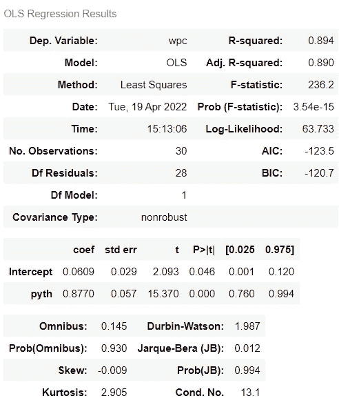
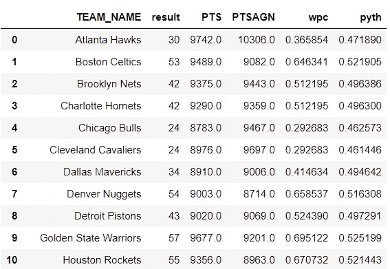
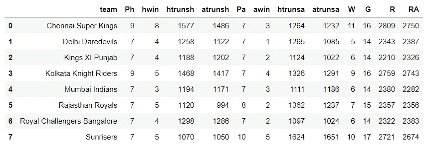
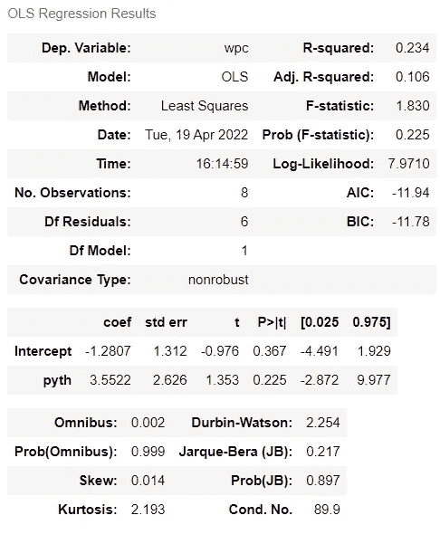

# 体育分析中的毕达哥拉斯期望，以及不同体育项目的例子

> 原文：<https://towardsdatascience.com/pythagorean-expectation-in-sports-analytics-with-examples-from-different-sports-f5e599530a6c>

## 毕达哥拉斯期望用于不同的运动，如棒球、篮球、足球、曲棍球等，以推动数据驱动的分析和预测建模


图片由 [Unsplash](https://unsplash.com/photos/VvQSzMJ_h0U) 上的 [Tim Gouw](https://unsplash.com/@punttim) 拍摄

**毕达哥拉斯的期望**是一个体育分析公式，是伟大的棒球分析师和统计学家之一- [Bill James](https://en.wikipedia.org/wiki/Bill_James) 的发明。最初源于棒球，并为棒球而设计，最终用于其他职业运动，如篮球、足球、美式足球、冰球等。

该公式基本上说明了职业运动队在给定赛季中赢得比赛的百分比应与该队在该赛季中得分/得分/进球的平方除以该队及其对手在整个赛季中得分/得分/进球的平方之和的比率成比例:


这个概念不仅有助于解释团队成功的原因，还可以作为预测未来结果的基础。这是一种我们可以用数据来衡量的关系。我们实际上可以计算每支球队的毕达哥拉斯期望，然后我们可以测试它是否真的与球队在给定赛季的胜率相关。

随着时间的推移，毕达哥拉斯的期望公式已经根据不同的用例进行了修补和增强。修改主要集中在指数的值上。棒球的理想指数是 1.83，而不是 2。[python report](https://legacy.baseballprospectus.com/glossary/index.php?mode=viewstat&stat=559)和[python pat](https://legacy.baseballprospectus.com/glossary/index.php?mode=viewstat&stat=136#:~:text=For%20Pythagenpat%2C%20the%20exponent%20X,See%20here%20for%20more.)是比尔·詹姆斯(Bill James)原始公式的两种修改形式，已在棒球比赛中使用，用于计算跑步环境的理想指数，而不是使用固定的指数值。

类似地，统计学家也研究和挖掘了其他运动的不同理想指数——篮球是 13.91，冰球是 2.37。篮球的指数较高是因为与棒球等运动相比，机会在篮球中的作用较小。

然而，在本文中，我们将深入研究毕达哥拉斯期望公式的基本形式，看看它如何与不同职业运动中的团队胜率相关联。在随后的文章中，我们还将了解如何使用毕达哥拉斯期望作为预测指标，也就是说，我们如何使用历史毕达哥拉斯期望来预测未来的胜率。

# 毕达哥拉斯的期望和美国职业棒球大联盟(MLB)

我们将从将以下模块导入 Jupyter 笔记本开始:

```
import pandas as pd
import numpy as np
import statsmodels.api as sm
import matplotlib.pyplot as plt
import seaborn as sns
```

在这一部分，我们将关注 2018 赛季的 MLB 奥运会，可以从 [Retrosheet](https://www.retrosheet.org/) 下载日志。以下是数据框的一瞥:



作者图片

上面的截图只覆盖了前几列。MLB 数据集中总共有 161 列/特征/变量，总共有 2431 行，每行代表一个游戏。但是，对于本文，我们只需要几列:主队、客队、主队得分、客队得分、比赛日期。为了便于使用，我们还可以将列重命名为稍短的变量名:

```
MLB18 = MLB[['VisitingTeam','HomeTeam','VisitorRunsScored','HomeRunsScore','Date']]
MLB18 = MLB18.rename(columns={'VisitorRunsScored':'VisR','HomeRunsScore':'HomR'})
```

现在，我们的数据集由单个游戏组成，每个游戏中有两个团队；有一个主队和一个客队。如果我们想计算整个赛季球队得分的总数，我们需要考虑主队得分和客队得分。此外，我们还需要主队得分，客队得分。为了做到这一点，我们将把这个数据帧分割成两个更小的数据帧；一个给客队，一个给主队。然后，我们将合并这两个数据集，以获得整个赛季每支球队的总数。

在此之前，我们必须定义每场比赛的赢家，这在棒球比赛中很简单——得分最多的队获胜。我们可以使用 np.where Numpy 方法将胜利分成两个不同的列:主队胜利和客场胜利:

```
MLB18['hwin'] = np.where(MLB18['HomR'] > MLB18['VisR'],1,0)
MLB18['awin'] = np.where(MLB18['HomR'] < MLB18['VisR'],1,0)
MLB18['count'] = 1
```

当我们将记录合并成一个单一的合并数据框时，将在后端使用新列 count:



作者图片

接下来，我们将创建两个独立的数据框，从主队的数据框开始。我们按主队对 MLB18 数据集进行分组，以获得胜场和跑垒(得分和失球)的总和，以及显示比赛场次的计数器变量(在 MLB，各队在常规赛中的比赛场次不一定相同):

```
MLBhome = MLB18.groupby('HomeTeam')['hwin','HomR','VisR','count'].sum().reset_index()
MLBhome = MLBhome.rename(columns={'HomeTeam':'team','VisR':'VisRh','HomR':'HomRh','count':'Gh'})
```

总共有 30 支球队，在下表中显示了以下信息:球队的名称、作为主队的球队的获胜次数、作为主队的球队得分的次数、当主队是客队时客队对该队得分的次数以及在给定赛季中作为主队的球队比赛的总次数。



作者图片

我们对客队重复同样的过程。我们从下面的代码片段中获得以下详细信息:球队的名称、作为客队的球队获胜的次数、作为客队的球队得分的次数、当客队时东道主对球队得分的次数以及在给定赛季中作为客队的球队比赛的总次数。

```
MLBaway = MLB18.groupby('VisitingTeam')['awin','HomR','VisR','count'].sum().reset_index()
MLBaway = MLBaway.rename(columns={'VisitingTeam':'team','VisR':'VisRa','HomR':'HomRa','count':'Ga'})
```



作者图片

这两个数据框总结了主场球队和客场球队的表现。我们接下来需要做的是将这两个数据框架合并在一起，以给出每个团队在整个赛季的总表现。为此，我们使用 pd.merge Pandas 方法来合并“team”列上的两个数据帧。


作者图片

从这个合并的数据集中，我们现在可以将这些列相加，以获得整个赛季球队的总胜场数、比赛场次、得分以及得分。

```
MLB18['W']=MLB18['hwin']+MLB18['awin']
MLB18['G']=MLB18['Gh']+MLB18['Ga']
MLB18['R']=MLB18['HomRh']+MLB18['VisRa']
MLB18['RA']=MLB18['VisRh']+MLB18['HomRa']
```

请注意，有 30 个不同的团队，但为了便于查看，我们在列表中显示了前 10 个团队:


作者图片

准备数据的最后一步是定义胜率和毕达哥拉斯期望值。胜率就是在一个特定的赛季中赢得的比赛总数与比赛总数的比率。

```
MLB18['wpc'] = MLB18['W']/MLB18['G']
MLB18['pyth'] = MLB18['R']**2/(MLB18['R']**2 + MLB18['RA']**2)ax = sns.scatterplot(x="pyth", y="wpc", data=MLB18)
plt.show()
```



作者图片

上面的散点图相当清楚地告诉我们，在我们的特定用例中，毕达哥拉斯期望和胜率之间有很强的相关性——毕达哥拉斯期望越高，团队的胜率可能越高。这证实了比尔·詹姆斯所描述的关系的存在。

为了实际量化这种关系，我们可以拟合这种关系的回归方程，以观察毕达哥拉斯期望中每增加一个单位，获胜百分比增加多少。

```
model = sm.OLS(MLB18['wpc'],MLB18['pyth'],data=MLB18)
results = model.fit()
results.summary()
```

回归输出告诉你许多关于赢率和毕达哥拉斯期望值之间的拟合关系的事情。回归是一种确定最适合数据的方程的方法。在这种情况下，关系是:wpc =截距+系数 pyth



作者图片

我们可以看到截距值是 0.0609，系数是 0.8770。我们感兴趣的是后一种价值。这意味着毕达哥拉斯的期望值每增加一个单位，赢率的值就会增加 0.877。

> (I)标准误差(std err)让我们了解估计的精确度。系数(coef)与标准误差的比值称为 t 统计量(t ),其值告诉我们统计显著性。这由 P 值(P > |t|)来说明—这是我们偶然观察到值 0.8770 的概率，如果真值真的为零。这里的概率是 0.000 —(这不完全是零，但表格中没有足够的小数位来显示这一点)，这意味着我们可以确信它不是零。按照惯例，通常的结论是，如果 p 值大于 0.05，我们不能确信系数值不为零
> 
> (ii)表格的右上角是 R 平方。该统计数据告诉您 y 变量(wpc)的变化百分比，这可以通过 x 变量(python)的变化来解释。r 平方可以被认为是一个百分比——在这里，毕达哥拉斯的期望可以解释 89.4%的胜率变化。

# 毕达哥拉斯期望与 NBA

在篮球的例子中，我们有一个具有非常不同特征的数据集。与 MLB 示例的一个重要区别在于，这里每场比赛出现在两行中，每支球队一行，即每支球队在每场比赛中出现两次，首先作为主队，然后作为客场队。从这个意义上说，我们的行数是游戏数的两倍。因此，我们不需要为主队和客队分别创建两个数据框，因为在本场景中已经为我们完成了这一工作。

数据由 2018 赛季的比赛组成，下面是数据框中的列/特征/变量列表:


游戏结果是标有“WL”的栏。我们创建了一个变量，如果球队赢了，这个变量的值为 1，如果输了，这个变量的值为零。现在，为了计算毕达哥拉斯期望，我们只需要结果，得分(PTS)和失分(PTSAGN)。

```
NBAR18['result'] = np.where(NBAR18['WL']== 'W',1,0)
NBAteams18 = NBAR18.groupby('TEAM_NAME')['result','PTS','PTSAGN'].sum().reset_index()
```

由于每支球队在 NBA 赛季都要打 82 场比赛，我们可以用下面的方法计算每支球队(n=30)的胜率和毕达哥拉斯期望值:

```
NBAteams18['wpc'] = NBAteams18['result']/82
NBAteams18['pyth'] = NBAteams18['PTS']**2/(NBAteams18['PTS']**2 + NBAteams18['PTSAGN']**2)
```



作者图片

现在，通过我们的统计分析，我们首先在 Seaborn 创建一个散点图，看看这种关系是什么样子的。如图所示，它看起来非常类似于棒球的例子。


作者图片

我们可以为这种关系拟合一个回归方程，以观察毕达哥拉斯期望值每增加一个单位，篮球的胜率会增加多少。


作者图片

上面的结果摘要显示了非常大的 t 统计量和 0.000 的 P 值，这基本上意味着这在统计学上非常显著。R 平方(决定系数)值接近 100%,这意味着几乎所有因变量(wpc)的变动都可以完全用自变量(python)的变动来解释。

# 毕达哥拉斯期望与印度超级联赛

在本文的最后一个例子中，我们将研究板球最引人注目的比赛 IPL 的一个例子。我们将使用 2018 年 IPL 赛季比赛的数据，数据集包括以下几列:


作者图片

首先，我们确定主队何时获胜，客队何时获胜。接下来，我们确定主队和客场队的得分(注意:与棒球不同，每队有九局，在 T20 板球中，每队只有一局，一旦第一队完成这一局，对方队就有这一局)。最后，我们包括一个计数器，我们可以把它加起来，给出每支球队的比赛总数。

```
IPL18['hwin']= np.where(IPL18['home_team']==IPL18['winning_team'],1,0)
IPL18['awin']= np.where(IPL18['away_team']==IPL18['winning_team'],1,0)
IPL18['htruns']= np.where(IPL18['home_team']==IPL18['inn1team'],IPL18['innings1'],IPL18['innings2'])
IPL18['atruns']= np.where(IPL18['away_team']==IPL18['inn1team'],IPL18['innings1'],IPL18['innings2'])
IPL18['count']=1
```

这里需要注意的一点是，IPL18 数据帧中只有 60 行(匹配)。因此，我们在板球例子中拥有的数据量明显少于我们前面提到的篮球和棒球例子，这可能是一个潜在的问题，我们稍后会发现。

与我们在 MLB 的例子中所做的类似，在 IPL 的例子中，我们也必须为主队和客场队创建两个独立的数据框架。我们使用相同的。groupby 命令汇总 2018 赛季主客场球队的表现，并将这两个数据帧合并，以获得显示八支 IPL 球队表现的组合数据帧:

```
IPLhome = IPL18.groupby('home_team')['count','hwin', 'htruns','atruns'].sum().reset_index()
IPLhome = IPLhome.rename(columns={'home_team':'team','count':'Ph','htruns':'htrunsh','atruns':'atrunsh'})IPLaway = IPL18.groupby('away_team')['count','awin', 'htruns','atruns'].sum().reset_index()
IPLaway = IPLaway.rename(columns={'away_team':'team','count':'Pa','htruns':'htrunsa','atruns':'atrunsa'})IPL18 = pd.merge(IPLhome, IPLaway, on = ['team'])
```

这是我们的基本数据，我们需要汇总每支球队的以下数据:胜场数、主队胜场数和客场胜场数、主队和客场比赛场次、主队和客场得分、主队和客场比赛场次:

```
IPL18['W'] = IPL18['hwin']+IPL18['awin']
IPL18['G'] = IPL18['Ph']+IPL18['Pa']
IPL18['R'] = IPL18['htrunsh']+IPL18['atrunsa']
IPL18['RA'] = IPL18['atrunsh']+IPL18['htrunsa']
```



作者图片

胜率，即胜率除以游戏次数，毕达哥拉斯期望值，即得分的平方除以得分的平方与得分的平方之和，现在可以很容易地计算出来:

```
IPL18['wpc'] = IPL18['W']/IPL18['G']
IPL18['pyth'] = IPL18['R']**2/(IPL18['R']**2 + IPL18['RA']**2)
```

准备好数据后，我们现在准备用散点图来检验因变量和自变量之间的关系。


作者图片

我们可以看到，胜率和毕达哥拉斯预期之间的相关性非常弱。首先，因为我们只有八个团队，我们的点要少得多，所以当你的数据中的观察数据少得多时，很难辨别任何关系。要注意的第二件事是，这些点往往分散在整个图中，它们没有像我们在前两个例子中看到的那样，从左到右整齐地组织成向上倾斜的关系。



作者图片

当我们对这种关系拟合线性回归模型时，这一点得到了进一步证实。这一次，虽然 pyth 上的系数是正的——意味着更高的毕达哥拉斯期望导致更大的胜率，但标准误差也非常大，1.353 的 t 统计意味着 p 值为 0.225——远高于通常的阈值 0.05。反过来，这意味着系数估计值实际上与零相差不大，我们可以自信地说，在 IPL 示例中，毕达哥拉斯期望和获胜百分比之间没有统计学上的显著关系。

> 毕达哥拉斯期望模型没有为 IPL 数据集产生好的结果可能有几个原因。首先，如上所述，我们拥有的 IPL 数据非常有限:60 场比赛和 8 支球队，而 MLB 有大约 2，300 场比赛和 30 支球队。在大规模分析数据时，随机变化可能会被消除，因此，如果毕达哥拉斯模型在 IPL 示例中是正确的，则随机变化有更大的机会淹没该模型。
> 
> 另一种解释可能是，板球和棒球等运动之间存在一些根本差异，这使得毕达哥拉斯模型适用于其中一项，而不适用于另一项。例如，在板球比赛中，第二棒球队只需要比对手多得一分就可以获胜，所以如果达到这个里程碑，这一局就结束了。如果击球第二的队是获胜的队，那么得分的差距就会很小。然而，如果首先击球的队可以便宜地得到所有十个三柱门，那么分数的差距可能会非常大。在我们的数据中，当第二棒球队获胜时，平均得分差是 2 分，而当第一棒球队获胜时，平均得分差是 30 分。这种不对称解释了为什么毕达哥拉斯的期望可能不是赢得 IPL 的良好指南。

也许，我们可以在另一篇文章中研究每局的数据，并尝试分析获胜队分别打第一或第二局的比赛。目前，本文到此结束。在接下来的文章中，我们将探讨毕达哥拉斯期望如何在英超联赛(EPL)中被用作预测指标。

参考资料:

1.  [体育分析的基础:体育中的数据、表示和模型](https://www.coursera.org/learn/foundations-sports-analytics/home/welcome)
2.  [棒球参考](https://www.baseball-reference.com/)
3.  [毕达哥拉斯的期望](https://en.wikipedia.org/wiki/Pythagorean_expectation)
4.  来自[追溯单](https://www.retrosheet.org/gamelogs/index.html)的数据集(许可:【https://www.retrosheet.org/notice.txt】T2