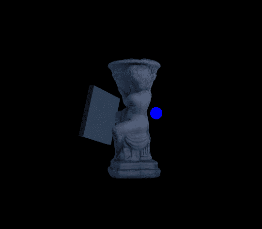
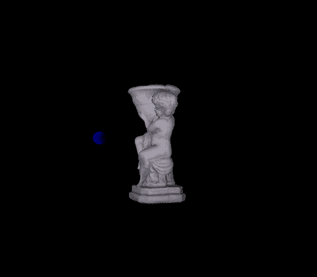
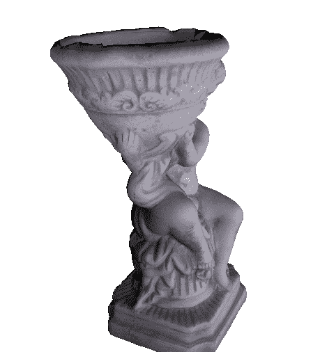
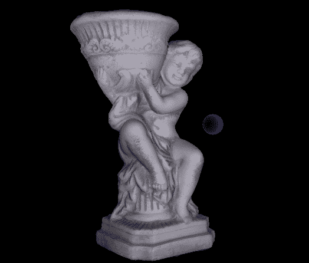
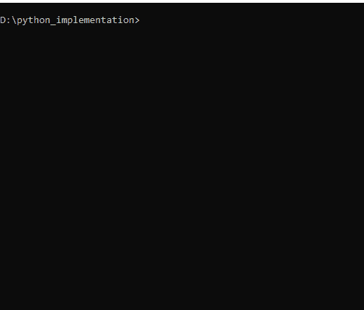
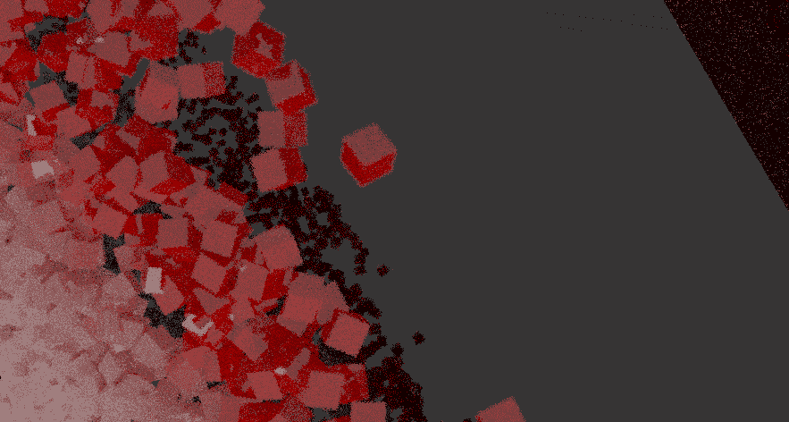
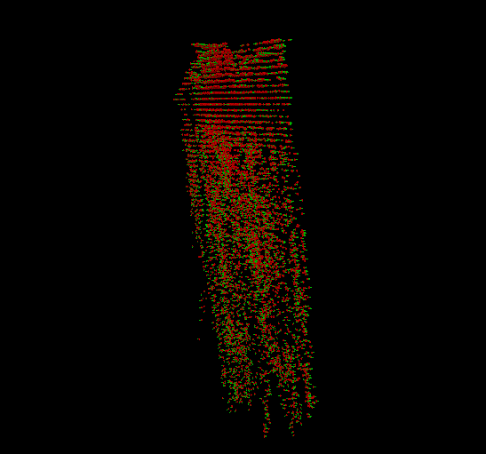

# 用于网格、点云和数据可视化的 Python 库(第 2 部分)

> 原文：<https://towardsdatascience.com/python-libraries-for-mesh-point-cloud-and-data-visualization-part-2-385f16188f0f>

> 这是本教程的第 2 部分，探索一些用于数据集、点云和网格的可视化和动画的最佳库。在本部分中，您将获得一些见解和代码片段，帮助您使用[](https://github.com/mmatl/pyrender)**，*[*PlotOptiX*](https://plotoptix.rnd.team/)*，*[*poly scope*](https://polyscope.run/py/)，*和*[*Simple-3d viz*](https://simple-3dviz.com/)*。制作令人惊叹的交互式可视化和光线跟踪渲染可以很容易！**

******

*作者的 PlotOptiX(左)、Pyrender(中)和 Simple-3dviz(右)|图像的输出示例*

*在 Python 可视化库概述的第 2 部分中，我们继续讨论一些广为人知和晦涩难懂的例子。本文中展示的两个库是相当轻量级的，可以通过手动和编程方式快速生成可视化效果。Polyscope 有一大套可视化选项，其中许多可以在显示 3D 对象时通过 GUI 界面手动设置。Simple-3dviz 是一个非常轻量级的实现，它提供了有限数量的可视化，但非常适合快速原型开发。另一方面，还有 Pyrender 和 PlotOptiX。这两个库都需要更多的硬件资源(在 PlotOptiX 的情况下，需要 Nvidia 卡)，但它们提供了更好的照明和光线跟踪渲染。*

*如果你对使用 Open3D、Trimesh、PyVista 或 Vedo 感兴趣，可以看看概述教程的第 1 部分——这里[这里](https://medium.com/@inikolov17/python-libraries-for-mesh-and-point-cloud-visualization-part-1-daa2af36de30)。*

*[](/python-libraries-for-mesh-and-point-cloud-visualization-part-1-daa2af36de30)  

作者使用 Simple-3dviz|图像的平滑闭环摄像机轨迹可视化示例

同样，对于每个库，本教程将介绍安装和设置过程，以及一个简单的实践示例，演示如何为可视化网格和点云以及数据集构建一个最小的工作原型。所有例子的代码都可以在 GitHub 库[这里](https://github.com/IvanNik17/python-3d-analysis-libraries)找到。


使用 Polyscope|作者提供的图片，可视化不同时间点的天气(温度/湿度)数据变化

为了跟进，我在**中提供了天使雕像网格。obj** 格式 [**这里**](https://github.com/IvanNik17/python-3d-analysis-libraries/tree/main/mesh) 和点云在**。txt** 格式[此处 。该物体已在几篇文章[1]，[2]，[3]中介绍过，也可作为大型摄影测量数据集[4]，[5]的一部分下载。为了演示 3D 图的可视化，在**中显示了包含天气数据的时间序列数据集。csv** 格式在](https://github.com/IvanNik17/python-3d-analysis-libraries/tree/main/point_cloud) 这里也提供 [**。天气元数据涵盖了 8 个月的各种天气条件，是自动编码器和物体探测器长期数据漂移研究的一部分[6]。数据是开源的，使用由**](https://github.com/IvanNik17/python-3d-analysis-libraries/tree/main/dataset)**[丹麦气象研究所(DMI)](https://confluence.govcloud.dk/display/FDAPI) 提供的 API 提取。它可以在商业和非商业、公共和私人项目中免费使用。为了使用数据集，熊猫是必需的。它默认出现在 Anaconda 安装中，可以通过调用`conda install pandas`轻松安装。**

# 使用 Simple-3dviz 进行可视化



简单-3dviz |作者图片

Simple-3dviz 库是一个轻量级且易于使用的工具集，用于网格和点云的可视化。它建立在 wxpython 之上，支持动画和屏幕外渲染。通过屏幕外渲染，该库还支持深度图像的提取。除此之外，作为库的一部分，还提供了两个帮助函数— `mesh_viewer`用于快速可视化 3D 对象并保存截图和渲染图，以及`func_viewer`用于快速可视化各种功能的 3D 效果。

该库被限制为每个查看器窗口只有一个光源，但它可以很容易地在场景中移动和重新定位。该库最强大的部分之一是可以轻松设置相机轨迹。这个库有几个依赖项，其中一些是必需的——比如 NumPy 和 [moderngl](https://github.com/moderngl/moderngl) ，而其他的只有在你想保存渲染或者可视化一个 GUI 的时候才是必需的，比如 OpenCV 和 wxpython。这使得这个库相当轻便。如果您正在使用 Anaconda，通常最好从创建一个环境开始，然后通过 pip 安装必要的部分。该库在 Linux 和 Windows 上运行，在 Mac 上有小的可视化错误。

```
conda create -n simple-3dviz_env python=3.8
conda activate simple-3dviz_env
pip install simple-3dviz
```

一旦安装完毕，通过调用`import simple-3dviz`和`print(simple-3dviz.__version__)`就可以很容易地检查所有的东西是否安装正确。如果显示了版本，并且没有打印错误，那么一切都准备好了。

要在任何地方使用 Windows 上的`mesh_viewer`和`func_viewer`，需要将 Python 和 conda 环境添加到系统的环境变量 path 中。出于测试目的，你也可以在`Anaconda3\envs\your_conda_environment_name\Scripts`中找到这两个应用。在这两种情况下，您都需要用它们的。exe 扩展名。例如，使用 mesh_viewer 可视化天使雕像是用`python mesh_viewer.exe \mesh\angelStatue_lp.obj`完成的，而可视化函数 x*y -y*x 可以用`python func_viewer.exe x*y**3-y*x**3`完成(这里要注意的是，不要把函数放在引号中，音节之间也不要有空格)。func_viewer 的结果如下所示。



内置的应用程序，查看 2D 函数在简单的三维图像作者

加载一个 3D 对象可以通过调用`simple-3dviz.from_file()`来完成，如果需要一个纹理网格，它会有额外的输入。在天使雕像的情况下，将纹理的路径添加到该函数会导致不正确的 UV 坐标和纹理映射。更迂回的方法是在加载网格和材质后调用`Material.with_texture_image()`。最后，设置材质对象，作为网格的材质。

同样，为场景创建球体图元也不太明显。Simple-3dviz 不包含创建图元的函数，但具有通过使用`Mesh.from_superquadrics()`创建[超二次曲面](https://en.wikipedia.org/wiki/Superquadrics)的函数，以及另外通过`Sphereclouds`方法创建用于表示点云的球体的函数。在我的例子中，我决定为了简单起见，使用点云中的一个球体。下面给出了生成图元和加载网格的代码。

为网格创建材质时，我们可以设置它的视觉属性。为了生成球体，我们首先创建一个单一的坐标位置并扩展其维度。然后，我们将它与大小和颜色一起添加到 Spherecloud 方法中。接下来，可视化和动画直接在对`show`函数的调用中完成。该函数还可以调用按键、摄像机移动和对象操作。代码如下所示。

从代码中可以看出，我使用了一点 hacky 实现。由于我没有找到直接旋转点云的方法，我使用了`RotateModel`的方法来旋转场景中的所有物体。然后我使用`RotateRenderables`来指定网格，并在另一个方向旋转它。最后，设置相机位置、向上方向、背景和图像大小。最终代码如下所示。

有几种方法可以扩展这个例子。如前所述，您可以将球体表示为超二次曲面。你也可以尝试使用不同的相机轨迹，因为 Simple-3dviz 包含了很多选项— `Lines`、`QuadraticBezierCurves`、`Circle`，以及重复移动、在点之间前进和后退等。或者您可以添加键盘和鼠标交互。

# 使用 PlotOptiX 进行可视化(需要支持 CUDA 的 GPU)


PlotOptiX 结果|作者图片

作为这些文章的一部分，我们将探索更有趣的库之一， [PlotOptiX](https://github.com/rnd-team-dev/plotoptix) 是一个 3D 光线跟踪包，用于网格、点云和非常大的数据集的可视化。它产生高保真效果，受益于最现代的后期处理和效果，如色调校正、去噪、抗锯齿、动态景深、色差等。该库被 Meta、Google 和 Adobe 广泛使用。它使用英伟达的 [Optix 7.3](https://developer.nvidia.com/rtx/ray-tracing/optix) 框架，在基于 RTX 的卡上，它运行时进行了许多优化。它既提供高分辨率的静态渲染，也提供实时动画和交互。它可以直接与其他库接口，如用于有限元网格生成的 Python 包装器 [pygmsh](https://github.com/meshpro/pygmsh) 或本文第 1 部分中已经提到的[Trimesh](https://medium.com/@inikolov17/python-libraries-for-mesh-and-point-cloud-visualization-part-1-daa2af36de30)。

该库可以在 Linux、Mac 和 Windows 上运行，需要 3.6 及更高版本的 64 位 Python。在 Windows 上，需要安装[。Net Framework](https://dotnet.microsoft.com/download/dotnet-framework) ≥ 4.6.1，而在 Linux 上需要安装 [Mono](https://www.mono-project.com/download/stable/#download-lin) 、 [pythonnet](http://pythonnet.github.io/) 、 [FFmpeg](https://ffmpeg.org/download.html) 。关于安装的更多信息可以在 PlotOptix 的 GitHub 页面上阅读。一旦安装了所有的先决条件，就可以在新的 Anaconda 环境中安装这个库了。

```
conda create -n plototix_env python=3.8
conda activate plototix_env
pip install plotoptixpip install tk
pip install pyqt5
```

在我的例子中，我需要按照建议安装 Tkinter 和 PyQt，以便能够可视化结果。最后，请注意 PlotOptiX **需要 Nvidia 卡，**，因为它使用了许多 CUDA 功能。就我而言，我有一台英伟达 GTX 1070 TI，在编写 512.15 时，该库要求我将驱动程序更新到最新版本。如果您在运行代码时遇到神秘的错误，一个好的第一步故障诊断是更新您的驱动程序。

一旦所有东西都安装好了，你可以通过调用`import plotoptix`然后调用`print(plotoptix.__version__)`来检查它。如果没有检测到问题，下一步是尝试 PlotOptiX GitHub 页面上提供的“Hello World”示例— [此处](https://github.com/rnd-team-dev/plotoptix/blob/master/examples/1_basics/0_try_plotoptix.py)。其他示例也可以通过调用

```
python -m plotoptix.install examples
```

我们可以使用`load_merged_mesh_obj`在 PlotOptiX 中加载网格。由于我们的网格也有纹理，我们用`load_texture()`加载它，并通过调用`name_of_material['ColorTexture'] = texture_name`用纹理更新材质。这样，当我们将材质赋予网格时，纹理将被自动分配。我们还需要初始化场景的查看器。在 PlotOptiX 中，有许多对可视化质量和速度有负面影响的调整选项。其中最重要的是`min_accumulation_step`和`max_accumulation_step`。第一个参数控制在显示可视化之前每次迭代将累积多少帧，而第二个参数指定每个场景的最大累积帧。这两个值越高，产生的结果越清晰，噪波越少，但是会大大降低可视化的速度。此外，可以通过调用`set_uint()`或`set_float()`方法以及所需的变量和新值来显式调整着色器的值。在我们的例子中，我们改变了`path_seg_range`，它改变了每条射线被追踪的范围。我们这样做是因为我们需要更高的值来正确地可视化赋予一个基本对象的玻璃材质。最后，我们还可以通过调用`add_postproc`并为其指定所需的效果和值，在渲染的视觉效果上应用后期处理效果。在我们的例子中，我们使用伽马校正和去噪后处理效果来清洁和锐化视觉效果。下面给出了加载天使网格和设置环境的代码。

在 PlotOptiX 中，我们还可以创建有限数量的图元——球体、平行六面体、平行四边形、四面体等。要创建一个，需要带有指定`geom`参数的函数`set_data()`，其中也可以设置对象的位置、大小和材料。使用`setup_light()`方法创建灯光，通过调用`in_geometry=True`可以将灯光设置为物理对象并可视化，并且可以显式设置其大小、颜色和位置。下面给出了用玻璃材质创建一个平行六面体的示例代码。

PlotOptiX 处理动画和交互性的方式是通过两种类型的回调函数— `on_scene_compute`和`on_rt_completed`。第一个在渲染前被调用，用于计算 CPU 端需要的一切。在我们的例子中，我们用它来增加一个计数器并计算光线的旋转位置。第二个在光线跟踪之后调用，用于计算和绘制 GPU 端的所有内容。在我们的例子中，我们使用它来调用对象和灯光的所有旋转和平移函数。这两种功能都可以随时暂停、恢复或停止。在我们的例子中，我们还使用一个简单的类来保存两个函数都会用到的所有必要变量。这两个函数被设置为在查看器初始化时调用。下面给出了代码。

`rotate_geometry`用于方便旋转，这里的中心可以是物体的质心，也可以是空间中的一个特定点。对于光的移动，我们没有特定的旋转函数，所以我们在`compute_changes`函数中计算新位置，并使用`update_light`函数设置新位置。网格可视化的完整代码如下所示。

PlotOptiX 的一个非常好的用例是创建 3D 数据图的光线跟踪渲染。这种可视化在观众面前的演示以及视频演示和数据概述中特别有用，其中这种渲染可用于吸引人们的注意力。目前，该库缺少一种可视化 3D 轴和原生 3D 文本标签的方法，但从 pandas 或 numpy 绘制数据非常容易。



使用 PlotOptiX 以 3D 方式可视化天气(温度/湿度/露点)数据。噪波像素是光线跟踪帧通道数较少的结果。|图片作者

PlotOptiX 还经过优化，可以显示大量图元，并利用 RTX 卡进一步加快可视化速度。我们可以通过从天气数据集中选择三列来证明这一点——温度、湿度和露点。我们将使用总计约 9K 个数据点的所有列。我们使用 pandas 加载数据，并将这三列转换成一个 NumPy 数组，以便加载到 PlotOptiX 的函数中。一旦数据在 NumPy 中，我们可以直接将它输入到`set_data()`方法的位置，我们也可以根据特定的列改变数据点的颜色和半径。下面的代码给出了数据的加载和数据点的设置。

这里我们还使用了`map_to_colors`方法将数据的温度列映射到 matplotlib 中的颜色图，PlotOptiX 使用这个颜色图。当我们设置数据时，我们也可以根据数据集列设置半径。在我们的例子中，我们将其设置为湿度列，并用标量值对其进行缩放。不同的几何图元也可以用于可视化数据点。还为数据点周围的侧板和底板创建了两个平面。我们创建了一个平行六面体和一个 2D 平行四边形，来演示如何创建它们，并给它们不同的预定义材质。最后，我们再次使用回调为摄像机创建一个简单的运动模式，并设置后期处理效果。下面是完整的代码。

# 使用 Polyscope 可视化


Polyscope 结果|作者图片

如果你需要一个轻量级的、易于设置和使用的浏览器和用户界面生成器， [Polyscope](https://polyscope.run/py/) 是最好的、易于使用的、成熟的库之一。它有 C++和 Python 两个版本，可用于通过代码或通过内置 GUI 手动轻松可视化和操作点云、数据集和网格。

该程序包含几个预构建的材质和着色器，以及体积网格，曲线网络，曲面网格和点云。它可以在 Linux、Mac 和 Windows 上运行。唯一的要求是操作系统需要支持 OpenGL>3.3 核心，并且能够打开显示窗口。这意味着 Polyscope 不支持无头渲染。它需要 3.5 以上的 Python 版本。同样，我们使用 Anaconda 环境来创建一个环境，并通过 pip 或 conda 在其中安装库。

```
conda create -n polyscope_env python=3.8
conda activate polyscope_env
pip install polyscope
OR
conda install conda-forge polyscope
```

一旦我们安装了库，我们可以通过调用`import polyscope`和`polyscope.init()`来检查一切是否正常。如果没有显示错误，则库安装正确。

Polyscope 一开始就没有包含的一个东西是读取网格数据的方法。这可以通过使用其他库来完成，如 Trimesh 或 Open3D，然后使用这些库中的顶点、面和法线数据在 Polyscope 中创建和可视化网格。由于这些库不是使用 Polyscope 的先决条件，本着分别提供每个库的清晰概述的精神，我们将在中加载天使雕像的点云。txt 格式通过 NumPy。点云包含天使雕像中每个点的 XYZ 位置、颜色和法线。我们可以使用`numpy.loadtxt`加载点云，然后将数组分成点位置、颜色和法线。通过调用`register_point_cloud`然后通过调用`add_color_quantity`添加颜色，这些可以用来生成多边形范围点云。下面给出了代码。

为了创建围绕天使雕像的旋转球体，我们创建了一个单点云，并将其渲染为一个半径较大的球体。由于天使雕像使用了额外的颜色，我们选择了一种可以与颜色混合的材料，而旋转球体使用了一种不能混合的材料。更多关于材料的信息可以在[这里](https://polyscope.run/py/features/materials/)看到。为了生成动画、按钮、鼠标和 GUI 交互，Polyscope 利用了在后台执行的回调，而不暂停主线程。由于 Polyscope 不包含简单的平移和旋转方法，我们实现了一个简单的方法来旋转天使雕像并围绕它移动球体。这在下面给出。

更新渲染点位置的主要方法是调用`update_point_positions`。对于这个例子，我们创建一个绕 Y 轴旋转的旋转矩阵，并计算天使雕像的所有点位置的点积。对于球体，我们计算新的 X 和 Z 位置。对于这两种情况，我们都使用`time.time`计数器。下面是完整的代码。

对于 3D 数据可视化，我们将利用 Polyscope 提供的简单动画工具。我们使用 pandas 导入数据集，并提取其中的三列——温度、湿度和风速。为了可视化这三个天气特征对于每个捕获点是如何变化的，我们利用了数据点之间边缘的可视化，或 Polyscope 中指定的曲线。我们首先把点本身想象成一个点云，其大小取决于温度。然后，我们根据捕捉时间制作点之间的边的动画。下面给出了读取和预处理数据集以及可视化数据点的代码。


温度、湿度和风速随时间的变化通过 3D 边缘图展示|图片由作者提供

一旦使用`add_scalar_quantity`和`set_point_radius_quantity`基于温度值对初始点云进行可视化和缩放，我们可以在每个更新周期调用回调来旋转相机并使用`register_curve_network`重建边缘。使用内置方法`look_at()`旋转摄像机，其中给出摄像机的新位置，摄像机的目标设置为数据集的中点。因为我们想要构建一个显示温度、湿度和风速如何从一个数据点变化到另一个数据点的边的动画，所以我们一次只在全部数据的子集上绘制边。多边形范围曲线网络需要 Ex2 形式的边数据，其中 E 是边的数量，每条边的起点和终点在单独的行上。我们再次利用单独的计数器值来选择回调中的子集。回调函数的代码如下所示。

在回调中，我们需要反复去掉之前的曲线段，然后重新构建。这样做是因为没有简单的方法将元素添加到已经创建的曲线网络中。我们通过得到特定的曲线网络并用`get_curve_network("network_name").remove()`移除它的所有部分来做到这一点。然后，我们添加代表每个边的温度颜色的标量。一旦我们到达数据集的末尾，我们重置计数器并重新开始。下面给出了制作数据集可视化动画的完整代码。

# 使用 Pyrender 的可视化


Pyrender 结果|作者图片

另一个相对轻量级但功能强大的可视化和动画库是 Pyrender。它建立在 Trimesh 之上，用于导入网格和点云。该库的一个有用功能是它附带了一个查看器和一个屏幕外渲染器，这使得它非常适合在无头模式下工作，并集成到深度学习数据提取、预处理和结果聚合中。Pyrender 是使用纯 Python 构建的，可以在 Python 2 和 Python 3 上工作。

集成的查看器带有一组预建的命令，用于简单的动画、法线和面部可视化、改变照明以及保存图像和 gif。它还带有有限但易于使用的金属粗糙材料支持和透明度。最后，屏幕外渲染器也可以用来生成深度图像。

该库可以在 Linux、Mac 和 Windows 上运行。安装直接使用 pip，并将所有依赖项与 Trimesh 一起安装。像往常一样，我们为库创建一个 Anaconda 环境并安装它。

```
conda create -n pyrender_env python=3.6
conda activate pyrender_env
pip install pyrender
```

一旦安装了库，我们可以通过导入它`import pyrender`并调用`print(pyrender.__version__)`来检查一切是否正常。如果没有出现错误，则安装成功。按照规定，Pyrender 无法导入网格和点云，但具有与 Trimesh 的内置互操作性。要加载天使雕像网格，我们首先使用`trimesh.load(path_to_angel)`加载，然后我们可以调用`pyrender.Mesh.from_trimesh(trimesh_object)`将其转换为可以在 Pyrender 中使用的对象。我们用同样的方法创建球体和地平面。我们首先通过调用 Trimesh 中的`trimesh.creation.uv_sphere()`和`trimesh.creation.box()`来创建一个 UV 球体图元和盒子，然后通过分别调用`pyrender.Mesh.from_trimesh()`将它们转换成 Pyrender 对象。Pyrender 可以渲染三种灯光——平行光、聚光灯和点光源，以及两种类型的相机——透视和正交。在我们的例子中，我们使用一个点光源`pyrender.PointLight()`，和一个透视相机`pyrender.PerspectiveCamera()`。下面是加载天使雕像，创建原始物体，相机和灯光的代码。

Pyrender 严重依赖于其场景的节点结构，其中每个对象都作为一个单独的节点添加到场景集中。每个节点可以包含网格、摄影机或灯光，这些对象可以通过用于更改其变换和属性的方法来显式调用或引用。每个创建的对象都被添加到一个节点，并设置它们的初始位置。这些节点将在稍后设置动画时被引用。下面给出了代码。

一旦创建了所有的节点，我们初始化查看器，并用包含[可能选项](https://pyrender.readthedocs.io/en/latest/generated/pyrender.viewer.Viewer.html)的字典设置查看器和呈现器标志。为了创建动画，Pyrender 有一个方法`viewer.is_active`，该方法返回 True，直到查看器关闭。我们用它来创建一个 while 循环，在这里我们改变对象的位置和方向。我们把所有用于改变对象的代码放在`viewer.render_lock.acquire()`和`viewer.render_lock.release()`之间，它们停止并释放渲染器，所以可以进行改变。代码如下。

在循环中，我们利用`trimesh.transformations.rotation_matrix()`来计算天使雕像绕 Y 轴的旋转。一旦计算出新的变换矩阵，就通过调用`scene.set_pose(name_of_node, transformation_matrix)`将其应用于特定对象。在循环结束时，`time.sleep()`被调用，因为没有它，观看者无法进行可视化。Pyrender 的完整代码如下。

Pyrender 可以从 Trimesh 访问所有图元，并可以基于 NumPy 数组中的 3D 坐标直接创建大量对象。我们可以利用它来可视化数据集的温度、湿度和风速列。此外，我们将结合使用胶囊原语可视化风向。我们再次使用熊猫来加载数据。我们提取必要的列，并从中创建一个 NumPy 数组，作为 Pyrender 对象的输入。为了生成风向胶囊，我们取[0:360]之间的值，将其转换成弧度，并输入到`trimesh.transformations.rotation_matrix`。例如，任意选择围绕世界 Y 轴旋转胶囊。所得到的变换矩阵被保存并在以后用于定位和旋转胶囊图元。代码如下。



温度、湿度、风速图，用“箭头”表示每个点的风向|图片由作者提供

一旦我们导入了所有必要的数据并预处理了旋转，Pyrender 对象就被创建并从数据集中填充。创建一个`trimesh.creation.uv_sphere()`和`trimesh.creation.capsule()`对象。这些对象然后被用作`pyrender.Mesh.from_trimesh()`方法的输入，连同数据集数组作为位置数据。为此，我们使用`numpy.tile()`函数为每个点创建一个 4x4 的变换矩阵。对于球体，我们只添加来自数据集的定位数据，而对于胶囊，我们还添加计算的旋转矩阵。每个这样创建的点云然后作为节点添加到场景中。最后，我们创建一个相机对象，将其添加到一个节点，并给它一个俯视数据集中点的位置。在我们的例子中，我们只需调用浏览器中的预建功能，按下“A”键即可旋转摄像机。为了确保为旋转选择正确的轴，我们通过给观察者一个`viewer_flag = {"rotation_axis":[0,1,0]}`来明确指定它。下面给出了数据集可视化的完整代码。

# 结论

恭喜你完成这篇教程文章！这是一个很长的阅读。通过本文的这两个部分，我希望更多的人将使用这些非常有用、通用和直观的库，使他们的数据、网格和点云可视化脱颖而出。每一个被探索的库都有优点和缺点，但是它们结合在一起形成了一个非常强大的武器库，每个研究人员和开发人员都可以利用，还有更广为人知的包，如 Matplotlib、Plotly、Seaborn 等。在接下来的文章中，我将关注具体的用例，如体素化、特征提取、距离计算、RANSAC 实现等。这对数据科学家、机器学习工程师和计算机图形程序员都很有用。

如果你想了解更多关于从点云和网格中提取特征的内容，你可以看看我的一些关于 3D 表面检查和噪声检测的文章[2]和[7]。你可以在我的 [**页面**](https://ivannikolov.carrd.co/) 上找到文章，加上我的其他研究，如果你发现一些有趣的东西或者只是想聊天，请随时给我留言。敬请关注更多内容！

# 参考

1.  **尼科洛夫，I.** ，&麦德森，C. (2016，10 月)。在不同的拍摄条件下，对 motion 3D 重建软件的近距离结构进行基准测试。在*欧洲-地中海会议*(第 15-26 页)。施普林格、湛；[https://doi.org/10.1007/978-3-319-48496-9_2](https://doi.org/10.1007/978-3-319-48496-9_2)
2.  **尼科洛夫，I.** ，&麦德森，C. (2020)。粗暴还是吵闹？SfM 重建中噪声估计的度量。*传感器*、 *20* (19)、5725；[https://doi.org/10.3390/s20195725](https://doi.org/10.3390/s20195725)
3.  **尼科洛夫，I. A.** ，&麦德森，C. B. (2019，2 月)。测试 SfM 图像捕获配置的交互式环境。在*第十四届计算机视觉、成像和计算机图形学理论与应用国际联合会议(Visigrapp 2019)* (第 317–322 页)。科学出版社数字图书馆；[https://doi.org/10.5220/0007566703170322](https://doi.org/10.5220/0007566703170322)
4.  **尼科洛夫一世**；Madsen，C. (2020)，“GGG 基准 SfM:在不同捕获条件下对近距离 SfM 软件性能进行基准测试的数据集”，门德利数据，第 4 版；[https://doi.org/10.17632/bzxk2n78s9.4](https://doi.org/10.17632/bzxk2n78s9.4)
5.  **尼科洛夫一世**；麦德森，C. (2020)，“GGG——粗糙还是嘈杂？SfM 重建中的噪声检测指标”，门德利数据，V2；[https://doi.org/10.17632/xtv5y29xvz.2](https://doi.org/10.17632/xtv5y29xvz.2)
6.  **Nikolov，I.** ，Philipsen，M. P .，Liu，j .，Dueholm，J. V .，Johansen，A. S .，Nasrollahi，k .，& Moeslund，T. B. (2021)。漂移中的季节:研究概念漂移的长期热成像数据集。第三十五届神经信息处理系统会议；[https://openreview.net/forum?id=LjjqegBNtPi](https://openreview.net/forum?id=LjjqegBNtPi)
7.  **尼科洛夫，I.** ，&马德森，C. B. (2021)。使用砂纸粒度量化风力涡轮机叶片表面粗糙度:初步探索。在*第 16 届计算机视觉理论与应用国际会议*(第 801–808 页)。科学出版社数字图书馆；[https://doi.org/10.5220/0010283908010808](https://doi.org/10.5220/0010283908010808)*