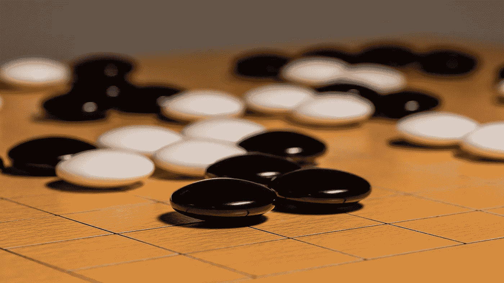
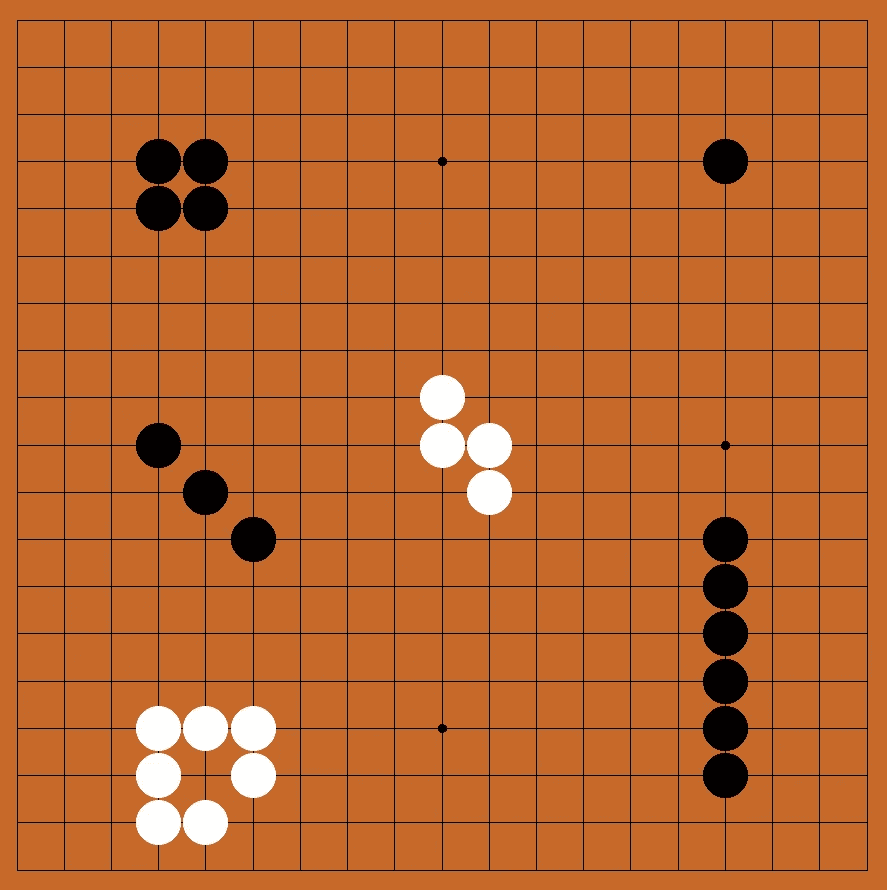
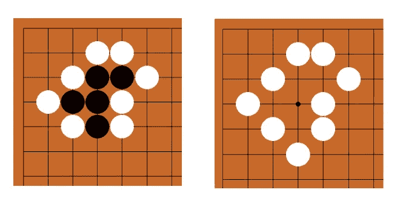

# Python Miniproject:在 PyGame 中从头开始制作游戏

> 原文：<https://towardsdatascience.com/python-miniproject-making-the-game-of-go-from-scratch-in-pygame-d94f406d4944>

围棋这个古老的[游戏已经玩了几千年了。围棋的棋盘配置比宇宙中的原子还要多，它是一种非常复杂和抽象的游戏，产生于一套简单的规则。2016 年，DeepMind 的 AlphaGo 程序在五局比赛中击败了顶级围棋职业选手 Lee Sedol，成为头条新闻。在观看了一部关于 AlphaGo-Lee 比赛的精彩纪录片后，我认为尝试用 Python 从头开始编写一个基本的围棋游戏会很有趣。作为一名程序员，做这样有趣的小项目是我自身发展的一个重要部分，所以我希望你喜欢跟着做，并且在处理自己的项目时也有所启发！](https://en.wikipedia.org/wiki/Go_(game))

图片来自维基共享(CC BY-SA 4.0)

在本文中，我们将探索如何使用 Python 和 PyGame 从头开始创建 Go。在这个过程中，我们将看到如何使用数据科学中的工具来帮助我们更轻松地编写这个游戏。到文章结束时，你会明白:

*   如何用 PyGame 建立一个基本的游戏图形用户界面
*   如何使用集合和 itertools 编写简洁优雅的代码
*   如何使用 NumPy 运算符进行快速矩阵运算
*   如何使用 Networkx 图形库分解复杂问题

## Go 规则快速概述

围棋的规则其实挺简单的。黑白双方轮流将石头放在 19x19 的棋盘上(其他尺寸也是可以的，但这是标准尺寸)。形成连续链(由网格线连接)的一组宝石组成一组。如果一个或一组石头完全被另一种颜色包围，那么这些游戏被捕获并从棋盘上移走。游戏结束时，石头包围更多领土的玩家获胜。我在这里有意掩饰一些细节，但这是基本要点。我们现在的目标是设计一个程序，允许两名玩家在棋盘上放置石头，同时执行围棋规则，例如禁止非法移动和实施捕捉。

## 设计过程

当处理一个复杂的项目时，将问题分解成容易理解的部分会很有帮助。我试图创建封装和模块化的程序，用不同的功能来处理一个问题的各个子部分。在 Go 的例子中，我认为我需要函数来完成以下任务:

*   使用 PyGame 绘制棋盘
*   在 PyGame 的(x，y)坐标和 19x19 网格的离散棋盘位置之间转换
*   根据用户动作(如鼠标点击)更新游戏状态
*   检查尝试的移动是否有效

我尽可能地将游戏的输入/输出与内部游戏状态分开。我创建了一个`Game`类，它存储了关于一个给定游戏的所有数据，比如棋盘的状态和每个玩家捕获的石头或“囚犯”的数量。`Game`类有一个`draw()`函数来处理将棋盘状态呈现给 PyGame GUI，还有一个`update()`函数来检查用户动作，比如鼠标点击和按键。

## 代码

下面的 GitHub 库包含了围棋游戏的完整代码。请注意，这只是一个基本的、最基本的实现，缺少许多你可以在 Go 应用程序和网站中找到的功能，但我选择保持项目简单，专注于本质。您可以看一下代码，然后继续阅读我对一些代码亮点的解释。请随意在 GitHub 上分叉代码，摆弄它，并留下任何评论或问题。

 [## gogame/gogame . py at master thomashikaru/gogame

### 此时您不能执行该操作。您已使用另一个标签页或窗口登录。您已在另一个选项卡中注销，或者…

github.com](https://github.com/thomashikaru/gogame/blob/master/gogame.py) 

## 用 PyGame 创建一个基本游戏

[PyGame](https://www.pygame.org/docs/) 是一个用于创建基本 GUI 游戏的 Python 库。它支持在屏幕上绘制图形、监视鼠标点击和按键、播放声音以及游戏中可能出现的其他操作。导入 PyGame 后，您可以使用`pygame.init()`来初始化一个 PyGame GUI。其他有用的函数包括`pygame.mouse.get_pos()`获取当前鼠标位置、`blit()`向屏幕发送文本、`flip()`用新的形状更新屏幕。请查看上面的代码，了解这些 PyGame 函数在实践中是如何工作的。

我的围棋游戏截图。

## **NumPy 操作的魔力**

正如你所知，围棋棋盘是一个二维矩阵。NumPy 库有很多非常方便的函数来处理数组和矩阵。

为了生成均匀间隔的网格线，我使用了`np.linspace()`和`np.full()`函数。第一个函数`np.linspace()`在给定的起始值和结束值之间创建一个等距值列表。同时，`np.full()`创建一个所需形状的相同值的数组。这允许我快速地为形成围棋棋盘网格的线段生成一组起点和终点，然后我将它们输入到`pygame.draw.line()`函数中。

另一个非常有用的 NumPy 函数是`np.where()`函数，它返回某个条件为真的数组中的索引。例如，行`np.where(self.board == 1)`返回存储值 1 的棋盘位置(在我的游戏惯例中，这表示存在黑石)。

## Itertools 和集合

我使用了`itertools.product()`来替换嵌套的 for 循环。例如，要快速创建 Go 棋盘上所有网格点的列表(例如(0，0)到(18，18))，我可以使用`itertools.product(range(19), range(19))`。

与此同时，我使用`collections.defaultdict()`创建了一个分数计数器，它优雅地处理递增，即使是空的。第`self.prisoners = collections.defaultdict(int)`行创建了一个类似于 Python 字典的数据结构，除了当一个键第一次访问字典时，它被赋予一个相应的值 0。我喜欢使用`defaultdicts`让我的代码对键错误更加健壮，而不必编写一堆特殊的边缘情况检查。

## 用图论方法识别石材群

围棋游戏的一个基本单位是石头群。一群石头同生共死。当一群石头被完全包围时，所有的石头都可以被一次捕获。但是只要一组中的一块石头至少有一个自由空间(未被占据的相邻棋盘空间)，整个组就仍然活着。

为了我们的游戏程序的目的，我们有下面的数学问题:给定一个填充有三个不同值(0 代表空白，1 代表黑石，2 代表白石)的 N×N 矩阵，产生每种颜色的石头组的列表，其中每个石头组是一个石头列表，使得该组中的所有石头形成一个连续的块。这个描述可能有点难以理解，所以请参考下图，看看你能不能算出每种颜色有多少个石组。

每种颜色有多少组石头？

正确答案是有 6 个黑石组和 2 个白石组。不要被对角线方向放置的 3 块黑色石头误导——它们彼此不相连，因为它们没有通过网格线直接连接，所以每块石头都是自己的石头组。我很快意识到，编写一个程序来获取一个游戏板并自动找到所有的石头组并不简单，因此我开始考虑是否可以将这个问题简化为一个已经存在算法的现有问题。

我发现使用图论和 [Networkx 图形库](https://networkx.org/documentation/stable/reference/index.html)得到了一个惊人的解决石头群计数问题的优雅方案。假设我们想找到所有的黑石组。基本的直觉是，我们从一个“网格图”开始，它看起来就像围棋棋盘的网格:每个顶点都连接到它上面、下面、左边和右边的顶点。然后我们移除所有没有黑色石头的顶点。这给我们留下了一个图，其中连接的组件直接对应于石头组！我们可以简单的用 Networkx 内置的`connected_components()`函数返回答案！使用这个函数，我现在可以实现在游戏中检测捕获的代码。这意味着游戏将自动检测何时石头群被包围，将他们从棋盘上移除，并相应地增加囚犯的数量。

游戏现在可以检测石头群的捕获并更新棋盘。

## 后续步骤

试用过代码的严肃围棋玩家可能已经注意到，游戏并没有 100%完成。这个游戏并没有执行 Ko 的规则，不允许玩家重复之前的游戏位置。如果能在游戏结束时自动计算分数，以及像“撤销”这样的便利功能，那就更好了。最后(这是一个很大的挑战)，如果有一个人工智能可以对抗一个单独的人类玩家，那就太好了，因为现在这个游戏需要两个人类玩家。

我希望你喜欢阅读我用 Python 构建围棋游戏的经历，并且在这个过程中你学到了一些新东西。如果您有任何其他建议或反馈，请在下面留下评论！

## 参考

[1] PyGame 文档:[https://www.pygame.org/docs/](https://www.pygame.org/docs/)

[2] Networkx 文档:[https://Networkx . org/Documentation/stable/reference/index . html](https://networkx.org/documentation/stable/reference/index.html)

[3]看看这部关于 AlphaGo 与 Lee Sedol 比赛的精彩纪录片: