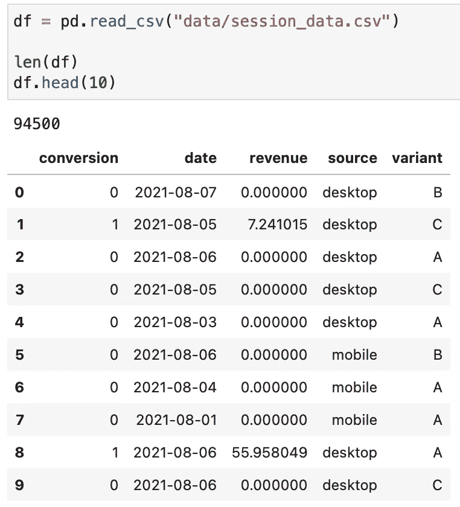
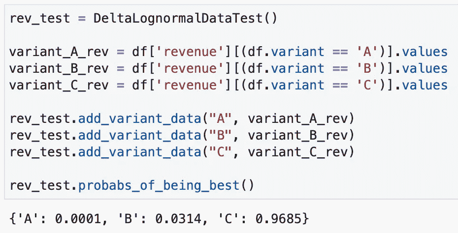

# 用于贝叶斯测试的 Python 包

> 原文：<https://towardsdatascience.com/python-package-for-bayesian-a-b-testing-86ea3ff5c963>

## 使用贝叶斯方法快速评估 A/B(或 A/B/C/…)测试


杰森·登特在 [Unsplash](https://unsplash.com?utm_source=medium&utm_medium=referral) 上拍摄的照片

我从事过几个 A/B 测试项目，我总是更喜欢使用贝叶斯方法和度量标准 ***最佳概率*** ，而不是传统的频率方法和 p 值。这是我选择的两个主要原因:

*   **可解释性**:能够说出变体 XYZ 在测试中是所有变体中最好的概率非常方便，尤其是在向企业解释结果的时候。
*   **可伸缩性**:对多个变体测试进行最佳伸缩的概率。

这篇文章不会关注 A/B 测试的细节。事实上，有许多文章(甚至在 Medium 或 TDS 上)是关于传统方法与贝叶斯方法的比较，也有许多文章是关于贝叶斯方法如何真正工作的细节。这些文章中有许多附有代码示例，展示了如何使用各自分布中的抽样来生成概率，但是大多数文章只关注二进制数据测试(例如转换)。

我总是缺少一些好的实现，特别是每会话收入数据，其中大多数会话都是非转换(收入为 0)，但转换携带收入信息(例如，用户购物会话的收入)。

# Python 包

我为贝叶斯 A/B(或 A/B/C/…)测试创建了一个小的 [python 包](https://pypi.org/project/bayesian-testing/)，它可以用于上面提到的两种情况。要安装它，只需使用 pip:

```
pip install bayesian_testing
```

# 使用示例

为了这个例子，我用收入信息生成了一些转换数据。在 GitHub [这里](https://github.com/Matt52/bayesian-testing/blob/main/examples/data/session_data.csv)有。它看起来是这样的:



记录数和数据集头

每行代表一个会话，如果会话被转换，则它还包含一个正收入值。以下是一些基本的统计数据:


数据集统计

对于这个生成的数据，我们有最高转换率(5.3%)的变体 ***B*** ，而变体 ***C*** 每会话的收入最高(1.20)。在现实中，可能会发生这样的情况，一种变体转换得更好(可能是因为一些折扣)，而另一种变体仍然能够产生更多的收入。

使用该软件包，我们可以分别运行转换率和每次会话收入的测试。

## 1.转化试验

要生成仅使用转换二进制数据(使用 Beta 分布)的最佳概率，我们可以使用 *BinaryDataTest* 类:


转化试验

从转换的角度来看，变体 ***B*** 概率 92.435%最好。

## 2.收入测试

对于收入数据，我们将使用 Delta-Lognormal 测试，该测试结合了使用 Beta 分布和对数正态分布的转换方法，用于非零收入值:



收入测试

从每节收益的角度来看，变体 ***C*** 的概率最好，为 96.85%。

# 评论

*   查看 [GitHub 页面](https://github.com/Matt52/bayesian-testing)查看包实现的细节。
*   除了上面例子中的二进制和对数正态增量数据之外，这个包也有用于正态数据测试的类。
*   在所有情况下，也有可能在添加变量数据时使用参数来指定先验分布(默认设置为低信息先验)。
*   变量数据也可以以聚合形式添加，这有时可能更实用(添加总计和转换，而不是二进制数据的向量)。为此，请看一下`add_variant_data_agg`方法。