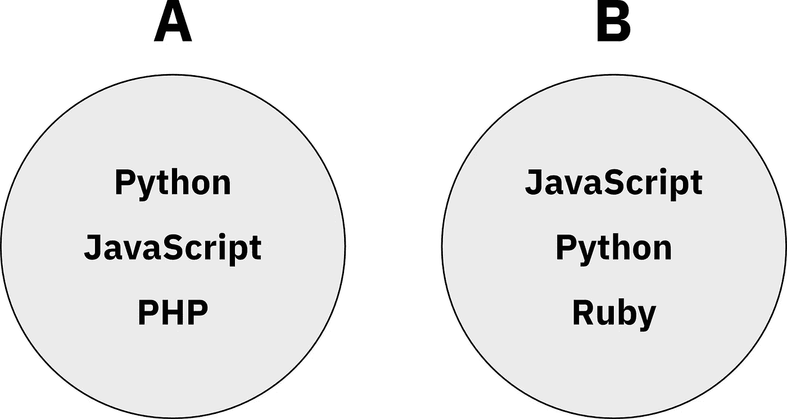

# Python 集合差异——初学者完全指南

> 原文：<https://towardsdatascience.com/python-set-difference-a-complete-beginner-guide-3ce54ed0bf07>

## 什么是 Python 集合差？Python 中的 Difference 方法是做什么的？所有这些以及更多的问题都在这本综合指南中得到了解答。


由[阿纳斯·阿尔尚蒂](https://unsplash.com/@anasalshanti?utm_source=unsplash&utm_medium=referral&utm_content=creditCopyText)在 [Unsplash](https://unsplash.com/s/photos/code?utm_source=unsplash&utm_medium=referral&utm_content=creditCopyText) 上拍摄

在上周的文章的[中，你已经深入了解了 Python set `union()`是如何工作的。本周我们将探索另一个 set 函数，那就是 set `difference()`。使用 Python 集合差异，您可以轻松找到两个或多个集合之间的差异。简单地说，这意味着只返回第一个集合特有的不同值。](https://betterdatascience.com/python-set-union/)

在这篇文章中你会得到更深入的理解，所以继续读下去。

或者干脆不要读——我已经用视频的形式讲述了这个话题:

# Python 集合差异-基础知识

那么，*Python 集合区别是什么？这就是我们在这一部分要回答的问题。通过可视化示例，您将对定义、语法和返回值有一个完整的理解。*

## 定义和用法

Set difference 函数返回第一个集合中没有在第二个集合中找到的元素。您可以找到多组之间的差异，同样的逻辑也适用。为了简单起见，我们将在下面的例子中使用两个。

看看下面两组— **A** 和 **B** :



图 1 —两套编程语言(图片由作者提供)

计算这些集合之间的差异意味着我们将得到一个只有一个元素的新集合——PHP。*为什么？*因为它是集合 **A** 中唯一没有在集合 **B** 中找到的元素:


图 2 —设定行动差异(作者提供的图片)

类似地， **B — A** 将导致*红宝石*，因为该元素特定于 set **B** 。Python 集合的差异通常用维恩图来表示。它看起来是这样的:


图 3 —将差异设置为文氏图(图片由作者提供)

元素 *Python* 和 *JavaScript* (JS)是两个集合共有的。在计算集合差异时，我们只关心第一个集合中的唯一元素——这就是为什么在新集合中只返回 PHP。

*差方法在 Python 中是做什么的，如何在 Python 中求集合的差？让我们复习一下语法来回答这个问题。*

## 句法

```
# Difference between two sets
set1.difference(set2)

# Difference between multiple sets
set1.difference(set2, set3, ...)
```

其中:

*   `set1` -从中寻找差异的 iterable。
*   `set2`、`set3` -其他集合用于从`set1`中“取消”元素

## 返回值

difference 函数返回一个新集合，它是第一个集合与作为参数传递的所有其他集合之间的差，但仅当集合或可迭代对象被传递给该函数时。

如果没有参数被传入`difference()`函数，则返回集合的一个副本。

# Python 集合差分函数示例

我们将声明两个集合，正如*图 1* 所示:

*   `A`:包含 *Python* 、 *JavaScript* 和 *PHP*
*   `B`:包含 *Python* 、 *JavaScript* 和 *Ruby*

正如你所看到的，前两种语言在两个集合中都存在。将差值计算为 **A — B** 应该会返回一个只有 *PHP* 的新集合。同样， **B — A** 返回一个只有*红宝石*的新集合:

```
A = {'Python', 'JavaScript', 'PHP'}
B = {'JavaScript', 'Python', 'Ruby'}

print(f"A - B = {A.difference(B)}")
print(f"B - A = {B.difference(A)}")
```

输出:

```
A - B = {'PHP'}
B - A = {'Ruby'}
```

如果没有为 difference 函数指定任何参数，则返回集合的副本:

```
print(f"A - B = {A.difference()}")
```

输出:

```
A - B = {'JavaScript', 'PHP', 'Python'}
```

您可以通过打印内存地址来验证它是否被复制:

```
A = {'Python', 'JavaScript', 'PHP'}
A_copy = A.difference()

print(hex(id(A)))
print(hex(id(A_copy)))
```

输出:

```
0x1107d3f20
0x1107d3d60
```

你不会看到相同的值，这不是重点。重要的是它们是不同的，表明集合被复制到不同的内存地址。

现在让我们探索一种更短的方法来获得集合差——通过使用减号运算符。

# Python 使用—运算符设置差异

不用每次都调用`difference()`函数。您可以使用减号(`-`)运算符来代替:

```
A = {'Python', 'JavaScript', 'PHP'}
B = {'JavaScript', 'Python', 'Ruby'}

print(f"A - B = {A - B}")
```

输出:

```
A - B = {'PHP'}
```

其他一切都保持不变。请记住，两个操作数都必须是 set 类型。

# Python 集合差异常见错误

当您第一次开始使用集合时，很可能会遇到错误。这些是常见的，但通常很容易调试。

## attribute error:“list”对象没有属性“difference”

这是最常见的错误类型，当您试图对错误的数据类型调用 set `difference()`函数时会出现这种错误。只有器械包可以使用此功能。

下面是一个示例—如果使用列表，则会引发一个异常:

```
A = ['Python', 'JavaScript', 'PHP']
B = ['JavaScript', 'Python', 'Ruby']

print(f"A - B = {A.difference(B)}")
```

输出:


图片 4-无属性错误(图片由作者提供)

确保两者都是 set 类型，你就可以开始了。

## TypeError:不支持的操作数类型-:“set”和“list”

当您试图对无效数据类型使用速记符号(减号)时，会出现此错误。两者都必须设置，负号才能工作。这里有一个例子:

```
A = {'Python', 'JavaScript', 'PHP'}
B = ['JavaScript', 'Python', 'Ruby']

print(f"A - B = {A - B}")
```

输出:


图 5 —不支持的操作数类型错误(作者图片)

如你所见， **A** 是一个集合， **B** 是一个列表，所以减号不起作用。

# Python 集合差异常见问题

我们现在来看几个关于 Python 集合和 Python 集合差异函数的常见问题(FAQ)。

## Python set()是做什么的？

Python 中的`set()`方法用于将任何可迭代的数据类型转换为具有不同元素集的元素。

## 集合可以有重复吗？

集合是重复和顺序被忽略的集合，所以集合不能有重复。

## Python 中的集合差算子可交换吗？

集合差不可交换— **A — B** 与 **B — A** 不同。这里有一个例子:

```
A = {1, 2, 3}
B = {3, 4, 5}

print(f"A - B = {A.difference(B)}")
print(f"B - A = {B.difference(A)}")
```

输出:

```
A - B = {1, 2}
B - A = {4, 5}
```

# 结论

Python 集合差异非常容易理解。我们经历了直觉和定义，并逐步理解了更高级的用法和你在某个时候必然会看到的典型错误。你必须承认——这比你想象的要容易。

我希望这篇文章能够帮助您更好地理解 Python 集合并集函数。一如既往，如果你有任何问题或意见，请随时在下面的评论区提问。编码快乐！

## 了解更多信息

*   [Python 集合并集](https://betterdatascience.com/python-set-union/)
*   [一行 Python If-Else 语句—三元运算符讲解](https://betterdatascience.com/python-if-else-one-line/)
*   [Python 单引号和双引号——您应该使用哪个，为什么？](https://betterdatascience.com/python-single-vs-double-quotes/)

## 保持联系

*   雇用我作为一名技术作家
*   在 YouTube[上订阅](https://www.youtube.com/c/BetterDataScience)
*   在 [LinkedIn](https://www.linkedin.com/in/darioradecic/) 上连接

*喜欢这篇文章吗？成为* [*中等会员*](https://medium.com/@radecicdario/membership) *继续无限制学习。如果你使用下面的链接，我会收到你的一部分会员费，不需要你额外付费。*

[](https://medium.com/@radecicdario/membership) [## 通过我的推荐链接加入 Medium-Dario rade ci

### 作为一个媒体会员，你的会员费的一部分会给你阅读的作家，你可以完全接触到每一个故事…

medium.com](https://medium.com/@radecicdario/membership) 

*原载于 2022 年 2 月 2 日*[*【https://betterdatascience.com】*](https://betterdatascience.com/python-set-difference/)*。*