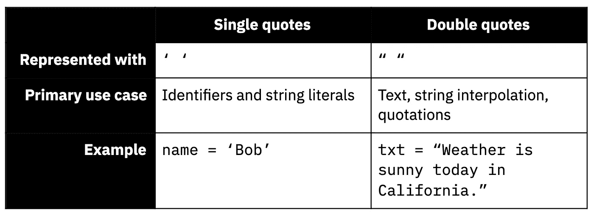

# Python 单引号和双引号——应该使用哪个，为什么？

> 原文：<https://towardsdatascience.com/python-single-vs-double-quotes-which-should-you-use-and-why-c02dd011f86c>

## 何时以及为什么应该使用其中一个而不是另一个？解释最佳实践。


莎伦·麦卡琴在 [Unsplash](https://unsplash.com?utm_source=medium&utm_medium=referral) 上的照片

Python 经常给你留下选项，引号也不例外。Python 单引号和双引号有什么区别？你应该用哪一个？什么时候一个比另一个有优势？什么是三重引号？如果你是初学者，很容易被弄糊涂。

你看，Python 和 Java 有很大不同。在 Java 中，字符串必须使用双引号，字符只允许使用单引号。这不是 Python 的交易。与静态类型语言相比，您拥有更大的灵活性。**但这真的是一件好事吗？**继续阅读寻找答案。

不想看书？请观看我的视频:

# Python 中单引号有什么用？

在 Python 中，最好用单引号将短字符串括起来，比如字符串文字或标识符。但是这里有一个交易——这不是一个要求。你可以用单引号将整段文章括起来。

这里有几个例子:

```
name = 'Bob'
print(name)

channel = 'Better Data Science'
print(channel)

paragraph = 'Bob likes the content on Better Data Science. Bob is cool. Be like Bob.'
print(paragraph)
```


图 1-单引号示例(作者图片)

单引号之间的内容没有字符限制，但是您不可避免地会遇到一些问题。第一个是字符串中的引号。

## 字符串中引号的问题是

英语中充满了单引号(撇号)。比如，我可以写*我们是*或者*我们是*，两者代表同一个东西。如果您想在 Python 中使用单引号将字符串括起来，那么选择第二个选项是有问题的:

```
print('We're going skiing this winter.')
```


图 2-打印带引号的字符串时出现语法错误(作者图片)

Python 认为字符串在`We`之后结束，因此其后的所有内容都被认为是语法错误。您可以很容易地在代码编辑器中发现这样的错误，因为`We`之后的部分颜色不同。

有三种解决方法:

1.  **停止使用缩写** ( *我们是* - > *我们是*)——一点都不实用。
2.  **转义字符串**——这是我们接下来要探讨的一种可能性。
3.  **使用双引号**——我们将在后面介绍。

## 在 Python 中转义字符串

对字符串进行转义的主要目的是防止某些字符被用作编程语言的一部分。例如，我们不希望撇号被视为引号。

在 Python 中，可以使用反斜杠(`\`)符号来转义字符串字符:

```
print('We\'re going skiing this winter.')
```


图 3 —对 Python 中的字符进行转义(图片由作者提供)

这很酷，但反斜杠通常在字符串中用作文字字符——例如，表示计算机上的路径。让我们看看如果您尝试使用转义符打印路径会发生什么:

```
print('C:\Users\Bob')
```


图 4 —使用无效转义字符时出现语法错误(图片由作者提供)

可能不是你想看到的。事实证明，您可以通过两种方式来转义转义字符:

1.  **通过使用原始字符串** —在第一个引号前写`r`。
2.  **使用双反斜杠**——这基本上会对转义字符进行转义。

以下是两者的使用方法:

```
print(r'C:\Users\Bob') 
print('C:\\Users\\Bob')
```


图 5 —在字符串中使用反斜杠的两种方式(作者图片)

这两个都适用于用单引号和双引号括起来的字符串。我们还没有讨论双引号，所以接下来让我们讨论一下。

# Python 中双引号是用来做什么的？

对自然语言消息、字符串插值以及任何你知道字符串中会有单引号的地方使用双引号被认为是最佳实践。

这里有几个例子:

```
name = 'Bob'

# Natural language
print("It is easy to get confused with single and double quotes in Python.")

# String interpolation
print(f"{name} said there will be food.")

# No need to escape a character
print("We're going skiing this winter.")

# Quotation inside a string
print("My favorite quote from Die Hard is 'Welcome to the party, pal'")
```


图 6-在 Python 中使用双引号(图片由作者提供)

正如你所看到的，我们可以很容易地将引用嵌入到双引号包围的字符串中。此外，没有必要像我们用单引号那样转义字符。

**记住**:在双引号包围的字符串中不能再次使用双引号。这样做将导致与单引号相同的语法错误:

```
print("You can't use "double quotes" inside this string.")
```


图 7-在双引号字符串中使用双引号时出现语法错误(图片由作者提供)

为了减轻这种影响，您可以重用上一节中的解决方案，但是也可以用单引号将字符串括起来:

```
print('You can use "double quotes" like this.')
```


图 8 —在字符串中使用双引号(作者图片)

现在你知道如何在 Python 中使用单引号和双引号了。接下来，我们将回顾差异并介绍最佳实践。

# Python 中单引号和双引号有什么区别？

这里有一个回答问题*的汇总表，在 Python* 中应该使用单引号还是双引号:



图 Python 中单引号和双引号的区别(图片由作者提供)

简而言之，您可以在所有情况下都使用这两个词，但是双引号更常用于文本和较长的字符串。没有人禁止你在任何地方使用单引号，但是你必须更加小心，因为单引号对特定的字符更加敏感。

有一些来自 Python 创作者的官方推荐，接下来让我们来看一下。

## Python 单引号与双引号 PEP8

根据 [PEP8](https://www.python.org/dev/peps/pep-0008/#string-quotes) :

*   PEP 不建议使用单引号还是双引号——选择一个规则并坚持下去。
*   当字符串用单引号括起来时，使用双引号来避免反斜杠。
*   当字符串用双引号括起来时，使用单引号以避免反斜杠。
*   使用三重引号字符串时，请始终在字符串中使用双引号字符。

我们将很快讨论三重引号字符串及其用例。

## 单引号与双引号最佳实践

单引号字符串的最佳实践:

*   确保字符串有点短，或者您正在处理一个字符串文字
*   确保字符串中没有单引号，因为添加转义字符会影响可读性。

双引号字符串的最佳实践:

*   对文本和字符串插值使用双引号。
*   当字符串中有引号时，使用双引号——您可以很容易地用单引号将引号括起来。

# Python 中应该用单引号还是双引号？

最终的答案是——这**取决于**，主要取决于你的风格偏好。Python 对单引号和双引号没有任何区别，所以决定权在你。

您不应该在单个 Python 文件或模块中不断地在单引号和双引号之间切换。挑一个自己比较喜欢的，并保持一致。

# Python 中的三重引号

是的 Python 中甚至还有第三种类型的引用。这些都有自己的优势:

*   您可以在其中使用单引号和双引号。
*   您可以将字符串拆分成多行。
*   在编写文档字符串时，它们被视为最佳实践。

让我们来看几个例子:

```
print("""Triple quote string example 1""")
print('''Triple quote string example 2''')

print("""Here's a string I'll split into
mulitple 
lines.""")

print("""You can use 'single quotes' and "double quotes" inside!""")
```


图 10—Python 中的三重引号(图片由作者提供)

如你所见，键盘上没有专用的三引号字符，所以我们用三个单引号或三个双引号来写它们。最大的好处是你可以通过按*回车*将字符串拆分成多行，这从根本上提高了可读性。

不过，三重引号的主要用例是函数的文档字符串(docstrings ):

```
def sum_list(lst: list):
    """Iterates over every list element and sums them.

    Keyword arguments:
    lst -- the input sequence of numbers.
    """
    res = 0
    for num in lst:
        res += num

    return res
```

您可以自由地使用`'''`和`"""`来包围 docstring，但是[约定](https://www.python.org/dev/peps/pep-0257/)是使用后者。

# 结论

长话短说 Python 中单引号和双引号字符串之间的差别很小。您可以在任何情况下使用其中任何一种——只要确保遵守您的编程约定。在一些用例中，一种类型比另一种类型有优势，但这种情况很少。

如果字符串中有引号，单引号字符串可能会给你带来一些麻烦，所以请记住这一点。双引号字符串是一个更安全的赌注，但不足以选择一个。

*喜欢这篇文章吗？成为* [*中等会员*](https://medium.com/@radecicdario/membership) *继续无限制学习。如果你使用下面的链接，我会收到你的一部分会员费，不需要你额外付费。*

<https://medium.com/@radecicdario/membership>  

# 了解更多信息

*   [Python If-Else 语句一行—三元运算符讲解](https://betterdatascience.com/python-if-else-one-line/)
*   [Python 结构模式匹配—帮助您入门的 3 大用例](https://betterdatascience.com/python-structural-pattern-matching/)
*   Dask 延迟——如何轻松并行化你的 Python 代码

# 保持联系

*   注册我的[简讯](https://mailchi.mp/46a3d2989d9b/bdssubscribe)
*   订阅 [YouTube](https://www.youtube.com/c/BetterDataScience)
*   在 [LinkedIn](https://www.linkedin.com/in/darioradecic/) 上连接

*原载于 2022 年 1 月 17 日 https://betterdatascience.com**[*。*](https://betterdatascience.com/python-single-vs-double-quotes/)*