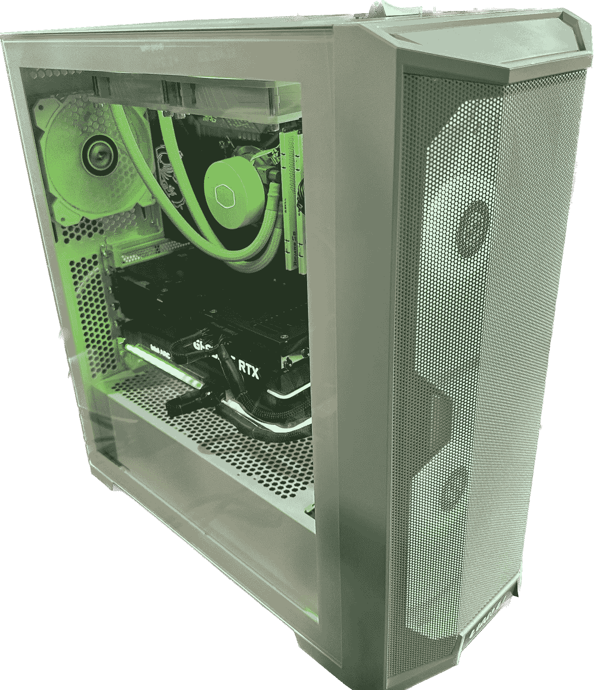

# 使用拥抱面和英特尔弧的 PyTorch 稳定扩散

> 原文：<https://towardsdatascience.com/pytorch-stable-diffusion-using-hugging-face-and-intel-arc-77010e9eead6>

## 使用英特尔 GPU 运行稳定的扩散


作者创造的稳定扩散的图像

# 介绍

文本到图像的人工智能模型在过去几年里变得非常流行。最受欢迎的模型之一是稳定扩散，由[康普维斯](https://github.com/CompVis)、[稳定人工智能](https://stability.ai/)和[莱恩](https://laion.ai/)合作创建。尝试稳定扩散的最简单方法之一是通过[拥抱面部扩散器库](https://huggingface.co/blog/stable_diffusion)。

随着最新英特尔 Arc GPU 的发布，我们收到了许多关于英特尔 Arc 卡是否支持运行 Tensorflow 和 PyTorch 模型的问题，答案是肯定的！使用 oneAPI 规范构建的[面向 TensorFlow*](https://www.intel.com/content/www/us/en/developer/articles/guide/optimization-for-tensorflow-installation-guide.html) 的英特尔优化和[面向 PyTorch 的英特尔扩展](https://www.intel.com/content/www/us/en/developer/tools/oneapi/extension-for-pytorch.html)允许用户在最新的英特尔 GPU 上运行这些框架。

为了帮助人们了解如何在英特尔 GPU 上运行 PyTorch，本文将快速展示我们如何在过去几年中在英特尔 Arc A770 GPU 上运行一个更有趣的人工智能工作负载。

# 设置

从我之前的[帖子](https://medium.com/@tonymongkolsmai)中，你可能知道我有一个英特尔 Alder Lake Core i9–12900 KF 外星人 R13 系统。实际上，我不会使用该系统作为本演练的基础，因为我刚刚使用 MSI z690 Carbon WiFi 主板和 64GB 5600 DDR 5 RAM 以及全新的英特尔 Arc A770 组装了一个 Raptor Lake 第 13 代英特尔酷睿 i7-13700KF 系统进行测试。系统正在运行全新安装的 Ubuntu 22.04.1。



测试系统图片由作者提供

# 英特尔弧上的稳定扩散

以此为硬件基础，让我们完成在该系统上实现稳定扩散所需的所有步骤。

## 设置基础软件堆栈

首先，我们需要安装英特尔 Arc 驱动程序和[英特尔 oneAPI 基础工具包](https://www.intel.com/content/www/us/en/developer/tools/oneapi/base-toolkit.html)，因此我们遵循以下说明:

[](https://www.intel.com/content/www/us/en/develop/documentation/installation-guide-for-intel-oneapi-toolkits-linux/top.html) [## 面向 Linux*操作系统的英特尔 oneAPI 工具包安装指南

### 本指南涵盖了在 Linux*操作系统上安装英特尔 oneAPI 工具包。在…之前检查先决条件信息

www.intel.com](https://www.intel.com/content/www/us/en/develop/documentation/installation-guide-for-intel-oneapi-toolkits-linux/top.html) 

具体来说，我正在使用位于[这里](https://www.intel.com/content/www/us/en/develop/documentation/installation-guide-for-intel-oneapi-toolkits-linux/top/installation/install-using-package-managers/apt.html#apt)的 APT 指令，特别注意准确地遵循安装英特尔 GPU 驱动程序(步骤 2)中的指令。我用 Linux 6.0.x 内核中包含的驱动程序尝试了这一点，遇到了一些问题，所以我建议您尝试 DKMS 指令，并在指令中使用内核 5.17.xxx。

因为我们将使用拥抱脸库，我们安装 Git 和 Git 大文件存储(Git LFS ),因为拥抱脸库需要它们。

```
> sudo apt-get install git git-lfs
```

## Python 设置

接下来，让我们设置 Python 环境，以便与英特尔 Arc 协同工作。我使用的是 Python 3.9.15，所以如果你有不同版本的 Python，说明可能会稍有不同。

由于这是一个全新的 Ubuntu 安装，由于某种原因我没有安装 pip Python 包管理器，所以快速修复方法是运行:

```
> wget [https://bootstrap.pypa.io/get-pip.py](https://bootstrap.pypa.io/get-pip.py)
> python get-pip.py
```

安装 pip 有很多种方法，根据你的 Ubuntu 版本，你可以直接使用 APT。

为了保持我们的 Python 环境整洁，我们可以设置 Python virtualenv 模块并创建一个虚拟环境。

```
> python3 -m pip install --user virtualenv
> python3 -m venv venv
> source venv/bin/activate
```

之后的每一步都将在我们的 Python 虚拟环境中运行。

## 拥抱面部设置

下一步是建立稳定的扩散。大多数情况下，我们只是按照[拥抱面部的指示来做](https://huggingface.co/blog/stable_diffusion)，但我会把它们嵌入以使它更简单。

如果您没有拥抱脸帐户，您需要在此处创建一个:

[](https://huggingface.co) [## 拥抱脸-人工智能社区建设未来。

### 构建、训练和部署由机器学习中的参考开源提供支持的最先进的模型。不止…

huggingface.co](https://huggingface.co) 

回到我们的系统，我们设置了 Hugging Face Hub 和一些基本库，并从 Hugging Face 中获取了扩散器和稳定的扩散代码:

```
> pip install transformers scipy ftfy huggingface_hub
> git clone [https://github.com/huggingface/diffusers.git](https://github.com/huggingface/diffusers.git)
> git clone [https://huggingface.co/CompVis/stable-diffusion-v1-4](https://huggingface.co/CompVis/stable-diffusion-v1-4) -b fp16
```

这些签出应该要求您使用 huggingface-cli 登录，如下所示:

```
Username for ‘[https://huggingface.co'](https://huggingface.co'): <your_user_name>
Password for ‘[https://](https://tonym-intel@huggingface.co')<your_user_name>[@huggingface.co'](https://tonym-intel@huggingface.co'):
```

最后的步骤是使用 pip 安装扩散器库需要的一些基本组件和库本身，并将其指向扩散器目录:

```
> pip install diffusers
```

## PyTorch 和用于 PyTorch 安装的英特尔扩展

最后，我们需要设置我们的英特尔 GPU 配置。下载 PyTorch 和 PyTorch 的英特尔扩展:

```
> wget [https://github.com/intel/intel-extension-for-pytorch/releases/download/v1.10.200%2Bgpu/intel_extension_for_pytorch-1.10.200+gpu-cp39-cp39-linux_x86_64.whl](https://github.com/intel/intel-extension-for-pytorch/releases/download/v1.10.200%2Bgpu/intel_extension_for_pytorch-1.10.200+gpu-cp39-cp39-linux_x86_64.whl)
> wget [https://github.com/intel/intel-extension-for-pytorch/releases/download/v1.10.200%2Bgpu/torch-1.10.0a0+git3d5f2d4-cp39-cp39-linux_x86_64.whl](https://github.com/intel/intel-extension-for-pytorch/releases/download/v1.10.200%2Bgpu/torch-1.10.0a0+git3d5f2d4-cp39-cp39-linux_x86_64.whl)
```

并使用 pip 安装车轮:

```
> source /opt/intel/oneapi/setvars.sh
> pip install torch-1.10.0a0+git3d5f2d4-cp39-cp39-linux_x86_64.whl
> pip install intel_extension_for_pytorch-1.10.200+gpu-cp39-cp39-linux_x86_64.whl
```

现在，一切都已就绪，可以在英特尔 Arc GPU 上运行 PyTorch 工作负载了。如果您希望使用低 CPU 内存使用模式，可以安装 accelerate 库。这一步应该在安装 Intel wheels 之后完成，否则您将在 NumPy 中得到一些错误。

```
> pip install accelerate
```

## 运行稳定扩散

接下来是有趣的部分！通过拥抱脸扩散器库，稳定扩散已准备好使用，英特尔 Arc GPU 已准备好通过 oneAPI 加速它。为了便于运行，我创建了这个简单的 Python 脚本，它提示用户输入，然后打开结果输出图像:

我们可以简单地运行脚本，输入一些内容，然后查看输出:

```
> python run-stable-diffusion.py
Enter keywords:
AI GPU image for medium post
```

它在这篇文章的顶部输出图像。

# 结论

在独立英特尔 GPU 上支持 PyTorch 和 Tensorflow！虽然许多人对英特尔 GPU 如何影响游戏 GPU 市场感到兴奋，但也有许多人使用 GPU 来加速非游戏工作负载。

正如[英特尔 GPU 对 Blender](https://code.blender.org/2022/09/intel-arc-gpu-support-for-cycles/) 的支持令许多人兴奋一样，对流行的人工智能框架的支持只是英特尔 GPU 故事的另一个里程碑。对于我们这些从事渲染、视频编辑、人工智能和其他计算工作负载的人来说，现在是对英特尔 GPU 感到兴奋的时候了。

*如果你想看看我在看什么科技新闻，你可以在 Twitter 上关注我*[](https://twitter.com/tonymongkolsmai)**。此外，一起查看* [*代码*](https://connectedsocialmedia.com/category/code-together/) *，这是我主持的面向开发者的英特尔播客，我们在这里讨论技术。**

**Tony 是英特尔的一名软件架构师和技术宣传员。他开发过多种软件开发工具，最近领导软件工程团队构建了数据中心平台，实现了 Habana 的可扩展 MLPerf 解决方案。**

**英特尔和其他英特尔标志是英特尔公司或其子公司的商标。其他名称和品牌可能是其他人的财产。**