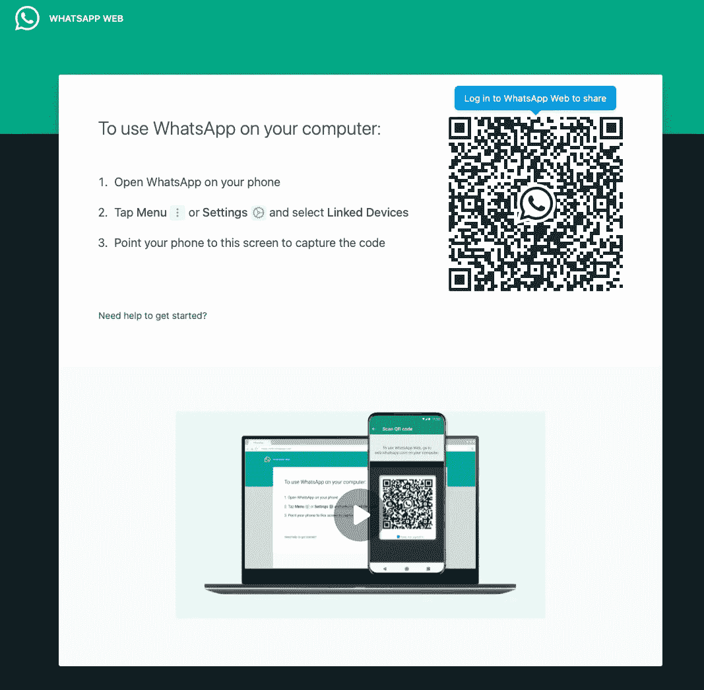
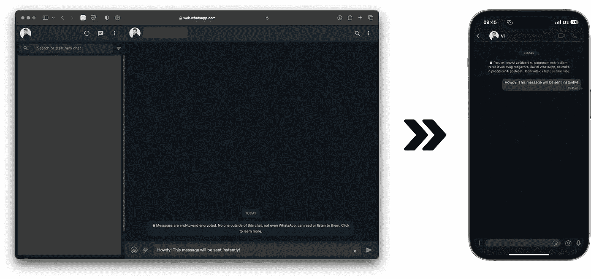
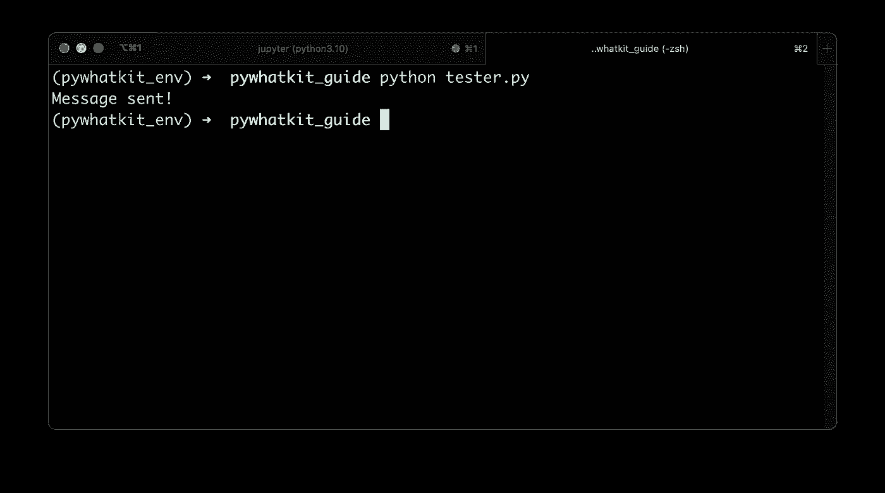
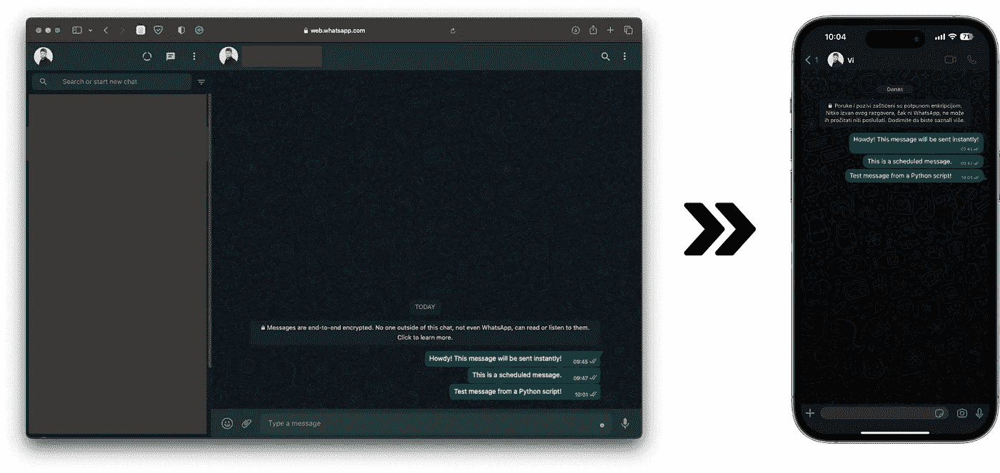

# PyWhatKit:如何用 Python 自动化 Whatsapp 消息

> 原文：<https://towardsdatascience.com/pywhatkit-how-to-automate-whatsapp-messages-with-python-9aa73b77389>

## **有 Whatsapp 账号？知道怎么调用 Python 函数吗？这就是你自动化 Whatsapp 信息所需要的一切**


照片由[克里斯蒂安·威迪格](https://unsplash.com/@christianw?utm_source=medium&utm_medium=referral)在 [Unsplash](https://unsplash.com?utm_source=medium&utm_medium=referral) 上拍摄

你曾经想自动化你的 Whatsapp 信息吗？现在你可以了，假设你至少有一周的 Python 编程经验。`pywhatkit`库允许你发送单独的 Whatsapp 消息，向群组发送消息，甚至发送图像——所有这些都来自 Python！还有播放 YouTube 视频和浏览互联网的选项，但这些将在接下来的文章中介绍。

今天你将学习如何通过`pywhatkit`和 Python 向自己或他人发送 Whatsapp 消息。这些是我们将关注的领域:

*   如何安装 PyWhatKit
*   如何即时发送 Whatsapp 消息
*   为以后安排 Whatsapp 消息
*   通过 Python 脚本发送 Whatsapp 消息
*   高级用法:组和图像

# 如何安装 PyWhatKit

这个包可以在 [PyPI](https://pypi.org/project/pywhatkit/) 上获得，这意味着你可以通过`pip`安装它。在此之前，让我们基于 Python 3.10 创建一个新的虚拟环境。创建完成后，我们可以发出一个`pip`命令来安装`pywhatkit`:

```
conda create --name pywhatkit_env python=3.10 -y
conda activate pywhatkit_env

pip install pywhatkit
```

此外，我还安装了 Jupyter 和 JupyterLab，因为这是我将在本文的第一部分使用的开发环境。您也可以这样做，但是您可以自由地使用文本编辑器。

要安装和启动 Jupyter:

```
pip install jupyter jupyter lab jupyter lab
```

这就是我们开始玩`pywhatkit`所需要的。

# 如何即时发送 Whatsapp 消息

假设您已经运行了 Jupyter(或文本编辑器),继续导入库:

```
import pywhatkit
```

`sendwhatmsg_instantly()`函数会在你运行代码时发送一条 Whatsapp 消息，因此名字中有“立即”二字。需要两个参数:

*   `phone_no` -您要向其发送信息的电话号码。不要忘记包括国家代码。
*   `message` -您想要发送的实际信息。

让我们来看看它的实际应用:

```
pywhatkit.sendwhatmsg_instantly(
    phone_no="<phone-number>", 
    message="Howdy! This message will be sent instantly!",
)
```

如果您没有登录 Whatsapp Web，您会看到此屏幕提示您用手机扫描二维码:



图 1 — Whatsapp 网络登录提示(图片由作者提供)

扫描完成后，您将进入一个新的聊天屏幕，您的信息将显示在输入区。出于某种原因，邮件不会自动发送，你必须手动点击发送按钮。这是库中的一个**错误**，可能会在未来的版本中得到修复。

稍后我会告诉你如何解决这个**错误**，但是现在，只要点击发送按钮。

你会在 Whatsapp 网站和手机上看到以下内容:



图 2 —通过 PyWhatKit 发送第一条消息(图片由作者提供)

这是你发送的第一条 Whatsapp 消息！

但是，如果您希望将消息安排在特定的时间，该怎么办呢？接下来让我们讨论这个选项。

# 为以后安排 Whatsapp 消息

有时您希望在特定的时间点发送消息。`pywhatkit`包有一个专用于被调用的`sendwhatmsg()`的函数。除了`phone_no`和`message`之外，还需要另外两个参数:

*   `time_hour` -整数，表示您要发送消息的小时(24 小时制)。
*   `time_min` -整数，表示您要发送消息的分钟。

它的工作方式与我们之前的例子几乎相同:

```
pywhatkit.sendwhatmsg(
    phone_no="<phone-number>", 
    message="This is a scheduled message.",
    time_hour=9,
    time_min=47
)
```

但是与前面的例子不同，这个函数将输出发送消息前的剩余时间:


图 3 —使用 PyWhatKit 的消息调度(图片由作者提供)

在这 53 秒之后，Whatsapp 网络浏览器窗口将会打开，您将会看到输入字段中填充的消息文本。和以前一样，邮件不会自动发送，你必须手动点击发送按钮。

发送后，您将在网络和手机聊天中看到该消息:


图 4 —通过 PyWhatKit 发送预定消息(图片由作者提供)

现在你知道如何即时发送信息，以及如何安排它们。如果我们不必每次都手动点击按钮来发送消息，那该多好。

当开发人员致力于修复这个 bug 时，让我们来看看如何解决它。

# 通过 Python 脚本发送 Whatsapp 消息

您需要两个额外的 Python 库来自动触发 Send 按钮。这些是`pyautogui`和`pynput`。

`send_whatsapp_message()`功能执行以下操作:

1.  打开 Whatsapp Web 并用指定的消息填充输入字段。
2.  休眠 10 秒钟，以确保所有内容都已正确加载。
3.  单击屏幕以确保选择了正确的窗口/选项卡。
4.  按下并释放键盘上的 Enter 键以发送消息。

如果任何步骤失败，异常将被打印到控制台。

下面是该函数的完整代码片段和一个使用示例:

```
import time 
import pywhatkit
import pyautogui
from pynput.keyboard import Key, Controller

keyboard = Controller()

def send_whatsapp_message(msg: str):
    try:
        pywhatkit.sendwhatmsg_instantly(
            phone_no="<phone-number>", 
            message=msg,
            tab_close=True
        )
        time.sleep(10)
        pyautogui.click()
        time.sleep(2)
        keyboard.press(Key.enter)
        keyboard.release(Key.enter)
        print("Message sent!")
    except Exception as e:
        print(str(e))

if __name__ == "__main__":
    send_whatsapp_message(msg="Test message from a Python script!")
```

我已经将这段代码保存到了`tester.py`文件中，现在我将通过终端运行它:

```
python tester.py
```



图 5-通过终端运行 Python 脚本(图片由作者提供)

您将看到相同的 Whatsapp Web 浏览器标签打开，消息字段填充，但这次消息将在几秒钟后发送，无需您的干预。

以下是完整的聊天记录:



图 6 —通过 Python 发送最后一条自动消息(图片由作者提供)

这就是你如何解决库中当前的 bug。在今天结束之前，让我们简要回顾一些更高级的用例。

# 高级用法:组和图像

还可以给 Whatsapp 群发消息，用`pywhatkit`发图片。请参考库中内置的这些方便的函数:

*   `sendwhatmsg_to_group(group_id: str, message: str, time_hour: int, time_min: int)` -用于向一个群组发送消息。
*   `sendwhatmsg_to_group_instantly(group_id: str, message: str)` -就像前面的函数一样，但是在您运行代码时立即发送消息。
*   `sendwhats_image(receiver: str, img_path: str)` -立即向一个号码或一个群组发送图像。有一个可选的`caption`参数用来给图片加标题。请记住，目前不支持 PNG 文件格式。

这就是 Python 库的全部内容，至少对于 Whatsapp 来说是这样。你可以自己随意摆弄这三个功能，我相信你能搞定！

该库还为 YouTube 和一般的 web 浏览打包了额外的功能，但是我将把这些主题留待以后讨论。

喜欢这篇文章吗？成为 [*中等会员*](https://medium.com/@radecicdario/membership) *继续无限制学习。如果你使用下面的链接，我会收到你的一部分会员费，不需要你额外付费。*

<https://medium.com/@radecicdario/membership>  

# 保持联系

*   雇用我作为一名技术作家
*   在 YouTube[上订阅](https://www.youtube.com/c/BetterDataScience)
*   在 [LinkedIn](https://www.linkedin.com/in/darioradecic/) 上连接

*原载于 2022 年 10 月 27 日*[*【https://betterdatascience.com】*](https://betterdatascience.com/pywhatkit-python-whatsapp/)*。*