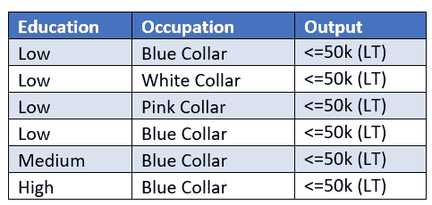

# 数量输入影响(QII)——超越 SHAP 的最大似然解释度

> 原文：<https://towardsdatascience.com/quantitative-input-influence-qii-an-ml-explainability-measure-f16debc9ed10>

# **量化输入影响(QII)——超越 SHAP 的 ML 可解释度**

## **功能的独立性不再是一个约束**

奥拉夫·阿伦斯·罗特内在 [Unsplash](https://unsplash.com?utm_source=medium&utm_medium=referral) 上的照片

任何数据科学家都会大声证明这一说法——“真实世界的数据至少违背了一些众所周知的方法的假设”。机器学习毕竟不简单。

在 ML 模型的可解释性领域，SHAP 和莱姆是两种值得信赖的方法。然而，它们中的每一个都有一些限制。在我的上一篇文章中，我讨论了 SHAP 的一些惊人的局限性。如果您想参考，以下是快速参考:

 [## 使用 SHAP 解释——首先理解这些限制！！

### 可解释性做对了。

towardsdatascience.com](/using-shap-for-explainability-understand-these-limitations-first-1bed91c9d21) 

在所有的 SHAP 局限性中，我认为两个(尽管有些关联)最令人担忧的是:

1)假设特征不相互依赖。在现实世界中，不可能找到特征相互独立的数据。在输出上，总是存在一定程度的相互依赖和共同依赖。

2)相关性而非因果关系 **:** 重要的是要承认，SHAP 只是“解释”了根据模型结构定义的变量“相关性”。这并不意味着定义的变量也有因果关系。

在寻找问题的潜在解决方案的过程中，我看到了一篇研究论文(“通过量化输入影响的算法透明度”)，展示了一种叫做“量化输入影响”(QII)的方法。QII 与 SHAP 的方法有一些相似之处，也有一些有意义的不同。

关键的区别在于使用了“干预技术”。相比之下，SHAP 使用“有条件的方法”。

在深入研究干预技术之前，先快速回顾一下模型中变量的边际贡献是如何计算的。对于给定的模型，特性的边际贡献计算如下:

通过包含和排除特征来分析输出的差异

求所有 N 的平均值！可能的订单

具有剩余特征所有子集。

**“介入”技术有什么帮助？**

让我们考虑几个例子来解释这个概念。

1.为了**确定公司的增长**(分类问题:1 如果增长> 10%，0 如果增长< = 10%)，在许多变量中有 2 个与销售相关的变量:1)销售人员的数量 2)销售额。现在，这两个变量是相互关联的，也就是说，更多的销售人员意味着更高的销售额。为了评估因果关系，在边际贡献计算中，我们可以首先用一组随机值替换销售人员的数量，并查看模型结果如何变化，然后我们可以用一组随机值替换销售额，并评估模型结果的变化。两者改变模型输出的程度有助于理解输出中两个变量的“因果关系”(不仅仅是相关性)。这里用一组随机值代替一个值的想法是“随机干预”。

2.想象一个**收入分类问题**，输出是收入大于 50k (GT)还是小于 50k(LT)。再次假设有两个变量:

-“教育”的价值有高、中、低

——价值观蓝领、白领、粉领的“职业”

假设模型将输出标记为 GT，如果“教育程度”是“高”，而“职业”是“白领”，对于所有其他情况，它将输出标记为 LT。

现在，对于一个“教育程度”低而“职业”为蓝领的数据点，变量的影响/贡献是什么？在这里，根据敏感性机制，仅仅使用“教育”或“职业”的随机值不会产生任何结果差异——因为在所有情况下，结果只会是 LT。

图片来自作者

可以承认，这并不意味着“教育”和“职业”对产出没有影响。这仅仅意味着只有一起移动的值才会给输出带来敏感性，并且可以推断每个变量的影响。这正是 QII 所做的。QII 不仅解释了个体特征的变化，也解释了“特征集合”的变化。利用这一点，QII 计算了一组功能的影响，然后使用合作博弈论的概念(与 SHAP 使用的方法相同)计算边际贡献。从逻辑上讲，这里 QII 打破了特征之间的相关性，以衡量特征对模型输出的单独贡献。

如果你不熟悉 SHAP 使用的合作博弈理论，请参考以下文章:

 [## SHAP 能引发风险分析的范式转变吗？

### 由 Chandan Durgia 和 Prasun Biswas 撰写

towardsdatascience.com](/can-shap-trigger-a-paradigm-shift-in-risk-analytics-c01278e4dd77) 

在解决 SHAP 带来的两个关键限制方面，QII 无疑已经向前迈出了一大步。此外，QII 据称比 SHAP 计算量少。

我个人认为，随着数据科学家继续揭示可解释性，QII 肯定会走上舞台中央。

时间会证明一切！！

免责声明:本文中表达的观点是作者以个人身份发表的意见，而不是他们各自雇主的意见。