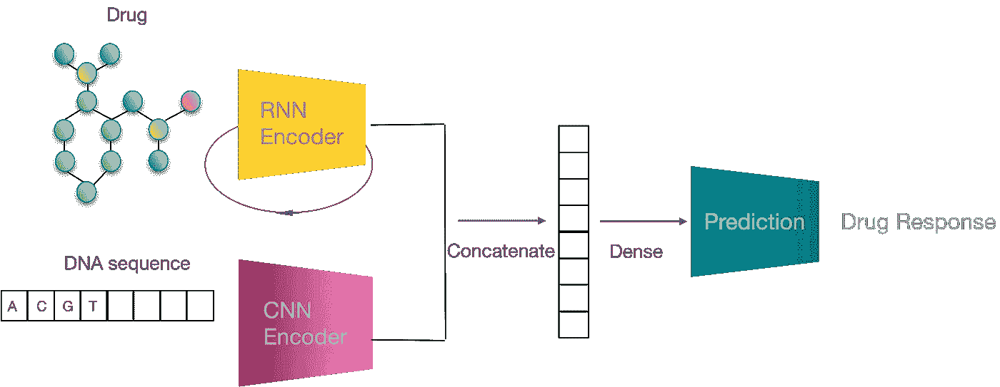

# 你应该问基于人工智能的药物研发公司的问题

> 原文：<https://towardsdatascience.com/questions-you-should-ask-ai-based-drug-discovery-companies-78c5a011c915>

## 基于人工智能的药物发现公司正在处理的问题

当我第一次听说有人在努力通过机器学习方法来发现药物时，我对人工智能可以提出新的药物化合物的想法非常感兴趣，我立即戴上了数据科学家的帽子，准备在这个领域应用一些很酷的深度学习方法(特别是甘，我承认:-)。尽管我的精神很好，但很快，我意识到(在我的医学算法职业生涯中，一次又一次地)在计算机视觉应用中工作良好的方法不一定在药物发现中工作。我被激励去揭开这个差距的原因，结果就在这里。我提出了 9 个问题，我认为这是造成这种情况的原因，我将在下面详细阐述。如果你从事药物研发领域，无论是在求职期间还是作为企业家，我建议你进一步研究或讨论这些问题。为了帮助你进行这些互动，我在每个主题上添加了一个问题示例，如果你试图建立一个问题示例，你可以问公司或你自己。

药品代理公司正在考虑是否在 tinder 中直接攻击 GAN。[派克斯](https://medium.com/u/5c7773c5a002?source=post_page-----78c5a011c915--------------------------------)

1.  **数据缺乏，数据集不平衡。**用于药物靶标相互作用(DTI)预测的最常用基准数据集包含不到 1000 个药物分子。另一个数据集包含 1:41 的活性与非活性药物反应比。迁移学习(TL)可以从大的标记数据点学习，并将其知识转移到有限数据点的下游任务。然而，TL 通常仍然需要合理数量的平衡训练数据点。*您使用哪个数据集？你训练了多少药物分子？*
2.  **非同步结构。**对于生成模型来说，探索超出其训练范围的分子结构是期望的，甚至是“健康的”，但是单个功能基团的变化可以导致独特的合成途径；因此，他们可能会提出荒谬的结构，不合理的药物目的。在一个案例中，即使在对深度学习模型生成的 30，000 个结构的初始列表进行过滤后，根据合成可及性，从 40 个候选结构中仅选择了 6 个合理的分子[6]。在其他情况下，提出的分子是如此荒谬，以至于人们立即意识到为什么仅仅根据它们的目标函数值来衡量这些方法是不够的。*你的生成式方法得到一堆结构后，你的过滤/评分/重新学习过程是怎样的？*
3.  **配送班次。**当训练和部署数据遵循相同的数据分布时，ML 模型工作良好。然而，在现实世界的使用中，特别是在基因组学中，许多问题会经历分布变化，其中部署数据与训练数据不同。例如，用脑组织的基因表达进行训练，同时预测骨组织。另一个例子是动物模型转录组的训练和预测人类的表型。一般来说，如果感兴趣的组织类型以前从未被研究过，将没有现有的数据集可用于训练监督方法，如[元学习](https://par.nsf.gov/servlets/purl/10219017)。然而，当训练数据可用时，监督方法的精确度、速度和可重复性的提高很容易胜过非监督方法。*你会将你的数据推广到不同种类的组织吗？*
4.  **表现能力。** CNN 模型常用来表示 DNA 序列。然而，大多数成功的应用仅适用于从预定义的预处理步骤产生的短 DNA 序列，而不是整个基因组序列的大部分，这可以允许模型利用长程基因调控依赖性的关键信息。RNN 和变形金刚也只能接受中等长度的输入，相比之下，每个基因组有超过一百万个 SNP(核苷酸)。这也意味着输入特征的数量可以比数据点的数量大几个数量级，这是一个众所周知的 ML 挑战，称为维度的诅咒(我在我的博客[中写道，弥合遗传和神经网络之间的差距](/bridging-the-gap-between-genetics-and-neural-networks-4fdb91032f4b?source=your_stories_page----------------------------------------))。此外，一般的 ML 模型通常是为没有生物动机的图像和文本数据开发的。因此，需要一个领域驱动的模型来捕捉极远距离高维特征之间的相互作用，以模拟人类基因组和基因之间的复杂调控。*你的基因组代表是什么？嵌入层是怎么学的？*
5.  多模态。众所周知，相同的小分子药物在不同的基因组谱中可以具有不同的反应水平。例如，一种抗癌药物对组织的反应可能不同[4]。因此，生成给定药物的准确反应谱和相应的基因组学谱对是至关重要的。然而，当前的 ML 方法集中于为单个数据模态开发方法，而为了完全捕获个体周围的完整数据类型，应该使用多模态。如上所述，集成受限的原因之一是缺少连接这些异构数据类型的数据访问。此外，尚不清楚该模型是否可以推广到新的背景，如新的细胞类型和结构多样的药物，样本有限。然而，下面的架构试图通过连接两个模态来解决这个问题:基因表达和一个分子(下图)。如上所述，RNN 代表一个分子，CNN 代表一个基因图谱。通过连接这些模型的输出，生成了包含顺序数据和卷积数据的组合表示。*如何连接顺序层和卷积层？*
6.  **维度。**字符串和指纹等分子表示将小分子描述为二维字符串(例如 SMILE 数据集)。提醒一下:有不止一个分子阶段，比如代表三维的三级结构，代表四维的四级结构，等等。然而，需要通过考虑三维结构来改进这种表示，因为同一小分子的构象变化可以改变受体-配体相互作用。你训练高于二维的结构吗？
7.  **模范守信。**“打开盒子”模型可以理清事情，并呈现最终预测内部知识的真实画面(我在博客[中写了这一点，而不仅仅是性能](/not-just-performance-insights-about-the-validation-process-of-sequences-of-life-models-eddd2c365343?source=your_stories_page----------------------------------------))。由于 ML 模型不是无误差的，当用户不自信时，提醒用户避免做出预测是至关重要的。*如何评价你的模型预测质量？* *你是否使用 e*[*xplainable models*](https://arxiv.org/pdf/2006.14779.pdf)*之类的方法来量化你预测的不确定性？*
8.  **针对某些人群的不平衡数据。**由于不同人群中等位基因频率的差异，在一个人群中表现良好的 ML 模型可能在其他人群中预测不佳。这些算法偏差可能对少数民族产生重大的[医学问题后果](http://ziadobermeyer.com/wp-content/uploads/2021/01/Algorithmic-approach-to-pain.pdf)。79%的基因组数据来自欧洲血统的患者，尽管他们只占世界人口的 16%[2]。由于迄今为止大多数发现是在欧洲血统人群中进行的，预测模型忽略了非洲和西班牙血统人群。同样，大多数研究集中于常见疾病，而罕见疾病往往是有限的。*你的数据集涉及不同的人群吗？你如何概括人口基因组？*(我写了一篇关于这个的博客[这里](/bridging-the-gap-between-genetics-and-neural-networks-4fdb91032f4b?source=your_stories_page----------------------------------------))
9.  **基因组数据隐私。**每天都会产生大量的基因组学数据和注释。这些数据和注释的集合可以极大地有益于 ML 模型。但是，这些通常被视为个人的私有资产，包含敏感的个人信息，因此不能直接共享。联合学习技术允许在不共享数据的情况下对聚合数据进行机器学习模型训练。*您使用任何技术来匿名化您的数据吗？*

**多模态神经网络**。给定一对药物化合物的分子结构和细胞系的基因表达谱，预测药物反应。药物编码器和细胞系编码器分别产生药物和细胞系的嵌入，然后将它们送入预测器以估计药物反应。(我画这个图)

## 关闭

在这里，我们概述了药物发现中的一些主要问题，希望尽快解决这些问题，并让您对这个主题的局限性有一个深刻的理解。我个人认为，就目前而言，我们远远没有解决这些问题，主要是因为最新的可用数据。一句话:如果你想在这个领域有所贡献，就把深度学习算法放在一边，自己创业去收集药物分子的下一个大标杆；这将比其他任何事情都更有贡献。同时，下一次你有关于这个话题的谈话，不要犹豫，看着他们的眼睛，自信地问这些问题…祝你好运。

## **注意事项**

1.  我写了另一个关于药物发现模型的博客，更像是一个测验。如果你想测试自己(无耻地)，阅读[这篇](/pl-ai-play-models-quiz-yourself-9ca35acd5192)博客。
2.  我在博客上投入了很多心血。请给我写一封电子邮件(miritrope@gmail)并通过 [LinkedIn](https://www.linkedin.com/in/miri-trope-916a194a/) 联系，告诉我你喜欢我的作品。

## 参考

1.  人工智能在药物发现中的应用与技术。 *arXiv 预印本 arXiv:2106.05386* (2021)。‏
2.  黄，可新，等，〈机器学习在基因组学数据治疗任务中的应用〉。arXiv 预印本 arXiv:2105.01171 (2021)。‏
3.  李、、、徐、。"卷积回归神经网络和转移学习用于有机药物和材料发现中的 QSAR 建模."*分子* 26.23 (2021): 7257。
4.  金，叶筋等，〈利用迁移学习预测未充分研究的组织中的抗癌药物协同作用〉*美国医学信息学协会杂志*28.1(2021):42–51。
5.  高，，柯里。"由生成模型提出的分子的可合成性."《化学信息与 2 建模杂志》*60.12(2020):5714–5723。*
6.  使用深度学习的最新药物发现的综合调查。《国际分子科学杂志》第 22 卷，18 9983。2021 年 9 月 15 日，doi:10.3390/ijms22189983
7.  卞、与项。"生成化学:具有深度学习生成模型的药物发现."*分子模拟杂志*27.3(2021):1–18。