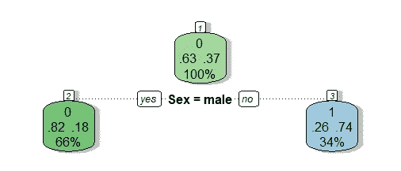
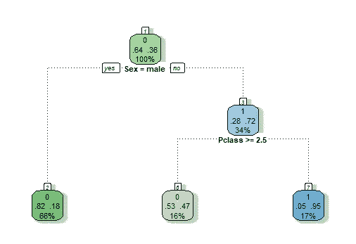
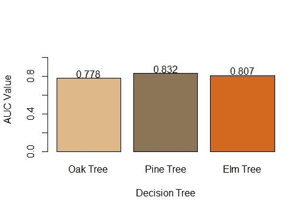

# 随机森林漫游——群体的智慧以及为什么它们比决策树更好

> 原文：<https://towardsdatascience.com/random-forests-walkthrough-why-are-they-better-than-decision-trees-22e02a28c6bd>

## 随机森林总是被称为“基于树的”模型的更强大和更稳定的版本。在本帖中，我们将证明为什么将群体的智慧应用到决策树是一个好主意。


照片由[@ skamenar](https://unsplash.com/@skamenar)-[Unsplash](https://medium.com/u/2053395ac335?source=post_page-----22e02a28c6bd--------------------------------)拍摄。com

决策树是非常强大的算法。当你进入数据科学和机器学习领域时，它们可能是你可能学习的第一批非线性算法之一。

决策树可以处理非线性模式，并理解目标和特征之间的一些最疯狂的关系。从这个意义上说，它们比线性模型如线性或逻辑回归有巨大的优势。

虽然它们具有捕捉更复杂的特征和目标关系的巨大能力，但它们也很容易过度拟合。它们是倾向于搜索完美叶节点的贪婪算法的子集。特别是当我们处理高维度(行或特征)时，这可能导致树最终用小样本进行概括，从而使您的算法对您的训练数据来说是完美的。

[他们的内部工作方式](/classification-decision-trees-easily-explained-f1064dde175e?sk=ccd305c31950f2e8c843377186e5e75f)很难找到纯节点，并且很难建立一个在偏差和方差之间达到最佳平衡的决策树。如何避免这种情况？

大多数情况下，研究人员已经找到了两种解决这个问题的方法:

*   boosting——将多个弱学习者组合并迭代到一个算法中——XGBoost 是最著名的实现之一。
*   打包——将多个模型聚合成一个整体——例如随机森林(RF)。

RFs 使用多个决策树的输出，将它们合并到一个投票系统中，这有助于缓解他们的一些紧迫问题。打个比方，如果决策树是一个独裁政府，只使用一个“头脑”的意见来做决定，随机森林就是一个民主政府，依靠群众的智慧来执行预测。

这篇文章会让你很好地理解随机森林背后的直觉。通过一些实验，我们将比较它们与单一决策树的性能，并理解为什么它们通常比单一决策树模型有更好的结果。

# 拟合多个决策树

为了真正理解 RF 的工作原理，让我们做一个实验，在一个数据集上拟合几个决策树。为了便于每个人复制，我们将使用 Kaggle 中可用的 [*泰坦尼克号*](https://www.kaggle.com/c/titanic/data?select=train.csv) 数据框，这是大多数数据科学家都知道的数据集。

对于这个特定的问题，我们希望根据一组特征(如乘客年龄、机票等级、性别等)来预测哪些乘客在泰坦尼克号失事中幸存。— **这是一个二元分类问题，有两个互斥的结果:**

*   乘客生还；
*   乘客没有生还；

让我们首先拟合 3 个不同的决策树。我们控制和创建完全不同的树的最常见的方法之一是给它们自己的一组[超参数](/5-decision-tree-hyperparameters-to-enhance-your-tree-algorithms-aee2cebe92c8?sk=5124b0f5996634d4f0d214499906f1d5)。这意味着产生的不同决策树会因用于预测结果的不同分割和变量而有所不同。

**除了不同的超参数，我们还将为每棵树选择 80%的原始训练样本，从而在构成的每棵树中引入更多的随机性来源。**

为了评估我们不同的决策树，我们将使用 30%的维持率作为纯测试集:

```
# Reading the titanic train dataset
titanic <- read.csv('./train.csv')# Obtaining the number of rows for training (70%)
size <- ceiling(0.7*nrow(titanic))# Use an indexer to perform train and test split
set.seed(999)
train_index <- sample(
  seq_len(nrow(titanic)), size = size
  )train_df <- titanic[train_index, ]
test_df <- titanic[-train_index, ]
```

*train_df* 数据帧包含 624 名乘客，而 *test_df* 包含 267 名乘客。

我们可以构建三个不同的决策树——由于它们对超参数和训练数据中的微小变化非常敏感，我们可以轻松地构建三个彼此完全不同的决策树，只需对代码进行非常小的更改。

举个例子，让我来拟合 1 号决策树，我将它命名为 *oak_tree* (用不同的名字来称呼不同的树将有助于我们更好地形象化我们的练习)。下面是我训练它的代码:

```
library(rpart)set.seed(9990)
oak_tree <- rpart(Survived ~ Fare + Age + Sex + Pclass,
                       data = sample_n(train_df, 600), 
                       method = 'class',
                       control = list(maxdepth = 2,
                                      minsplit=30))
```

*(不要忘记在运行 set.seed 的同时运行训练代码，这样您就可以复制这些结果)*

请注意，我们只是使用 4 个特征来预测是否有人在泰坦尼克号失事中幸存——乘客票价、年龄、性别和机票等级。是什么让我的*橡树*与众不同？我的 *oak_tree* 是一棵深度只有 2 的超级小树，允许在每个节点上进行至少 30 个例子的分割。如果这个超参数术语让你感到困惑，[看看这个](/5-decision-tree-hyperparameters-to-enhance-your-tree-algorithms-aee2cebe92c8?sk=5124b0f5996634d4f0d214499906f1d5)。

正如我以前说过的，我也给我的*橡树增加了更多的辣度—* 我只在大约 600 名随机乘客的数据上训练算法，这将模拟不同树之间更多的随机性。

所以我们的*橡树*看起来像下面的 *:*



决策树 1 —作者图片

在这个树中，用来决定结果的第一个变量(也是唯一的一个)是性别。这一变量似乎具有很高的判别能力，因为如果乘客是男性，他不幸存的可能性更高——约为 82%，而如果乘客不是男性，则为 26%。关于此图如何工作的一个小插图:


决策树图表说明—图片由作者提供

请记住，这种特殊的树是以这种方式构建的，因为我们定义了 600 个客户的特定子样本和一组超参数。

现在让我们训练一个完全不同的树，这次我叫它 *pine_tree。*

```
set.seed(9991)
pine_tree <- rpart(Survived ~ Fare + Age + Sex + Pclass,
                      data = sample_n(train_df, 600), 
                      method = ‘class’,
                      control = list(maxdepth = 3, 
                                     minsplit=3, 
                                     minbucket=4, 
                                     cp=0.01))
```

我们的*松树*可以比我们的*橡树更深一点。*此外，我们允许我们的树用更少的例子构建节点——无论是在进行分割时还是在构建末端叶节点时。

让我们检查一下结果——注意这个树形图和*橡树图*的区别:


决策树 2 —作者图片

注意一些很酷的事情——新的变量开始发挥作用。虽然性别仍然被用作第一分割点，但从那时起，票价、阶级和年龄就占据了舞台，并决定了我们的大部分概率。

有趣的流程如下所示:

*   支付超过 16 美元且不到 2 岁的儿童有 86%的存活概率。
*   上流社会的女性生存的可能性最高(95%)。

我们现在已经建立了两个不同的树！请注意，它们显示了完全不同的结果，尽管我们的*松树*似乎是我们的*橡树*的自然延伸。也预期*松树*比*橡树*有更多的过度拟合，仅仅是因为超参数的设置。

最后再来拟合另一棵树， *elm_tree。*

*Elm_tree* 与 *pine_tree* 相似，但有一点不同——我们只允许树的最大深度为 2。

```
set.seed(9992)
elm_tree <- rpart(Survived ~ Fare + Age + Sex + Pclass,
                data = sample_n(train_df, 600), 
                method = 'class',
                control = list(maxdepth = 2, 
                               minsplit=2, 
                               minbucket=4, 
                               cp=0.01))
```

*榆树 _ 树*看起来如下:



决策树 3 —作者图片

请注意，性别仍然是定义第一次拆分的变量。接下来就是上课了。

这三棵树看起来很相似，只是深度不同。当然，我们现在需要评估它们！它们在性能上有多大的不同？

# 评估每棵树的性能

为了快速进行性能评估，并且不受限于任何阈值，让我们使用 AUC 作为评估模型的指标。

更高的 [AUC](/understanding-auc-roc-curve-68b2303cc9c5) 意味着我们的模型更善于区分 0 类和 1 类，使我们的模型在预测中更有效和正确。

我正在使用 *ROCR* 库来更快地获得 AUC:

```
library(ROCR)obtainauc <- function(model) {
  predictions <- predict(model, test_df)[,2]
  pred <- prediction(predictions, test_df$Survived)
  perf <- performance(pred, measure = 'auc')
  return (perf@y.values[[1]])
}
```

我们的采油树表现如下:



树与树之间 AUC 的比较—图片由作者提供

从上面的图来看:

*   橡树的 AUC 为 0.778
*   *松树*的 AUC 为 0.832
*   *榆树*的 AUC 为 0.807

*松树*是表现最好的树。这是意料之中的，因为这也是包含最佳细节的树。每当我们提高最大深度时，我们可能会在训练集上有更好的性能——当我们在测试集上评估时，可能会有所不同。

因此，随机森林集中在一个核心问题中:**“即使我的*松树*是最好的，我是否应该完全放弃*橡树*和*榆树*的观点？”**

让我们建立另一个实验——我们将做一个多数投票选项——平均所有树的结果，并将这个意见“集合”与每棵树单独进行比较。由于我们正在处理概率结果，我们将只是平均 3 个不同树之间的概率，并认为这是我们的组合投票。

# 平均结果

为了更容易理解“平均结果”的真正含义，我们来做一点角色扮演。

假设我询问橡树、松树和榆树对下面这个人的看法:

*   一名男性花了不到 16 美元登上泰坦尼克号，他会幸免于难吗？

橡树说这位乘客有 18%的可能性会活下来。松树说只有 10%的机会活下来。*榆树*也说这个人有 18%的几率活下来。

如果我们对每棵树的推荐进行平均，我们将得到 *(18%+18%+10%)/3* ，这将产生 *15.3%* — **使用投票平均值，这应该是我们最终的乘客存活概率。**

让我们看看另一位乘客:

*   乘坐头等舱或二等舱的女乘客。

橡树说这位乘客有 74%的可能性会活下来。松树和榆树都显示有 95%的可能性。

如果我们平均这些建议，我们得到 88%的生存概率。

**主要问题是——你认为对测试集中的所有乘客使用这种基本原理会提高我们的性能吗？还是由于他们更糟糕的表现，我们的*橡树*和*榆树*的意见只会拖累我们的成绩？**

让我们看看！

# 群众的智慧

这里有一小段代码，我基于*橡树、松树*和*榆树*构建了这个集合模型。

```
ensemble <- (
  predict(oak_tree, test_df)[,2]
  +
  predict(pine_tree, test_df)[,2]
  +
  predict(elm_tree, test_df)[,2]
)/3
```

这个简单的系综模型表现如何？让我们再次检查使用 ROCR 图书馆:

```
# Ensemble Performance
prediction <- prediction(ensemble, test_df$Survived)
perf <- performance(prediction, measure = 'auc')
performance_ensemble <- perf@y.values[[1]]
```

我们有以下 AUC 结果:


树木和系综的 AUC 比较——作者提供的图像

哇！尽管我们的*橡树*和*榆树*比我们的*松树*更糟糕，但在做预测时考虑他们的意见是有价值的。**请注意，我们的集合模型的 AUC 略好于最佳个体树。**结论是，即使通过将该树与“较弱”的树相结合，我们也能够提升性能。

这正是随机森林背后的基本原理！每次你适应一个随机的森林，你就适应了无数的树，当与一个单独的决策树比较时，即使是较弱的树也会有利于你的整体性能。

当你增加被训练的树的数量时——有时增加到几千棵树——这种行为就更加强大了。当然，当你增加训练的树的数量时，你提高了你的“集合”比组成相同“集合”的单个决策树更好的可能性。

就是这样！感谢你花时间阅读这篇文章，希望你喜欢。我的目标是解释为什么随机森林通常比单一决策树更好，以及为什么它们是您的机器学习项目中值得考虑的优秀算法。这个例子应该能让你很好地理解 RF 背后的“群体智慧”假设。

*[***我在 Udemy 上开设了一门关于学习数据科学的课程***](https://www.udemy.com/course/r-for-data-science-first-step-data-scientist/?referralCode=MEDIUMREADERS)***——这门课程是为初学者设计的，包含 50 多个练习，我希望你能在我身边！您将学习基于树的模型、回归以及如何从头到尾构建数据科学项目。****

*这里有一个小的*要点*和贯穿这篇文章的代码:*

**数据集许可:本文中使用的数据集可以在*[https://www.openml.org/d/40945](https://www.openml.org/d/40945)公开使用*

*[](https://ivopbernardo.medium.com/membership) [## 通过我的推荐链接加入 Medium-Ivo Bernardo

### 作为一个媒体会员，你的会员费的一部分会给你阅读的作家，你可以完全接触到每一个故事…

ivopbernardo.medium.com](https://ivopbernardo.medium.com/membership)*