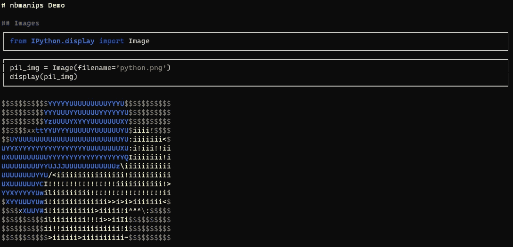
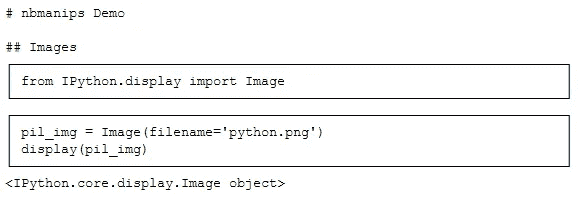
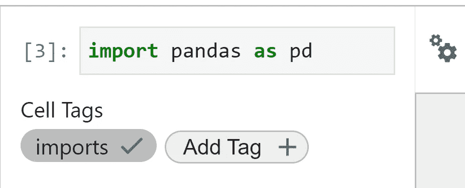

# 快速浏览 Jupyter 笔记本电脑(就在您的终端中)

> 原文：<https://towardsdatascience.com/rapidly-explore-jupyter-notebooks-right-in-your-terminal-67598d2265c2>

## 优化笔记本搜索

作者:[阿玛尔哈斯尼](https://medium.com/u/d38873cbc5aa?source=post_page-----40d1ab7243c2--------------------------------) & [迪亚赫米拉](https://medium.com/u/7f47bdb8b8c0?source=post_page-----40d1ab7243c2--------------------------------)



作者截图

想象一下，你有一个代码样本，埋藏在一个旧的 Jupyter 代码中，却不记得是哪一个了。您可以使用两种简单的解决方案:

1.旋转 Jupyter 实例并手动搜索所有笔记本
2。在文本编辑器中打开笔记本，搜索特定文本

这两种方式都不理想，因为:

1.  在 Jupyter 中加载每个笔记本并进行搜索需要时间

2.JSON 格式的大笔记本可读性不强

如果有第三种方法可以解决这两个问题，并且你可以在不离开终端的情况下使用它，那会怎么样？

认识一下 `nbmanips`，这是一个 python *包，我们专门为处理、探索和转换笔记本而创建。*

💡声明:这是我和 Dhia Hmila 创建的一个包。

```
**Table Of Contents:** 
. [1 — How to Install](#667f)
. [2 — nbmanips in Python](#da52)
  ∘ [2.1 — Reading a notebook](#1fcb)
  ∘ [2.2 — Filtering/Selecting Notebook Cells](#2662)
  ∘ [2.3 — Handling Multiple Notebooks](#8dd6)
. [3 — nbmanips in the Terminal](#3660)
```

# 1 -如何安装

如果使用 pip，安装 `nbmanips`非常简单:

```
pip install nbmanips
```

通过该软件包，即使您的 Jupyter 笔记本内容包含图像，也可以在您的终端上显示。是的，你没看错！如果您安装以下可选要求，它将呈现包含的图像:

```
pip install nbmanips[images]
```

如果你愿意，你可以用你自己的笔记本文件测试下面的库。但是如果你需要测试笔记本，这里有一个很棒的 [Git 资源库](https://github.com/Nyandwi/machine_learning_complete.git)，里面有超过 30 个机器学习相关的笔记本。

# Python 中的 2 - nbmanips

## 2.1 -阅读笔记本

阅读 Jupyter 笔记本非常简单:

一旦你读完了笔记本，你可以用 `show`方法把它打印到屏幕上:

```
nb.show()
```



您可以选择不同的展示风格:

```
# Possible values: ['single', 'double', 'grid', 'separated', 'rounded', 'dots', 'simple', 'copy']
nb.show(style='double')
```

💡**提示:** `copy`风格非常适合从终端复制/粘贴代码😉

📓其他有趣的参数有:

*   `width`:单元格的宽度
*   `exclude_output`:如果想要隐藏单元格的输出，则为 True。


## 2.2 -过滤/选择笔记本单元格

> 现在，我们有了一种不用离开终端就能以可读的方式可视化我们的笔记本的方法

然而，Jupyter 笔记本可以有大量的电池，我们不一定想在屏幕上看到所有的电池。

这就是 `Selectors`发挥作用的地方。它们用于指定我们将在哪些单元格上应用给定的操作(如显示或删除)。在我们的示例中，操作只是显示单元格。

要选择要应用前面操作的单元格，可以使用:

**1。使用索引过滤**

**2。使用预定义选择器**进行过滤

`nbmanips`中可用的预定义选择器如下:

*   `code_cells` / `markdown_cells` / `raw_cells`:选择给定类型的单元格
*   `contains`:选择包含某个文本/关键字的单元格
*   `is_empty` / `empty`:选择空单元格
*   `has_output`:检查电池是否有输出
*   `has_output_type`:选择具有给定输出类型的单元格
*   `has_byte_size`:选择字节大小在给定值范围内的单元格。这对于过滤掉包含大图像的单元格特别有用。
*   `has_html_tag`:选择具有特定 HTML 标签的减价单元格
*   `has_tag`:选择具有某个单元格标签的单元格。对于那些不知道它的人来说，可以给 Jupyter 笔记本单元格添加一个标记:



作者截图

*   `has_slide_type`:选择具有给定幻灯片类型的单元格
*   `is_new_slide`:选择新幻灯片/子幻灯片开始的单元格:


作者截图

**3。使用用户自定义函数过滤**

该函数采用一个 `Cell`对象，如果单元格应该被选中，则返回 True:

**4。组合过滤器**

*   组合选择器的第一种方法是简单地使用一个列表。

*   通过链接 select 语句来组合选择器:

```
nb.select('markdown_cells').select('is_empty').show()
```

*   使用二元运算符组合选择器:

## 2.3 —处理多台笔记本电脑

现在我们知道了如何在每个笔记本中显示特定的单元格，让我们将它应用于给定文件夹中的所有笔记本。

# 终端中的 3 - nbmanips

`nbmanips`还附带了一个 CLI，因此我们之前看到的所有内容都可以在几行代码中完成。

例如，要预览一个笔记本，您可以运行 `show`子命令:

```
nb show nb.ipynb
```

如果你想看到可用的参数，你可以通过 `--help`选项:

您可以使用过滤器，通过以下方式进行管道连接:

您也可以使用 `--help`选项获取更多信息:

# 最后的想法

Jupyter 笔记本对于交互式探索数据或快速尝试新想法非常有帮助。然而，一旦你完成了它们，你经常会留下一个快速和肮脏的代码。

`nbmanips`试图提供一种快速探索代码的方法，同时也能轻松地重组单元格和改造笔记本。

请继续关注我们的下一篇文章，了解如何拆分和合并不同的笔记本。

你可以在这个 [GitHub 库](https://github.com/hmiladhia/nbmanips-playground)中找到所有的 Python 脚本。如果您有任何问题，请不要犹豫，在回复部分留言，我们将非常乐意回答。

感谢您坚持到现在，注意安全，我们将在下一篇文章中再见！😊

# 更多文章阅读

[](/how-to-easily-merge-multiple-jupyter-notebooks-into-one-e464a22d2dc4)  [](/equivalents-between-pandas-and-pyspark-c8b5ba57dc1d)  [](/8-tips-to-write-cleaner-code-376f7232652c)  [](/this-decorator-will-make-python-30-times-faster-715ca5a66d5f)  

人工智能生成的图像(稳定扩散)