# 使用 Python 中的 Pytesseract 阅读多列 PDF

> 原文：<https://towardsdatascience.com/read-a-multi-column-pdf-with-pytesseract-in-python-1d99015f887a>

## NLP 工具

## 逐步介绍 OCR 的奇妙世界(附图片)


由 [Jaizer Capangpangan](https://unsplash.com/@kingjaizer?utm_source=medium&utm_medium=referral) 在 [Unsplash](https://unsplash.com?utm_source=medium&utm_medium=referral) 上拍摄的照片

在前一篇[文章](/read-a-multi-column-pdf-using-pymupdf-in-python-4b48972f82dc)中，我们学习了如何使用 PyMuPDF 包阅读 PDF 文档。我们还了解到，这种方法只有在 PDF 被数字化或可搜索的情况下才有效。否则，如果 PDF 被扫描并且不可搜索，PyMuPDF 就不起作用。

宇宙魔方来救援了。

Pytesseract 是另一个 OCR(光学字符识别)工具，作为 Google 的 Tesseract-OCR 引擎的 Python 包装器。它可以“识别”和“阅读”嵌入图像中的文本。”[1]

# Tesseract-OCR 安装

在开始编码之前，我们首先必须安装 Tesseract-OCR，并将其安装路径添加到环境变量中。

对于 Windows，我们可以直接去[这里](https://github.com/UB-Mannheim/tesseract/wiki)下载安装程序。对于其他操作系统，在此进入[。](https://tesseract-ocr.github.io/tessdoc/Installation.html)

让我们开始安装吧！

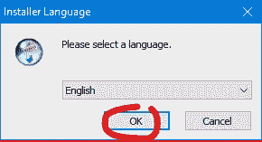

作者截图

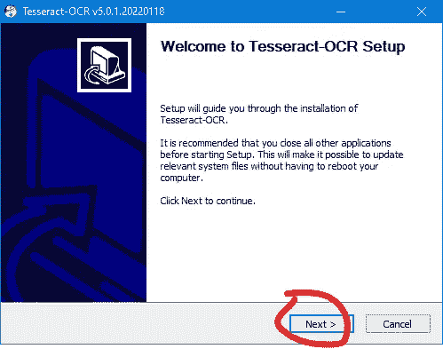

作者截图

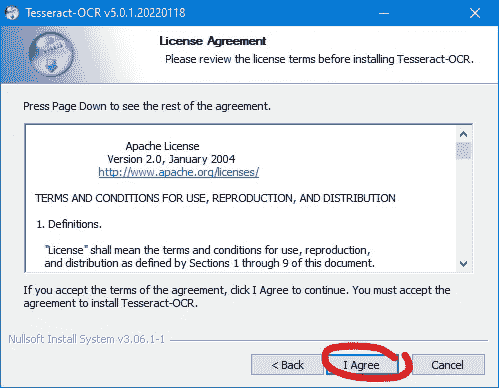

作者截图

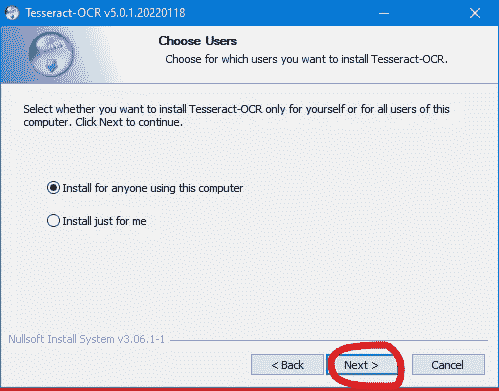

作者截图

这一次，我没有使用默认选项，而是推荐下载额外的数据，这样您以后就不必再这样做了。勾选下面圈出的方框:

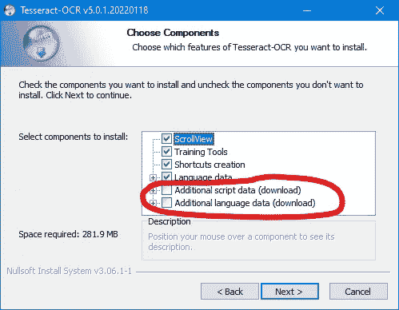

作者截图

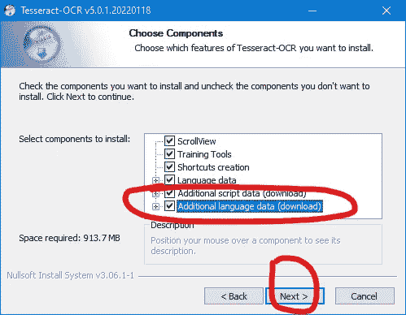

作者截图

在下一个屏幕中，请注意将安装 Tesseract-OCR 的目标文件夹。当我们将它添加到环境变量的路径中时，我们将需要它。

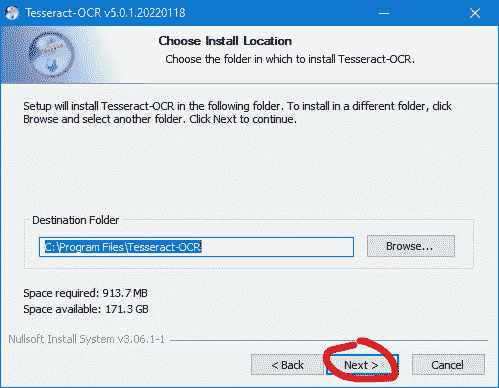

作者截图

在下一个屏幕上单击“安装”。

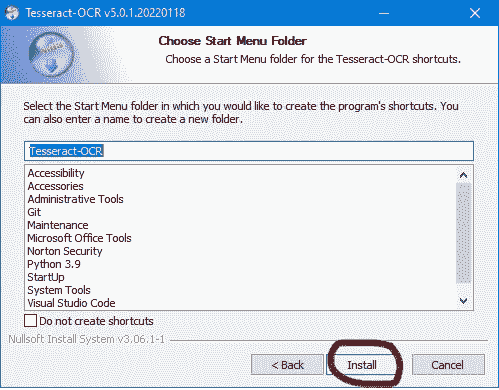

作者截图

安装完成后，单击“完成”。

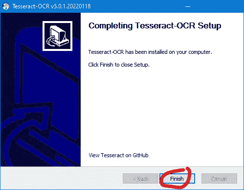

作者截图

此时，如果我们打开一个终端并键入`tesseract --version`，我们将看到一个错误。


作者截图

我们首先需要做的是将 Tesseract-OCR 安装文件夹添加到路径中。为此，按下 Windows 键并立即键入`env`。然后会出现一个搜索框，显示几个选项供你考虑。让我们选择“为您的帐户编辑环境变量”

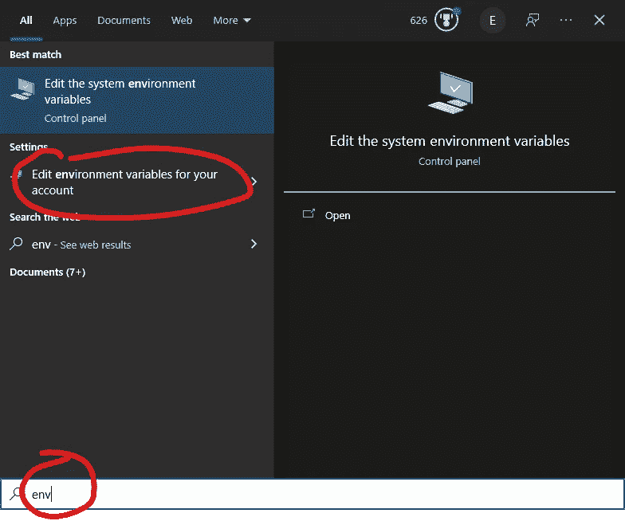

作者截图

在下一个屏幕上，单击路径和“编辑…”按钮。

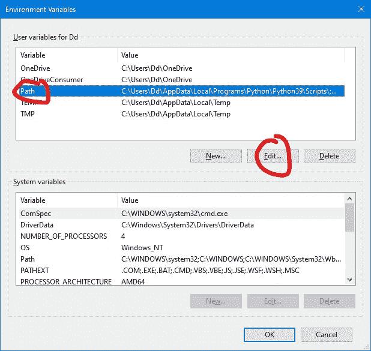

作者截图

单击下一个屏幕顶部的“新建”按钮。

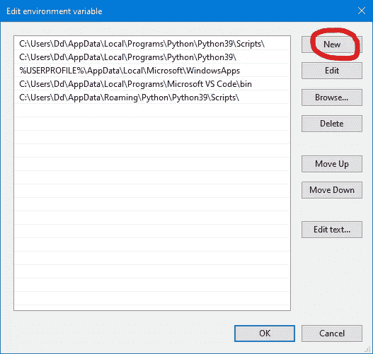

作者截图

现在，让我们进入 Tesseract-OCR 安装文件夹。单击“确定”

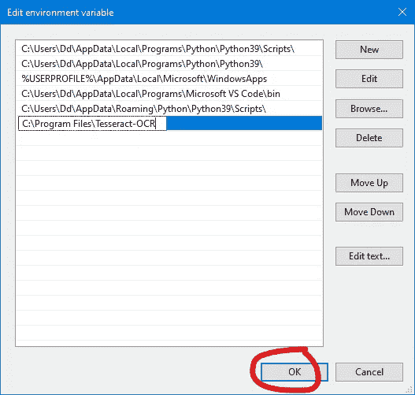

作者截图

在下一个屏幕上再次单击“确定”。

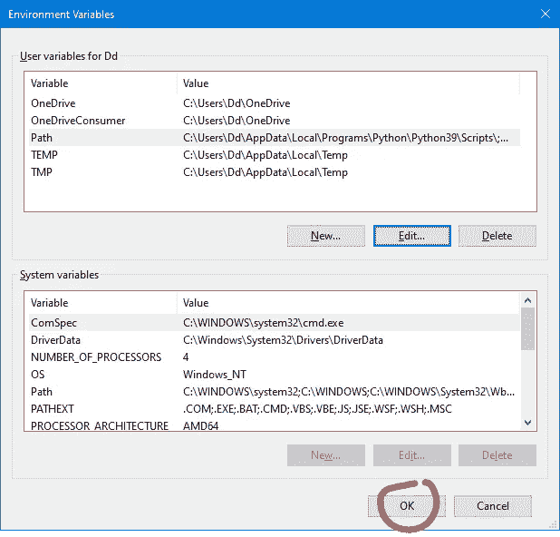

作者截图

当我们在终端中输入`tesseract --version`时，我们将得到关于宇宙魔方的信息，而不是一个错误。


作者截图

既然已经安装了 Tesseract-OCR 并且更新了我们的路径，我们就可以开始通过 pip 安装我们需要的 Python 包了。

# 使用 PIP 安装

因此，回到终端并键入以下内容:

```
pip install pytesseract
```


作者截图

完成后，键入以下内容:

```
pip install opencv-contrib-python
```


作者截图

现在我们已经准备好启动 jupyter 笔记本了！

# Jupyter 笔记本

打开笔记本，让我们导入一些包:

现在，让我们也设置一个全局变量:

现在，让我们来看看我们的输入 pdf:

如果需要的话，让我们放大或放大 pdf。在这里，我们将其水平和垂直放大两倍:

在下面的代码块中，我们打开 SCANNED_FILE (pdf 扩展名),并将其转换为扩展名为 png 的图像。然后，我们利用 for 循环从文件中提取所有页面，脚本每页生成一个 png 图像。

现在我们有了一个图像文件，我们准备预处理这个图像。

在下一个单元格中，我们将加载上一步生成的第一个(可能只有一个)页面。

然后，我们将图像转换为灰度。

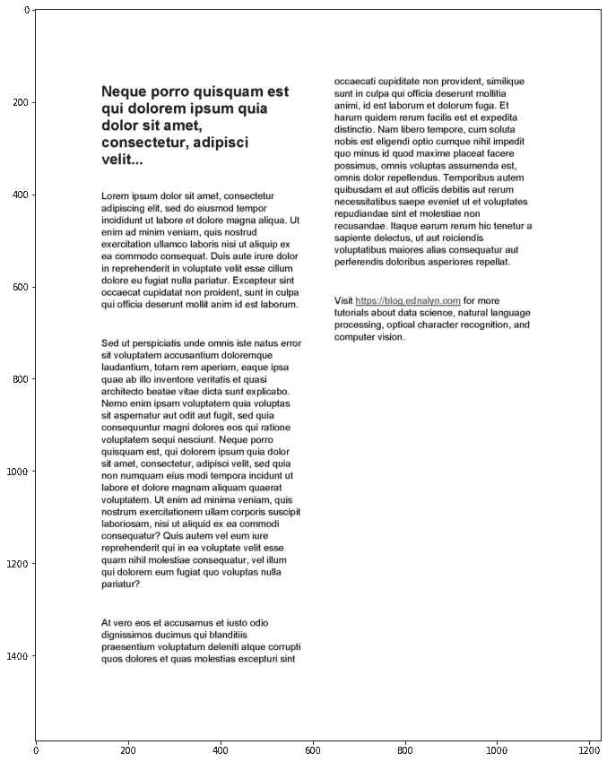

作者截图

下一步被称为 Otsu 的阈值技术。阈值处理是指我们制作二进制图像文件。它获取图像的像素并将其转换成黑色或白色。使用 Otsu 的阈值技术，我们不需要自己设置阈值参数。相反，大津是为我们做的。

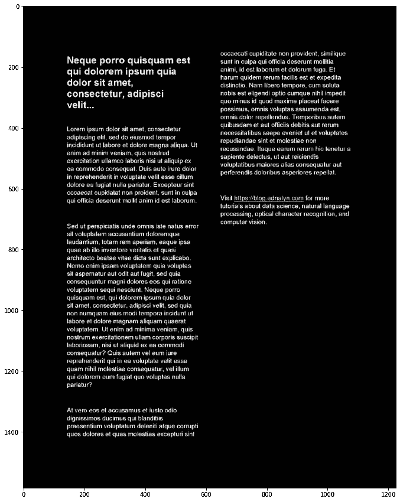

作者截图

接下来是我们代码的核心。

首先，`rectangular_kernel`决定在文本周围画多大的矩形。在这种情况下，我们有(66，66)。这个数字越高，我们得到的盒子就越少，因为它通过将不同的单词聚集在一个盒子里来将它们处理成一个单元。反之，如果有(11，11)，我们得到的盒子越多，因为它更独立地处理不同的单词。

我们可以看到下面的盒子的遮罩，其内核大小为(66，66)。

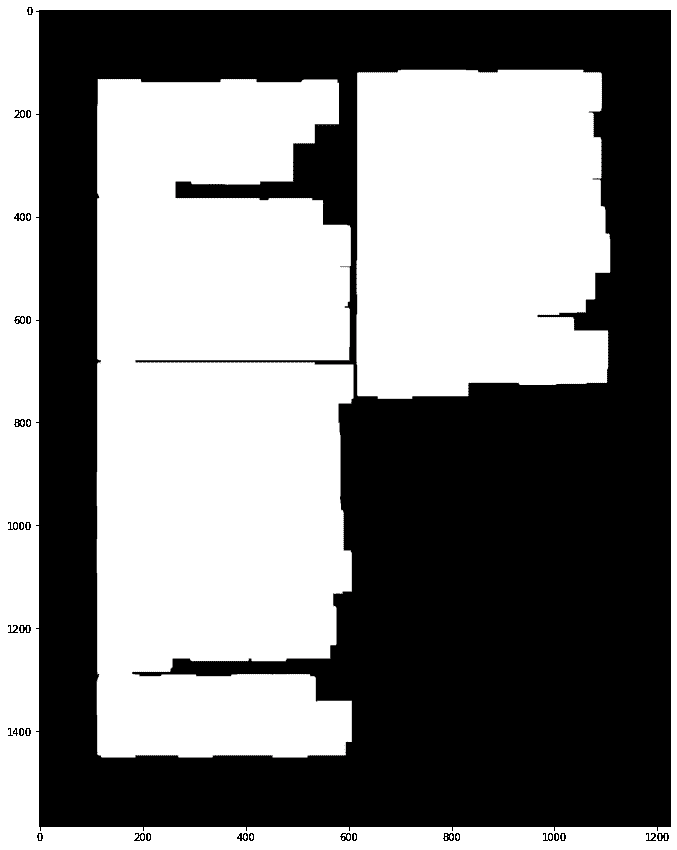

作者截图

在下一张图中，我们将内核大小改为(11，11)。


作者截图

最重要的一行是`text = pytesseract.image_to_string(cropped, lang='lat', config='--oem 3 --psm 1')`，宇宙魔方将图像转换成文本(或字符串)。config 参数允许您指定两件事:OCR 引擎模式和页面分段模式。

OCR 引擎模式或“oem”允许您指定是否使用神经网络。

1.  仅传统
2.  神经网络 LSTM 引擎而已。
3.  传统+ LSTM 发动机。
4.  默认，基于可用的内容。

页面分割模式或“psm”允许您指定 OCR 工具应该进行哪种页面分割。例如，我们使用“1”表示“带有 OSD(方向和脚本检测)的自动页面分段”,因为我们的文档是多列的。否则，我将使用“4”来表示“假设一列可变大小的文本”。如需使用哪种“psm”的示例，请阅读来自 [Nanonets](https://nanonets.com/blog/ocr-with-tesseract/) 的本教程:

[](https://nanonets.com/blog/ocr-with-tesseract/)  

说到底，这就是我们的结果:

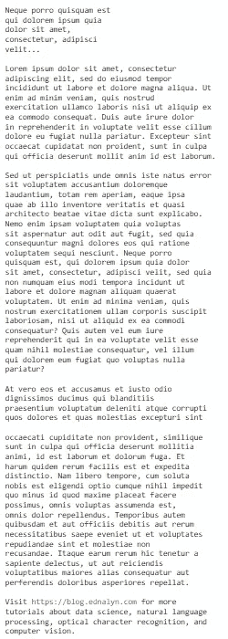

作者截图

今天就到这里吧！

# 结论

今天，我们看到了宇宙魔方 OCR 的实际应用。一旦你掌握了图像预处理的诀窍，它会是一个很有价值的工具。然而，如果你不喜欢预处理图像，并且你足够幸运有数字化的 PDF 来处理，你可能会更好地使用 PyMuPDF。

但是数字化的 pdf 呢？！查看[使用 Python 中的 PyMuPDF 阅读多列 PDF](/read-a-multi-column-pdf-using-pymupdf-in-python-4b48972f82dc)。

[](/read-a-multi-column-pdf-using-pymupdf-in-python-4b48972f82dc)  

谢谢你过来看我的帖子。希望 PyMuPDF 能像帮助我一样帮助你！你可以在 [Github](https://github.com/ecdedios) 上这里找到我用[的笔记本。](https://github.com/ecdedios/read-multicolumn-pdf-pymupdf/tree/main/data/in)

敬请期待！

*如果你想了解更多关于我从懒鬼到数据科学家的旅程，请查看下面的文章:*

[](/from-slacker-to-data-scientist-b4f34aa10ea1)  

*如果你正在考虑改变方向，进入数据科学领域，现在就开始考虑重塑品牌:*

[](/the-slackers-guide-to-rebranding-yourself-as-a-data-scientist-b34424d45540)  

你可以通过 [Twitter](https://twitter.com/ecdedios) 或 [LinkedIn](https://www.linkedin.com/in/ednalyn-de-dios/) 联系我。

参考

*   [1][https://pypi.org/project/pytesseract/](https://pypi.org/project/pytesseract/)