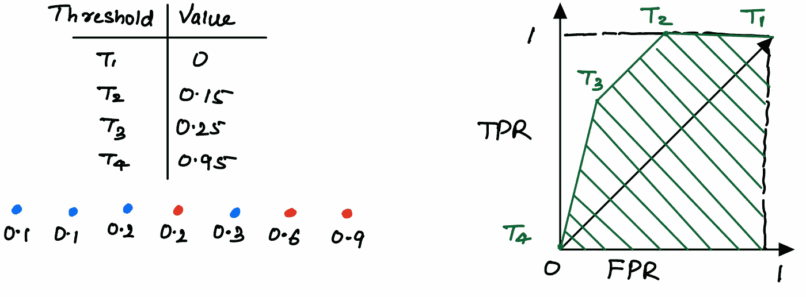
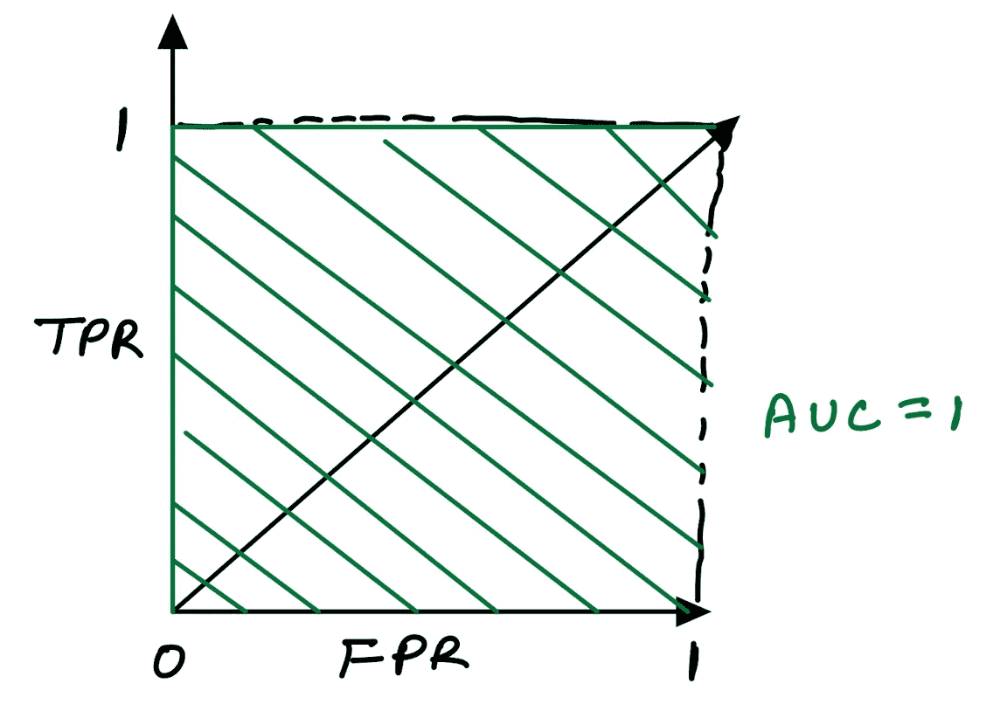
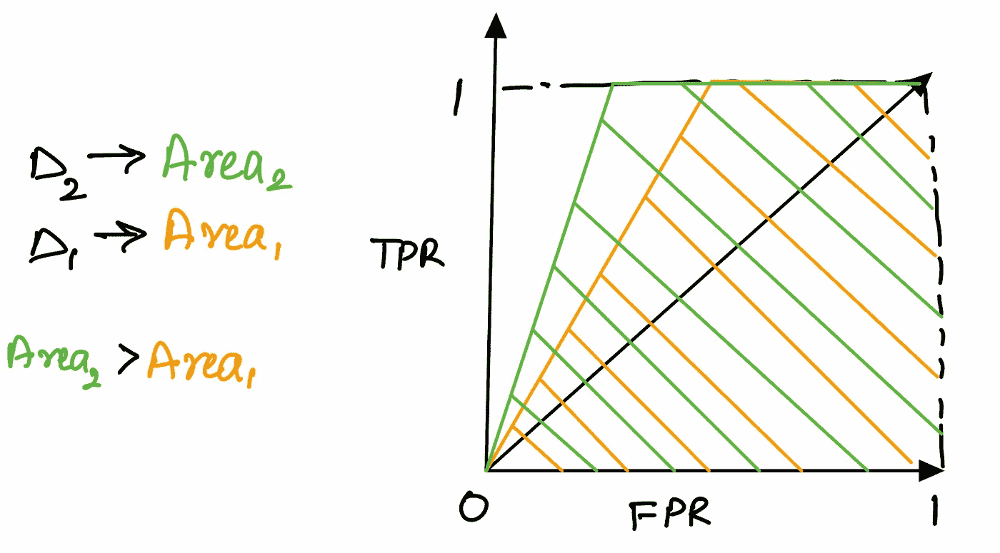

# 什么是 ROC-AUC 以及何时不使用它

> 原文：<https://towardsdatascience.com/read-this-before-using-roc-auc-as-a-metric-c84c2d5af621>

## 没有完美的度量标准。

原象

了解指标隐藏和提升了什么。

> 当一个衡量标准成为目标时，它就不再是一个好的衡量标准——古德哈特定律

当您改进一个度量标准时，您主要是改进该度量标准有利于什么。因为没有一个指标可以衡量一切，盲目地追求一个指标可能是危险的。我想探索这对 ROC-AUC 意味着什么。

接收器操作特征曲线或 ROC 曲线用于评估二元分类器。二元分类器输出数据点属于正类的概率。正是我们为这个数字设定了一个阈值，并给它贴上了一个标签。如果概率高于阈值，我们说预测的类是正的(1)，否则是负的(0)。调整阈值通常取决于用例。对于不捕捉正面例子的成本大于将负面例子误分类为正面例子的情况，可以选择较低的阈值，反之亦然。

ROC 曲线有助于我们将阈值之间的权衡可视化。该曲线下的面积(ROC-AUC)是该模型如何很好地分离不同阈值的正例和负例的总结。

# 将 ROC-AUC 可视化

下面的示例将带您了解一个玩具示例的 ROC-AUC 计算。

原象

上图显示了 7 个点的虚拟数据集的 ROC 曲线，其中有 4 个阴性(蓝色)和 3 个阳性(红色)示例。它们按照模型预测概率的升序排列(0.1、0.1、0.2、0.2、0.3、0.6、0.9)。我们在四个任意选择的阈值 T1、T2、T3 和 T4 测量**真阳性率(TPR)** 和**假阳性率(FPR)** ，值分别为 0、0.15、0.25 和 0.95。

***【TPR】****=(+ve 个预测概率高于阈值的例子)/(总正例)* ***【FPR】****=(-ve 个预测概率高于阈值的例子)/(总负例)*

例如，考虑 T3 (=0.25)。T3 以上的正例数为 2(满分 3)，T3 以上的反例数为 1(满分 4)。因此，TPR = 2/3，FPR = 1/4。最终，我们可以计算每个阈值的 **TPR** 和 **FPR** ，并将其绘制在二维平面上，如上所示。这条曲线下的面积是 ROC-AUC。阈值越多，曲线越平滑，指标越精确。

## AUC 的限制

> 可实现的最大 AUC 是 1。这是什么意思？

原象

根据该曲线，对于任何非零 FPR，TPR 将总是 1。从概念上讲，如果您选择一个阈值，并且只有一个负数据点越过它，则每个正数据点都会越过该阈值。只有当存在一个完美区分类别的阈值时，这才是可能的。

## 在不平衡数据集的情况下会发生什么？

在不平衡数据集的情况下，ROC-AUC 往往更乐观。考虑两个排序的数据集(表示为密度)，

原象

如图所示，数据集 1 (D1)有 50 多个 ve 示例和 100 个 ve 示例。假设正例与反例的重叠是同质的。也就是说，任何两个重叠部分都有相同比例的正面和负面例子。这同样适用于数据集 2 (D2)。显然，D2 比 D1 更不平衡。

对于 **D1** ，at 阈值= **0.5** ，
—精度= 50/(50+50) = **0.5** 。
—回忆= 50/50 = **1** 。
— F-1 评分=(2*精度*召回)/(精度+召回)=(2 * 0.5 * 1)/(0.5+1)=**2/3**。

D2 在 **0.75** 阈值，F1 得分(= **2/3** )。

现在让我们做一些有趣的事情。让我们看看 AUC。

原象

对于 D1，当你从阈值 0 到 0.5 时，TPR 保持不变(=1)。类似地，对于阈值为 0 至 0.75 的 D2，TPR=1。

对于 D1，在 0.5 FPR 之后，TPR 和 FPR 线性下降，因为它们是均匀混合的。D2 也是如此，排在 FPR 之后 0.25。但是 D2 的 AUC 比 D1 大，尽管他们有相同的 F1 最高分。观察到对于大多数阈值，不平衡数据集中的 TPR 更高。

这可能具有欺骗性。那么还有什么选择呢？

## 精确召回曲线

精度-召回曲线类似于 ROC 曲线，除了 Y 轴是精度，X 轴是召回。通过在不同阈值绘制曲线来计算 AUC。考虑上面讨论的同一个例子的 PR 曲线—

对于 D1，任何阈值在 0.5 之后，对于 D2，任何阈值在 0.75 之后，精度=0.5。对于 D1，0.5 之前的任何阈值和对于 D2，0.75 之前的任何阈值都有 recall=1。如你所见，曲线基本相同。1/3 是 D1 的精度，1/5 是阈值=0 时 D2 的精度。我们使用的例子过于简单了。然而，PR-AUC 对不平衡不太敏感。

## 一般建议

衡量标准的表现很重要。模型评估几乎不会停留在单一的数字指标上。要了解模型学到了什么，请查看模型犯了哪些错误？模型对哪些例子不自信？指标的最大收益来自哪里？

我热爱教学！如果你需要帮助理解数据科学、机器/深度学习或 Python 中难以理解的概念，请随时在这里申请辅导课程。