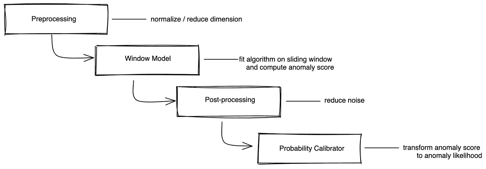

# 用 Python 实现实时异常检测

> 原文：<https://towardsdatascience.com/real-time-anomaly-detection-with-python-36e3455e84e2>

## 使用 PyOD 和 PySAD 进行流数据的机器学习

用于实时异常检测的滑动窗口(图片由作者提供)

在这篇博文中，我们将讨论流数据的异常检测，特别是 Python 的两个库 PyOD 和 PySAD。

简而言之，异常检测是对不符合预期模式的项目、事件或观察结果的识别。这可能像检测欺诈性信用卡交易一样简单，也可能像识别制造数据中的违规行为一样复杂。

异常检测可以帮助您在问题变成问题之前识别问题，并通过识别您可能没有意识到的模式来帮助您优化流程。

说到大数据，主要有两类:批处理和流处理。批处理是指一次性处理所有数据。另一方面，流式传输是指在数据到达时对其进行处理。由于流数据不断更新，异常检测是保持系统平稳运行的关键。

在这篇博文中，我们将通过在几行代码中结合 PyOD 和 PySAD 来解决实时检测异常的挑战。

敬请期待！

# 异常检测

异常检测是对不符合预期模式或数据集中其他项目的观察值的识别。这是一个重要的数据挖掘工具，用于发现诱发的错误、意外的模式和更普遍的异常。

执行异常检测有多种方法，您采用的方法取决于数据的性质和您要寻找的异常类型。但是一般来说，对于给定的样本分布，有三种方法可以识别可能被认为是异常的观察值:

**无监督**(来源:[PyOD documentation](https://pyod.readthedocs.io/en/latest/relevant_knowledge.html))*当训练数据同时包含正常和异常观测值时，该模型在拟合过程中识别出异常值。当“异常值”被定义为存在于数据集的低密度区域中的点时，可以使用该方法-任何不属于高密度区域的新观察值都将由算法自动标记。*

**半监督**(来源:[PyOD documentation](https://pyod.readthedocs.io/en/latest/relevant_knowledge.html))
*半监督技术背后的想法是，我们可以利用我们关于什么使事情正常的知识，并在无异常的数据点上拟合模型。然后，在推断时间期间检测异常，并假设异常随训练数据的分布而变化。*

**监督**(资料来源:[PyOD documentation](https://pyod.readthedocs.io/en/latest/relevant_knowledge.html))
*每个观察的基本事实——内部和外部——都是众所周知的。该模型已经对不平衡的训练数据进行了拟合，然后用于对新的观察结果进行分类。当属于异常值类的内容与属于其他类的内容之间存在明显差异时，以及知道它们随后的行为时，可以采用这种方法-假设异常值具有与训练集中相似的分布。*

# 实时异常检测

为了检测异常，机器学习算法必须能够识别数据中的模式。

> 这些模式可能非常复杂，并且会随着时间的推移而变化。

这就是为什么我们有时需要在生成新数据点的同时在线更新机器学习模型的原因。

出于多种原因，实时异常检测非常重要。首先，它可以帮助您快速识别并纠正错误，以免造成重大损失或中断。其次，它可以让您主动监控系统的潜在问题，并在检测到问题时快速做出响应。最后，它可以让您近乎实时地了解系统中正在发生的情况，让您做出更好的决策，也就是说，在异常发生时而不是事后检测到异常。

机器学习算法的问题在于，它们的训练速度相当慢，而且通常需要大量数据。根据我们试图达到的推理时间，我们应该小心我们选择的模型。正如您所想象的，在速度和准确性之间进行权衡，在使用 PySAD 时有两个主要参数来处理这种折衷:“窗口大小”和“滑动大小”。

窗口大小决定了机器学习算法用来训练模型的数据点的数量，滑动大小是模型更新的周期。

例如，如果我们想检测 Twitter feeds 中的异常，我们就在一个历史窗口上训练算法，并用这个模型检查每个新推文，以确定它是否是异常。然后，在“滑动大小”时间(比如 30 秒)后，模型太旧了，我们在一个新窗口上更新模型，该窗口查看最近的数据点。

> 这意味着模型定期更新，但不是每次有新的数据点时都更新。

实时异常检测框图(图片由作者提供)

# 管道与 PyOD 和 PySAD

我最喜欢的两个异常检测库是 PyOD 和 PySAD。PyOD 库是一个全面的 Python 工具包，用于检测多元数据中的异常值，而 PySAD 是一个轻量级库，用于流数据中的无监督异常检测。

> 这两个库都是开源的，易于安装，并且彼此兼容。

我们可以将这两个库结合起来，与前面描述的窗口模型一起工作:PySAD 负责窗口逻辑，而 PyOD 拥有检测异常的算法。

用于实时异常检测的管道(图片由作者提供)

在实时处理数据时，预处理可以发挥至关重要的作用，因为如果您使用一些降维算法(如主成分分析(PCA )),可以显著提高算法的速度，或者可以通过归一化传入的数据点来提高算法的准确性。

另一方面，后处理是从异常分数中去除噪声所必需的。在管道的末端，概率校准器会给你面对异常的最终可能性。

> 整个流水线——预处理、窗口模型、后处理和概率校准器——可以用几行代码实现。

这里有一个笔记本展示了合并这两个库的简单性:

# **结论**

异常检测是识别不符合预期模式的事件或观察结果的过程。由于数据生成的高速率和必须处理的数据量，检测流数据中的异常可能很困难。

> 如果您应该从本文中记住一件事，那就是 PyOD 和 PySAD 可以一起使用来检测数据流中的异常，并且这样做的代码只有几行长。

为了检测异常，机器学习算法必须能够识别数据中的模式，但这些模式可能非常复杂，可能会随时间而变化。由于这个原因，当新的数据点被创建时，我们有时需要在线更新机器学习模型。

好奇想了解更多关于 Anthony 的工作和项目吗？在[中](https://medium.com/@anthonycvn)、 [LinkedIn](https://www.linkedin.com/in/anthonycavin/) 、 [Twitter](https://twitter.com/Anthony66333223) 上关注他。

*需要技术写手？将您的请求发送到*[*https://amigo CCI . io*](https://amigocci.io/blog/mlops-at-medium-scale/)*。*