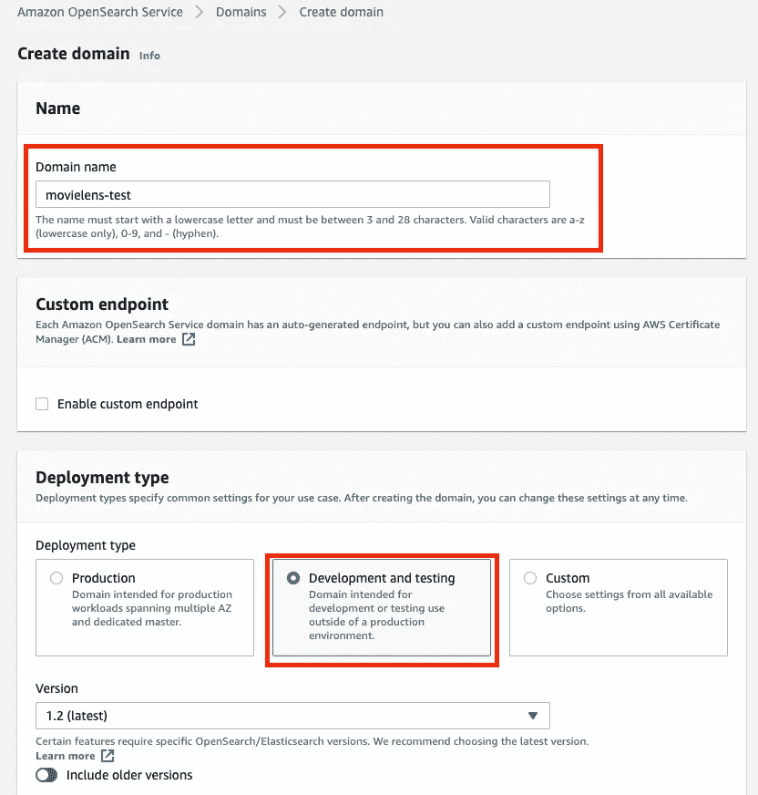
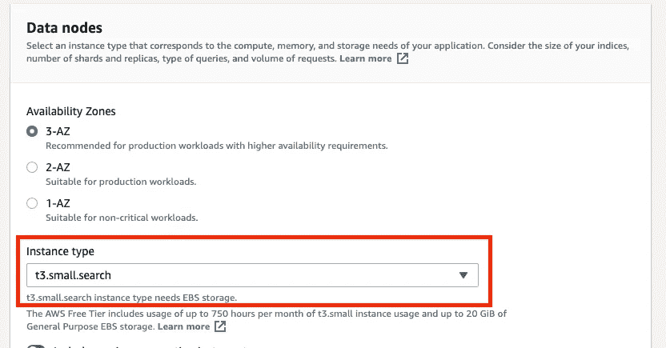
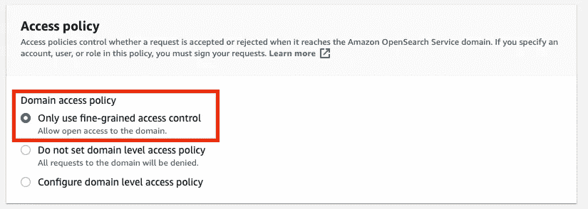
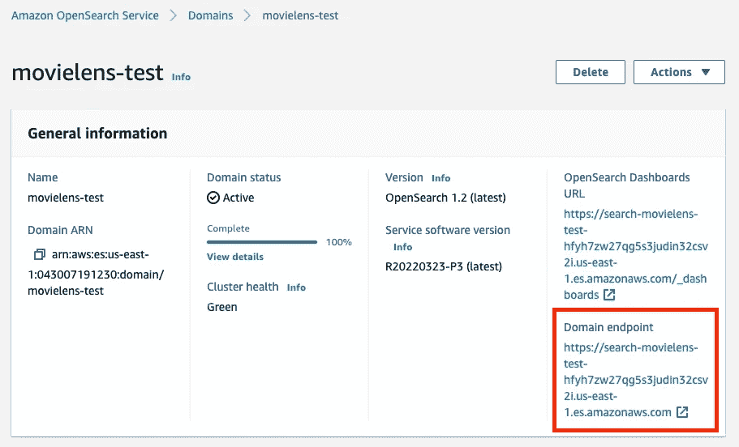

# 使用 Elasticsearch 进行实时预输入搜索(AWS OpenSearch)

> 原文：<https://towardsdatascience.com/real-time-typeahead-search-with-elasticsearch-aws-opensearch-88410d5b31a1>

## 使用 MovieLens 数据集在云上构建可扩展的智能搜索引擎的端到端示例


在谷歌搜索的例子。作者图片

[1。](#f88c)
简介 [2。数据集准备](#5d90)
[3。设置 OpenSearch](#7699)
[4。索引数据](#39ad)
[5。基本查询同匹配](#8385)
[6。用 Jupyter 笔记本和 ipywidgets](#87ea)
[7 基本前端实现。一些高级查询](#0beb)
∘ [7.1 匹配短语前缀](#7bad)
∘ [7.2 匹配+前缀带布尔](#7041)
∘ [7.3 多字段搜索](#cd74)
[8。结论](#e539)
[关于我的](#a593)
[参考文献](#4a40)

# 1.介绍

你有没有想过谷歌是如何让它的搜索引擎变得如此智能，以至于它可以预测我们的想法，甚至在我们不输入整个内容的情况下自动完成整个搜索词？它被称为**类型预搜索**。这是一个非常有用的语言预测工具，许多搜索界面使用它来为用户输入查询提供建议。[1]

作为一名数据科学家或任何从事数据后端工作的人，有时我们可能需要这样一个交互式搜索引擎界面，让我们的用户能够以最少的努力查询结构化/非结构化数据。这样总能让用户体验更上一层楼。

幸运的是，我们不必从头开始构建它。有很多开源工具可以使用，其中之一就是 **Elasticsearch** 。

[**elastic search**](https://www.elastic.co/what-is/elasticsearch)是一个分布式、免费和开放的搜索和分析引擎，适用于所有类型的数据，包括文本、数字、地理空间、结构化和非结构化数据。Elasticsearch 以其简单的 REST APIs、分布式特性、速度和可伸缩性而闻名，是 Elastic Stack 的核心组件，是一套用于数据摄取、丰富、存储、分析和可视化的免费开放工具。[2]

另一方面，亚马逊创建的 [**AWS OpenSearch**](https://aws.amazon.com/opensearch-service/?nc=bc&pg=wik) 是 Elasticsearch 的分叉版本，适合其 AWS 生态系统。它有一个非常相似的界面与基础结构与弹性搜索。在这篇文章中，为了**简化**在本地机器上下载、安装和设置 Ealsticsearch 的过程，我将带您浏览一个使用 **AWS Open Search** 索引和查询数据的端到端示例。

在现实世界中，使用这种云服务的另一个重要原因是**可扩展性。**我们可以轻松调整所需的资源，以适应任何数据复杂性。

请记住，即使我们在这里使用 AWS OpenSearch，如果您已经设置了 Elasticsearch，您仍然可以按照其中的步骤操作。这些工具在本质上非常相似。

# **2。数据集准备**

在本例中，我们将使用 [**MovieLens 20M 数据集**](https://grouplens.org/datasets/movielens/20m/) ，这是一个受欢迎的开放电影数据集，被许多数据专业人员用于各种项目。之所以称之为 20M，是因为数据集中包含了 2000 万个收视率。此外，整个数据集中包含 465，000 个标签应用、27，000 部电影和 138，000 个用户。

这个数据集包含几个文件，可以用于非常复杂的例子，但是假设我们只想在这里构建一个可以查询**电影名称、年份和流派**的电影搜索引擎，我们只需要一个文件 ***movies.csv*** 。

这是一个非常干净的数据集。结构如下所示:


movies.csv (MovieLense 20M)。作者图片

只有 3 个字段: **movieId** 、**片名**(括号内为年份)、以及**流派**(用|)隔开。我们将使用标题和流派对数据集进行索引，但看起来有些电影没有指定流派(例如，movieId = 131260)，因此我们可能希望将这些流派替换为 NA，以防止它们作为不需要的流派关键字被查询。几行处理就足够了:

```
import pandas as pd
import numpy as npdf = pd.read_csv('../data/movies.csv')
df['genres'] = df['genres'].replace('(no genres listed)', np.NaN)
df.to_csv('../data/movies_clean.csv', index=False)
```

通过这一小段代码，我们刚刚清理了数据集，并将其保存为一个名为`movie_clean.csv`的新文件。现在，我们可以继续创建一个 AWS OpenSearch 域。

# 3.设置开放搜索

下面是来自 AWS OpenSearch 的 [**官方文档**](https://docs.aws.amazon.com/opensearch-service/latest/developerguide/gsg.html) 。你可以跟着它做更详细的介绍，也可以通读我下面做的简化版。

如果你没有 **AWS 账号**，可以按照这个 [**链接**](https://portal.aws.amazon.com/billing/signup?nc2=h_ct&src=header_signup&redirect_url=https%3A%2F%2Faws.amazon.com%2Fregistration-confirmation#/start/email) 报名 AWS。您还需要为 AWS 服务添加一种支付方式。然而，不要惊慌，因为在本教程中，我们将使用最少的资源，成本应该不超过 1 美元。


[报名 AW](https://portal.aws.amazon.com/billing/signup?nc2=h_ct&src=header_signup&redirect_url=https%3A%2F%2Faws.amazon.com%2Fregistration-confirmation#/start/email) S .图片作者

创建您的帐户后，只需登录您的 [**AWS 管理控制台**](https://aws.amazon.com/console/) ，搜索 OpenSearch 服务，或点击[此处](https://us-east-1.console.aws.amazon.com/esv3/home?region=us-east-1#opensearch/dashboard)进入 **OpenSearch 仪表盘**。


打开搜索仪表板。作者图片

在仪表板中，按照以下步骤操作:

1.  选择**创建域**。
2.  给个**域名**。
3.  在开发类型中，选择**开发和测试**。



[AWS OpenSearch 设置](https://docs.aws.amazon.com/opensearch-service/latest/developerguide/gsgcreate-domain.html)。用户图像

4.将实例类型更改为 **t3.small.search** ，并保留所有其他类型的默认值。



[AWS OpenSearch 设置](https://docs.aws.amazon.com/opensearch-service/latest/developerguide/gsgcreate-domain.html)。用户图像

5.为了项目的简单，在网络中，选择**公共接入**

6.在细粒度访问控制中，通过设置用户名和密码来创建**主用户**。


[AWS 开放搜索设置](https://docs.aws.amazon.com/opensearch-service/latest/developerguide/gsgcreate-domain.html)。用户图像

7.在访问策略中，选择**只使用细粒度的访问控制**



[AWS OpenSearch 设置](https://docs.aws.amazon.com/opensearch-service/latest/developerguide/gsgcreate-domain.html)。用户图像

8.通过保留默认设置来忽略所有其他设置。点击**创建**。这可能需要 15-30 分钟才能完成，但根据我的经验，通常会更快。

# **4。索引数据**

AWS OpenSearch 或 Elasticsearch 足够智能，可以自动索引我们上传的任何数据，之后我们可以用任何逻辑规则编写查询来查询结果。然而，可能需要一些预处理工作来简化我们的查询工作。

我们记得，我们的数据由 3 列组成:


movies.csv (MovieLense 20M)。作者图片

标题和类型对我们来说都很重要，因为我们可能希望在任一/两者中输入任何关键字来搜索我们想要的电影。**open search 支持多字段搜索**，但是为了查询的简单性，我们也可以通过将我们感兴趣的所有关键词放入一个专门的列来对其进行预处理，这样**提高了效率，降低了查询复杂度**。

预处理以创建新的 search_index 列。作者代码

使用上面的预处理代码，我们将一个名为 **search_index** 的新列插入到包含标题和所有流派的数据帧中:


添加了 search_index 的数据帧。作者图片

下一步是将数据转换成 JSON 格式，以便**批量上传到我们的域。为批量数据上传指定的格式可以在 [**开发人员指南**](https://docs.aws.amazon.com/opensearch-service/latest/developerguide/gsgupload-data.html?sc_icampaign=docs_console-es_upload-data_20201706&sc_ichannel=ha&sc_icontent=awssm-4561&sc_iplace=console-es&trk=ha_awssm-4561) 选项 2 中找到。大概是这样的:**

```
{"index": {"_index": "movies", "_id": "2"}}
{"title": "Jumanji (1995)", "genres": "Adventure|Children|Fantasy", "search_index": "Jumanji (1995) Adventure Children Fantasy"}
```

其中**第一行**指定要保存在域中的索引(文档)名称以及记录 id(这里我使用 movieId 列作为惟一标识符)。第二行包括数据集中的所有其他字段。

以下代码用于转换:

从 dataframe 转换到 JSON。作者代码

转换后，数据以`movies.json`的名称存储在数据文件夹中。现在我们需要将它上传到域中，如下所示:

将 JSON 数据批量上传到域中。作者代码

请注意，**端点**可以在您的 OpenSearch 域页面上找到。**用户名和密码**是我们在创建该域名时设置的主用户名&密码。



域仪表板。作者图片

如果它返回一个 **<响应【200】>**，那么我们就可以开始了。数据集已成功上传到 AWS OpenSearch 域。

# 5.带有匹配的基本查询

现在，随着数据的上传，我们已经完成了服务器端的所有工作。OpenSearch 自动索引数据以备查询。我们现在可以开始在客户端**上查询来自域的数据。**

要了解关于查询语言的更多信息，这里有两个选项:

1.  开始使用 [**AWS OpenSearch 服务开发者指南**](https://docs.aws.amazon.com/opensearch-service/latest/developerguide/gsgsearch.html)
2.  在这个 [**官方 Elasticsearch 指南查询 DSL**](https://www.elastic.co/guide/en/elasticsearch/reference/current/query-dsl.html) 中有一些关于从 Elasticsearch 和 OpenSearch 中查询数据的非常详细的文档。

然而，在这个例子中，我们不需要非常高级的功能。我们将主要使用围绕标准 [**匹配查询**](https://www.elastic.co/guide/en/elasticsearch/reference/current/query-dsl-match-query.html) 的一些小变化。

下面是一个基本的例子:

基本匹配查询。作者代码

在这里，我们编写查询来查找任何与 title = "jumanji "匹配的记录，将 JSON 查询序列化为字符串，并将其与端点和凭证一起发送到域。让我们看看返回的结果:

```
{'took': 4,
 'timed_out': False,
 '_shards': {'total': 5, 'successful': 5, 'skipped': 0, 'failed': 0},
 'hits': {'total': {'value': 1, 'relation': 'eq'},
  'max_score': 10.658253,
  'hits': [{'_index': 'movies',
    '_type': '_doc',
    '_id': '2',
    '_score': 10.658253,
    '_source': {'title': 'Jumanji (1995)',
     'genres': 'Adventure|Children|Fantasy',
     'search_index': 'Jumanji (1995) Adventure Children Fantasy'}}]}}
```

正如我们看到的，它返回标题等于`jumanji`的记录。我们的数据集中只有一个匹配的结果，确切的标题是`Jumanji (1995)`，还有其他信息，如 id、流派和 search_index。

OpenSearch 自动处理**大写/小写字母、任何符号和空格**，因此它可以很好地找到我们的记录。此外，**分数**意味着返回的结果与我们的查询匹配的可信度，越高越好。这种情况下是`10.658253`。如果我们在搜索查询中包括年份，比如“jumanji 1995”，那么分数将增加到`16.227726`。当查询返回多个结果时，**对结果进行排序**是一个重要的指标。

# 6.Jupyter 笔记本和 ipywidgets 的基本前端实现

作为一个数据科学家， **Jupyter 笔记本**是一个很好的朋友，配合现在流行的 [**ipywidgets**](https://ipywidgets.readthedocs.io/en/latest/index.html) ，我们可以让笔记本变得很有互动性。下面是构建一个基本 GUI 的一些代码，该 GUI 包括一个**文本框**(用于输入关键字)和一个**文本输出**(用于显示查询结果)。

该准则有 5 个部分:

1.  **搜索功能**:上一节介绍的基本查询的包装器。通过输入，它搜索并返回包含输入关键字的结果。
2.  **加粗**:这个功能使用 Markdown 来加粗结果中的关键词，以便更好地可视化结果。
3.  **printmd** :在 IPython 中显示 Markdown 的包装函数
4.  **text_change** :处理 **widget 事件**的函数。在这种情况下，只要文本框中的值发生变化，它就会执行搜索功能，并返回按分数排序的前 10 个结果。还实现了一个计时模块来显示搜索需要多长时间。
5.  代码的最后一部分定义了要显示的小部件元素:一个**文本框**和一个**输出**。当框中的值改变时，小部件事件被触发，结果将显示在输出中。

下面是我们执行代码时的样子:


使用 GUI 的基本查询。作者图片

当我们输入关键字“jumanji”时，它会不断搜索更新的关键字。在此过程中，关键字“j”、“ju”和“jumanji”分别返回 3 组结果。但是，对于“jum”、“juma”、“juman”或“jumanj”，它是空的，因为我们在这里使用的匹配查询将输入的关键字视为**精确术语**，并且我们的数据集中没有包含这些单词的电影。

这看起来不像我们预期的 typeahead 功能。为了提高性能，我们将在下面研究一些高级查询选项，包括**前缀**、**布尔**和**多字段**搜索。

# 7.一些高级查询

## 7.1 匹配短语前缀

一个简单的解决方法是使用 [**匹配短语前缀查询**](https://www.elastic.co/guide/en/elasticsearch/reference/current/query-dsl-match-query-phrase-prefix.html) 代替 [**匹配查询**](https://www.elastic.co/guide/en/elasticsearch/reference/current/query-dsl-match-query.html) 。匹配短语前缀查询可以按照与所提供的相同的顺序**返回包含所提供文本的单词的文档。所提供文本的最后一个术语**被视为前缀**，匹配以该术语开头的任何单词。[5]******

**这似乎是我们想要的:当我们输入查询时，我们不必在它可以告诉结果之前完成术语。**

**所以让我们这样修改我们的查询！**

**这里我不会再展示 Python 代码，因为除了对**搜索函数中的查询稍作修改之外，一切都保持不变。**现在`match`变成了`match_phrase_prefix`:**

```
query = {
    'query': {
        'match_phrase_prefix': {
            'title': prefix
            }
        }
    }
```

**更改后，现在看起来是这样的:**

****

**匹配短语前缀查询的结果。作者图片**

**我们在这里尝试了 3 个例子:**

1.  ****巨漫记**:现在修好了！当我们输入时，搜索引擎使用输入的文本作为前缀，完美地呈现所有想要的输出。**
2.  **《哈利·波特》:和上一个例子做的一样。当我们到第二个学期“波特”时，它开始显示所有的哈利波特电影。**
3.  ****哈利波特**:然而，如果我们将“哈利波特”反转为“哈利波特”，它不会显示任何结果，因为在**匹配短语前缀查询**中顺序很重要。**

**想象一下，当我们使用搜索引擎时，我们并不总是 100%确定我们记住了按**正确顺序排列的所有关键词，**，所以我们可能想要改进搜索引擎，使它变得更加**智能**来帮助我们解决问题。**

## **7.2 用布尔值匹配+前缀**

**要分解此类查询的**需求**:**

1.  ****最后一项**需要作为**前缀**处理**
2.  ****其他术语**需要与**完全匹配****
3.  **我们不需要确切的顺序来得到想要的结果**

**遗憾的是，Elasticsearch/OpenSearch 中没有这种我们可以直接使用的查询类型，但是工具足够灵活，我们可以使用 [**布尔查询**](https://www.elastic.co/guide/en/elasticsearch/client/net-api/8.2/bool-query-usage.html) 来实现逻辑。**

**search_prefix 函数，它将最后一项视为前缀，而忽略顺序。作者代码**

**上面显示的代码是更新后的搜索功能。正如我们在这里看到的，在合并了 **bool** 操作 **must** 之后，查询变得更长了:**

*   **如果我们输入的搜索文本包含不止一个单词**，那么我们将把最后一个单词**视为前缀**，**和**，**前面的单词与**完全匹配。****
*   **如果搜索文本是**只有一个单词**(或更少)，那么我们就把它当作一个**前缀**来搜索。**

**实施更改后，让我们看看结果:**

****

**使用前缀和布尔语句的复合查询的结果。作者图片**

**现在，当以完全混合的顺序输入:“波特哈利王子血”时，搜索引擎知道我们在寻找什么，它能够返回正确的结果:**哈利波特与混血王子(2009)** 。**

## **7.3 多字段搜索**

**到目前为止，我们只在电影标题字段中进行搜索，但是我们可以进一步改进搜索引擎，通过利用一些**隐藏字段，例如我们案例中的类型**，使其更加智能。**

**要在**多个字段**中进行搜索，弹性搜索用户指南中有 [**多匹配查询**](https://www.elastic.co/guide/en/elasticsearch/reference/current/query-dsl-multi-match-query.html) 。但是，它没有提供足够的能力来搜索前缀，同时像我们刚才所做的那样忽略订单。我们仍然需要布尔来进行复合查询。**

**有一个捷径:记住，我们之前处理了数据集，并准备了一个组合的 **search_index** 列来包含标题和流派信息。有了这个新字段，我们可以很容易地修改我们以前的查询，以包含隐藏的流派信息，而无需显式地使用多匹配查询。**

**search_prefix 函数，在不显式使用多匹配的情况下进行多字段搜索。作者代码**

**这是修改后的`search_prefix`函数，但是如果你仔细看，它和上一个函数没有什么变化，除了我们用`search_index`代替了`title`来搜索标题和流派。**

**以下是更改后的结果:**

****

**使用标题和类型信息的多字段搜索结果。作者图片**

**我们尝试了两个例子:**

1.  **假设我们记得有一部冒险电影，关键词是“不可能”。然后我们输入“不可能的冒险”，它会返回所有不可能完成的任务的电影，因为它们被归类为“冒险”电影。**
2.  **哈利·波特也一样。如果输入“波特冒险”，它将返回所有的哈利波特电影，因为它们都是“冒险”电影。**

# **8.结论**

**在这篇文章中，我们通过一个端到端的例子来构建一个智能的预输入搜索引擎，步骤如下:**

*   **准备电影数据集**
*   **设置 AWS OpenSearch 域**
*   **将数据集批量上传到 OpenSearch 服务进行索引**
*   **构建一个简单的预输入搜索引擎 GUI**
*   **从基础到高级主题，从域中查询数据的几种方法**

**结果令人印象深刻:我们能够像谷歌一样模仿预输入搜索。在键入关键字的同时，搜索引擎在**中近乎实时** (0.2 秒)地分析和搜索数据库，以呈现最接近的匹配，并指导我们进一步缩小搜索结果列表的方向。**

**另一方面，我们使用布尔运算修改了查询，使我们能够**混合关键字顺序**。我们还可以输入属于**隐藏字段**的值，例如流派名称，以帮助我们缩小范围并找到想要的结果。这两个特性使得搜索引擎更加智能。**

**在这个例子中，我们还有很多地方可以在将来改进:**

1.  **Jupyter 笔记本和它的`ipywidgets`在构建 GUI 方面非常强大。这里我们只使用了文本框和输出，但是本例中可以使用更多的小部件，例如触发搜索的**按钮**、在结果上添加过滤器的**复选框**或**下拉列表**，或者点击 Google 提供的建议结果的**选择框**。**
2.  **然而，与前端开发人员使用的工具包(如 JavaScript)相比，`ipywidgets`仍然具有**有限的功能**。本例中显示的工作流仅用于数据科学家的**快速测试和开发**用途，他们非常熟悉 Jupyter 笔记本电脑，但在前端开发方面经验有限。如果我们想建立一个强大的搜索引擎应用程序，这不是最好的做法。**
3.  **Elasticsearch/OpenSearch **领域特定语言(DSL)** 是一个非常**通用的**工具，我们可以用它来编写几乎可以满足任何需求的查询。在这个例子中，我们只是覆盖了它的一个非常肤浅的层面。如果你有兴趣了解更多，这里有 Elasticsearch 提供的完整的 [**文档**](https://www.elastic.co/guide/en/elasticsearch/reference/current/query-dsl.html) 。**
4.  **AWS OpenSearch 是**可扩展的**。在这个例子中，我们为这个 27，000 部电影的数据集选择了`t3.small.search`，但是如果我们扩大资源，我们通常可以期待更好的结果。在现实世界中，数据量也可能是完全不同的数量级，因此需要为实际的数据大小选择适当的资源。**
5.  **对于任何云服务来说，安全性都是一个严肃的话题。在这个例子中，我们几乎完全忽略了所有的安全设置，但是如果是在生产环境中，我们需要付出更多的努力来增强安全级别。**

**在帖子的最后，最后提醒一句:如果你不再需要 AWS OpenSearch 域名，请记得**将其删除，否则会产生不必要的费用！****

**感谢您的阅读！如果你喜欢这篇文章，请**关注我的频道**和/或 [**成为我今天的推荐会员**](https://zhouxu-ds.medium.com/membership) (非常感谢🙏).我会继续写下去，分享我关于数据科学的想法和项目。如果你有任何问题，请随时联系我。**

**[](https://zhouxu-ds.medium.com/membership) [## 加盟传媒与我的引荐链接——周(乔)徐

### 阅读周(Joe)徐(以及媒体上成千上万的其他作家)的每一个故事。您的会员费直接支持…

zhouxu-ds.medium.com](https://zhouxu-ds.medium.com/membership) 

# 关于我

我是赛诺菲的数据科学家。我拥抱技术，每天都在学习新技能。欢迎您通过[媒体博客](https://zhouxu-ds.medium.com/)、 [LinkedIn](https://www.linkedin.com/in/zhouxu-ds/) 或 [GitHub](https://github.com/zhouxu-ds) 联系我。我的观点是我自己的，而不是我雇主的观点。

请看我的其他文章:

*   [利用空气质量传感器数据进行时间序列模式识别](/time-series-pattern-recognition-with-air-quality-sensor-data-4b94710bb290)
*   [利润最大化的贷款违约预测](/loan-default-prediction-for-profit-maximization-45fcd461582b)
*   [使用 Berka 数据集进行贷款违约预测](/loan-default-prediction-an-end-to-end-ml-project-with-real-bank-data-part-1-1405f7aecb9e)
*   [使用 Python 和 Flask-RESTful 为机器学习模型构建 REST API](/build-rest-api-for-machine-learning-models-using-python-and-flask-restful-7b2cd8d87aa0)
*   [理解分类问题中的 Sigmoid、Logistic、Softmax 函数和交叉熵损失(对数损失)](/understanding-sigmoid-logistic-softmax-functions-and-cross-entropy-loss-log-loss-dbbbe0a17efb#4dd4)

# **参考文献**

[1]动态 Web-type ahead 搜索:[https://doc . Dynamic Web . com/documentation-9/how-tos/general/implementing-type ahead-Search](https://doc.dynamicweb.com/documentation-9/how-tos/general/implementing-typeahead-search)

[2]弹性——什么是弹性搜索:[https://www.elastic.co/what-is/elasticsearch](https://www.elastic.co/what-is/elasticsearch)

[3] MovieLens 20M 数据集:[https://grouplens.org/datasets/movielens/20m/](https://grouplens.org/datasets/movielens/20m/)

F.麦克斯韦·哈珀和约瑟夫·a·康斯坦。2015.电影镜头数据集:历史和背景。ACM 交互式智能系统汇刊(TiiS) 5，4，第 19 篇(2015 年 12 月)，19 页。http://dx.doi.org/10.1145/2827872

[4]亚马逊 OpenSearch 服务开发者指南:[https://docs . AWS . Amazon . com/open search-Service/latest/Developer Guide/gsg . html](https://docs.aws.amazon.com/opensearch-service/latest/developerguide/gsg.html)

[5] Elasticsearch Guide —查询 DSL:[https://www . elastic . co/Guide/en/elastic search/reference/current/Query-DSL . html](https://www.elastic.co/guide/en/elasticsearch/reference/current/query-dsl.html)**