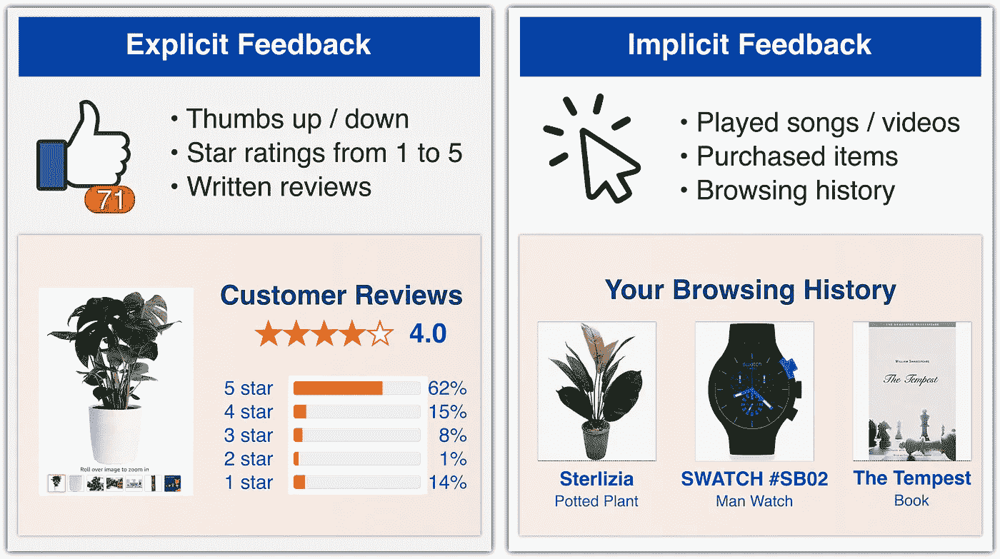
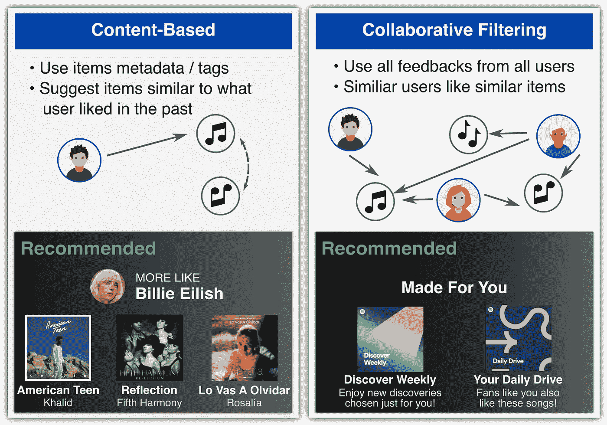

# 推荐系统——机器学习模型完全指南

> 原文：<https://towardsdatascience.com/recommender-systems-a-complete-guide-to-machine-learning-models-96d3f94ea748>

## 利用数据帮助用户发现新内容

Javier Allegue Barros 在 [Unsplash](https://unsplash.com?utm_source=medium&utm_medium=referral) 上拍摄的照片

# 推荐系统:为什么和如何？

[**推荐系统**](https://en.wikipedia.org/wiki/Recommender_system) 是为每个用户最相关的项目提供个性化建议的算法。随着可用在线内容的大规模增长，用户已经被淹没在选择中。因此，为了提高用户满意度和参与度，网络平台向每个用户提供商品推荐是至关重要的。

YouTube 向用户推荐视频，帮助他们在大量可用内容中发现和观看与他们相关的内容。(图片由作者提供)

下面的列表展示了拥有**大量可用内容**的知名网络平台的例子，这些平台需要高效的推荐系统来保持用户的兴趣。

1.  [Youtube](https://www.youtube.com/)。每分钟都有人上传 [500 个小时的视频](https://www.oberlo.com/blog/youtube-statistics)，也就是说，一个用户要花 82 年才能看完上一个小时上传的所有视频。
2.  <https://www.spotify.com/>****。**用户可以收听超过[8000 万首歌曲和播客](https://newsroom.spotify.com/company-info/)。**
3.  **[亚马逊](https://www.amazon.com/) **。**用户可以购买超过[3.5 亿种不同的产品](https://www.retailtouchpoints.com/resources/how-many-products-does-amazon-carry)。**

**所有这些平台都使用强大的机器学习模型，以便为每个用户生成相关的推荐。**

# **显性反馈与隐性反馈**

**在推荐系统中，机器学习模型用于预测用户 *u* 对某个项目*I*t8】的**评分 *rᵤᵢ* 。在推理时，我们向每个用户 *u* 推荐预测评分最高的 *l* 项*rᵤ*t16】t17】ᵢt19】。****

**因此，我们需要收集用户反馈，这样我们就可以有一个训练和评估模型的基础事实。这里必须对**显式反馈**和**隐式反馈**进行重要区分。**

****

**推荐系统中显式和隐式反馈的比较。(图片由作者提供)**

**[**显性反馈**](https://en.wikipedia.org/wiki/Rating_scale#Rating_scales_used_online) 是用户明确给出的一个评分，用以表达对某个项目的满意程度。例如:购买产品后给出的从 1 到 5 的星级数，观看视频后给出的拇指向上/向下等。这种反馈提供了**用户喜欢某件商品的详细信息**，但是**很难收集**，因为大多数用户通常不会为他们购买的每件商品写评论或给出明确的评级。**

**<https://en.wikipedia.org/wiki/Implicit_data_collection>**另一方面，假设用户-项目交互是偏好的指示。例子是:用户的购买/浏览历史、用户播放的歌曲列表等。这种反馈是**极其丰富的**，但同时也是**不太详细的**和**更嘈杂的**(例如，某人可能会购买一件产品作为礼物送给别人)。然而，与这种可用数据的庞大规模相比，这种噪音变得可以忽略不计，并且大多数现代推荐系统倾向于依赖隐式反馈。****

********

****显性反馈和隐性反馈数据集的用户项目评分矩阵。(图片由作者提供)****

****收集到显性或隐性反馈后，我们可以创建**用户项评分矩阵 *rᵤᵢ*** 。对于明确的反馈，在 *rᵤᵢ* 中的每个条目都是一个数值——例如 *rᵤᵢ =* “由 *u* 给电影 *i* ”的星星——或“？”如果用户 *u* 没有对项目 *i* 进行评分。对于隐式反馈， *rᵤᵢ* 中的值是表示存在或不存在交互的布尔值——例如, *rᵤᵢ =* “用户 *u* 看电影了吗。请注意，矩阵 *rᵤᵢ* 非常稀疏，因为用户与所有可用内容中的很少项目交互，他们查看的项目更少！****

# ****基于内容的方法与协作过滤方法****

****推荐系统可以根据用来预测用户偏好的信息类型分为**基于内容的**或**协同过滤。******

********

****推荐系统中基于内容和协作过滤的方法。(作者图片)****

## ****基于内容的方法****

****[**基于内容的方法**](https://en.wikipedia.org/wiki/Recommender_system#Content-based_filtering) 通过 **已知的元数据**来描述**用户和项目。每一项 *i* 都由一组相关的标签表示——例如 [IMDb 平台的电影](https://www.imdb.com/search/keyword/)可以被标记为*“动作”、“喜剧”、“等。每个用户 *u* 都由一个用户配置文件表示，该文件可以根据已知的用户信息(例如，性别和年龄)或用户过去的活动创建。*******

****用这种方法训练机器学习模型，我们可以使用 [**k-NN 模型**](https://en.wikipedia.org/wiki/K-nearest_neighbors_algorithm) **。**例如:如果我们知道用户 *u* 购买了一件 *i* 的商品，我们可以向 *u* 推荐那些与 *i* 最相似的商品。****

****这种方法的**优势**是项目元数据是预先已知的，因此我们也可以将其应用于[冷启动场景](https://en.wikipedia.org/wiki/Cold_start_(recommender_systems))，其中新项目或用户被添加到平台，我们没有用户-项目交互来训练我们的模型。**的缺点**是我们没有使用所有已知的用户-项目交互(每个用户被单独对待)，并且我们需要知道每个项目和用户的元数据信息。****

## ****协同过滤方法****

****[**协同过滤方法**](https://en.wikipedia.org/wiki/Recommender_system#Collaborative_filtering) 不使用项目或用户元数据，而是尝试**利用所有用户的反馈或活动历史**，以便通过从观察到的活动推断用户和项目之间的相互依赖性来预测用户对给定项目的评级。****

****为了用这种方法训练机器学习模型，我们通常会尝试对评级矩阵 *rᵤᵢ* 进行聚类或因式分解，以便对未观察到的对( *u，i* )，即 *rᵤᵢ* = "？进行预测。在本文的下文中，我们将介绍 [**矩阵分解算法**](https://en.wikipedia.org/wiki/Matrix_factorization_(recommender_systems)) ，这是这一类中最常用的方法。****

****这种方法的**优势**在于使用了整套用户-项目交互(即矩阵 *rᵤᵢ* ),这通常允许获得比使用基于内容的模型更高的准确性。这种方法的缺点是在模型拟合之前需要一些用户交互。****

## ****混合方法****

****最后，还有 [**混合方法**](https://en.wikipedia.org/wiki/Recommender_system#Hybrid_recommendations_approaches) 尝试使用已知的元数据和观察到的用户-项目交互集。这种方法**结合了基于内容和协作过滤方法的优点**，并允许获得最佳结果。在本文的后面，我们将介绍 [**LightFM**](https://github.com/lyst/lightfm) ，它是这类方法中最流行的算法。****

# ****协同过滤:矩阵分解****

****[**矩阵分解算法**](https://datajobs.com/data-science-repo/Recommender-Systems-[Netflix].pdf) 可能是推荐系统中最流行、最有效的协同过滤方法。矩阵因式分解是一种[潜在因子模型](https://en.wikipedia.org/wiki/Latent_variable_model)假设对于每个用户 *u* 和项目 *i* 有**个潜在向量表示 *pᵤ、qᵢ*t13】∈**r**ᶠs . t .*rᵤᵢ*可以用 *pᵤ* 和 *qᵢ* 来唯一地表示——即“因式分解”。Python 库 [**惊奇**](https://github.com/NicolasHug/Surprise) 提供了这些方法的优秀实现。******

## **显式反馈的矩阵分解**

**最简单的想法是通过一个**线性模型**对用户-项目交互进行建模。为了了解 *pᵤ* 和 *qᵢ* 的值，我们可以在已知 *rᵤᵢ* 的组 *K* 对( *u* ， *i* )上最小化一个正则化的 [MSE 损失](https://en.wikipedia.org/wiki/Mean_squared_error)。这样得到的算法称为[**【PMF】**](https://proceedings.neurips.cc/paper/2007/hash/d7322ed717dedf1eb4e6e52a37ea7bcd-Abstract.html)。**

****

**概率矩阵分解:rᵤᵢ模型*和损失函数。***

**损失函数可以通过两种不同的方式最小化。第一种方法是使用[**【SGD】**](https://en.wikipedia.org/wiki/Stochastic_gradient_descent)****。SGD 容易实现，但是可能会有一些问题，因为 pᵤ和 qᵢ都是未知的，因此损失函数不是凸的。为了解决这个问题，我们可以选择固定值 *pᵤ* 和 *qᵢ* ，得到一个凸线性回归问题，这个问题很容易用[普通最小二乘法(OLS)](https://en.wikipedia.org/wiki/Ordinary_least_squares) 来解决。这第二种方法被称为[**【ALS】**](https://spark.apache.org/docs/2.2.0/ml-collaborative-filtering.html)，允许显著的并行化和加速。******

**PMF 算法后来被推广为[**【SVD】**](https://sifter.org/simon/journal/20061211.html)算法，在模型中引入了**偏差项**。更具体地说，*和*分别测量用户 *u* 和项目 *i* 的观察评分偏差，而 ***μ*** 是总体平均评分。这些术语通常解释了大多数观察到的评级 *rᵤᵢ* ，因为一些项目普遍获得更好/更差的评级，而一些用户对他们的评级一贯或多或少慷慨。****

********

****SVD 算法，概率矩阵分解的推广。****

## ****隐式反馈的矩阵分解****

****将 **SVD** **方法** **能** **被** [**适应于隐式反馈数据集**](https://ieeexplore.ieee.org/document/4781121) 。这个想法是将隐性反馈视为信心的间接测量。假设隐式反馈 ***tᵤᵢ*** 测量用户 *u* 看过电影 *i* 的百分比——例如 *tᵤᵢ* = 0 表示 *u* 从未看过 *i* ， *tᵤᵢ* = 0.1 表示他只看了其中的 10%， *tᵤᵢ* = 2 表示直觉上，用户更可能对他们看过两次的电影感兴趣，而不是对他们从未看过的电影感兴趣。我们因此定义一个**信心矩阵*cᵤᵢ*t35】和一个**评级矩阵 *rᵤᵢ*** 如下。******

********

****隐式反馈的置信矩阵和评级矩阵。****

****然后，我们可以使用用于奇异值分解的相同线性模型对观察到的 *rᵤᵢ* 进行建模，但损失函数略有不同。首先，我们计算所有( *u* ， *i* )对的损失——与显式情况不同，如果用户 *u* 从未与 *i* 交互，我们就有了 *rᵤᵢ =* 0，而不是 *rᵤᵢ =* ”。第二，我们通过 *cᵤᵢ* 认为 *u* 喜欢 *i.* 来衡量每一项损失****

********

****隐式反馈奇异值分解的损失函数。****

****最后，当我们可以访问显式和隐式反馈时，可以使用[**svd++**](https://dl.acm.org/doi/abs/10.1145/1401890.1401944)**算法。这可能非常有用，因为通常用户会与许多项目进行交互(=隐式反馈)，但只对其中的一小部分进行评级(=显式反馈)。让我们为每个用户 *u* 表示 *N(u)* 已经与 *u* 交互的项目集合。然后，我们假设与项目 *j* 的隐式交互与新的潜在向量*zⱼ*∈**r***ᶠ*相关联。SVD++算法通过将这些潜在因素的加权和包含到用户表示中来修改 SVD 的线性模型 *zⱼ.*******

************

******SVD++用于混合(显式+隐式)反馈******

# ******混合方法:LightFM******

******基于矩阵分解的协同过滤方法通常会产生出色的结果，但在<https://en.wikipedia.org/wiki/Cold_start_(recommender_systems>)**冷启动场景中——其中很少或没有交互数据可用于新项目和用户——它们无法做出良好的预测，因为它们缺乏估计潜在因素的数据。**混合方法**通过利用已知项目或用户元数据来改进矩阵分解模型，从而解决了这个问题。Python 库 [**LightFM**](https://github.com/lyst/lightfm) 实现了最流行的混合算法之一。********

******在 LightFM 中，我们假设为每个用户 *u* 收集了一组标签注释*aᵁ(u】*—例如*“男性”*，*“年龄<30”*，… —类似地，每个商品 *i* 都有一组注释 *Aᴵ(i)* —例如*“价格> 100 美元】【t22 …然后我们通过一个**潜在因子 *xᵁₐ* ∈** **R** ᶠ和一个**偏差项*bᵁₐ*∈**t36】r 对每个用户标签进行建模，并且我们假设用户向量表示 *pᵤ* 及其相关偏差 *bᵤ* 可以简单地表示为这些项 *xᵁₐ* 和*之和 我们对物品标签采取同样的方法，使用潜在因素 *xᴵₐ* ∈ Rᶠ和偏差项 *bᴵₐ* ∈ R。一旦我们使用这些公式定义了 *pᵤ、qᵢ、bᵤ、bᵢ* ，我们就可以使用相同的 SVD 线性模型来描述这些项和 *rᵤᵢ* 之间的关系。******

**********

*****LightFM:用户/项目嵌入和偏差是与每个用户/项目相关的潜在向量的总和。*****

*****注意，LightFM 的这种混合方法有三个有趣的例子。*****

1.  *******冷启动。**如果我们有一个带有已知标签*aᴵ(i*的新项目 *i* ，那么我们可以使用潜在向量 *xᴵₐ* (通过对之前的数据拟合我们的模型获得)来计算它的嵌入 *qᵢ* ，并因此为任何用户 *u* 估计它的评级 *rᵤᵢ* 。*****
2.  *******没有可用的标签。**如果我们没有任何已知的条目或用户的元数据，我们唯一可以使用的注释是一个指示器函数，即每个用户和每个条目有一个不同的注释 *a* 。然后，用户和物品特征矩阵是单位矩阵，LightFM 简化为 SVD 等经典的协同过滤方法。*****
3.  *******基于内容与混合。**如果我们只使用没有指示器注释的用户或项目标签，LightFM 将几乎是一个基于内容的模型。因此，在实践中，为了利用用户-项目交互，我们还向已知标签添加了一个指示器注释*一个不同于每个用户和项目的*。*****

# *****TL；DR–结论*****

*   *******推荐系统**利用机器学习算法来帮助用户在发现相关内容时淹没在选择中。*****
*   *******显性与隐性反馈**:前者更容易利用，但后者更丰富。*****
*   *******基于内容的**模型在冷启动场景中工作良好，但是需要知道用户和项目**元数据**。*****
*   *******协同过滤**模型一般采用矩阵分解: **PMF，SVD，SVD 为隐式反馈，SVD++。*******
*   *******混合模型**充分利用了基于内容和协作过滤的优势。LightFM 是这种方法的一个很好的例子。*****

# *****参考*****

*   *****[维基百科，*推荐系统*](https://en.wikipedia.org/wiki/Recommender_system) *。******
*   *****[《惊喜》、 *Python 包文档*。](https://surprise.readthedocs.io/en/stable/)*****
*   *****网飞更新:在家里试试这个。*****
*   *****[(R. Salakhutdinov 2007)，*概率矩阵分解。*](https://proceedings.neurips.cc/paper/2007/hash/d7322ed717dedf1eb4e6e52a37ea7bcd-Abstract.html)*****
*   *****([y . Hu 2008)*针对隐式反馈数据集的协同过滤*](https://ieeexplore.ieee.org/document/4781121) *。******
*   *****[(y . Koren 2009)*推荐系统的矩阵分解技术*](https://ieeexplore.ieee.org/document/5197422) *。******
*   *****[(Y. Koren 2008) *因式分解遇上邻域:多面协同过滤模型。*](https://dl.acm.org/doi/abs/10.1145/1401890.1401944)*****
*   *****( [M .库拉 2015)，*用户和项目冷启动建议的元数据嵌入*](https://arxiv.org/pdf/1507.08439.pdf) *。******