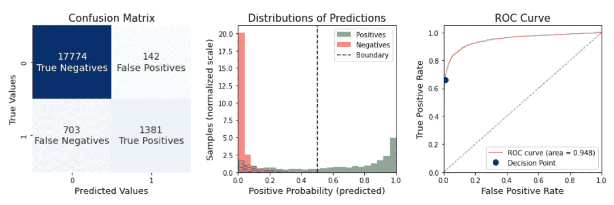
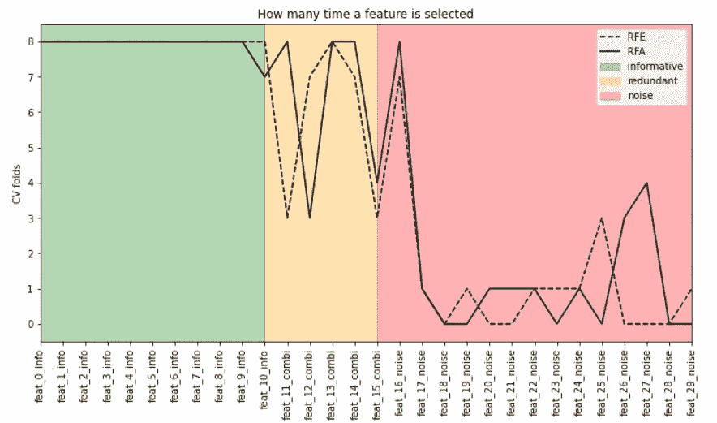

# 递归特征选择:增加还是消除？

> 原文：<https://towardsdatascience.com/recursive-feature-selection-addition-or-elimination-755e5d86a791>

## 一种执行详尽特征选择的聪明方法


在 [Unsplash](https://unsplash.com?utm_source=medium&utm_medium=referral) 上由 [Rodion Kutsaev](https://unsplash.com/@frostroomhead?utm_source=medium&utm_medium=referral) 拍照

当建立一个机器学习模型时，拥有更多的特征比拥有更少的特征更重要。但是只使用你需要的比全部使用更有用。因此，在第一次建模试验之后，我们需要一个半自动的过程，可以只过滤对我们的监督任务有用的特征。

我们只是指特征选择过程。它包括从原始数据集中仅选择变量子集的所有算法，以用作我们预测模型的输入。有各种技术来执行特征选择，并且每种方法都有各种利弊要考虑。

**在生产简单和可维护的管线时，少量特征是有效的；提高泛化能力；降低可能的存储空间或成本；减少推断时间(无论最终预测值是多少)或提供更好的可解释结果。**

同时，仅产生有用的预测特征的子集可能是昂贵的、困难的和不明确的。一个好的特征选择算法应该尝试所有可能的特征组合，并根据我们的验证策略标注哪一个导致性能提高。由于时间的限制，数据科学家不鼓励采用大型数据集的特征选择方法。此外，所选特征取决于所用的模型和参数。因此，简单地改变其中一个可能会以一种不好的方式改变最终结果。对于在我们的机器学习工作流程中在哪里放置特征选择以获得最佳效果，也可能会产生疑问。

为了应对这些挑战，我们发布了[**shap-hype tune**](https://github.com/cerlymarco/shap-hypetune):*一个用于同步超参数调整和特性选择的 python 包。*其目的是在单个流水线中优化最佳数量的特征，同时搜索梯度增强模型的最佳参数配置。它提供了各种参数搜索方法(网格、随机或贝叶斯搜索)和特征选择策略(递归特征消除/添加和 Boruta)以及使用 SHAP 值提高泛化能力的**。**

在这篇文章中，我们关注递归特征选择算法的优点。**递归特征选择能够搜索可靠的特征子集，同时提高性能并保持可接受的计算成本**。因此，它具备成为现实应用中最有效的特征过滤方法之一的所有先决条件。我们旨在探索不太为人所知的加法方法(递归特征添加)，在标准分类问题中将其与最著名的减法方法(递归特征消除)进行比较。

# 递归特征添加

递归要素添加按照递归添加过程选择要素。工作流程如下图所示:

1.  使用所有可用的特征来拟合估计量(在我们的例子中是梯度增强)。
2.  提取要素重要性排名(标准的基于树的重要性或 SHAP 重要性有效)。
3.  根据功能的贡献对其进行排序。
4.  仅使用最相关的特征来拟合估计量，并根据验证数据计算性能。
5.  包括下一个最重要的特征，并适合新的估计器。
6.  在步骤 5 和 6 中计算模型之间的性能差异。
7.  如果性能提高，该特征被认为是有价值的预测器。
8.  重复第 5 步到第 7 步，直到所有特性都被考虑在内。

用 **shap-hypetune** 执行递归特征添加是简单明了的。

```
rfa = **BoostRFA**(
    LGBMClassifier(), 
    step=3, min_features_to_select=1
)
rfa.fit(X_train, y_train, eval_set=[(X_val, y_val)])
```

在上面的例子中，我们简单地使用 RFA 和一个 *LGBMClassifier* 。定制有很多。例如，我们可以使用具有 SHAP 特性重要性的 *BoostRFA* 实例(而不是传统的基于树的实例),或者在搜索最佳参数配置时使用。

对于我们的分类任务，我们使用 *BoostRFA* ，连同 *LGBMClassifier* ，计算一个贝叶斯参数搜索。结果报告如下。


折叠外样本的交叉验证结果(图片由作者提供)

# 递归特征消除

递归要素消除按照递归消除过程选择要素。工作流程如下图所示:

1.  使用所有可用的特征来拟合估计量(在我们的例子中是梯度增强)。
2.  提取要素重要性排名(标准的基于树的重要性或 SHAP 重要性有效)。
3.  根据功能的贡献对其进行排序。
4.  排除最不重要的特征并拟合新的估计量。
5.  在连续迭代中，计算步骤 4 中模型之间的性能差异。
6.  如果性能提高，该特征被释放。
7.  重复第 4 步到第 7 步，直到所有特性都被考虑在内。

至于 RFA 的情况，用 **shap-hypetune** 执行递归特征添加是简单明了的。

```
rfe = **BoostRFE**(
    LGBMClassifier(), 
    step=3, min_features_to_select=1
)
rfe.fit(X_train, y_train, eval_set=[(X_val, y_val)])
```

在上面的例子中，我们简单地使用了带有 *LGBMClassifier* 的 RFE。定制有很多。例如，我们可以使用具有 SHAP 特性重要性的 *BoostRFE* 实例(而不是传统的基于树的实例),或者在搜索最佳参数配置时使用。

对于我们的分类任务，我们使用 *BoostRFE* ，连同 *LGBMClassifier* ，计算贝叶斯参数搜索。结果报告如下。



折叠外样本的交叉验证结果(图片由作者提供)

# 结论

RFA 和 RFE 在我们的模拟分类任务中都显示出惊人的结果。它们还表现出良好的过滤能力。从交叉验证的结果来看，选择最多的是信息特征，其次是线性组合特征(冗余)和噪声特征。



使用交叉验证比较 RFA 和 RFE 的选择能力(图片由作者提供)

总之，我们证明了递归算法对于特征选择的优越性。我们介绍了不太为人所知的递归特征添加，并将其与最流行的递归特征消除方法进行了比较。两种方法都显示出令人满意的结果。然而，完美的选择方法并不存在。我们必须根据我们的任务找到并优化正确的过滤策略。

**如果你对题目感兴趣，我建议:**

*   [**SHAP 用于特征选择和超参数调谐**](/shap-for-feature-selection-and-hyperparameter-tuning-a330ec0ea104)
*   [**博鲁塔和 SHAP 进行更好的特征选择**](/boruta-and-shap-for-better-feature-selection-20ea97595f4a)
*   [**博鲁塔 SHAP 进行时态特征选择**](/boruta-shap-for-temporal-feature-selection-96a7840c7713)
*   [**漂移检测 SHAP:有效数据漂移监控**](/shap-for-drift-detection-effective-data-shift-monitoring-c7fb9590adb0)

[**查看我的 GITHUB 回购**](https://github.com/cerlymarco/MEDIUM_NoteBook)

保持联系: [Linkedin](https://www.linkedin.com/in/marco-cerliani-b0bba714b/)