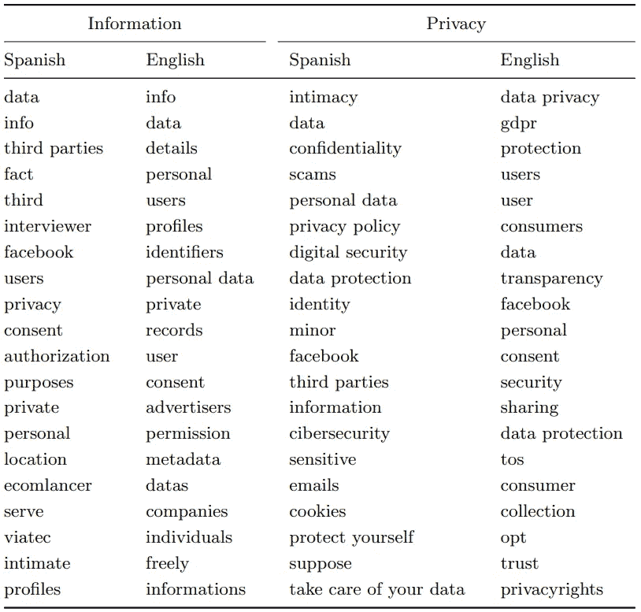

# 脸书-剑桥分析数据丑闻后的隐私问题

> 原文：<https://towardsdatascience.com/regional-differences-in-information-privacy-concerns-after-the-facebook-cambridge-analytica-data-15c6c29a623a>

## 一项关于重大隐私丑闻的跨地区跨语言 Twitter 研究

[Firmbee.com](https://unsplash.com/@firmbee?utm_source=medium&utm_medium=referral)在 [Unsplash](https://unsplash.com?utm_source=medium&utm_medium=referral) 上拍照

# 介绍

2018 年，剑桥分析公司被指控在未经授权的情况下收集和使用超过 8700 万脸书用户的个人信息。与此相关的观点、事实和故事在社交媒体上分享，包括 Twitter，其中#DeleteFacebook 标签成为了几天的热门话题。

虽然全球对数据隐私越来越关注，但大多数隐私研究仅在北美和欧洲的少数几个国家进行。**在本文中，** **我们描述了一种通过分析与这起重大数据隐私丑闻相关的社交媒体内容来研究更大地理范围内的数据隐私的方法。我们还报告了我们方法的局限性、发现和未来的工作方向**。

您可以在我们的论文中找到更多关于我们的方法和发现的详细信息:

费利佩·冈萨雷斯·皮萨罗、安德里亚·菲格罗亚、克劳迪娅·洛佩兹和塞西莉亚·阿拉贡。 [**脸书-剑桥分析公司数据丑闻**](https://arxiv.org/abs/2202.07075) 后信息隐私担忧的地区差异。发表于*计算机支持的协同工作(CSCW)* 31 **，**33–77(2022)

我们的论文分析了 100 多万条与脸书-剑桥分析公司丑闻相关的公开推文。数据集按语言(西班牙语和英语)和地区(拉丁美洲、欧洲、北美和亚洲)划分。使用单词嵌入和人工内容分析，我们研究和比较了使用隐私相关术语的语义上下文。然后，我们将我们的结果与最常用的信息隐私关注框架(IUIPC)进行了对比。在我们的结果中，我们观察到了隐私问题的语言和地区差异，这暗示了对当前信息隐私框架扩展的需要。

# **我们的方法**

我们实施了一个四步方法来确定不同语言和世界地区的信息隐私问题的差异(见图 1)。 **(1)数据收集:**检索特定时期内与数据隐私相关的推文。 **(2)数据预处理:**过滤数据，去除转发，排除可能由僵尸工具生成的推文。 **(3)文本挖掘:**根据语言和世界区域为剩余的推文创建单词嵌入(语料库的多维表示)。 **(4)编码&分析:**分析单词嵌入中隐私关键词语义语境的异同。

图 1:四步法|作者图片

# **数据采集**

我们使用 [Tweepy](http://www.tweepy.org/) 收集了 2018 年 4 月至 7 月期间与脸书-剑桥分析公司丑闻相关的西班牙语/英语。 **Tweepy 是一个 Python 库，用于访问标准的** [**实时流媒体 Twitter API**](https://developer.twitter.com/en/docs/tweets/filter-realtime/guides/basic-stream-parameters.html) **，可以检索与给定查询**匹配的推文(例如“#DeleteFacebook”、“#Cambridge Analytica”)。我们用来检查数据集的术语/查询的完整列表可以在网上[找到](https://github.com/gonzalezf/Regional-Differences-on-Information-Privacy-Concerns)。根据 Twitter API 的条款和条件，我们收集推文是被允许的。

# **数据预处理**

由于目标是分析人们对信息隐私的看法，我们决定用三种方式预处理我们的数据。首先，转发被删除，以避免分析完全重复。之后，我们试图识别和过滤由机器人生成的推文。我们的最后一步是将推文与其对应的世界区域链接起来。前面的步骤将在下面进一步解释。

**僵尸检测**

我们使用 [Botometer](https://botometer.osome.iu.edu/) [1]来检测和删除由机器人创建的推文。Botometer 使用机器学习来分析一千多个特征，包括推文的内容和情感，账户和朋友的元数据，转发/提及网络结构和发布行为，以生成一个从 0 到 1 的分数。较高的值表示被检查的帐户是 bot 的可能性较高。该工具在预测简单和复杂的机器人方面都达到了很高的准确率(94%)。

**识别 Twitter 用户的居住国**

我们使用 [GeoNames API](http://www.geonames.org/) 在我们的数据集中识别 Twitter 用户居住的国家。在 Twitter 上，用户可以自我报告他们的城市或优先国家。然而，对地理位置的文本参考可能是模糊的。例如，全世界有 60 多个地方被命名为*【巴黎】*【2】。为了应对这一挑战，我们采用了 GeoNames API，这是一个地名词典合作项目，包含超过 1100 万个条目和世界各地各种语言的备用名称。该工具产生的结果准确率超过 80%[2]。

我们发现 81%的西班牙语用户和 79%的英语用户在他们的个人资料中填写了城市或国家字段。然而，GeoNames API 在一些情况下无法检测用户的位置，例如，当提供不准确的信息时(例如*“行星地球”)..其他人都是从哪里来的*、*、【火星】*)。尽管如此，该工具还是能够识别出创建了 59%西班牙语推文和 60%英语推文的用户的位置。

创建了五个语言区域数据集来比较地理区域的信息隐私问题。西班牙的推特数据集分为两组:来自拉丁美洲和欧洲的用户写的推特。类似地，英语数据集被分为三组:来自(1)北美、(2)欧洲和(3)亚洲的用户写的推文。

# 文本挖掘:识别语义上下文的单词嵌入

单词嵌入是一种单词表示类型，其将术语的含义编码在向量中，使得相关单词在向量空间中更接近。**分析与给定术语最接近的术语可以揭示其使用的语义上下文**【3，4】。

为了实现跨语言和跨地区的比较，创建了一组单词嵌入。首先，我们为西班牙语和英语数据集(包含地理定位和非地理定位的 tweets)构建了单词嵌入。然后，我们为五个语言区域数据集中的每一个生成单词嵌入。

在创建单词嵌入时，我们考虑了不同的单词嵌入架构组合，包括 Word2vec/FastText、CBOW/Skipgram 以及不同数量的维度和时期。由于对于哪种单词嵌入评估更合适还没有达成共识，因此使用[单词嵌入基准库](https://github.com/kudkudak/word-embeddings-benchmarks)通过 18 种内在意识评估方法对每个单词嵌入架构进行了评估。

# **手动编码&分析**

我们系统地研究了语义环境中的信息隐私条款出现根据词嵌入。我们的调查集中在英语中的四个关键词:*信息*、*隐私*、*用户、*和*公司*以及它们在西班牙语中相应的翻译:*信息*、*隐私*、*常用、*和*企业*。对于每个嵌入，我们检索与四个关键字最接近的术语。使用余弦相似度来测量每个术语和关键词之间的接近度。例如，在英文单词 embedding 中，与关键字*信息*最接近的术语依次是*信息*、*数据*、*细节*和*个人*(见图 2)。

图 2:西班牙语和英语单词嵌入中最接近“信息”和“隐私”的前 20 个术语。作者将西班牙语术语翻译成了英语。全部结果可在[在线](https://github.com/gonzalezf/Regional-Differences-on-Information-Privacy-Concerns) |图片由作者提供

通过收集和分析这些隐私相关关键词的语义上下文，我们可以观察到收集到的推文中是否存在与信息隐私相关的术语。我们系统地对这些术语进行了**开放编码**。经过几次迭代，我们开发了一组类别来描述它们。最后，为了评估是否存在信息隐私问题，我们将这些类别与广泛接受的描述互联网用户信息隐私问题的框架(IUIPC)进行了对比。我们发现了一些类别、三个 IUIPC 维度和初始关键词之间的关系(见图 3)。

图 3:我们确定了几个类别，可以很容易地映射到互联网用户信息隐私问题(IUIPC)的三个维度:收集、意识和控制。通过这种方式，我们发现社交媒体内容可以揭示隐私问题的信息|作者图片

然后，我们评估了不同语言和世界地区在信息隐私问题上的差异。为此，我们使用卡方检验来评估语义上下文中的术语比例是否在单词嵌入中有显著差异。在所有这些测试中，我们根据 idák 应用 alpha 调整来说明多重比较。这种方法允许我们在执行多重假设测试时控制错误发现的概率。

# 我们的结果—关键见解

# 当前信息隐私问题的概念化可能需要扩展

IUIPC 是一个基于理论的模型，广泛用于研究互联网上的信息隐私问题。它包括三个构造: ***采集*** ，是指数据采集； ***控制*** 其中涉及到对数据治理的担忧； ***意识*** 指对组织信息隐私实践的认可。

我们的结果建议对 ***觉知*** IUIPC 概念进行更精细的分类。例如，它可以包括用户可以知道的更具体的子主题，例如 ***隐私和安全术语*** (例如，网络安全、保密性) ***安全机制*** (例如，凭证、加密)，以及 ***隐私和安全风险*** (例如，诈骗、疏导)。符合这些类别的术语的出现表明，它们已经是围绕隐私的公共在线对话的一部分。广义的隐私和安全术语、保护数据的机制以及潜在的数据风险之间的区别可能有助于进一步描述人们所拥有的知识种类。此外，对其中一些副主题的了解可能比其他的更有影响力。例如，了解风险和机制可能是更深层次隐私问题的标志，而了解广泛的隐私和安全术语可能不是。子主题之间的区别也可以指导用户、教育者和从业者努力提高隐私素养。

# 法规不仅仅是数据和法律专家的话题

***法规*** 类别的存在凸显了其在信息隐私问题方面的重要性。法规是指旨在控制个人数据使用的法律或规则。这一类别从我们的*开放编码*中出现，通过它在关于数据泄露丑闻的公开帖子中的频繁出现，证实了它的相关性。这些法规不仅是数据和法律专家的话题，也似乎是围绕在线数据隐私的公共话语的一部分。

# 在强调信息隐私方面的语言和地区差异

## 说英语的人比说西班牙语的人更强调数据收集。

我们的分析显示，在网上自由表达隐私关键词时，说英语的人比说西班牙语的人更重视数据收集。这种差异可以引导研究人员和从业人员探索更适合特定人群的数据隐私活动的有效性。例如，关注收集的人群可能需要更多关于共享他们的信息的好处的信息。

## 北美的隐私问题不能推广到其他地区。

我们还观察到在*认知上的显著地区差异。特别是，来自北美的数据显示对*认知度的重视程度最低，而拉丁美洲的认知度最高。这一发现尤其重要，因为大多数关于信息隐私问题的研究都集中在美国。它警告我们不要(有时是含蓄的)认为北美的隐私问题可以推广到其他地区。研究结果提供了观察证据，证明有必要纳入更多不同的人群，以更好地理解围绕数据隐私的现象。这一发现也促使从业者使用不同的服务和隐私政策方法来解决其他地区的问题，例如拉丁美洲。例如，更关注公众意识的人群可能更容易接受那些在个人数据使用方面采取更透明沟通方式的公司。**

# *我们方法的局限性*

*和任何研究一样，我们的研究也有局限性。我们使用特定的标签和关键词，通过免费的标准流媒体 Twitter API 收集数据。因此，我们只能获得有限的关于丑闻的推特样本。我们使用 Botometer 来检测和删除可能由机器人创建的推文。这个工具只能分析 Twitter 公众账号；因此，在运行我们的分析时，它不能用于暂停的帐户或那些其推文受到保护的帐户。我们决定从我们的数据集中删除这些账户的推文，因为我们不能自信地声称是人类生成的。事实上，以前的研究表明，社交机器人很可能出现在这个群体中。此外，我们将调查重点放在四个英文关键词上:*信息*、*隐私*、*用户*和*公司*以及它们相应的西班牙语翻译。虽然使用同义词会带来相似的语义上下文，但添加更多的概念可以加强结果。未来的工作可以探索其他关键词如*亲密度*和*消费者*。*

# *字里行间*

*我们的论文使用另一种方法来研究大地理范围内的信息隐私问题。这种方法旨在从大规模社交媒体数据集中发现关于某个主题的知识，对于该主题，不存在地面事实。不幸的是，这样的基本事实不太可能存在，因为大规模、多国家、多语言的调查成本太高[5]。*

*我们仔细分析了语义上下文的一千多个术语，进行了开放编码以形成基于数据的分类，并将我们的分类与 IUIPC [6]进行了对比，IUIPC 是一种广为接受的信息隐私问题的理论概念化。*

*我们的论文讨论了我们的发现如何扩展当前信息隐私问题的概念化。最后，我们考察了在我们分析的地区，它们与个人数据使用法规的关系。*

*未来的工作可以更深入地挖掘观察到的差异，并研究潜在的原因。未来的研究可能会基于我们的工作，考虑更多的语言、地理位置或不同的信息隐私框架来检查隐私问题。使用我们的方法来比较更长时期的数据集，可以帮助确定隐私关键字的语义上下文是否随时间而变化。*

*有兴趣可以在 [**Twitter**](https://twitter.com/fpeandrees) 上找我或者访问我的 [**网站**](https://gonzalezf.github.io/) :)。*

# *感谢*

*感谢 [Claudia López](https://scholar.google.com/citations?user=vw1dhvcAAAAJ) 、 [Ignacio Tampe](https://www.tampe.cl/) 和 [Adam Geller](https://www.cs.ubc.ca/~atgeller/) 对本文提出的改进建议。*

# ***参考文献***

*[1]戴维斯，C. A .，瓦罗尔，o .，费拉拉，e .，弗拉米尼，a .，&门策尔，F. (2016，4 月)。 [Botornot:一个评估社交机器人的系统。](https://dl.acm.org/doi/abs/10.1145/2872518.2889302)见*第 25 届国际万维网会议论文集*(第 273–274 页)。*

*[2]a . Jackoway，h . Samet 和 j . Sankaranarayanan(2011 年 11 月)。使用 Twitter 识别现场新闻事件。在第三届 ACM SIGSPATIAL 基于位置的社交网络国际研讨会会议录(第 25-32 页)。*

*[3]f .冈萨雷斯、a .菲格罗亚、c .洛佩斯和 c .阿拉贡(2019 年 11 月)。推特上的信息隐私观点:一项跨语言研究。2019 年关于计算机支持的协同工作和社会计算的*会议配套出版物*(第 190-194 页)。*

*[4] Rho，E. H. R .，Mark，g .，& Mazmanian，M. (2018 年)。F [在线主持民间话语:跨政治视角的# metoo 文章评论中的语言行为](https://dl.acm.org/doi/10.1145/3274416)。*美国计算机学会人机交互会议录*， *2* (CSCW)，1–28 页。*

*[5]李、姚；尤金妮亚·哈 Rim Rho 以及阿尔弗雷德·科布萨(2020)。[文化差异对社交网站用户隐私决策的影响](https://doi.org/10.1080/0144929X.2020.1831608)。行为&信息技术，1–23。*

*[6]纳尔什·k·马尔霍特拉；金成；和詹姆斯·阿加瓦尔(2004)。[互联网用户的信息隐私担忧(IUIPC):结构、规模和因果模型](https://doi.org/10.1287/isre.1040.0032)。信息系统研究，第 15 卷，第 4 期，第 336-355 页。*