# 回归树，循序渐进

> 原文：<https://towardsdatascience.com/regression-trees-step-by-step-4de996e27f85>

## 学习如何构建回归树，了解它们的主要优点和缺点


*【免责声明:此帖子包含一些我的 Udemy 课程的附属链接】*

决策树已经存在了几十年，在世界各地的几个机器学习项目中都有使用。虽然它们很可能不会在大多数问题上达到最先进的性能，但它们仍然是最值得测试的可解释算法之一。此外，它们是极端梯度提升、随机森林或贝叶斯回归树等著名算法的支柱，了解它们是数据科学家和机器学习工程师的必备知识。

与普通的线性或逻辑回归(不对特征应用二次变换)相反，决策树能够非线性地分割我们的数据，在我们的特征和目标之间建立有趣的关系，这对于其他更简单的算法来说似乎是不可能的。

当然，这不是没有代价的。由于它们的非线性本质，决策树通常是高方差模型，可以很好地适应大多数训练数据集，但在测试数据上表现很差。

在这篇文章中，我们将探索回归树，两种最常见的决策树之一(另一种是[分类](/classification-decision-trees-easily-explained-f1064dde175e))。我们将在一个玩具数据集上做几个实验，并走过以下路径:

*   首先，我们将绘制数据集，了解房屋大小和价格之间的关系。
*   然后，我们将了解线性回归在我们的数据集中表现不佳的原因。
*   我们将拟合一个回归树，并可视化它对数据的(几乎)完美拟合。
*   我们将详细介绍回归树以及它们的超参数如何影响训练。

在整篇文章中，我将使用 R 编程语言来支持每一个解释，展示一些代码来解释我们将探索的每个细节——让我们开始吧！

# 设置和检查数据集

在这篇文章中，我们将使用一个房价玩具数据集。点击这个[链接](https://fastupload.io/en/3EB6gdFj9CFBuPy/file)可以找到 excel 源文件。将这个数据集加载到 R 中非常容易:

```
library(readxl)
library(ggplot2)
library(dplyr)
library(rpart)
library(rpart.plot)house_prices <- read_excel('./data/house_prices.xlsx')
```

在上面的代码片段中，我还添加了我们在帖子后面需要的库:

*   `readxl`加载我们的 excel 文件。
*   `ggplot2`为我们的地块。
*   `dplyr`执行一些数据转换。
*   `rpart`构建我们的决策树。
*   `rpart.plot`绘制我们的决策树。

我们的数据包含来自一个虚构地方的 57 个房屋实例，我们有两个相关变量—房屋的价格及其面积(平方英尺):

```
house_price_plot <- ggplot(
  data = house_prices,
  aes(x = area, y = price)
) + geom_point()house_price_plot
```

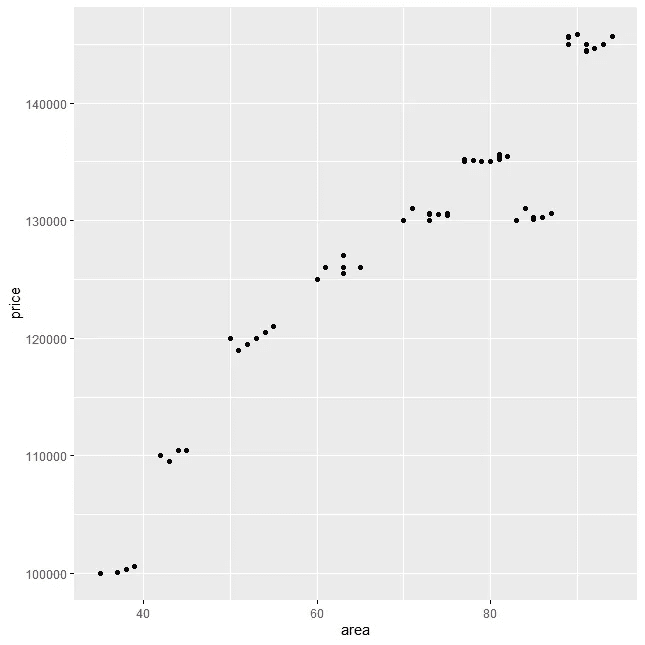

房价数据集-按作者分类的图像

自然，房子的价格和面积是线性关系。这是意料之中的，因为我们知道(同一位置的)大房子往往会更贵。

但请注意一些奇怪的事情，81 到 87 平方英尺的房子比 77 到 81 平方英尺的房子便宜——这将打破我们的线性回归。至少对于这些点来说，我们的回归线将无法捕捉到这种关系，尽管该模型将具有质量，但它将无法理解这一小簇房屋打破了整体趋势。

当我们发现这种类型的问题时，我们通常会试图寻找一些我们没有测量的影响来源——例如，房子里浴室的数量可以解释这种下降。在这篇文章中，让我们假设我们无法访问更多关于房子的数据。

**所以……我们的假设是在这个图上拟合一条回归线肯定会建立一些次优的东西**(同样，忽略我们能够做任何特征变换，因为二次特征可能有帮助)**——接下来让我们证明这一点。**

# 拟合线性回归

如果我们用 R 对数据拟合一条回归线:

```
linear.model <- lm(price ~ area, data=house_prices)
```

虽然我们实现了大约 0.8998 的 R 平方，**但我们的模型仍然存在一些偏差来源。我们是怎么知道的？让我们将我们的预测与真实目标进行对比。**

```
simulation_prices <- data.frame(
  area = seq(min(house_prices$area), 
            max(house_prices$area))
)# Predicting house price based on our linear.model
simulation_prices$predicted_house_price <- predict(
  linear.model,
  simulation_prices
)# Plotting Houses Prices + Predictions
(
  house_price_plot
  +
  geom_line(data=simulation_prices, aes(x=area, y=predicted_house_price), color='red')
)
```

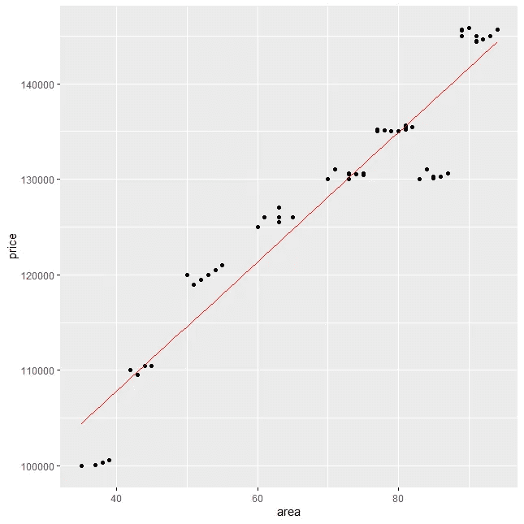

房价数据集与回归线-作者图片

红色的是我们预测的回归线。虽然我们的模型很好地捕捉了数据的趋势，但它超越了两组房屋:

*   面积不超过 40 平方米的房屋。脚。
*   面积在 81 至 87 平方米之间的房屋。脚:

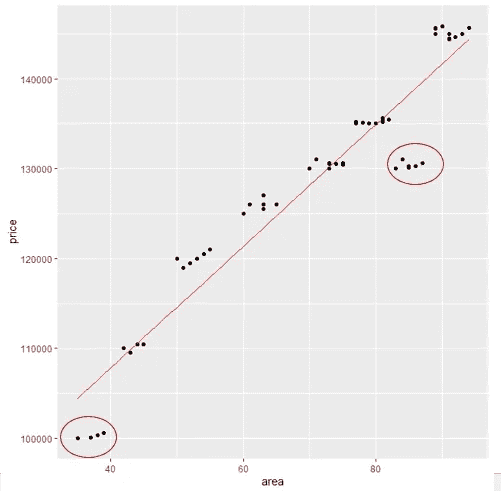

房价数据集与回归线-作者图片

正如我们已经讨论过的，有几种方法可以解决这种偏见，即:

*   1)构建二次特征以更好地捕捉关系-这些特征将能够将我们的回归线“弯曲”成曲线模型。
*   2)使用能够解释这些房屋为何打破整体趋势的其他特征。
*   3)使用其他类型的模型，更好地捕捉这些类型的复杂关系。

**我们要走第三条路线！**

回归树是基本的非线性模型之一，能够捕捉特征和目标之间的复杂关系-让我们从拟合一个开始，看看它的性能，然后讨论它们为什么有用以及如何从头构建一个。

# 拟合回归树

决策树是一种算法，能够捕捉我们看到的面积和房价之间关系的下降。有了 1 个特征，决策树(当我们预测连续变量时称为回归树)将构建类似于*阶跃函数*的东西，如下所示。我将从拟合决策树开始，只是为了让您对我们产生的输出感到好奇。

```
d.tree <- rpart(price ~ area,
             data = house_prices, method = 'anova',
             control = list(maxdepth=5,
                            minsplit=2, minbucket=2,
                            cp = 0.0001))
```

暂时忽略`rpart`的那些参数——我将在接下来详述它们。在上面的函数中，我们使用递归分区库`rpart`将决策树拟合到我们的数据中——让我们看看拟合生成的“线”:

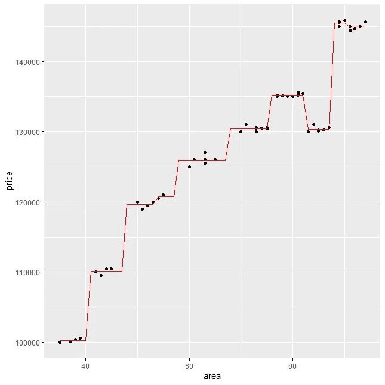

房价数据集与决策树线-作者图片

**看看这和我们的回归线有多不同？**我们如何能够更好地发现数据中的奇怪模式？

两个问题展开了:

*   为什么决策树更善于捕捉这些类型的关系？
*   它们只有在能够捕捉目标和特征之间的复杂交互时才有优势，还是有缺点？

让我们看看！

# 回归树是如何工作的？—第一次拆分

回归树基本上按照一定的标准分割数据，直到它们根据它们的超参数集找到同质组。

我知道这听起来令人困惑，但是让我们详细说明一下——你会发现这实际上是一个非常简单的概念。

回归树的核心是只能预测每次分割后的平均值。想象一下，我会让你把我们的数据分成两部分——比如关于`area=68`的数据:

```
house_price_plot + geom_vline(xintercept=68, color = "red")
```


房价数据集与随机分割-作者图片

假设我们最好的猜测是用我们线两边的平均值对每栋新房子进行分类。**每一栋面积小于 68 平方米的新房子。ft，我们说它的价格是 115.844 €:**

```
mean_value = house_prices %>%
  filter(area < 68) %>%
  summarize(mean_price = mean(price))(
  house_price_plot 
  + 
  geom_vline(xintercept=68, color = "red")
  + 
  geom_segment(aes(x=30, xend=68, y=mean_value[[1]], yend=mean_value[[1]], color='orange'))
  +
  theme(legend.position="none")
)
```

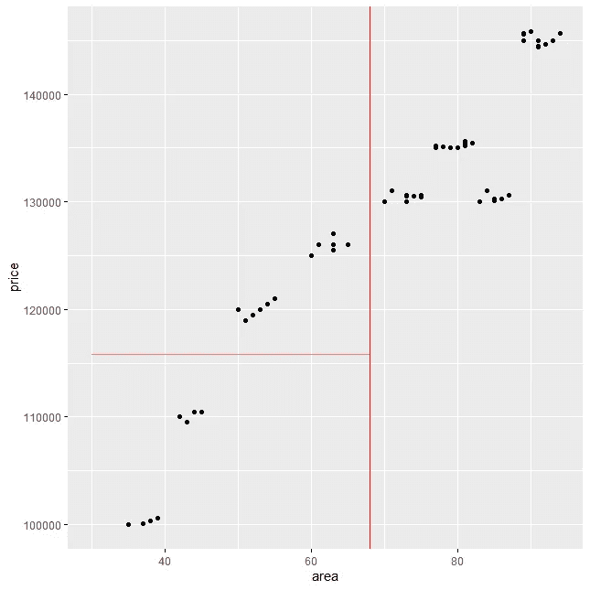

房价数据集与平均预测值-作者图片

如果这是我们的猜测，我们清楚地看到，由于低于 68 平方英尺的房屋价格的可变性，我们最终犯了很多错误。制成范围从 100k 到 125k€。

我们如何量化我们的简单模型所犯的错误？我们只是计算每个点与我们的“最佳猜测”的差异。以第一栋房子为例:


房价数据集与第一套房子的平均预测误差-图片由作者提供

**黑线表示我们的错误**——我们高估了这栋房子 16k€的价格。如果你是房子的买家，你会非常生气，因为你会支付高于房子公允价值的价格。

但是..还有其他一些情况，你(作为买家)会非常高兴，因为我们也低于一些价格，比如这栋房子:


房价数据集与 17 号房屋的平均预测误差-图片由作者提供

不错的交易！

好吧，很明显我们的模型还不够好——但它正在某个地方开始。在右边，对于大于或等于 68 平方英尺的房屋，如果我们用右边的平均值分类，也会发生同样的问题:

```
mean_value_right_split = house_prices %>%
  filter(area >= 68) %>%
  summarize(mean_price = mean(price))(
  house_price_plot 
  + 
    geom_vline(xintercept=68, color = "red")
  + 
    geom_segment(aes(x=68, xend=100, y=mean_value_right_split[[1]], yend=mean_value_right_split[[1]], color='orange'))
  +
    theme(legend.position="none")
)
```

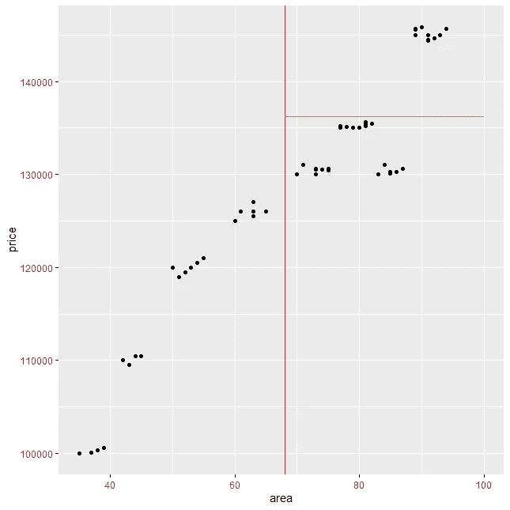

超过 68 平方英尺的房屋的房价数据集与平均预测。—作者图片

你知道什么最酷吗？这实际上可以转化为一个真实的决策树！

如果我用根-分支格式来显示我们的分离，而不是用二维图来显示呢？(为了模仿 R 绘制决策树的方式，我将绘制一个颠倒的决策树)


第一次拆分的树形格式，区域< 68 — Image by Author

This is our decision tree with a **单次拆分**！

**虽然单个分裂树总是无法构建一个好的模型**(除非你在目标和特征之间有一个完美的阶梯形状关系，这在现实世界的数据集上是不寻常的)，我们肯定需要在我们的数据集上进行更多的分裂。

即便如此，我们也要从某个地方开始！**我们应该如何选择第一个分割来开始我们的树？**

让我们回到房子 1 的例子，在这里我们看到了房子的预测价格和实际价值之间的差异:


房价数据集与第一套房子的平均预测误差-图片由作者提供

**每个点将产生一条黑线**——这条线代表该特定示例的*误差(又名残差)*。

**如果我们将模型生成的所有“黑线”相加，我们将得到一个误差指标**——从视觉上看，我们希望我们的黑线尽可能小。如果发生这种情况，您的点接近预测值(水平红线)。

让我们在`house_prices`数据框架中计算每个具体示例的误差，假设我们使用上面的分割:

```
house_prices['predicted_price'] <- ifelse(
  house_prices['area'] < 68,
  115844,
  136215
)# Calculate Error
house_prices['error'] <- (
  house_prices['price']-house_prices['predicted_price']
)
```

看看我们的`house_prices`数据框架:


房价与误差栏-作者图片

`error`列表示我们的预测`predicted_price`和房子的`price`之间的差异。由于有些误差是负的，有些是正的，我们需要将误差转换成可比较的东西。一些常见的策略包括获得误差的绝对值或平方值——为了便于解释，我们将使用绝对值:

```
house_prices['error'] <- (
  abs(house_prices['error'])
)
```

这样，我们就可以产生一个理想的度量标准来理解我们模型的质量，即平均误差:

```
mean(house_prices['error'][[1]])
```

**目前，我们还差 6428 €** 左右的房价。我们可以把这个值和分割`area < 68 or area >= 68`联系起来。

**如果我们可以将误差指标与分割相关联，我们现在能做什么？我们可以找到使这个平均误差最小的分裂！**

这正是决策树在选择第一次拆分时的机制——接下来让我们看看如何优化我们的第一次拆分。

# 回归树是如何工作的？—优化第一次分割

让我们想象一下，我们遍历了`area`变量上的每一个可能的分裂，并具体检查了那个分裂的平均误差。请记住，对于每个不同的分割值，我们预测的是我们构建的红线每一侧的`price`的平均值，例如，50 上的分割看起来像这样:

```
obtain_split_plot <- function(base_plot, split_value) {

  mean_value_right_split = house_prices %>%
    filter(area >= split_value) %>%
    summarize(mean_price = mean(price))

  mean_value_left_split = house_prices %>%
    filter(area < split_value) %>%
    summarize(mean_price = mean(price))

  print(mean_value_left_split)
  print(mean_value_right_split)

  (
    base_plot 
    + 
      geom_vline(xintercept=split_value, color = "red")
    + 
      geom_segment(aes(x=30, xend=split_value, y=mean_value_left_split[[1]], yend=mean_value_left_split[[1]]), linetype ='dashed')
    + 
      geom_segment(aes(x=split_value, xend=90, y=mean_value_right_split[[1]], yend=mean_value_right_split[[1]]), linetype ='dashed')    +
      theme(legend.position="none")
  )

}obtain_split_plot(house_price_plot, 50)
```


虚线表示左右两侧的预测。如果我们将其转换为树形格式:

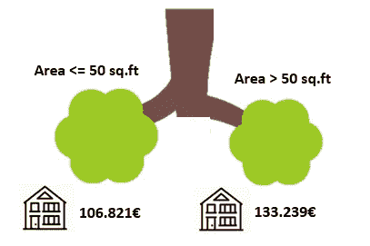

任何不同的分割都会产生不同的误差值。一个想法是绘制每个可能分割的平均误差——让我们使用 R 函数:

```
produce_error_split <- function(house_data) {

  min_area <- min(house_data$area)+1
  max_area <- max(house_data$area)-1

  vector_areas <- seq(min_area, max_area)

  error_summary <- data.frame(
    split = vector_areas
  )

  error_values <- c()

  for (split_value in vector_areas) {

    mean_value_right_split = house_data %>%
      filter(area >= split_value) %>%
      summarize(mean_price = mean(price))

    mean_value_left_split = house_data %>%
      filter(area < split_value) %>%
      summarize(mean_price = mean(price))

    predicted_price <- ifelse(
      house_data$area < split_value,
      mean_value_left_split[[1]],
      mean_value_right_split[[1]]
    )error <- abs(
      house_data['price']-predicted_price
    )

    error_values <- c(error_values, mean(error[[1]]))
  }

  error_summary$mean_absolute_error <- error_values

  return (error_summary)
}error_summary <- produce_error_split(house_prices)
```

上面的函数为我们的`area`的每次分割产生**平均绝对误差。这将产生类似于“成本函数”的东西:**

```
ggplot(
  data = error_summary,
  aes(x = split, y = mean_absolute_error)
) + geom_line()
```

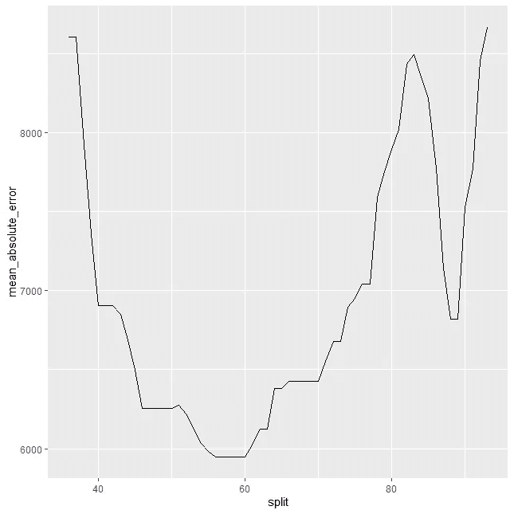

每次分割的平均绝对误差—按作者分类的图像

那有多酷？由于我们与目标具有“几乎”线性关系，因此成本函数将近似于由线性回归产生的函数。根据上面的图，产生最小误差的分割是什么？

55 到 59 之间的区域！如果我们以二维和树形格式查看其中一个拆分:


最佳首次分割-2D 格式-作者图片


最佳第一分割树格式—作者图片

我们已经解决了我们的第一次分裂，因为这是一个最小化我们的错误。

但是，谁说我们需要在一次拆分中停止呢？

*技术说明:虽然我将误差显示为最小化问题(最小化绝对误差)，但 rpart 通过每次分割使增益最大化，这与我上面显示的图相反。不会改变我们所看到的一切背后的推理，但你知道这一点以避免混淆是很酷的。*

# 回归树是如何工作的？—进一步分裂我们的树

现在我们已经有了第一次分裂，如果我们开始进一步分裂我们的每一方呢？例如，让我放大我们的数据集—仅子集化大于或等于 57 平方英尺的区域。英尺:

```
right_split <- house_prices %>% filter(area >= 57)# Right Splithouse_price_plot_right_split <- ggplot(
  data = right_split,
  aes(x = area, y = price)
) + geom_point()
```


超过 57 平方米的房子。制成—作者图片

我们现在正致力于我们拆分的右侧:


决策树，第一次拆分-作者图片

如果我们对这个数据子集进行同样的推理，试图找到最佳分割，使我们的平均值和每个点之间的误差最小化，会怎么样？

```
error_summary_right_split <- produce_error_split(right_split)
```


树的右分支每次分割的平均绝对误差-作者图片

对于树的这个分支，当我们再次在 88 和 89 sq 之间分割数据时，我们的误差最小。制成在二维格式中:


新的分类，树的右侧分割-按作者分类的图片

**但是，不要忘记这个拆分已经依赖于一个过去的拆分了！**用树形格式，这就容易理解多了:

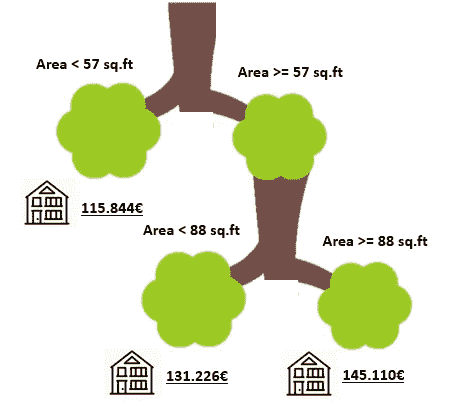

新分类，整个决策树—按作者分类的图片

现在，我们的决策树开始看起来像一个真正的算法！我们现在有三条路可走:

*   如果房子的面积小于 57 平方米。制成，我们说它的价格是 115.844 €。
*   如果房子的面积大于或等于 57 平方英尺小于 88 平方英尺，我们说它的价格是 131.226 €。
*   如果房子的面积超过 88 平方米。制成，我们说它的价格是 145.110 €。

当然，我们也可以将相同的推理应用于左边的分支——首先检查哪里是最佳的分割:

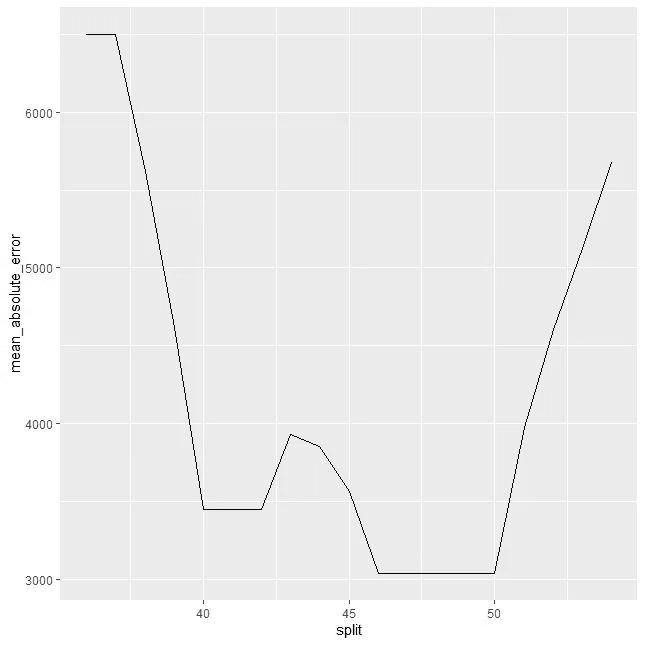

树的左分支的每次分割的平均绝对误差-作者图片

根据我们的“成本函数”,对于左边的分支，我们应该为新的分割选择一个介于 47 和 50 之间的值——让我们检查一下我们的新树:

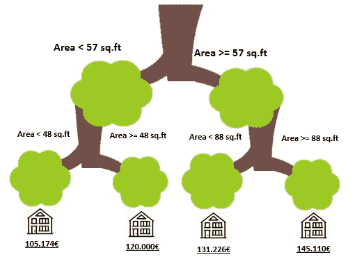

新的分类，两个分支都扩展了——图片由作者提供

我们可以进一步对数据进行分区(现在你知道递归分区名称的来源了！).我们可以保持这一点，直到我们在一个树节点中有一个单独的例子——这有一些主要的后果，比如巨大的过度拟合。

那么，我们怎样才能避免那棵树下降得太深呢？是否有办法控制这种情况？是啊！用超参数！

# 检查一些超参数

由于这篇文章已经有点长了，我将避免过多地详述超参数。但是检查我的[其他帖子](/5-decision-tree-hyperparameters-to-enhance-your-tree-algorithms-aee2cebe92c8)来更好地了解他们。

超参数是基于树的模型的关键——正如我们已经看到的，我们的树可以**下降，直到单个示例属于单个节点。**

为了控制将导致非常糟糕(高方差)模型的行为，超参数来了。由于树确实容易过度拟合，我们有一些超参数来控制训练过程——下面是其中一些超参数的简短描述:

*   maxdepth 此参数给出树的最大深度(层数)。在上面的例子中，我们下降了两级。
*   minsplit 为了尝试分割，结点中必须存在的最小观测值数量。
*   minbucket 任何末端叶节点中的最小观测值。
*   CP——或复杂度参数——节点为了有效而必须贡献的最小误差增益。基本上，不会执行稍微提高树的整体准确性的分割，并且分区在此停止。

在 fit 中，您可以控制更多的超参数——您可以使用`?rpart.control`来检查它们。用它们做实验会让你很好的理解你的树是如何随着不同的值而变化的。

# 视觉化我们的契合度

最后，为了证明我们遵循了`rpart`所遵循的实现，让我们回到我们在本文开始时所拟合的树:

```
d.tree <- rpart(price ~ area,
             data = house_prices, method = 'anova',
             control = list(maxdepth=5,
                            minsplit=2, minbucket=2,
                            cp = 0.0001))
```

如果我们使用`rpart.plot`来绘制它，并专注于前两个级别:

```
rpart.plot(d.tree)
```

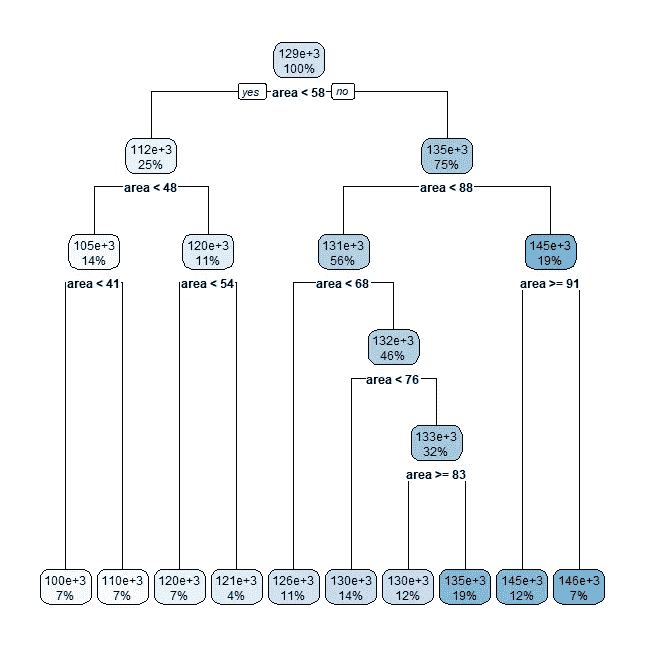

前两个级别与我们在使用“成本函数”规则之前构建的非常相似！

尽管很强大，决策树也很容易过度适应**。如果您决定基于少数几个示例(例如，只有 1 或 2 个观察值)进行预测，您将最终得到一个不能很好地推广到测试集的模型。**

在这篇文章中，我们没有遵循训练-测试分离范式，但如果你在实验中这样做，你会看到决策树在看不见的数据上的表现有多差，只需要对超参数做一点小小的调整。

然而，它们确实是很酷的模型，是任何数据科学家或机器学习工程师的必备知识。如今，您不太可能为您将面临的大多数问题部署决策树，但了解它们是投入到研究更高级的模型(如随机森林或极端梯度推进)的 50%的工作！

感谢你花时间阅读这篇文章！最后一点，我已经在 [**Udemy**](https://www.udemy.com/course/r-for-data-science-first-step-data-scientist/?referralCode=MEDIUMREADERS) **上开设了一门**课程，从头开始学习数据科学概念——使用前面的链接或下面的链接加入并立即开始学习数据科学！****


[数据科学训练营课程](https://www.udemy.com/course/r-for-data-science-first-step-data-scientist/?referralCode=MEDIUMREADERS)

[](https://medium.com/membership/@ivopbernardo) 