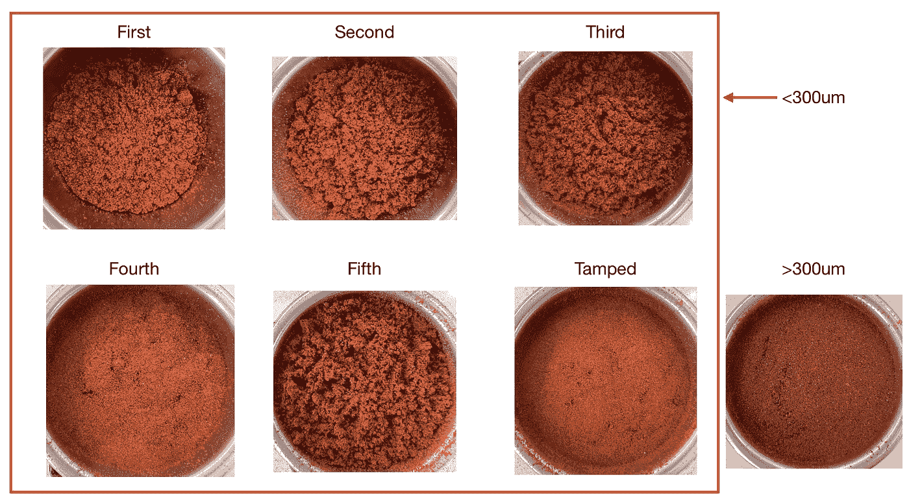
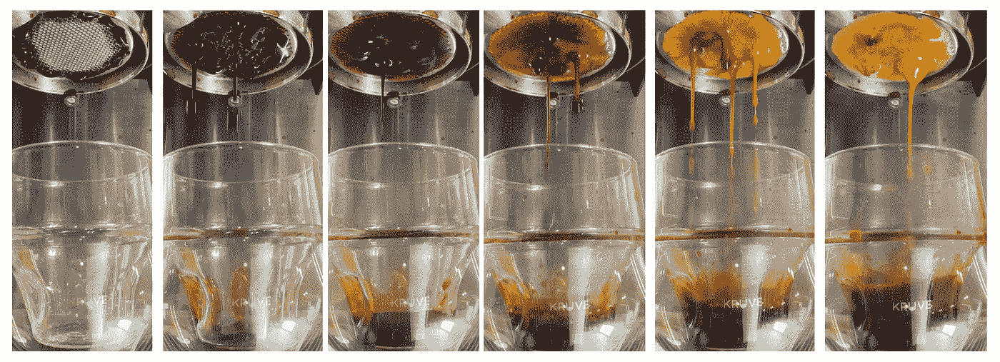
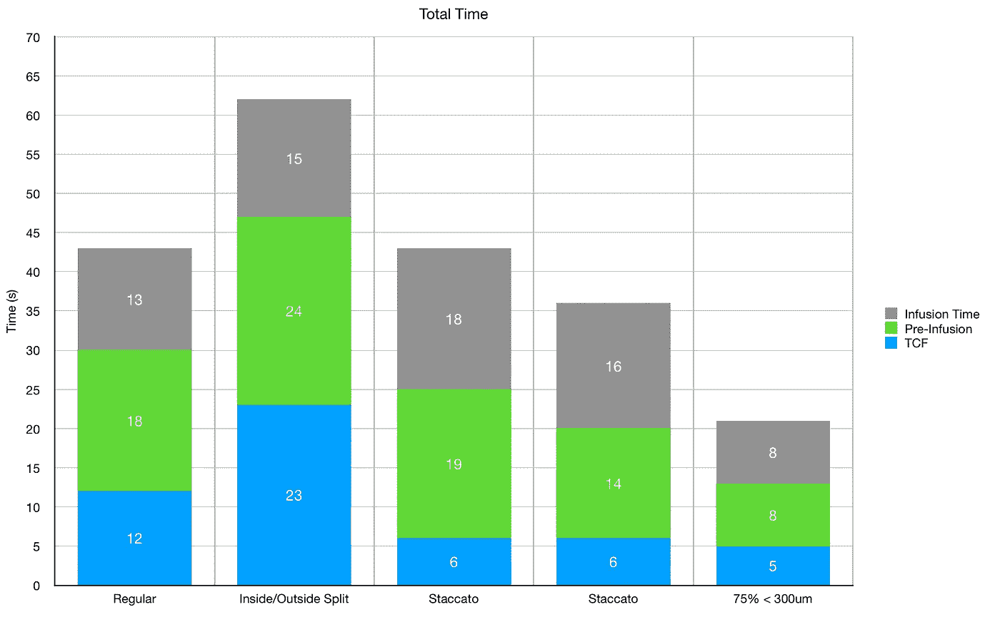

# 为浓缩咖啡研磨 5 次咖啡

> 原文：<https://towardsdatascience.com/regrinding-coffee-5-times-for-espresso-d29568427387>

## 咖啡数据科学

## 来自另一个微米的浓缩咖啡

[双磨](/the-lazy-staccato-espresso-34aa743bed96)咖啡在几年前成为一个有趣的讨论。然而，关于这为什么有趣的讨论并没有向前推进。我看了看双重研磨，我发现更有趣的部分是将里面的 T2 粉末与其余的咖啡分离开来。

这让我想到研磨和筛选几次。如果我每次都筛掉 300 微米以下的颗粒，那么经过几轮之后，这些颗粒的粒径会不会基本相同？于是心血来潮，我研磨筛选了 5 遍。

所有图片由作者提供

我用了一个壁龛研磨机，我从设置 30 开始。然后，我用研究员 [Shimmy](/the-fellow-shimmy-sifter-a-data-driven-review-8eedc23580f8) 筛选出小于 300 微米的颗粒。我降低了研磨设置 10，我重复了这个过程。

-10 仍在毛边上方触摸。

这很费时间，但拍摄相当惊人。我非常惊讶，因为我以为它会引导和引起问题。

我在这次调查中最大的遗憾是没有记录粒子分布。

# 设备/技术

[意式咖啡机](/taxonomy-of-lever-espresso-machines-f32d111688f1) : [像样的意式咖啡机](/developing-a-decent-profile-for-espresso-c2750bed053f)

[咖啡研磨机](/rok-beats-niche-zero-part-1-7957ec49840d) : [小生零](https://youtu.be/2F_0bPW7ZPw)和[带](https://fellowproducts.com/products/ode-brew-grinder) [SPP 毛刺的同杆针](http://www.sspgrind.com/)

咖啡:[家庭烘焙咖啡](https://rmckeon.medium.com/coffee-roasting-splash-page-780b0c3242ea)，中杯(第一口+ 1 分钟)

拍摄准备:[断音](https://medium.com/overthinking-life/staccato-espresso-leveling-up-espresso-70b68144f94)在精神上

[预灌注](/pre-infusion-for-espresso-visual-cues-for-better-espresso-c23b2542152e):长，约 25 秒

输液:[压力脉动](/pressure-pulsing-for-better-espresso-62f09362211d)

[过滤篮](https://rmckeon.medium.com/espresso-baskets-and-related-topics-splash-page-ff10f690a738) : 20g VST

其他设备: [Atago TDS 计](/affordable-coffee-solubility-tools-tds-for-espresso-brix-vs-atago-f8367efb5aa4)， [Acaia Pyxis 秤](/data-review-acaia-scale-pyxis-for-espresso-457782bafa5d)

# 绩效指标

我使用两个[指标](/metrics-of-performance-espresso-1ef8af75ce9a)来评估技术之间的差异:最终得分和咖啡萃取。

[**最终得分**](https://towardsdatascience.com/@rmckeon/coffee-data-sheet-d95fd241e7f6) 是评分卡上 7 个指标(辛辣、浓郁、糖浆、甜味、酸味、苦味和余味)的平均值。当然，这些分数是主观的，但它们符合我的口味，帮助我提高了我的拍摄水平。分数有一些变化。我的目标是保持每个指标的一致性，但有时粒度很难确定。

</coffee-solubility-in-espresso-an-initial-study-88f78a432e2c>**使用折射仪测量总溶解固体量(TDS)，这个数字结合咖啡的输出重量和输入重量用于确定提取到杯中的咖啡的百分比，称为**提取率(EY)** 。**

# **表演**

**为了查看性能，我将它与相同烤肉的其他几个镜头进行了比较。我有一次常规击球(断奏)，一次内外分球，两次断奏击球。这种情况下的实验剂量被称为 75% < 300 微米，因为 75%的咖啡渣小于 300 微米。**

********

**这个实验性的镜头比其他所有镜头都要好，而且跑得更快。**

****

**这个实验性的镜头需要更多的劳动，但我认为它给了我们一个很好的研磨课程。人们可以用筛子和饲料进行研磨，因为只需再研磨较粗的颗粒，或者关键是使用辊式研磨机。**

**如果你愿意，可以在推特、 [YouTube](https://m.youtube.com/channel/UClgcmAtBMTmVVGANjtntXTw?source=post_page---------------------------) 和 [Instagram](https://www.instagram.com/espressofun/) 上关注我，我会在那里发布不同机器上的浓缩咖啡照片和浓缩咖啡相关的视频。你也可以在 [LinkedIn](https://www.linkedin.com/in/dr-robert-mckeon-aloe-01581595) 上找到我。也可以关注我在[中](https://towardsdatascience.com/@rmckeon/follow)和[订阅](https://rmckeon.medium.com/subscribe)。**

# **[我的进一步阅读](https://rmckeon.medium.com/story-collection-splash-page-e15025710347):**

**[我未来的书](https://www.kickstarter.com/projects/espressofun/engineering-better-espresso-data-driven-coffee)**

**[我的链接](https://rmckeon.medium.com/my-links-5de9eb69c26b?source=your_stories_page----------------------------------------)**

**[浓缩咖啡系列文章](https://rmckeon.medium.com/a-collection-of-espresso-articles-de8a3abf9917?postPublishedType=repub)**

**工作和学校故事集**