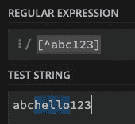
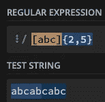
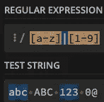

# 正则表达式:详细语法

> 原文：<https://towardsdatascience.com/regular-expressions-syntax-in-detail-dcc11e9aa996>

## 编程|模式匹配|计算机科学

## 对正则表达式及其语法的深入探究

Gerd Altmann 在 [Pixabay](https://cdn.pixabay.com/photo/2016/04/04/14/12/monitor-1307227_1280.jpg) 上拍摄的照片

[在我们的上一篇文章](/introduction-to-regular-expressions-3371c86f7)中，我们介绍并讨论了正则表达式(regex)范式。Regex 是一个强大的工具，它允许我们执行字符串模式匹配、替换和其他操作。

我们以一个用例为例，构建一个正则表达式来验证一个十六进制颜色值。

您可以在此处找到介绍材料:

</introduction-to-regular-expressions-3371c86f7>  

这篇文章的目的是作为一个剪贴簿/备忘单风格指南，介绍 regex 中一些更高级的概念。当我学习这些类型的技能(需要练习才能真正掌握的技能)时，我发现有简明的指导方针和一个实践场所来测试这些指导方针要好得多。

我通常使用下面的在线工具来练习和测试我的正则表达式。还有其他好的在线工具。挑一个你喜欢的，一如既往——练习，练习，再练习。

<https://regex101.com>  

因此，这篇文章将与我的典型文章略有不同。这将是最小的和直接的。我也很想听到你对这种指导风格的反馈，以及你是否喜欢更详细和动手的写作风格。

> 实验是成长的本质

# 术语

在开始之前，让我们先回顾一下术语。

剖析正则表达式。图片作者。

**分隔符**用于指示正则表达式的开始和结束。

在分隔符之间，我们编写正则表达式。regex**是我们想要匹配的实际模式。**

在结束分隔符之后，我们也可以使用修饰语。但是，稍后我们会详细介绍这一点！

# 匹配字符

两种主要类型:**普通**和**特殊**

## 普通的

普通字符是正则表达式的最简单形式，因为它们匹配自身(即它们的文字字符)。匹配它们意味着如果我们在正则表达式中输入字符`A`，它实际上会在字符串中寻找一个`A`。其他一些例子包括`0`和`9`之间的数字，以及字母表中剩余的字母。

给定一个字符串`abc123`，匹配的正则表达式就是`/abc123`。

## 控制

控制字符(或转义序列)是代表其他元素的字符序列。例如，控制序列`\n`代表一个新行。下面，我们展示了一些常用的转义序列。

> **警告:不同的正则表达式引擎可能有不同的表示——所以最好仔细检查你的正则表达式的文档。**

## 特殊/元字符

**人物类**

字符类可以列出一个或多个字符。使用字符类实质上就是说任何列出的字符都是匹配的。我们通过使用方括号符号对元字符进行分组来展示这一点。我们也可以使用`—`操作符来指定范围。

例如，`/[abc123]`表示如果方括号之间的任一字符存在于字符串中，那么它将是匹配的。

同样，`/[a-f]`表示`a`和`f`之间的任何字母都可以匹配(即`a, b, c, d, e, f`)。

使用范围时要记住的一件重要事情是，正则表达式范围是基于 ASCII 代码的。假设我们有像`\[A-z]`这样的正则表达式，这个范围将匹配一些额外的符号，比如`\`和方括号。其他一些例子包括:

*   `**[9-0]**` —可能是一个空范围
*   `**[],\[\**` **—** 无效，将无法编译

看看下面的 ASCII 码，更好地理解我在说什么。

<https://www.w3schools.com/charsets/ref_html_ascii.asp>  

这些例子被称为**正类**，因为正则表达式表达了它应该匹配的内容。另一方面，我们也有**负类**，它们表示正则表达式不应该匹配的内容。这是通过在我们不想匹配的模式开始处使用`^`操作符来完成的。

例如，假设我们有正则表达式`/[^abc123]`和字符串`abchello123`，正则表达式引擎将忽略方括号中列出的任何字符，因此只匹配表达式的`hello`部分。

作者图片

那么，如果我们真的想要匹配一个`-`，甚至是`^`字符呢？

该语法取决于所讨论的操作符。例如，对`—`的转义可以通过在正则表达式的最开始或最末尾使用它来完成(即`[A-Z_-]`)。要用破折号开始一个范围，该范围需要是字符类中的第一个范围(`[--/A-Z],[A-Z+--])`)。

至于`^`这个角色，工作原理也差不多。如果不是第一个字符，它将被计为文字。

对于`[`和`]`，最好的方法是使用`\`操作符，如`\[`或`\]`。

# 通配符

**点** —匹配除换行符之外的任何字符，但匹配带有**点全**修饰符的`\n`(某些类型的正则表达式引擎用空字节替换新行)—请咨询您的正则表达式引擎！

当在字符类中使用时，它失去了它的功能，并作为文字进行匹配。这是没有用的，因为一个字符类已经匹配任何东西。

**警告:** *用带量词的点变成了* ***非常慢*** *。(即:* ***)。+*** *)*

# 量词

量词用来表示重复。有 4 个主要的重复量词。

`?` —重复零次或一次

`+` —重复一次或多次(无限制)

`*` —重复零次或多次(无限制)

`{}` —允许我们指定我们想要的精确重复。我们也可以传入最小值和最大值— `{n,m}`或`{n,}`或`{,m}`

`{,m}`不适用于大多数正则表达式，所以最好使用`{0,m}`

量词被称为贪婪的，因为它们总是倾向于匹配而不是不匹配。量词也会尽可能频繁地尝试匹配。

让我们快速看一个例子。

作者图片

我们可以看到我们的正则表达式匹配了两个组。第一组(示例中的浅蓝色)由前 5 个字符组成，而第二组(深蓝色)由剩余的 4 个字符组成。

# 贪婪和懒惰

贪婪意味着只有当条件不能再满足时才会停止。

条件一满足，懒就停了。我们通过使用`?`操作符指定一个正则表达式为惰性的。这样会让它更不情愿。它仍然倾向于匹配，但在进行匹配的同时尽可能减少匹配次数，它可以是 0。

比如贪婪的`h.+l`和`'hello'`里的`'hell'`匹配，而懒惰的`h.+?l`和`'hel'`匹配。

为了利用这一点并使其更快，我们必须精确并使用否定(这将防止回溯)。否定几乎总是比使用通配符好。

# 间隔

整个想法实质上是创建一个备用分支。我们可以通过`|`操作符来实现。

`|`在一个类中并不特殊；因此，它将作为文字进行匹配。所以比尔。此外，分支顺序也很重要(最左边的分支是最需要的，但不会阻碍其他分支)。

`|`也有最低的优先级，所以使用分组操作符来表示开始和结束可能更明智。

作者图片

# 子模式和分组

嗯，顾名思义，他们把东西组合在一起。可以使用`(` `)`字符指定分组。

例如，假设我们想要无限次地完全匹配单词`hello`。我们可以使用 regex `/(hello)+`来指定我们想要匹配整个组(在本例中是 hello)一次或多次(通过`+`)。

作者图片

# 结束语

在这篇文章中，我们回顾了最常用的主要正则表达式语法细节。掌握正则表达式绝对是一项技能，乍一看似乎是一个额外的学习工具，但实际上它非常有用，这是我的经验之谈。

我特意保持这篇文章的简洁，因为正则表达式是你必须使用的工具之一。我强烈建议您尝试一下 regex 学习之旅。如果这样做，您将成为效率提高 10 倍的开发人员——我保证！

你喜欢这篇文章吗？如果是，请考虑订阅我的电子邮件列表，以便在我发布新内容时得到通知。免费的:)

<https://david-farrugia.medium.com/subscribe>  

**也许你也可以考虑成为一名会员来支持我和你其他喜欢的作家。每月 5 美元，你就可以无限制地阅读 Medium 上的每一篇文章。**

<https://david-farrugia.medium.com/membership>  

# 想联系吗？

我很想听听你对这个话题的想法，或者任何关于人工智能和数据的想法。

如果你想联系我，请给我发电子邮件至 davidfarrugia53@gmail.com**T5T7。**

[领英](https://www.linkedin.com/in/david-farrugia/)