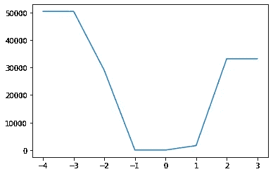
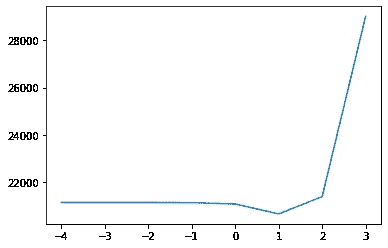
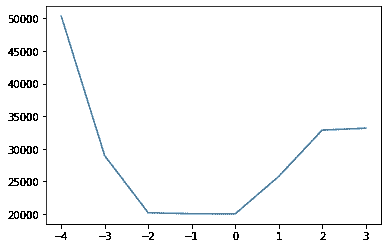

# 机器学习的正则化

> 原文：<https://towardsdatascience.com/regularization-for-machine-learning-67c37b132d61>


杰斯温·托马斯在 [Unsplash](https://unsplash.com?utm_source=medium&utm_medium=referral) 上的照片

## 为什么它是最重要的技术之一，以及如何使用它

# 这是什么？

正则化是一种通过使损失函数考虑特征重要性来校准机器学习模型的技术。

直观地说，这意味着我们迫使我们的模型对那些在预测目标变量时不太重要的特征给予较小的权重，而对那些更重要的特征给予较大的权重。

# 为什么有用？

在机器学习中，可能会有“过度拟合”的趋势，这取决于我们拥有的数据和我们使用的模型。也就是说，我们的模型可能“过于努力”来适应训练数据，然后它将无法在以后进行归纳(以在新数据上很好地工作)。

这是一个与好模型相比过度拟合的直观示例，也是一个拟合不足的示例:


图片作者(改编自 [sklearn 示例](https://scikit-learn.org/stable/auto_examples/model_selection/plot_underfitting_overfitting.html))

当我们没有太多数据时，当我们必须拥有许多特征时，或者当我们的模型太复杂时，这可能会发生。

> 经验法则:数据越少，就越应该保持模型简单(参数越少，特性越少)

最基本的正则化技术是 *L1* 和 *L2* 。我们将详细了解它们是如何工作的，然后对其他技术进行概述。

# L1 对 L2

L1 和 L2 提到了这些正则化(也分别称为套索和岭回归)所使用的规范类型，以及回归中添加到损失函数的项。它们之间的差别很微妙，但却很重要。

首先，让我们简要回顾一下回归方程:


回归方程式

其中，ŷ是我们的预测值，x 是特征，β和α是模型的截距。在回归模型中，我们的工作是找到最佳的β和α。我们所说的最好是什么意思？将损失函数最小化的那些:


基本损失函数

其中 n 是观测值的数量，ŷ是预测值，y 是目标变量的实际值。

损失函数简单地计算预测值(ŷ)和实际值(y)之间的差值的平方，并对它们求和。

现在让我们看看这个函数是如何进行 L1 回归的:


带 L1 正则项的损失函数

新术语(绿色，以防您没有注意到)有两个主要部分:lambda，它是正则化参数(它越大，我们的正则化就越强)和|β|，它是回归参数的绝对值。本质上，它所做的是增加高参数的成本，因此为了给参数分配更大的值，必须通过显著提高预测质量来补偿。

另一方面，L2 回归是这样计算损失的:


带有 L2 正则项的损失函数

区别很微妙:我们取β的平方，而不是绝对值。

在 L1，如果各个特征对整个模型的贡献不足，βj 可以等于 0。然而，在 L2，β可以很小，但不等于 0。

在 L1 和 L2 之间做出选择会有什么影响？

首先，因为 L1 可以赋予权重等于 0，这实质上意味着我们可以摆脱不太重要的功能，使我们的模型更简单，数据摄取过程更容易。另一方面，L2 在计算上花费较少(因为 L2 范数有一个封闭形式的解)。

顺便说一下，如果你想把两者结合起来，你有[弹性网](https://scikit-learn.org/stable/modules/generated/sklearn.linear_model.ElasticNet.html)选项，它增加了两个正则化项，并允许你给一个或另一个更多的权重。

你应该使用多少正则化？这将取决于您的数据集和模型。我建议你做一些超参数调整，通过测试正则化参数的多个值，看看哪一个产生最好的误差。让我们看看如何使用 Python 来实现这一点。

# 如何使用它

Lasso、Ridge 和 ElasticNet 回归都可以在 scikit-learn 上获得，只需几行代码就可以轻松使用。

我添加了一些代码，可以帮助您实现它们，还可以评估正则化强度的最佳值，在 scikit-learn 中称为 *alpha* (但相当于我们之前示例中的λ。

我使用了使用 sk learn . datasets . make _ regression 生成的假数据，以及训练数据的标准名称( *X_train* 和 *y_train* )，但是您可以很容易地根据您的数据和代码调整它:

```
from sklearn.linear_model import Lasso, Ridge, ElasticNetalphas = [0.0001, 0.001, 0.01, 0.1, 1, 10, 100, 1000]# LASSO
errors = []
for alpha in alphas:
    clf = **Lasso(alpha=alpha)**
    clf.fit(X_train, y_train)
    y_hat = clf.predict(X_test)
    mse = mean_squared_error(y_test, y_hat)
    errors.append(mse)
plt.plot(np.log10(alphas), errors)
plt.show()
```



Lasso 回归的 MSE 与 log(alpha )(图片由作者提供)

我绘制 *log(alpha)* 而不是 *alpha* 的原因是因为它的比例呈指数变化，所以在对数比例中可视化变得更容易。

当然，Ridge 和 ElasticNet 也可以类似的方式使用:

```
# RIDGE
errors = []
for alpha in alphas:
    clf = **Ridge(alpha=alpha)**
    clf.fit(X_train, y_train)
    y_hat = clf.predict(X_test)
    mse = mean_squared_error(y_test, y_hat)
    errors.append(mse)
plt.plot(np.log10(alphas), errors)
plt.show()
```



岭回归的 MSE 与 log(alpha )(图片由作者提供)

```
# ElasticNet
errors = []
for alpha in alphas:
    clf = **ElasticNet(alpha=alpha)**
    clf.fit(X_train, y_train)
    y_hat = clf.predict(X_test)
    mse = mean_squared_error(y_test, y_hat)
    errors.append(mse)
plt.plot(np.log10(alphas), errors)
plt.show()
```



弹性网络回归的 MSE 与 log(alpha )(图片由作者提供)

从这些图中，您可以找到将最小化模型误差的回归类型和 alpha。

# 其他技术

## 提前停止

早期停止可用于迭代方法，如梯度下降，它包括在达到某个目标后停止训练过程。这个目标可以是某个精度度量的给定值，或者只是迭代次数。换句话说，你是在告诉模型，如果它表现得足够好，或者如果它走得太远，就停止训练过程。它常用于神经网络和梯度增强方法。

早期停止起到正则化的作用，因为它降低了模型超参数将针对特定训练数据进行优化而不能很好地泛化的风险。

## 拒绝传统社会的人

Dropout 是训练神经网络时随机丢弃节点的技术(尽管它可以适用于其他方法)。在每个时期，一定百分比的节点没有被使用，这给过程增加了一些噪声，并迫使模型更好地适应和概括。在 XGBoost 中,“DART”booster 还建议在训练过程中随机删除树，以减少过度拟合。

如果你喜欢这篇文章，你可能也会喜欢这些:

</a-new-better-version-of-the-k-nearest-neighbors-algorithm-12af81391682>  </hypothesis-testing-a23852264d09>  

> 如果你想进一步讨论，请随时通过 LinkedIn 联系我，这将是我的荣幸(老实说)。