# 机器学习中的正则化

> 原文：<https://towardsdatascience.com/regularization-in-machine-learning-6fbc4417b1e5>

## 正则化是如何工作的，如何防止过度拟合？

按作者分列的数字

**内容**

1.  介绍
2.  线性回归概述

2.1 简单数据集的回归

3.0 正规化

3.1 山脊正规化

3.2 套索正规化

4.0 山脊 Vs 套索正则化

4.1 作为约束最小化的脊和套索正则化

4.2 弹性网

5.0 一个简单的正则化示例

6.0 结论

7.0 参考文献

**1.0 简介:**

灵活性是指模型表示特征变量和目标变量之间复杂变化的能力。模型的灵活性在很大程度上影响其预测能力。在处理复杂数据集时，高度灵活的模型是可取的。使用高灵活性模型的缺点是，这种模型在训练阶段往往会过度拟合数据。当模型密切学习训练数据集中的变化时，会发生过度拟合。过度拟合模型显示了从一个看不见的数据到另一个看不见的数据的预测的巨大变化。如此大的变化导致高方差误差。控制方差误差允许模型对看不见的数据进行概括并表现良好。这是机器学习中的一个重要主题。正则化是用于控制高灵活性模型中过拟合的技术之一。虽然正则化用于许多不同的机器学习算法，包括深度神经网络，但在本文中，我们使用线性回归来解释正则化及其用法。

**2.0 线性回归概述:**

在深入研究正则化技术之前，我们先快速回顾一下线性回归模型。线性模型表示为:

βⱼ是权重，β₀是偏差项。ῡᵢ是第 I 个数据点 xᵢⱼ.的预测值在上面的等式中，n 是特征的数量，k 是数据点的数量。

线性回归模型通过最小化第 I 个 yᵢ观察值和第 I 个数据点的模型预测值ῡᵢ之间的误差平方和(SSE)来计算未知权重和偏差项。

βⱼ和β₀是上述等式中的未知数。为了便于表示，我们改用无索引符号。

设 **X** 是一个 k×n+1 矩阵，由 xᵢⱼ和一个额外的 1 列组成。

观察值由长度为 k 的向量 **y** 表示。

未知权重βⱼ和β₀由长度为 n+1 的向量表示。

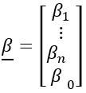

SSE 的表达式可以用矩阵形式重写为:

可以通过将上证 w.r.t **β** 的偏导数设置为零来找到最小值。

求解上式中的 **β** 得出:

由于矩阵 **X** ᵀ **X** 可能不总是条件良好的，实际上最小化是通过梯度下降技术实现的。

线性回归这个名称是指模型在未知的βⱼ和β₀.是线性的当观测值 yᵢ和数据点 xᵢⱼ之间的关系接近线性时，该模型工作良好。

增加模型灵活性的一种方法是增加不同的 xᵢⱼ权力(即 xᵢⱼ、xᵢⱼ)等。这允许模型拟合非线性关系。这种模型被称为多项式回归模型。请注意，在未知的βⱼ和β₀.，模型仍然保持线性

**2.1 简单数据集回归:**

本例中使用的数据以微米为单位测量精密工具的偏心偏差，以摄氏度为单位测量工具温度。该数据集不是真实的，此处仅用于说明目的。下图显示了作为工具温度函数的工具偏转。

工具偏转与工具温度(作者提供的图)

为了保证质量，制造商希望有一个模型来预测给定工具温度下的工具变形。这个简单的单变量数据集有 1090 个数据点。工具温度被标准化为平均值 0 和标准偏差 1.0。

尽管上面所示的曲线形状表明需要一个相当高阶的多项式，但为了简单起见，我们拟合了一个 4 阶多项式模型:

上式中的 t 代表工具温度。以下笔记本的目的是展示如何使用 sci-kit learn 拟合多项式模型。由于特征向量(独立变量温度)已经标准化，因此不需要缩放。目前，为了便于说明，该模型适合整个数据集。

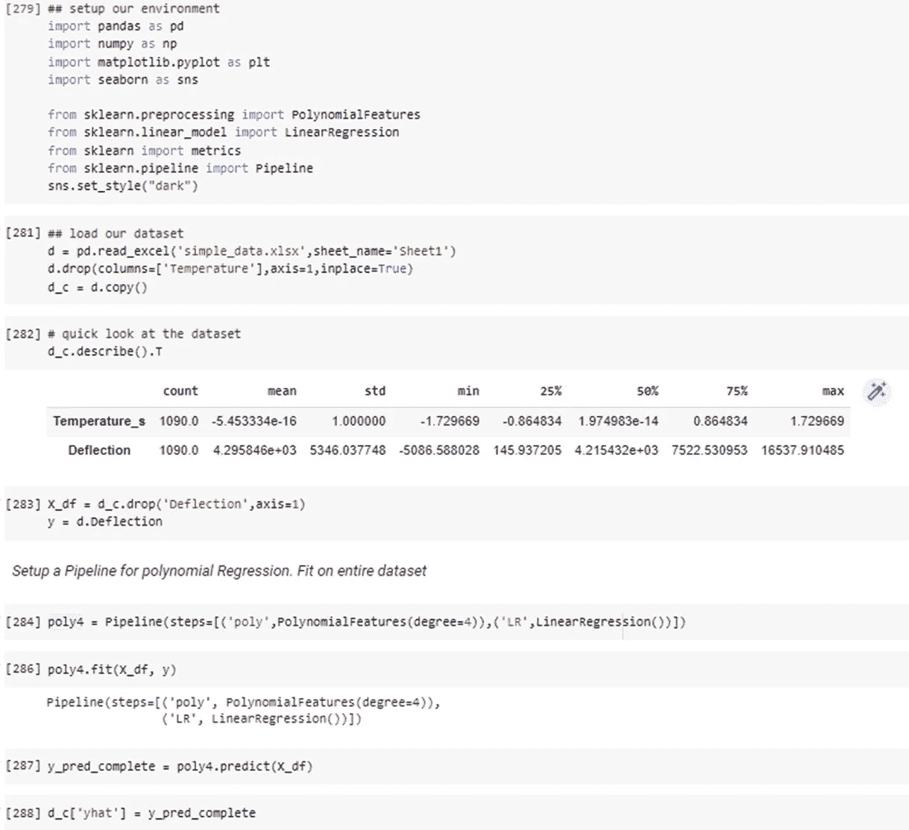

值得注意的是，线性回归用于拟合多项式模型。权重向量 **β** 可以如下获得:

下图显示了四阶多项式。

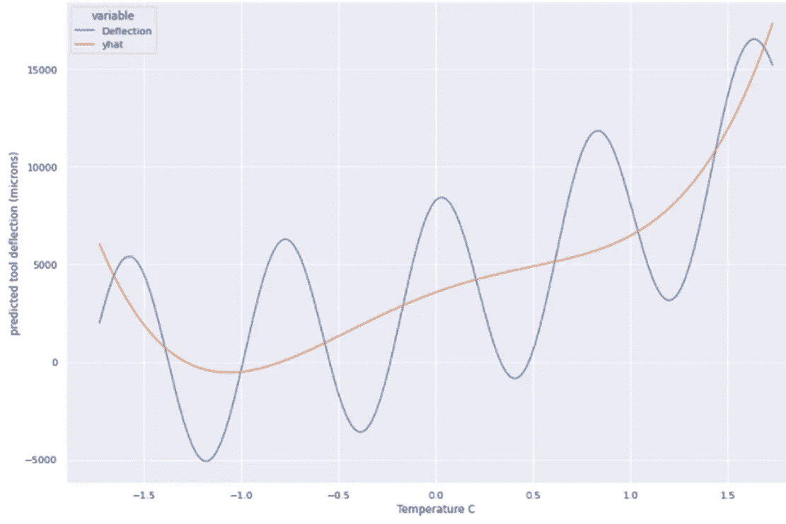

四阶多项式拟合(作者图)

虽然四阶模型不是最佳选择，但我们选择它是因为它简单，并将在后续部分中使用它进行说明。

**3.0 规则化:**

通常，当我们训练一个非常复杂的模型(比如说一个高阶多项式模型)时，权重会不断变化，以更接近地表示训练数据中的信息。

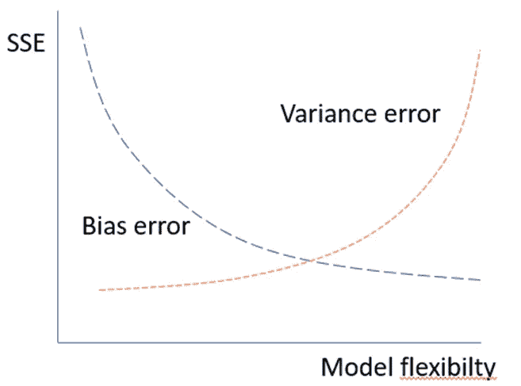

图:A:过度拟合模型，B:偏差-方差误差(图由作者提供)

图 1 的左窗格描述了这个场景。预测值非常接近训练数据点。模型权重对于训练数据是如此具体，以至于当新的看不见的验证数据点呈现给模型时，预测显示出与目标值的较大偏差，即较大的方差误差。图 1 的右窗格显示了随着模型的灵活性，偏置误差如何下降，方差误差如何增加。因此，希望能够在模型训练阶段控制体重的增长。正规化就是这样做的。它控制权重可以变得多大。为了实现这一点，SSE 方程增加了一个附加项。根据我们如何构造这个额外的项，我们得到一个脊或套索正则化模型。

**3.1 山脊正则化:**

对于岭正则化，带有额外项的 SSE 的表达式如下所示:

上述等式中的第二项是权重的平方乘以正则化参数α的和。注意，这个术语不包括截距。这个附加项表示权重向量长度的平方，也称为 L2 范数，由正则化参数缩放。它的大小取决于重量。SSE 的最小化不仅最小化了误差项，而且最小化了权重向量的缩放幅度，即权重。我们可以通过改变正则化参数的值来控制这个附加项被罚的程度。想象一个极端情况，α如此之大，以至于第一项(误差项)与第二项相比相形见绌，我们可以完全忽略它。在这种情况下，最小化将迫使权重非常小。因此，通过增加α的值，我们可以降低模型的灵活性(通过迫使权重变小)并防止过度拟合。

回到矩阵和向量符号，上面的等式可以写成

**I** ₀是一个(n+1) X (n+1)矩阵，除了最后一个对角线位置的值为 0 之外，所有对角线位置的值都为 1。

该矩阵用于排除截距项β₀.的影响对矢量 **β** 取标量函数 wrt 的导数，得到 **:**

求解上述方程系统的 **β** 得出:

从上面我们可以看出，脊正则化是在 **X** ᵀ **X** 的对角项中加入了正则化参数。因此，在岭正则化中，所有权重都以相同的比例改变。我们还观察到，α与 **β** 成反比，即，随着α增加 **β** 减少。最后，将α设置为零会得到我们在 2.0 节中给出的线性回归解。

**3.2 拉索规则化:**

对于套索正则化，SSE 表达式为:

第二项现在涉及权重的绝对值(L1 范数)乘以正则化参数的总和。用权重的 L1 范数来增加 SSE 的想法非常类似于岭正则化。这里，通过正则化参数惩罚权重允许我们控制权重的增长。

使用矩阵和向量符号，上述等式可以表示为:

表示两个向量的内积。 **1₀** ，是 1 的 n+1 个向量，最后一个分量为 0。

引入它是为了排除截距项的贡献。符号| **β** |表示向量的各个分量取绝对值。上述标量值函数 wrt 向量 **β** 的导数得出:

其中 sgn()是应用于向量 **β** 的各个分量的正负号函数。请注意，因为 signum()函数在其参数为零时没有定义，所以上面的表达式在权重正好为零时没有定义。与岭正则化不同，我们不能从上面的方程推导出解的解析表达式。最小值以数字形式执行。类似于脊正则化，正则化参数α的增加导致权重的减少。但是，套索正则化控制权重的方式不同于山脊正则化。我们接下来看看这些差异。

**4.0 山脊 Vs 套索正则化:**

在上一节中，我们看了山脊和套索正则化的数学形式。我们还根据正则化参数导出了脊正则化的解。虽然脊和套索正则化在形式上相似，但它们的功能不同。在这里，我们将使用简单的数据集和我们在第 2 节中介绍的四阶多项式来查看脊和套索正则化如何控制模型的灵活性。我们将使用 scikit 学习库来设置管道，以使用脊和套索模型来拟合 4 阶多项式。我们再次指出，特征变量“温度”已经标准化为零均值和单位标准差。

在下图所示的笔记本中，管道由一个四阶多项式和岭正则化模型组成。为了进行比较，我们构建了三个不同的模型，分别对应于正则化参数值 9000.0(大)、100.0(中)和 0.0(零)，分别命名为 polyRdgLarge、polyRdgMed 和 polyRdgZero。尽管这些值有些武断，但它们足以证明模型中的差异。在后面的部分中，我们将介绍一种更正式的参数选择方法。因为我们的目标是演示正则化参数如何影响模型权重，所以整个数据集用于模型训练。

表 1:岭回归权重及其 L2 范数

表 1 显示了标记为大、中和零的三个正则化参数的权重。为了完整性，截距也显示在表中。表中最后一行所示的 L2 范数不包括截距。在上一节中，我们提到正则化会降低权重的 L2 范数。从表中可以看出，随着正则化参数α的增大，L2 范数减小。权重随着 L2 范数的减小而减小。图 2 绘制了三个正则化参数的三条四阶多项式曲线。从图中可以看出，随着正则化参数的增加，模型的灵活性降低，即曲线变得更平坦。

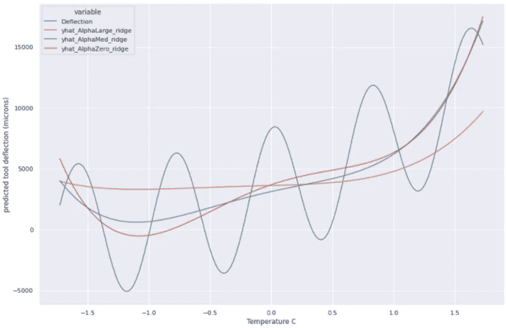

图 2:山脊规则化(作者提供的图片)

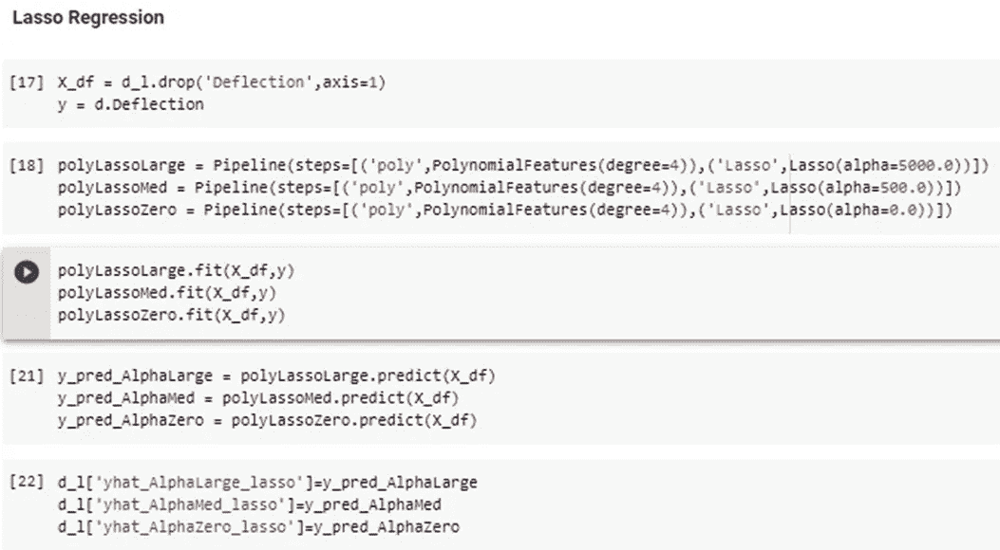

我们拟合了三个 Lasso 正则化模型 polyLassoMed、polyLassoMed 和 polyLassoZero，分别对应于三个正则化值 5000.0(大)、500.0(中)和 0.0(零)。注意 polyLassoZero 和 polyRdgZero 型号是相同的。再次，三个正则化参数值是任意选择的。与岭正则化的情况类似，整个数据集用于拟合三个模型。

表 2:套索正则化权重及其 L1 范数

上表显示了三种套索模型的权重。最后一行显示的 L1 范数不包括表中显示的截距。类似于脊正则化，L1 范数以及相应的权重随着正则化参数的增加而减小。从图 3 中，我们看到曲线变得更平坦，即模型灵活性随着正则化参数的增加而降低。

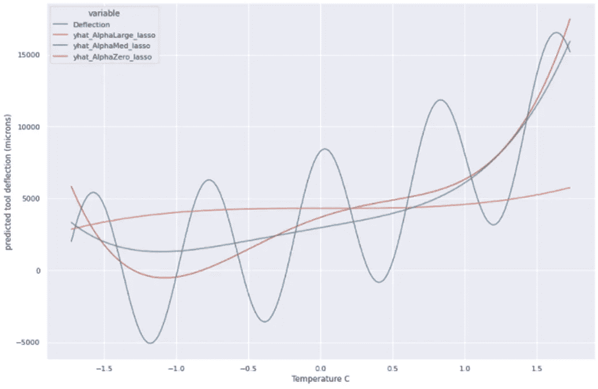

图 3:套索调整(作者提供的图片)

虽然岭回归和套索回归的总体行为是相似的，但在表 1 和表 2 中可以看出这两种方法之间的一个重要区别。我们可以看到，套索正则化的一些模型权重正好为零。即使正则化参数设置为较大的值，岭回归的权重也不会恰好为零。下一节将解释山脊正则化和套索正则化之间的区别。

**4.1 作为约束最小化的脊和套索正则化**

在第 3.0 节中，我们将山脊和套索正则化视为 SSE 扩充形式的最小化。在这一节中，我们以不同的形式重新描述这个问题，以使我们能够理解为什么对于套索正则化，一些权重恰好为零。

在这个替代公式中，通过最小化受约束的 SSE 来获得权重。

对于山脊规则化:

对于套索正则化:

上述等式中的参数“**s”**与正则化参数相关。首先，我们研究上交所术语。为简单起见，我们考虑一个模型，其中上证综指仅依赖于两个权重β₁和β₂.假设截距项β₀为零。这种简化使得视觉解释变得容易。

图 4: SSE 等高线(作者提供的图)

图 4 显示了β₁-β₂平面中 SSE 的轮廓。图 4 中任何给定曲线上的所有点都具有相同的 SSE 值。最小 SSE 值(由β^表示)通过最小化 SSE 获得，如第 2 节所述。扩张的等高线代表较大的 SSE 值。

脊正则化的约束项在β₁-β₂平面中由半径为 s 的圆表示，如图 5 所示。圆的阴影区域包含满足约束的所有点。

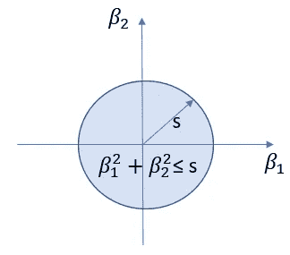

图 5 山脊约束(作者提供的图片)

在第 3 节中，我们提到，一般来说，权重随着正则化参数α的增加而减小。因为 s 是圆在β₁-β₂平面中的半径，所以较小的权重导致较小的半径。因此，参数 s 与正则化参数α成反比。

套索正则化的约束条件在β₁-β₂平面中用菱形表示，如图 6 所示。

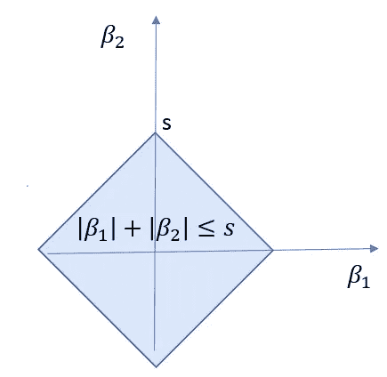

图 6:套索约束(作者提供的图片)

菱形内的阴影区域包含满足约束的所有点。菱形的大小由参数 s 控制。参数 s 与正则化参数α成反比。现在我们已经分别可视化了 SSE 和约束条件，让我们将两者放在一起。

满足脊线约束的 SSE 的最小值是轮廓和定义脊线约束的圆之间的交点。

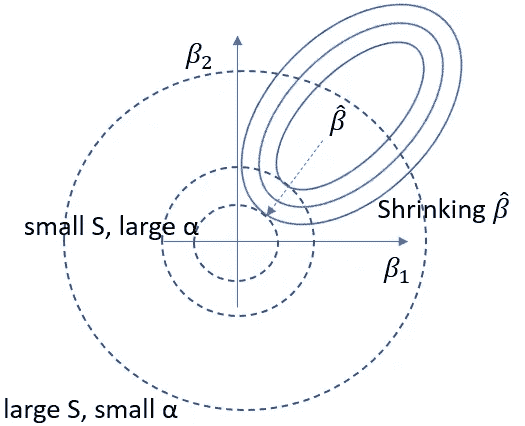

图 7:岭正则化的重量缩减(作者提供的图片)

图 7 中的虚线圆对应于正则化参数的不同值。当α的值接近零时，圆足够大，可以包含最小化 SSE 的最小β^obtained，而没有惩罚项。随着α值的增加，约束圆的尺寸减小，轮廓曲线和圆之间的交点移动。虚线箭头示出了随着正则化参数值的增加，解向原点收缩。这就是为什么正则化模型也被称为收缩模型。

同样的推理也可以应用于套索正则化，如图 8 所示。

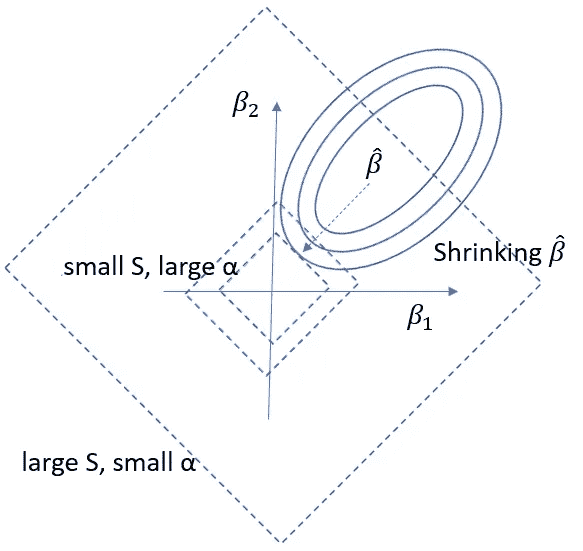

图 8:套索收缩(图由作者提供)

对于套索正则化，最小解是轮廓接触菱形的点。

到目前为止，我们已经给出了脊和套索回归如何缩小模型权重的几何解释。

图 9:山脊 Vs 套索(作者提供的图片)

图 9 并排显示了山脊和套索正则化的轮廓和约束区域之间的交点。我们可以看到，因为套索的菱形有一个角，所以轮廓曲线可以与菱形正好在角上相交。因为菱形的角在轴上，所以另一个权重的值为零。图 9 的右窗格显示了这种情况。我们看到相交发生在β₂轴上，即对于这个最小点β₁ = 0。相比之下，脊约束是一个圆(即没有角)，因此轮廓和圆的交点不太可能落在轴上。这就是为什么套索正则化的一些权重恰好为零的原因。虽然这里提供的解释只考虑了两个权重β₁和β₂，但是该思想可以扩展到具有更多权重的复杂模型。

**4.2 弹性网:**

山脊和套索正则化各有优势。由于一些权重正好为零，因此套索正则化模型是一个更简单、更容易解释的模型。另一方面，在某些情况下，岭回归可以生成 SSE 较低的模型。一般来说，对于给定的数据集，很难说这两种方法中哪一种效果最好。如果权重较大的要素较少，套索正则化效果会很好。对于具有相似大小权重的许多要素的模型，岭回归效果很好。那么问题自然就来了，我们能不能结合这两种模型来利用这两种方法呢？

弹性网就是这样做的。它结合了两种收缩模型的加权版本:

Elastic-Net = γ*Lasso 约束+ (1 — γ) *Ridge 约束。

参数γ对两个模型的贡献进行加权。实际上，惩罚参数和权重参数的最佳值是使用交叉验证来确定的。

**5.0 一个简单的正则化例子:**

选择正则化参数的好值的强力方法是尝试不同的值来训练模型并检查测试集的预测结果。这是一种麻烦的方法。通过 Scikit learn 中的 GridSearchCV 模块，我们可以建立一个管道并在参数网格上运行交叉验证，以自动选择最佳参数。我们使用加州房价数据集来演示这一过程。数据集可以在这里找到:[https://www.kaggle.com/camnugent/california-housing-prices](https://www.kaggle.com/camnugent/california-housing-prices)。

该数据集包含 1990 年以来加州的房价。为了简化我们的模型，我们从原始数据集中删除了“ocean_proximity”列。剔除丢失的数据点后，我们剩下 20433 个数据点。

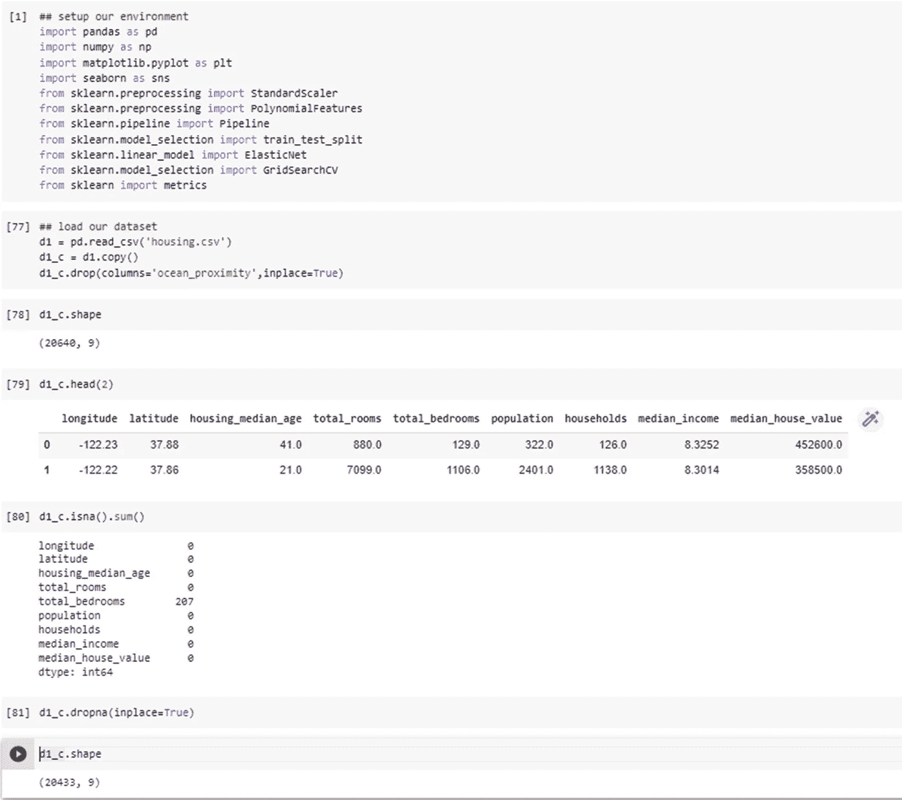

我们的目标是建立一个模型来预测中值房价，即我们的目标列是“中值房价”。我们还剔除了中值超过 50 万美元的房屋。不同特性和我们的目标列的分布如下所示:

(图由作者提供)

我们的目的是使用 GridSearchCV 演示参数优化。我们跳过了对理解数据和构建良好的预测模型至关重要的详细数据探索。

数据集分为训练集和测试集。管道包括数据的标准缩放、设置多项式回归和弹性网络。paramsPolyEN 字典允许我们为管道中的不同组件设置一个参数网格。这里我们只尝试一阶和二阶多项式。该字典还包含范围从 400.0 到 600.0 的正则化参数值列表，以及范围从 0.5 到 1.0 的套索与脊的权重比列表。可以指定更精确的参数列表，以获得更优的模型。GridSearchCV 使用管道中指定的估计器以及参数值网格来运行 n 重交叉验证，以实现最佳模型。这里，以 R2 评分作为模型评估的标准，进行 6 重交叉验证。

GridSearchCV 的结果可以在上面看到。我们看到，正则化参数为 500.0 的套索正则化二阶模型(L1 比率=1.0)是指定列表中的最佳模型。测试数据的 R2 分数是 0.76。套索模型的权重如下所示。我们可以观察到有几个权重正好为零。值得注意的是，增加多项式次数会导致模型非常复杂，难以解释。

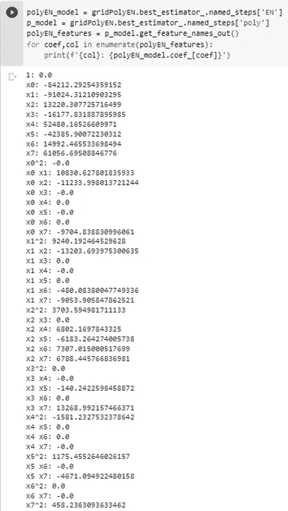

感兴趣的读者可以使用下面提供的代码来试验更大的参数网格，以发现更优的解决方案。

**6.0 结论:**

在本文中，我们讨论了正则化的数学和几何解释。当我们使用线性回归进行推导时，正则化与更灵活的技术一起使用，例如深度神经网络。这个想法和这里讨论的一样。使用一个简单的单变量例子，我们研究了正则化如何控制权重的增长，从而控制模型的灵活性。这减少了方差误差，提高了模型的通用性。另一个公式用于说明套索正则化和脊正则化之间的差异。使用流水线、参数网格字典和 GridSearchCV 是寻找最优正则化参数的有效方法。我们使用加州住房数据集来演示这种方法。正则化是机器学习中非常有用的工具，用于调整高度灵活的模型。

**7.0 参考文献:**

1.[https://sci kit-learn . org/stable/modules/linear _ model . html #普通最小二乘法](https://scikit-learn.org/stable/modules/linear_model.html#ordinary-least-squares)

2.[https://sci kit-learn . org/stable/modules/generated/sk learn . linear _ model。ElasticNet.html](https://scikit-learn.org/stable/modules/generated/sklearn.linear_model.ElasticNet.html)

3.[https://www.kaggle.com/camnugent/california-housing-prices](https://www.kaggle.com/camnugent/california-housing-prices)。(许可:通用公共领域)

4.《R 语言中的统计学习及其应用导论》，作者:James，Witten，Hastie 和 Tibshirani。