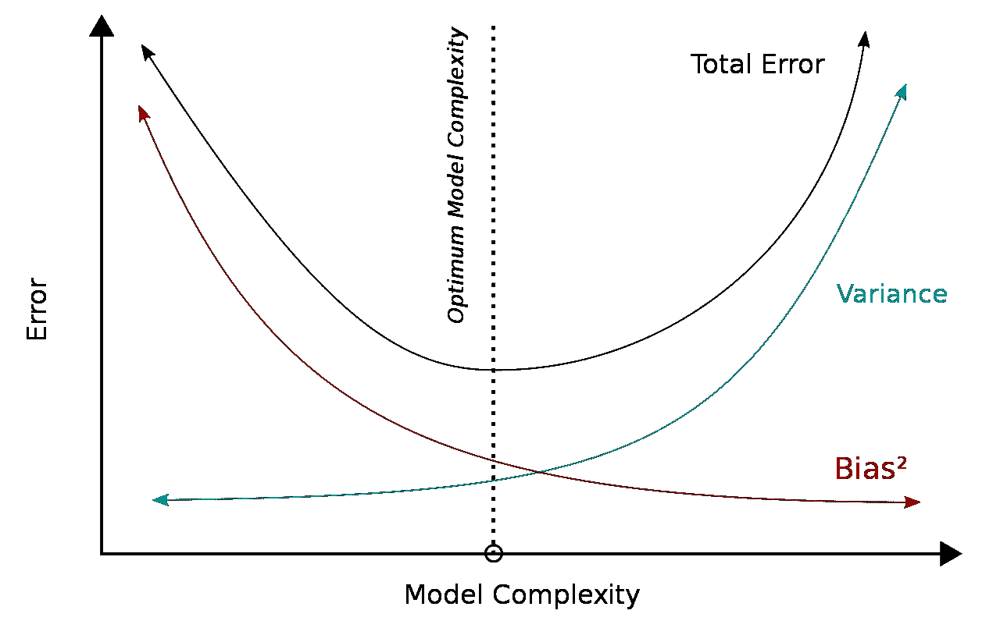

# 用脊线、套索和橡皮筋来调整你的回归模型

> 原文：<https://towardsdatascience.com/regulate-your-regression-model-with-ridge-lasso-and-elasticnet-92735e192e34>

## 什么是正则化技术，我们为什么要使用它们？提供了一个 Python sklearn 示例。

迈克·考克斯在 [Unsplash](https://unsplash.com?utm_source=medium&utm_medium=referral) 上的照片

线性模型有广泛的吸引力。即使对 Excel 有基本的了解，也可以创建解释数据模式的模型。将权重(系数)附加到解释变量(特征)后，在解释数据时就很容易评估单个变量的重要性。毫不奇怪，线性模型已经存在了几十年，并广泛应用于许多领域，从心理学到商业管理，从机器学习到统计学。

尽管线性模型表面上很简单，但许多事情可能会出错。两个特别常见的问题是:

*   **过拟合**。尤其是当具有包含许多解释变量的大型模型时，存在使模型适应噪声的趋势。R 值在训练数据上可能看起来很好，但模型在样本外数据上的表现会差得多。
*   **多重共线性**:在设计解释变量时，它们有可能相互关联(想想卧室的数量和房子的面积)。强烈的多重共线性使得分配适当的权重成为问题。

如果目标是使模型适用于样本外预测，就有解决方案。(*注意:对于统计干扰，它们没有什么意义)*本文讨论了三种常见的正则化技术，用于解决上述问题并创建更鲁棒的预测模型。如果你只是想看 Python 实现(使用 *sklearn* )，跳到最后。

# 线性回归

当我们讨论线性回归时，我们的意思是模型作为统计估计问题是**线性的。线性模型可以简单到`y_salary=θ*x_years_experience+ϵ`(用`θ`权重、`x`特征、`y`因变量、`ϵ`随机噪声)，也可以复杂到[高次多元多项式](/polynomial-regression-an-alternative-for-neural-networks-c4bd30fa6cf6)。尽管基本概念保持不变:模型是解释变量的线性组合。我们通过以最小化模型误差的方式估计权重来拟合模型。**

最常用的回归程序(普通最小二乘法或 OLS)是直观的，包含在许多工具和库中。对于每个数据点，我们可以通过模型计算观察值和预测值之间的差异(误差)。通过拟合直线使得平方误差最小化，平均而言，该模型可以相当好地解释每个数据点。

普通最小二乘回归以最小化预测和观察之间的平方误差的方式选择权重θ。

*技术提示:假设模型本身是正确的，数据点的偏差是随机噪声的结果。*

在线性回归中，通过最小化观察值(红点)和模型(蓝线)之间的差异(MSE)来拟合直线。[图片来自[维基媒体](https://en.wikipedia.org/wiki/Linear_regression#/media/File:Linear_least_squares_example2.png)作者 [Oleg Alexandrov](https://commons.wikimedia.org/wiki/User:Oleg_Alexandrov)

这种情况下用单个解释变量(简单线性回归，`y=θ*x+ϵ`)很容易直观地表现出来。通常，我们处理多个变量(多元线性回归，由`y=∑_i θ_i*x_i+ϵ`定义)。包含许多(潜在)解释变量的大型数据集是最直接的例子。

事实上，我们可以设计任意复杂的特征，例如，当处理高次多项式时。变量可以被变换(例如，将一个变量平方)或组合(例如，将两个变量相乘)。创建任意大的特征集来生成非常大的回归模型并不需要太多的想象力。

虽然不是唯一的潜在原因，**高维模型**(即包含许多特征)往往会引入上述多重共线性和过拟合问题。许多特征可能(在很大程度上)解释了相同的影响，或者某些特征可能被错误地分配来解释某些异常值。此外，许多特征可能几乎没有解释力。

所有这些问题都不是 OLS 回归所能解决的，它只是最小化了误差的平方。相反，我们需要稍微引导一下我们的模型，这就是正则化的作用。

# 正规化

统计模型在偏差和方差之间有一个内在的权衡。在这种情况下，**偏差**描述了源自错误假设的误差，而**方差**指的是由于对噪声敏感而导致的误差。

虽然这里过于简化了，但是高方差通常伴随着多重共线性和/或过度拟合。**规则化**有助于减少方差，代价是(有意)引入一些偏差。虽然在*训练集*上可能比常规回归具有更低的 R 分数，但是当偏差和方差之间达到更适当的平衡时，该模型在*样本外* *数据*上可能表现得更好。

偏差和方差之间的权衡。与普通最小二乘回归相比，正则化模型故意增加偏差以减少方差。最终，目标是最小化总误差[图片来自[WikiMedia](https://en.wikipedia.org/wiki/Bias%E2%80%93variance_tradeoff#/media/File:Bias_and_variance_contributing_to_total_error.svg)by[Bigbossfarin](https://commons.wikimedia.org/wiki/User:Bigbossfarin)

本文讨论了三种最常见的正则化技术:套索、脊和弹性网。

## 套索正则化

LASSO 是*“最小绝对收缩和选择算子”*的缩写。完整的标题实际上是相当描述性的:它旨在通过应用绝对惩罚来选择最强的解释变量。它也被称为 L1 正则化。

套索正则化对权重θ的绝对和乘以用户确定的常数λ进行惩罚

LASSO 主要在处理大量解释变量时有用，我们怀疑其中许多变量没有什么相关性。然后可以应用 LASSO 将权重设置为 0，并将我们的模型缩减为一个更小、更全面的模型。该过程可以迭代地执行(例如，每一步增加λ)，逐渐减小模型的尺寸。

LASSO 的一个潜在缺点是，它倾向于从一组相关变量中只选择一个变量。虽然解决了多重共线性问题，但该模型也可能会以这种方式失去预测能力。此外，当处理以许多解释变量和很少数据点为特征的数据集时(也称为“大 *p* ，小 *n* 的情况)，LASSO 将选择最多 *n* 变量。

总之，LASSO 在缩小回归模型的规模方面可能相当激进，因此应该谨慎使用。

## 岭正则化

罗得西亚脊背龙。照片由 [Gene Jeter](https://unsplash.com/@genejeter?utm_source=medium&utm_medium=referral) 在 [Unsplash](https://unsplash.com?utm_source=medium&utm_medium=referral) 上拍摄

虽然表面上看起来与套索相似，但脊正则化(也称为吉洪诺夫正则化或 L2 正则化)具有明显不同的效果。它还对 OLS 公式应用惩罚，但是惩罚的是*平方*权重，而不是*绝对*权重:

岭正则化惩罚权重的平方和θ乘以用户确定的常数λ

效果比你想象的要强烈。提醒一下，20 =40，2 =4，0.2 =0.04。因此；岭严重惩罚大重量，但小重量实际上是有益的。因此，岭正则化倾向于在整个要素范围内分配许多小的(非零)权重。

你可以想象一个有几个非常高的权重的模型会对相应变量的变化做出剧烈的反应。通过更均匀地分配权重，岭正则化产生了一个“更平滑”的模型，因此得名该过程。

通常，当处理相对较少的解释变量时，我们会使用岭回归。与套索不同，它对特征选择没有帮助。岭回归的主要好处是它倾向于**显著减少方差**。

## 弹性网正则化

和生活中的许多事情一样，平衡是关键。L1 和 L2 的点球都有特定的目的，但是有时候我们两者都想要一点。更具体地说，我们可能希望减少特征的数量，但也希望在剩余的特征之间更稳健地分布权重。这就是弹性网正则化的作用。它只是将 L1 和 L2 的处罚加在一起，并赋予一定的权重:

弹性网正则化包括 L1 和 L2 惩罚，由用户确定的常数λ_1 和λ_2 加权

注意`λ_1`和`λ_2`可以由用户设置，使得**能够平衡 L1 和 L2** 。在极端情况下，您可以应用纯套索回归或岭回归。理想情况下，弹性网络正则化能够选择好的特征并为它们创建鲁棒的模型。然而，它也容易受到套索和山脊的不利影响。弹性网正则化的简单应用会产生很差的结果。

# sklearn 示例

获得一些建模技术的实践经验总是最好的，所以我使用`sklearn`库添加了一个简短的 Python 示例。内置的*加州住房数据集*包含 8 个特征(例如，靠近海洋、卧室数量)和每个地区的房价中值。请注意，我只是使用原始数据集，没有任何调整工作或迭代过程——当然，您可以做得比这好得多。

样本外预测的实际改进超出了这里的范围(即，结果不是很好…)，但是预期的行为在回归系数中是可见的:

`===No regularization===
Weights:
[ 4.33102288e-01 9.32362843e-03 -1.00332994e-01 6.15219176e-01
-2.55110625e-06 -4.78180583e-03 -4.29077359e-01 -4.41484229e-01]
MSE: 0.544
R²: 0.601

===LASSO regularization===
Weights:
[ 1.45469232e-01 5.81496884e-03 0.00000000e+00 -0.00000000e+00
-6.37292607e-06 -0.00000000e+00 -0.00000000e+00 -0.00000000e+00]
MSE: 0.974
R²: 0.286

===Ridge regularization===
Weights:
[ 4.36594382e-01 9.43739513e-03 -1.07132761e-01 6.44062485e-01
-3.97034295e-06 -3.78635869e-03 -4.21299306e-01 -4.34484717e-01]
MSE: 0.543
R²: 0.602

===Elastic net regularization===
Weights:
[ 2.53202643e-01 1.12982857e-02 0.00000000e+00 -0.00000000e+00
9.63636030e-06 -0.00000000e+00 -0.00000000e+00 -0.00000000e+00]
MSE: 0.786
R²: 0.424`

我们看到岭回归使小系数变大了一点。与标准回归相比，R 稍好一些；均方误差略小。套索和弹性网将许多系数设置为 0，表现明显不佳；显然，许多有用的功能都被删除了。

结果表明，盲目地应用正则化技术并不一定会大幅提高你的预测性能；恰恰相反。正规化理论上的好处是显而易见的，但要谨慎行事。

# 关键要点

*   尤其是在处理大量特征(如高维数据)时，**过拟合**和**多重共线性**会在线性回归中造成相当大的问题。
*   **正则化技术**通过惩罚权重分配来帮助创建更鲁棒的模型，当正确应用时，通常会产生更好的样本外预测。它们不适合统计干扰。
*   正则化惩罚被添加到 OLS 回归函数中。与 OLS 相比，他们**故意引入偏差**以减少方差，使模型对噪音和异常值不那么敏感。
*   **套索** (L1)正则化惩罚*绝对*权重之和。因此，许多权重被设置为等于 0。LASSO 有助于从大集合中选择显著特征并创建更简单的模型，但也可能会大大降低预测能力。
*   **山脊** (L2)正则化惩罚*平方*权重之和。结果是，它比 OLS 更倾向于平均分配重量，对某些特征的变化不太敏感。它对选择特征没有帮助。
*   **弹性网**正则化结合了 L1 和 L2 惩罚与一定的权重。在最好的情况下，它产生了紧凑和稳健的回归模型，但它也有许多潜在的缺点。
*   正则化技术的简单应用可能会大大降低回归模型的质量。通常，需要**迭代过程**和某些转换来充分利用它们。

*考虑申请正规化？一定不要犯这种常见的错误:*

  

*对回归感兴趣？你可能也想阅读多项式回归:*

  

# 参考

           