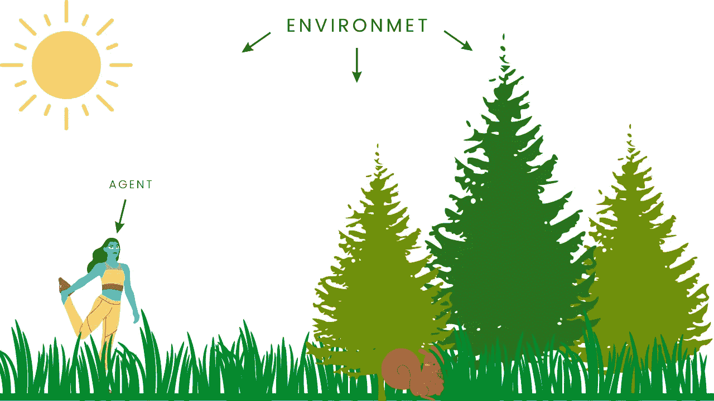
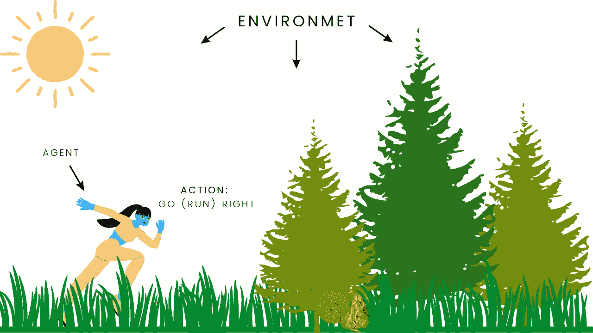
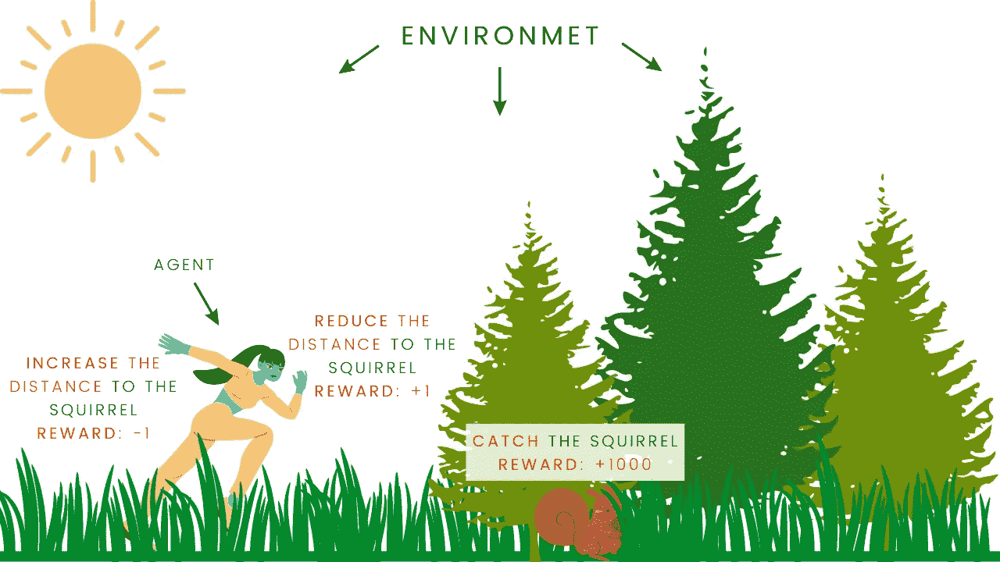
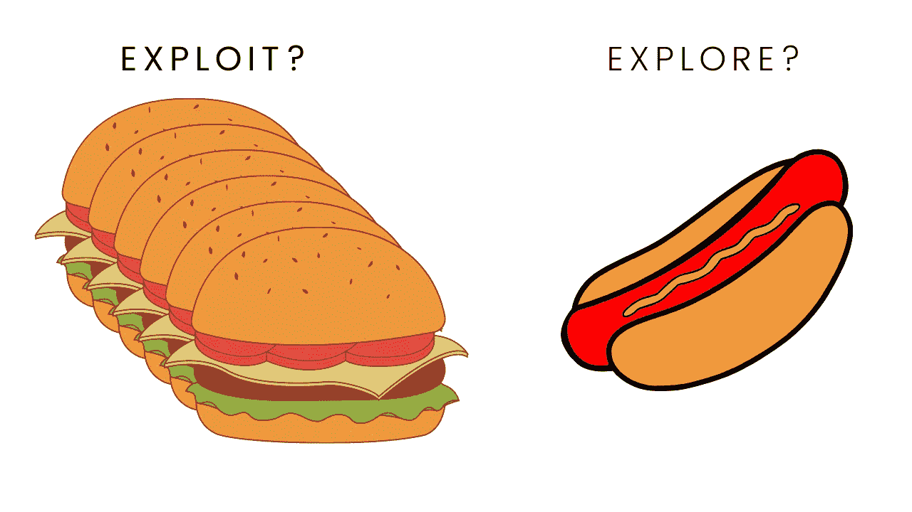

# 强化学习(RL)——什么是强化学习，它是如何工作的？

> 原文：<https://towardsdatascience.com/reinforcement-learning-rl-what-is-it-and-how-does-it-work-1962cf6db103>

## 强化学习

## 对强化学习的温和介绍，对概念和术语有清晰的解释

图片由[皮克斯拜](https://pixabay.com//?utm_source=link-attribution&utm_medium=referral&utm_campaign=image&utm_content=663997)的 Gerd Altmann 提供

# **简介**

与我以前的文章略有不同，这次我将不包括 Python 代码，因为我想避免读者的信息过载。而是简单介绍一下**强化学习(RL)** ，讲解一下**主要思路**和**术语**。

我的后续文章将更深入地研究各个 RL 算法，并提供详细的 Python 示例。因此，记得[订阅](https://solclover.com/subscribe)以便在它们发布时直接发送到你的收件箱。

# 内容

*   机器学习领域中的强化学习
*   什么是强化学习？
    -主体和环境
    -行动空间
    -状态(观察)空间
    -奖励(和折扣因子)
    -探索与剥削
*   训练模型的不同方法
*   摘要

# ML 世界中的强化学习

简单来说，强化学习类似于婴儿如何学习周围环境，或者我们如何训练狗。我们允许他们与环境互动和探索环境，并提供积极/消极的奖励来鼓励特定的行为。

由于 RL 的机器学习方法明显不同于其他类型的 ML，我们将 RL 放在我们的机器学习宇宙图中的一个单独的类别中。

下面的**图是交互式的**，请点击👇在不同的部分探索和揭示更多。

机器学习算法分类。由[作者](https://solclover.com/)创作的互动图表。

***如果你喜欢数据科学和机器学习*** *，请* [*订阅*](https://bit.ly/3sItbfx) *获取我的新文章邮件。如果你不是中等会员，可以在这里加入*<https://bit.ly/36Mozgu>**。**

# *什么是强化学习？*

*强化学习(RL)是一种机器学习算法，用于训练智能**代理**在特定**环境**中通过最大化预期累积**回报来执行任务或实现目标。**这里有几个例子:*

*   *教一个基本的人工智能如何玩电脑游戏，比如雅达利的《太空入侵者》或任天堂的《超级马里奥兄弟》*
*   *教一个更高级的人工智能玩现实生活中的游戏，比如国际象棋或围棋*
*   *教自动驾驶汽车(或模型车)如何在模拟或现实生活环境中驾驶([参见 AWS DeepRacer](https://aws.amazon.com/deepracer/) )*

## *代理和环境*

*RL 中的两个关键组件是**代理**和它的**环境**。**代理**代表一个玩家、一辆汽车或其他可以与其环境互动的“智能角色”。*

*同时，**环境**是代理“生活”或操作的“世界”。*

**

*代理及其环境。作者插图。*

## ***动作空间***

*代理可以**在其环境中执行动作**。例如，马里奥可以做像向左走、向右走、向上跳等事情。，里面是它的超级马里奥游戏关卡。同样的情况也适用于下面我虚构的游戏插图中的代理。*

**

*在其环境中执行动作的代理。作者[插图](https://solclover.com/)。*

*可用的**动作空间**可以是**离散的**或**连续的**。*

*   ***离散动作空间**——就像在超级马里奥兄弟的例子中，代理只能执行有限数量的动作，使其成为离散的。因此，我们总是可以列出所有可用的操作。*
*   ***连续动作空间** —代理可以采取无限数量的动作。例如，自动驾驶汽车可以左转 1 度、1.2 度、1.2432 度等。因此，我们无法列出所有可能的行动。*

## ***状态(观察)空间***

*下一个重要元素是环境的**观察**或**状态**。*

*   *一个**状态**描述了代理从环境中获得的信息。例如在计算机游戏中，它可以是显示代理的确切位置的环境的冻结帧。请注意，**状态是对世界**的完整描述，即完全观察到的环境，就像棋盘的全景。*
*   *一个**观察**是状态的**部分描述，也就是说，它只提供了环境的部分视图。例如，超级马里奥兄弟的冻结帧将仅向我们显示接近代理的部分级别，而不是整个级别。***

*然而，在实践中，**状态和观察是互换使用的**，所以当我们不一定对环境有一个完整的看法时，不要惊讶地看到“状态”这个术语，反之亦然。*

**

*状态 vs 观察。作者[插图](https://solclover.com/)。*

## ***奖励(和折扣系数)***

*也许这个谜题最关键的部分是奖励。我们训练代理采取“最佳”行动，根据行动是否使代理更接近实现特定目标，给予积极、中立或消极的奖励。*

*假设我们在玩一个游戏，目标是抓一只松鼠。代理将从随机探索它的环境开始，如果它靠近松鼠，我们将奖励代理(+1 分)，如果它远离松鼠，我们将“惩罚”(-1 分)。最后，当代理实现了它的目标，也就是抓到了松鼠，我们会给一个很大的奖励(+1000)。*

*只要采取随机行动并获得相应的奖励，代理人就可以了解需要做什么来使**的累积奖励**最大化，并使**实现目标**。*

**

*奖励是给代理的，所以它学习如何实现游戏的目标。作者插图。*

*请注意，本例中的奖励值仅用于说明目的。我们在做强化学习的时候，往往会选择**创建自己的奖励函数**。通常，你的奖励函数的“质量”将是你的模型成功的重要驱动因素(例如，查看[奖励函数如何在 AWS DeepRacer 竞赛中使用](https://docs.aws.amazon.com/deepracer/latest/developerguide/deepracer-console-train-evaluate-models.html))。*

*奖励的另一个重要方面是**折扣系数(gamma)** 。它的范围可以在 0 到 1 之间，但我们通常会选择 0.95 到 0.99 之间的值。折扣系数的目的是让我们控制对短期和长期回报的偏好。*

*例如，在国际象棋比赛中，抓住对手棋子的一步棋会得到奖励。然而，我们不希望经纪人优先考虑这一举动，如果这让我们长期处于亏损的境地。因此，平衡短期和长期回报至关重要。*

## *探索与开发*

*我们要学习的最后一个概念是探索和开发之间的权衡。我们通常希望鼓励代理**对其环境进行某种程度的探索**，而不是将全部时间**用于开发其已有的知识**。*

*一个简单的现实生活中的例子是选择午餐。假设你是汉堡的超级粉丝，每天午餐都吃汉堡。因此，你是在**利用现有的知识(你对汉堡的口味)**。*

*然而，你也可以在你的日常生活中增加一个**的探索元素**。例如，你可以偶尔尝试不同的食物，比如热狗或烤肉串。当然，通过探索，你会有失望的风险(负面体验/回报)，但你也会发现一些你可能比汉堡更喜欢的东西(正面体验/回报)。*

**

*探索与开发。作者[插图](https://solclover.com/)。*

*在强化学习的背景下，我们希望鼓励代理花部分时间去探索。否则，代理可能会不断重复相同的动作，而没有意识到还有更好的动作要做。我们通过一个**附加参数(ε)**做到这一点。我们指定代理在多大比例的情况下应该采取**随机行动(即探索)**。*

****

# ***训练你的模型的不同方法***

*当我们使用强化学习时，我们希望训练代理采取“最佳”行动来实现其目标。我们称之为 **Policy(𝜋)** 。它有点像代理的“大脑”。*

*例如，如果我们想教一个代理如何玩电脑游戏，它需要学习在每种情况下采取什么行动。换句话说，我们希望**找到一个最优的 Policy(𝜋)** ，从长期来看，它能带来尽可能高的回报。*

*要找到最佳策略，我们可以使用以下方法之一:*

*   ***基于策略的方法** —我们直接训练代理在哪个状态下采取什么行动。*
*   ***基于价值的方法** —我们训练代理识别哪些状态(或状态-动作对)更有价值，因此它可以由价值最大化来指导。例如，在捕捉松鼠的游戏中，站在离松鼠一步远的地方会比站在十步远的地方描述更有价值的状态。*

*我将在接下来的文章中更详细地介绍每种方法，因为我们将更深入地研究各种 RL 算法，并学习如何用 Python 对它们进行编码。*

# ***总结***

*概括地说，我们已经了解到，强化学习用于教导**代理**在其**环境**中操作，并通过根据代理在不同**状态**下采取的**动作**向代理提供积极的、中立的或消极的**奖励**来实现目标或目的(例如，赢得一场游戏)。*

*我们通过指定随机选择代理的行动比例来平衡**探索**与**开发**，并且我们应用**折扣因子(gamma)** 来控制代理对短期与长期回报的偏好。*

*最后，我们通过优化 **Policy(𝜋、**来训练模型(教导代理人)，我们可以通过**基于直接政策的方法**或**基于间接价值的方法**来完成。*

*在我的下一篇文章中，我将带您了解 **Q-learning** 算法(**基于值的方法**)，并向您展示如何在 Python 中使用它来训练一个代理在一个名为[冰封湖](https://www.gymlibrary.dev/environments/toy_text/frozen_lake/?highlight=frozen+lake)的简单游戏中从头到尾成功导航。*

**

*Gif 图片由[作者](https://solclover.com/)使用[开放 AI 的健身房 Python 库](https://www.gymlibrary.dev/environments/toy_text/frozen_lake/?highlight=frozen+lake)内的冰湖游戏的组件创建。*

*请不要忘记关注并[订阅](https://solclover.com/subscribe)，这样你就不会错过和我一起探索强化学习的乐趣。*

*干杯！🤓
索尔·多比拉斯*

****如果你已经花光了这个月的学习预算，下次请记得我。*** *我的个性化链接加入媒介:**

*<https://bit.ly/3J6StZI> *