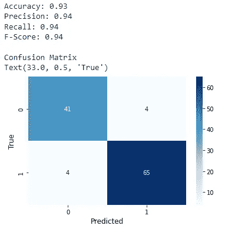
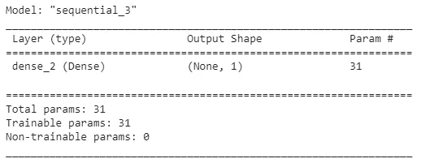
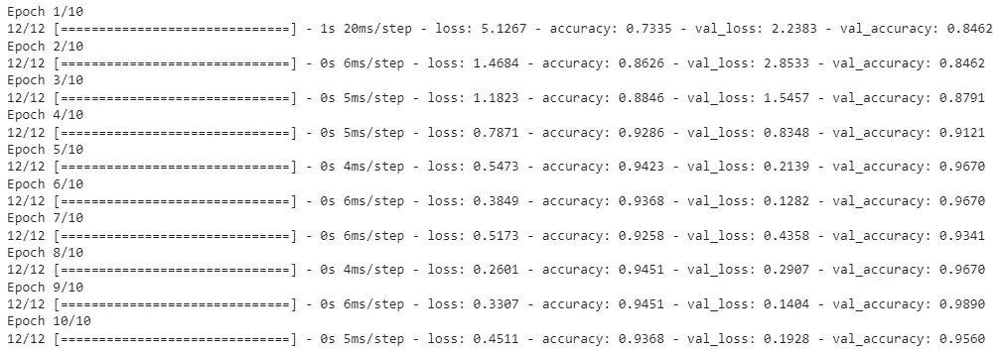
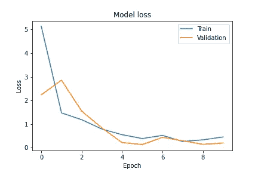

# 在 Keras 中将逻辑回归模型复制为人工神经网络

> 原文：<https://towardsdatascience.com/replicate-a-logistic-regression-model-as-an-artificial-neural-network-in-keras-cd6f49cf4b2c>

## 神经网络和深度学习课程:第 11 部分


图片来自 [Pixabay](https://pixabay.com/?utm_source=link-attribution&utm_medium=referral&utm_campaign=image&utm_content=475664) 的 [Gerd Altmann](https://pixabay.com/users/geralt-9301/?utm_source=link-attribution&utm_medium=referral&utm_campaign=image&utm_content=475664)

逻辑回归是一个非常简单的神经网络模型，没有隐藏层，正如我在我的[神经网络和深度学习课程](https://rukshanpramoditha.medium.com/list/neural-networks-and-deep-learning-course-a2779b9c3f75)的[第 7 部分](https://rukshanpramoditha.medium.com/logistic-regression-as-a-very-simple-neural-network-model-923d366d5a94)中解释的那样。

这里，我们将使用 Scikit-learn 和 Keras 包构建相同的逻辑回归模型。Scikit-learn `LogisticRegression()`类是构建逻辑回归模型的最佳选择。然而，我们可以用神经网络思维在 Keras 中构建相同的模型，因为逻辑回归模型在技术上可以被视为 ANN。

编写本教程的主要目标是:

1.  比较使用两个不同库构建的相同逻辑回归模型的性能。
2.  建立一个 Keras 序列模型。
3.  熟悉 Keras 类中的一些`import`约定。
4.  使用 Keras 顺序模型实例的`summary()`、`compile()`、`fit()`和`evaluate()`方法。
5.  在模型训练和评估中，绘制每个时期的损失和准确性分数。

在本文的结尾，你将能够用神经网络的思维方式建立一个逻辑回归模型，并使用数值和可视化技术评估它的性能。

## 关于我们使用的数据

这里，我们使用 1995 年 11 月创建的 [Scikit-learn 乳腺癌威斯康星州数据集](https://scikit-learn.org/stable/modules/generated/sklearn.datasets.load_breast_cancer.html)。

*   **数据集来源:**你可以在这里下载原始数据集[。](https://archive.ics.uci.edu/ml/datasets/Breast+Cancer+Wisconsin+(Diagnostic))
*   **数据集许可:**这个数据集是捐赠给公众的。它属于 **CC0:公共领域**许可。你可以在这里找到关于那种许可证[的更多信息。](https://creativecommons.org/publicdomain/zero/1.0/)
*   创作者:威廉·h·沃尔伯格博士，w·尼克街，奥尔维·l·曼加萨里安
*   **捐赠者:**尼克街
*   **数据集描述**:该数据集包含目标列在内共 31 个变量。你可以在这里找到每个变量[的描述。](https://scikit-learn.org/stable/datasets/toy_dataset.html#breast-cancer-dataset)

让我们看看整个数据集的概况。

**加载乳腺癌数据集**(作者代码)


**乳腺癌数据集**的一部分(图片作者提供)

```
df.shape
```

这将返回(569，30)。数据集有 569 个观察值(行)和 30 个变量。这里不包括目标列。它有 0 和 1，代表两个类。

```
df.isnull().sum().sum()
```

这将返回 0。这意味着数据集中没有缺失值。

## 制作 X、y、训练和测试集

让我们创建 X 和 y，特征矩阵和目标向量。

```
X = df
y = pd.Series(cancer.target)
```

现在，我们创建训练集和测试集。我们将总数据的 20%分配给测试集。

**制作列车和试验部件**(作者代码)

## 用 Scikit-learn 建立逻辑回归模型

现在，我们使用 Scikit-learn `LogisticRegression()`类在乳腺癌数据集上构建逻辑回归模型。我们通过使用多种度量标准来评估我们的模型。

**在 Scikit-learn 中构建逻辑回归模型**(作者代码)



**上述模型的输出**(图片作者)

# 用 Keras 中的神经网络思维模式构建相同的逻辑回归模型

这是我们今天要强调的主要话题。这里，我们将构建一个可以复制上述逻辑回归模型的人工神经网络。整个过程分为如下 8 个步骤。

## 步骤 1:定义神经网络架构

在这里，我们建立一个序列模型。顺序模型只不过是一层层的堆叠。输入层、隐藏层和输出层按顺序堆叠在模型中。这是一种人工神经网络。更多详情，请阅读[本](https://rukshanpramoditha.medium.com/implicit-and-explicit-input-layers-in-keras-sequential-models-733049f83a32#:~:text=What%20is%20a%20sequential%20model%3F)。

我们的模型没有隐藏层！它只有输入层和输出层。输入层有 30 个节点(神经元),与数据集中的要素数量相等。输入层不需要激活。输出层只有一个节点，这里使用了 sigmoid 激活函数，因为我们正在执行二元分类(逻辑回归)任务。

## 步骤 2:实例化 Keras Sequential()类的模型

```
from keras.models import Sequential
ANN_model = Sequential()
```

## 步骤 3:向顺序模型添加层

一旦实例化，就可以使用`add()`方法将层添加到现有模型中。这里，我们[通过使用 Keras `InputLayer()`类显式添加输入层](https://rukshanpramoditha.medium.com/implicit-and-explicit-input-layers-in-keras-sequential-models-733049f83a32#:~:text=We%20can%20use%20the%20InputLayer()%20class%20to%20explicitly%20define%20the%20input%20layer%20of%20a%20Keras%20sequential%20model.)。使用 Keras `Dense()`类添加输出层。两者都是 ***全连通*** (也叫*)层。在输出层中使用 sigmoid 激活。*

```
*from tensorflow.keras.layers import InputLayer
from tensorflow.keras.layers import DenseANN_model.add(InputLayer(input_shape=(30, )))
# No hidden layers
ANN_model.add(Dense(1, activation='sigmoid'))*
```

## *第四步:获取模型的概要*

```
*ANN_model.summary()*
```

**

*(图片作者)*

*在我们的模型中有 31 个可训练参数。在训练期间，这些参数的值被更新，直到损失函数被最小化。请注意，这里没有显示输入层。*

## *步骤 5:编译模型*

*在此步骤中，我们将配置培训步骤中所需的学习参数。这里，我们指定在训练过程中使用的优化器、损失函数和模型评估度量的类型。*

```
*optimizer=tf.keras.optimizers.Adam(learning_rate=0.05)ANN_model.compile(optimizer=optimizer,
                  loss='binary_crossentropy',
                  metrics=['accuracy'])*
```

*这里，我们使用学习率为 0.05 的 **Adam** 优化器。学习率显著影响我们模型的输出。所以，你可以随意改变这个值，观察不同的结果。随着课程的进行，你将学会如何选择最佳的学习速度。*

***二元交叉熵**(也称为 ***对数损失*** )是默认的损失函数，用于在训练期间测量二元(两类)分类问题的性能。*

***准确性**度量用于评估二进制分类问题对测试数据的性能。*

## *第六步:拟合模型*

*现在，模型已经为使用`fit()`方法进行训练做好了准备。这里，我们需要为`fit()`方法提供训练数据。*

*调用`fit()`方法的输出包含一些在训练过程中收集的有用信息，并保存在 ***历史*** 变量中。该信息包括在每次迭代(时期)之后计算的损失和任何其他度量分数。我们可以使用它们来绘制模型性能与历元数的关系图。*

```
*history = ANN_model.fit(X_train, y_train, 
                        epochs=10, batch_size=32,
                        validation_split=0.2, 
                        shuffle=False)*
```

*我们为训练数据提供`X_train`、`y_train`。我们定义了 10 个时期，以便优化器遍历整个训练数据集 10 次。一个**时期**是对整个训练数据集的迭代。每批训练数据包含 32 个训练样本，因为我们定义`batch_size`为 32。大约有(569/32)个批次。要了解更多关于批次大小和时期的信息，请阅读[此](https://rukshanpramoditha.medium.com/overview-of-a-neural-networks-learning-process-61690a502fa#:~:text=The%20batch%20size%20and%20epochs)。*

*`validation_split`是可选参数。如果包括的话，一部分训练数据被保留在一边以在每个时期之后验证模型。将分别计算培训和验证部分的损失和任何其他指标分数。*

**

***神经网络模型的输出**(图片由作者提供)*

*当我们想要根据时期的数量来评估模型性能时,`validation_split`参数非常有用。我们可以忽略这个论点，或者在使用`evaluate()`方法和训练数据进行训练后评估我们的模型。*

## *步骤 7:绘制模型在训练过程中的表现*

*现在，我们绘制模型性能与历元数的关系图。我们使用在训练期间计算的训练和验证部分的损失和准确性分数。所有这些都存储在 ***历史*** 变量中作为字典的值。你通过调用`history.history`得到全部。*

```
*# Plot training and validation accuracy scores
# against the number of epochs.
plt.plot(history.history['accuracy'], label='Train')
plt.plot(history.history['val_accuracy'], label='Validation')
plt.ylabel('Accuracy')
plt.xlabel('Epoch')
plt.title('Model Accuracy')
plt.legend(loc='upper left')*
```

**

*(图片由作者提供)*

```
*# Plot training and validation loss scores
# against the number of epochs.
plt.plot(history.history['loss'], label='Train')
plt.plot(history.history['val_loss'], label='Validation')
plt.ylabel('Loss')
plt.xlabel('Epoch')
plt.title('Model Loss')
plt.legend(loc='upper right')*
```

**

*(图片由作者提供)*

## *步骤 8:根据测试数据评估模型*

*请注意，我们还没有根据测试数据评估我们的模型。在我们的例子中，我们可以通过使用返回 ***test_loss*** 和 ***test_acc*** 分数的`evaluate()`方法来轻松实现。*

```
*test_loss, test_acc = ANN_model.evaluate(X_test, y_test)
print("Test loss:", test_loss)
print("Test accuracy:", test_acc)*
```

**

*(图片由作者提供)*

*由该 ANN 模型返回的准确度分数更接近于先前由逻辑回归模型返回的准确度分数。*

# *摘要*

*我们也可以对训练数据使用`evaluate()`方法。这是在`fit()`方法中指定`validation_split`参数的替代方法。*

*即使对于一个简单的 ANN 模型，我们也需要为下面的[超参数](https://rukshanpramoditha.medium.com/parameters-vs-hyperparameters-what-is-the-difference-5f40e16e2e82)指定最佳值，这些超参数控制可训练参数的值( **W** s 和 **b** s)。*

*   *网络中的层数*
*   *每层中的节点数量(也称为层大小)*
*   *损失函数的类型*
*   *优化器的类型*
*   *评估指标的类型*
*   *激活功能的类型*
*   *批量*
*   *纪元*
*   *学习率*

*当执行我在这里包含的代码时，不同的执行会得到不同的结果。这是因为算法中包含的随机性。您可以通过如下设置随机种子来获得静态结果。*

```
*import numpy as np
import tensorflow as tfnp.random.seed(42)
tf.random.set_seed(42)*
```

*今天的帖子到此结束。*

*如果您有任何问题或反馈，请告诉我。*

*我希望你喜欢阅读这篇文章。如果你愿意支持我成为一名作家，请考虑 [***注册会员***](https://rukshanpramoditha.medium.com/membership) *以获得无限制的媒体访问权限。它只需要每月 5 美元，我会收到你的会员费的一部分。**

*[](https://rukshanpramoditha.medium.com/membership) [## 通过我的推荐链接加入 Medium

### 作为一个媒体会员，你的会员费的一部分会给你阅读的作家，你可以完全接触到每一个故事…

rukshanpramoditha.medium.com](https://rukshanpramoditha.medium.com/membership) 

非常感谢你一直以来的支持！下一篇文章再见。祝大家学习愉快！* 

*[鲁克山普拉莫迪塔](https://medium.com/u/f90a3bb1d400?source=post_page-----cd6f49cf4b2c--------------------------------)
**2022–05–19***