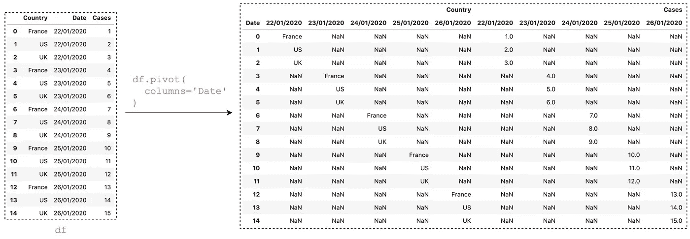
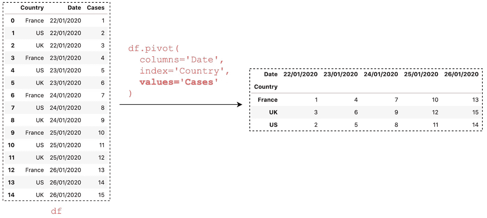
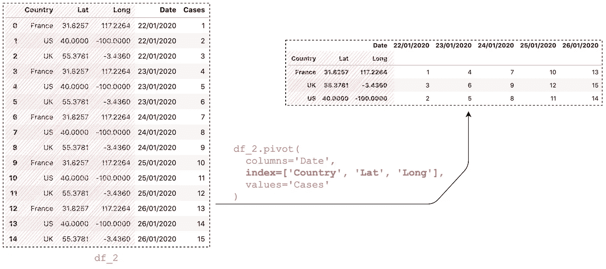
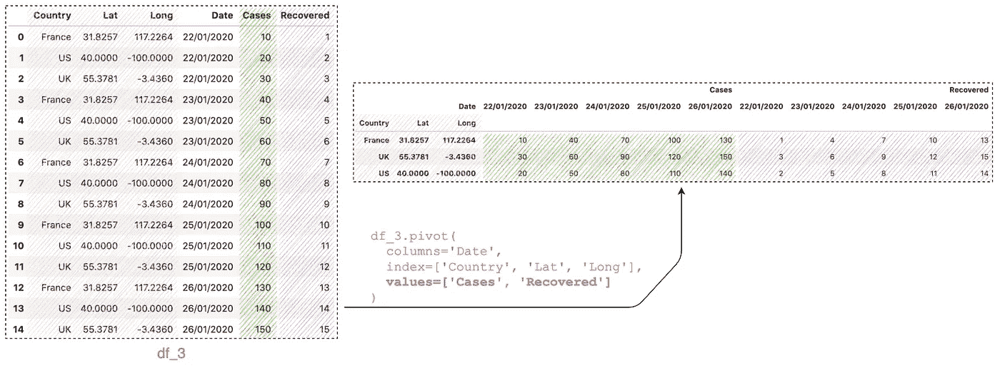
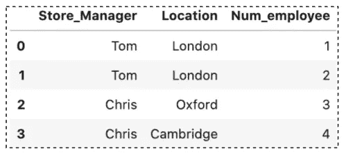

# 使用 pivot()将数据帧从长格式改为宽格式

> 原文：<https://towardsdatascience.com/reshaping-a-dataframe-from-long-to-wide-format-using-pivot-b099930b30ae>

## 介绍 Pandas pivot()以及如何使用它将数据帧从长格式转换为宽格式


[Josh Hild](https://unsplash.com/@joshhild?utm_source=unsplash&utm_medium=referral&utm_content=creditCopyText) 在 [Unsplash](https://unsplash.com/s/photos/photo-wall?utm_source=unsplash&utm_medium=referral&utm_content=creditCopyText) 上拍摄的照片

> *当您处理包含具有某种序列的变量的数据集时，例如时间序列数据，通常需要进行整形。*
> 
> *来源于弗吉尼亚大学研究数据服务部[1]*

在之前的[文章](/reshaping-a-dataframe-using-pandas-melt-83a151ce1907)中，我们已经讨论过使用 Pandas `[melt()](/reshaping-a-dataframe-using-pandas-melt-83a151ce1907)`将数据从宽格式重塑为长格式。在实践中，我们也经常需要完全相反的操作——将数据从长格式转换为宽格式。这就是熊猫`pivot()`来帮忙的地方。简而言之，熊猫`pivot()`与`[melt()](/reshaping-a-dataframe-using-pandas-melt-83a151ce1907)`完全相反。

在本文中，我们将探索如何使用 Pandas `pivot()`方法将数据帧从长格式重塑为宽格式。本文涵盖以下主题:

1.  最简单的`pivot()`
2.  指定`index`
3.  多列
4.  多重值
5.  任何重复的值错误
6.  `pivot()`和`pivot_table()`的区别

> 源代码请查看[笔记本](https://github.com/BindiChen/machine-learning/blob/main/data-analysis/049-pandas-pivot/pivot.ipynb)。更多教程可从 [Github Repo](https://github.com/BindiChen/machine-learning) 获取。

# 1.简单`pivot()`

最简单的`pivot()`必须有一个`columns`值，该值用于指定生成新 DataFrame 的列的列。在我们的例子中，让我们使用**日期**列。

```
df.pivot(**columns='Date'**)
```

但是，这个输出往往包含大量的`NaN`。这是因为如果没有指定，`pivot()`中的`values`参数将使用剩余的列来填充新 DataFrame 的值。



最简单的 pivot()(图片由作者提供)

结果往往没有太大意义，所以一般用例至少指定了`index`。

# 2.指定`index`

将`index`设置为`'Country'`后，您应该会得到如下结果:

```
df.pivot(columns='Date', **index='Country'**)
```


熊猫透视()带列和索引(图片由作者提供)

有了`index='Country'`，结果数据帧不再有`NaN`。这似乎很神奇，但是对于这个特殊的例子，剩下的列只有 **Cases** 列，而 **Country** 列包含分类数据。

您可能会注意到，结果具有分层索引列**案例**和**日期**(也称为多索引列)。我们可以显式指定`values`参数来消除它:

```
df.pivot(columns='Date', index='Country', **values='Cases'**)
```



熊猫透视()带列和索引(图片由作者提供)

# 3.多列

与相反的方法 Pandas `melt()`类似，我们可以指定多个列，将它们作为输出中的列。例如，如果我们想保留**国家**、**纬度**和**经度**作为列，以便更好地参考:

```
df_2.pivot(
    columns='Date', 
    **index=['Country', 'Lat', 'Long'],** 
    values='Cases'
)
```



多列熊猫透视()

# 4.多重值

类似地，我们可以向`values`参数传递一个列表，以便并排查看不同的类别:

```
df_3.pivot(
    columns='Date', 
    index=['Country', 'Lat', 'Long'], 
    **values=['Cases', 'Recovered']**
)
```



具有多个值的熊猫透视()

# 5.任何重复的值错误

现在，让我们来看一个具有重复值的数据帧。

```
df = pd.DataFrame({
    "Store_Manager": ['Tom', 'Tom', 'Chris', 'Chris'],
    "Location": ['London', 'London', 'Oxford', 'Cambridge'],
    "Num_employee": [1, 2, 3, 4]
})
```



当执行下面的语句时，您将得到一个 **ValueError** 。这是因为前两行对于`index`和`columns`参数是相同的。

```
df.pivot(
    **index='Store_Manager', 
    columns='Location',** 
    values='Num_employee'
)
```


我们可以使用`[pivot_table()](/a-practical-introduction-to-pandas-pivot-table-function-3e1002dcd4eb)`来解决这个问题。但是请记住，默认情况下，`[pivot_table()](/a-practical-introduction-to-pandas-pivot-table-function-3e1002dcd4eb)`将执行 ***均值*** 聚合。例如，运行下面的语句，你会得到一个输出显示" ***Tom*** *在伦敦平均有 1.5 名雇员"*。

```
df.pivot_table(
 **index='Store_Manager', 
    columns='Location',** 
    values='Num_employee'
)
```


# 6.`pivot()`和`pivot_table()`的区别

基本上，`[pivot_table()](/a-practical-introduction-to-pandas-pivot-table-function-3e1002dcd4eb)`函数是允许执行聚合的`pivot()`函数的推广。

`pivot()`的主要使用案例有:

1.  如果您需要透视一个表并显示没有任何聚合的值。
2.  您希望将数据帧从长格式转换为宽格式

当您正在寻找一种从数据中获取洞察力并执行聚合的方法时，`[pivot_table()](/a-practical-introduction-to-pandas-pivot-table-function-3e1002dcd4eb)`应该是最佳选择。如果你想了解更多关于`pivot_table()`的信息，请查看这篇文章:

</a-practical-introduction-to-pandas-pivot-table-function-3e1002dcd4eb>  

# 结论

在本文中，我们已经讨论了`pivot()`的 5 个用例，并讨论了`pivot()`和`[pivot_table()](/a-practical-introduction-to-pandas-pivot-table-function-3e1002dcd4eb)`的区别。在数据预处理和探索性数据分析过程中，这是一个非常方便且最受欢迎的方法之一。

重塑数据是数据科学中一项重要的基本技能。我希望你喜欢这篇文章，并学到一些新的有用的东西。

感谢阅读。请查看[笔记本](https://github.com/BindiChen/machine-learning/blob/main/data-analysis/049-pandas-pivot/pivot.ipynb)获取源代码，如果您对机器学习的实用方面感兴趣，请继续关注。更多教程可从 [Github Repo](https://github.com/BindiChen/machine-learning) 获得。

## 参考

*   [1]弗吉尼亚大学:[研究数据服务+科学](https://data.library.virginia.edu/stata-basics-reshape-data/)