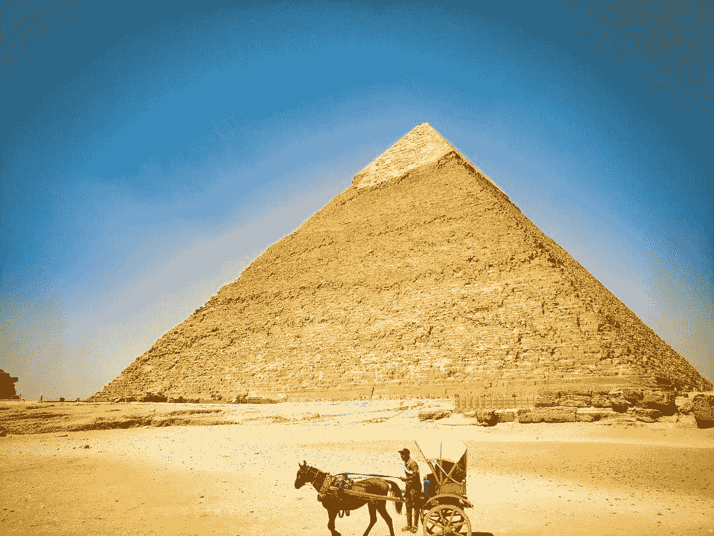
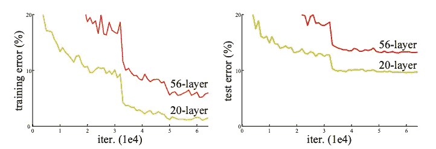
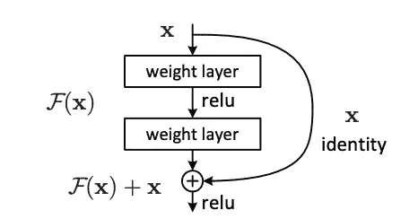
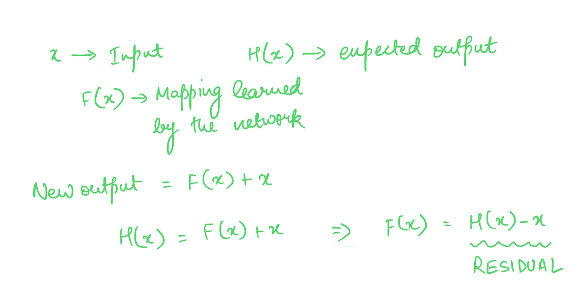
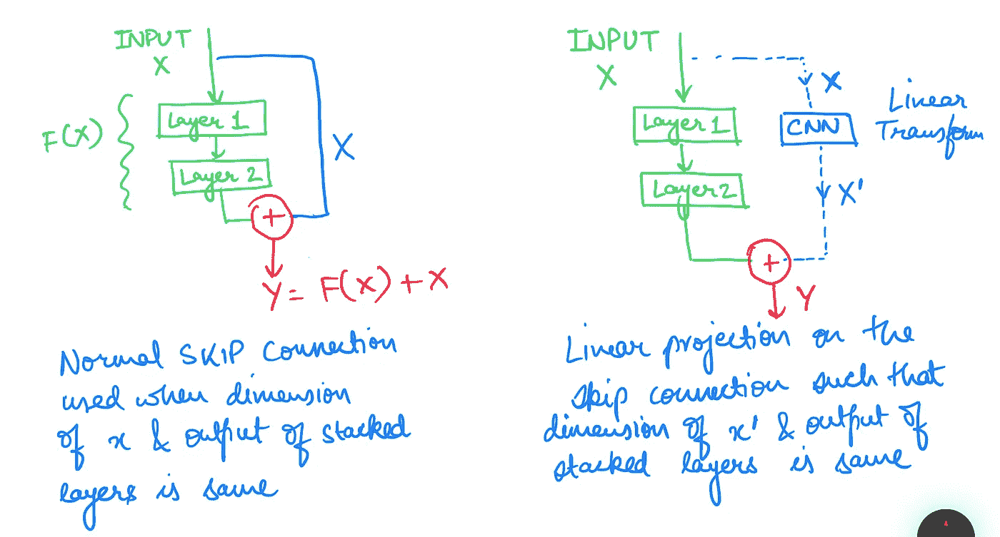
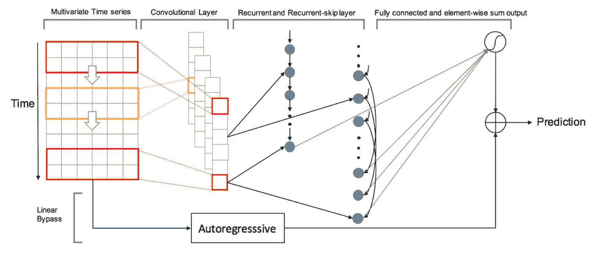

# 深度学习中的剩余块

> 原文：<https://towardsdatascience.com/residual-blocks-in-deep-learning-11d95ca12b00>

## ResNet 论文中首次引入的残差块解决了神经网络退化问题

图 0:随着深度神经网络的深入，其退化的真实生活模拟(图片由作者提供)

深度神经网络是主要机器学习算法的发电站。这些神经网络是堆叠层(每层有一些神经元)的集合，它们组合起来执行给定的任务。因此，随着我们将更多的层堆叠在一起，即更深或增加模型的深度，我们期望提高性能。

但是，这些深度神经网络受到退化问题的困扰。那么神经网络中的退化到底是什么？如何解决这个问题？这些是残余块破译的一些问题。

在这篇博客中，我们将学习以下一组基本概念(按顺序排列),这些概念增强了数据科学领域的创新能力。

1.  深度神经网络简介
2.  深度神经网络中的退化问题
3.  剩余块(解决问题的方法)
4.  身份功能
5.  不同类型神经网络中的剩余块
6.  结论

让我们开始…

但是，在开始之前，如果你希望更深入地了解卷积(残差块是在牢记卷积神经网络的基础上开发的)，请阅读下面的博客:[https://towardsdatascience . com/computer-vision-convolution-basics-2d 0 AE 3b 79346](/computer-vision-convolution-basics-2d0ae3b79346)

# **深度神经网络简介**

图 1:用于二元分类的深度神经网络(图片由作者提供)

上图代表了一个由层叠 CNN 组成的深度神经网络，对输入图像进行二值分类(是或否)。

所以我们把输入看作**‘x’**，输出看作**“H(x)**。CNN 操作本质上是线性的，并且激活函数(假设 relu)用于学习抽象特征(非线性)。这个网络的全部目的是找到最佳映射(拟合)，即函数

> F(x) -> H(x)

现在，如果我们想提高模型性能，堆叠更多的层有帮助吗？理想情况下，它应该提高性能，因为更多的神经元可用于学习抽象特征。但这并不是每次都管用。该网络面临多个问题，第一个是消失/爆炸梯度的问题。这个问题可以通过规格化初始化和中间规格化层、权重裁剪等等来有效解决。它使模型能够开始收敛于具有反向传播的随机梯度下降(或任何其他优化器)。

> 一旦更深的模型开始收敛(在考虑消失/爆炸梯度之后)，我们可能会有另一个问题。是**退化**。

# 深度神经网络中的退化问题

那么到底什么是退化呢？

随着我们增加网络的深度，精确度会饱和。也许这些层已经充分了解了我们数据的所有复杂性。但是，我们对精度不满意，我们又叠加了几层。现在，模型开始退化。这是意料之外的，但这种退化不是因为过拟合(训练误差增加)。附加层导致更高的训练误差。

图 2:训练错误(左)和测试错误(右)。Red 是更深的网络，并且具有更高的训练和测试误差。(图片由[明凯](https://arxiv.org/pdf/1512.03385.pdf)提供)

退化间接暗示了并非所有的系统都是相似的或容易优化的。如果浅层网络正在学习特征，假设获得 90%的准确性，那么同一模型的深层变体甚至可能获得低于 90%的准确性。这是因为随着网络深度的增加，优化变得非常困难。

那么，如何解决这个问题呢？

# 残留块(消除退化的方法)

让我们考虑两个网络，网络**“A”**:浅层网络和网络**“B”**:网络 A 的更深层对等物。现在，如果不是更好，至少我们希望实现与网络 B 相同的性能。因此，给定网络 A，我们将添加身份映射作为额外的层来构造 B。这种设置应确保更深层的模型 B 不会比其更浅层的对等物产生更高的训练错误。但是实验表明，这种设置无法找到相对更好或相同性能的解决方案。

这证明了模型在优化期间学习身份映射是非常困难的。

为了解决退化的问题，我们有一个叫做**跳跃连接**的设置。或者称为快捷连接，它跳过架构中的一些层，并将前一层的输出提供给当前位置，从而有助于优化。

图 3:跳过连接的剩余块(图片由[明凯](https://arxiv.org/pdf/1512.03385.pdf)提供)

在上图中，skip-connection 跳过两层，直接将输入“x”作为输出。这被称为快捷方式/跳过连接，因为它不涉及任何额外的参数，因为我们只是将先前的信息传递给层。

一个称为深度剩余学习的框架用于解决退化问题。

在前面的部分中，我们学习了网络学习正确的映射，即 F(x) -> H(x)，其中 x 是输入，H(x)是要拟合的底层映射(预期输出)，我们尝试拟合网络并获得类似 H(x)的 F(x)。

现在，如果我们在同一个设置中添加一个跳过连接(作为身份函数)，我们会得到以下等式:

图 4:带有残差块的网络的更新方程(图片由作者提供)

从上图中，我们有了一个新的 F(x)，即残差(预期输出和输入之间的差)。堆叠层尝试学习残差和 ta-da 的映射！这就是它被称为残余块的原因。

原来的映射 F(x) -> H(x)现在是 H(x)-x(剩余)。堆叠的非线性层试图拟合残差。

图 5:带有残余块的前向传播(图片由作者提供)

图 5 证明了跳过连接只是执行身份映射。它们的输出被添加到堆叠层的输出中，并且由于某种原因，如果 F(x)趋向于零，则由于身份映射，我们的模型将仍然具有非零权重。这消除了退化。

考虑一个神经网络，其中一些堆叠的层增加了值，而一些层仅仅为零。但是由于残留块，我们能够保持权重并不断优化和获得更好的精度。为此，将残差 F(x)推至零比通过一堆非线性层拟合身份映射更容易。跳过连接是消除更深层神经网络退化的一种幸事。

> 残差块的整个思想来源于这样一个假设，如果多个非线性层可以逼近复杂函数，那么等价于假设它们也可以逼近残差函数，即 H(x)-x。

现在，如果 x 和 F(x)的维数不同呢？

# 身份映射

快捷连接(身份映射)既不引入额外的参数，也不增加计算复杂度。

*y =* F(x，{Wi}) *+ x，*其中 x 是身份映射

但是，如果身份映射和堆叠层的维度不同，那么我们就不能添加它们。为了解决这个问题，我们在身份函数中执行线性投影(使用 CNN)或额外的零条目(称为填充)来匹配维度。我们有以下等式:

y = F(x，{Wi}) + W*x，其中 W 是线性投影

图 6:跳过连接的残差块(左)和线性变换跳过连接的残差块(右)以匹配维度(图片由作者提供)

通常，残差函数具有两个或三个堆叠层，然而更多层是可能的，但是它可以减少残差块的影响。但是，如果 F(x)只有一层，它非常类似于线性层，因此:

*y = W1*x + x*

这种设置无助于解决退化问题。因此，我们可以假设，通常一个残差块有 2-3 个堆叠层，并有一个跳跃连接。我们可以使用堆叠的剩余块来创建更深层次的神经网络。

终于！！我们已经学习了使更深层次的神经网络能够优化和继续学习的残差块。

# 不同神经网络中的剩余块

所以，我们只是在一个简单的神经网络上探索了剩余块。但是，我们如何应用相同的块来解决计算机视觉任务，准确地说是卷积神经网络，或者解决使用顺序网络的任务。

残差块可以在没有任何修改的情况下与卷积神经网络一起使用。在 CNN 中，堆叠层的输出会发生变化，但方法完全相同。

对于时序网络，我们有一个称为**高速公路网络的网络。**高速公路网是附加大门的捷径连接。这些门是数据相关的，并且有一些参数，而剩余网络中的快捷连接没有任何参数。这些门决定是否传递信息。它作为一个调制跳跃连接来调节信息流。这些网络受 **LSTM 式**网络的启发，在那里我们有多个门来遗忘、更新和输出信息。

图 7:使用循环跳跃层的 LSTNet 架构，类似于具有跳跃连接的剩余块的功能(图片由[郭坤](https://arxiv.org/abs/1703.07015)提供)

或者，对于时序网络，让我们以时间序列数据为例。就像残差块一样，我们可以创建一个跳过 RNN 连接来跳过输入中的几个时间步长(通过以有序的方式跳过一些时间步长)。LSTNet 是一个最先进的模型，为时间序列数据实现了跳跃 RNN 连接。人们可以通过看一看来加深对斯基普-RNN 的理解。

# **结论**

残差块是 ResNet 的基本单元，ResNet 是用于从图像提取特征的 SOTA 模型。它继续被用于解决深度神经网络中的退化问题。在当今世界，超过 90%的架构使用基于跳过连接的网络来开发特征嵌入。从 ResNet 到 Transformer 再到 BERT，残差块的重要性已经被证明是非常重要的，这将继续成为未来许多创新的一部分。

读完整篇博客后，你应该能够回答以下问题:

1.  什么是神经网络中的退化？
2.  降级和过度拟合有什么不同？
3.  如何解决深度网络中的退化问题？
4.  什么是跳过连接？
5.  什么是残块？
6.  为什么残差块被称为残差块？
7.  什么是高速公路网？
8.  跳跃连接和高速公路网有什么关系？
9.  我们能在顺序网络中使用剩余块吗？
10.  剩余块中的恒等式(函数)是什么？
11.  叠加层的同一性和输出的维度总是一样的吗？如果没有，如何处理这种情况？

这是这篇博客回答的几个问题。

我希望这个博客解决了你追求知识的愿望。如果你喜欢这个博客，你可能会喜欢 TDS 上的一些其他读物。

1.  [计算机视觉:卷积基础知识](/computer-vision-convolution-basics-2d0ae3b79346)
2.  [神经网络辍学](/dropout-in-neural-networks-47a162d621d9)
3.  [联邦学习基础](/preserving-data-privacy-in-deep-learning-part-1-a04894f78029)
4.  [非 IID/真实世界数据集](/preserving-data-privacy-in-deep-learning-part-2-6c2e9494398b)
5.  [基于 CIFAR10 的加权平均联合学习](/preserving-data-privacy-in-deep-learning-part-3-ae2103c40c22)

再见…直到下一个博客:D

# 参考

[1]何，深度残差学习用于图像识别，

[2] Prem Oommem，ResNets —残差块&深度残差学习，[https://towards data science . com/ResNets—残差块—深度残差学习-a231a0ee73d2](/resnets-residual-blocks-deep-residual-learning-a231a0ee73d2)

[3] Sabyasachi，ResNet 的剩余块-构建块，[https://towards data science . com/Residual-blocks-Building-blocks-of-ResNet-FD 90 ca 15d 6 EC](/residual-blocks-building-blocks-of-resnet-fd90ca15d6ec)

[4]赖国坤，用深度神经网络建模长短期时间模式，