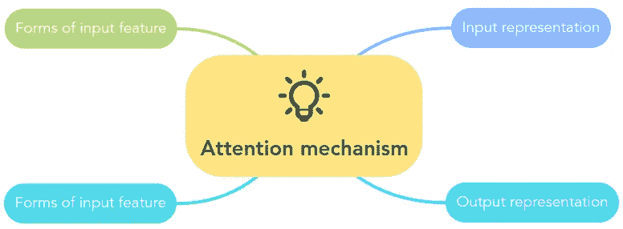
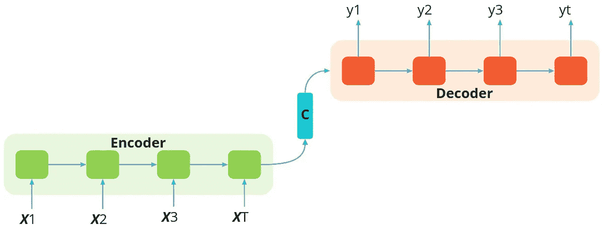
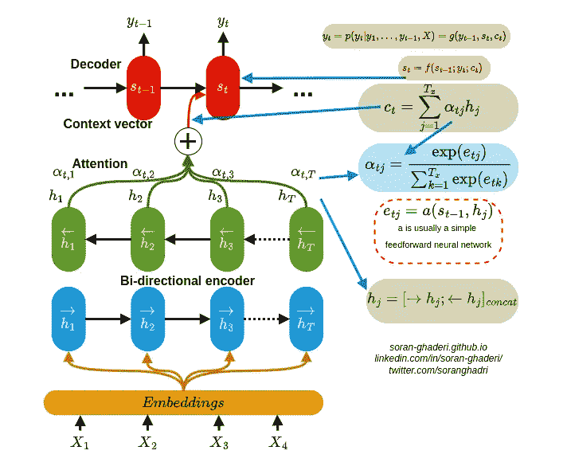
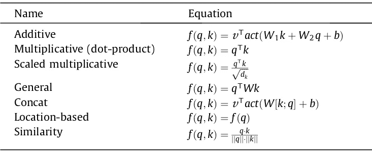
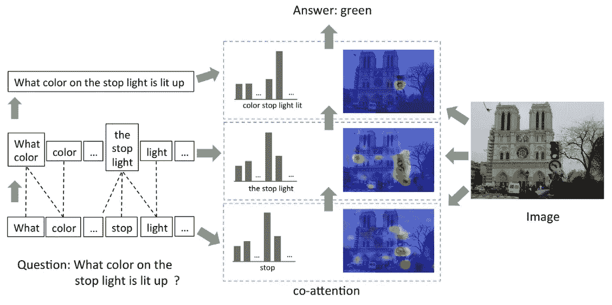
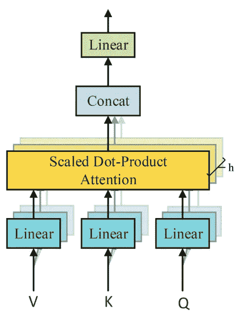

# 反思思维:注意力机制实际上是如何工作的？

> 原文：<https://towardsdatascience.com/rethinking-thinking-how-do-attention-mechanisms-actually-work-a6f67d313f99>

## 大脑、数学和数字鸿沟——2022 年的研究前沿

图一。注意机制的主要类别。照片由[作者](https://soran-ghaderi.github.io/)拍摄。

# 目录

1.[简介:人脑中的注意力](#3251)

2.[深度学习中的注意机制](#7714)
2.1。 [RNNSearch](#bbb7)
2.2。[注意机制中的键、查询和值到底是什么？](#6b17)

3.[注意机制的分类](#d9a2)
3.1。[注意](#4a83)的柔软度
3.2。[输入特征的形式](#5140)3.3
。[输入表示法](#658e)3.4
。[输出表示](#a090)

4.[研究前沿与挑战](#e3af)
4.1。[协作](#3c32)

5.[结论](http://96eb)

6.[参考文献](#7fb8)

# 1.简介:人类大脑中的注意力

**注意力**是一种认知和行为功能，它赋予我们选择性地专注于一小部分输入信息的能力，这有利于我们正在进行的任务。它赋予大脑通过忽略无关的可感知信息和选择高价值信息来限制其输入量的能力。当我们观察到一个场景，其中有一个特定的重要部分与我们正在做的任务相关时，我们会提取那个部分进行更细致的处理；当这些场景再次出现时，我们可以学会更好地关注这些部分。

根据 j . K . Tsotsos et al .[【1】](https://doi.org/10.1016/0004-3702(95)00025-9)，注意机制可以分为两类。

*   自下而上的无意识注意
*   自上而下的有意识注意

第一类是自下而上的无意识注意——**基于显著性的注意**——受外界因素刺激。举例来说，较大的声音比较小的声音更容易被听到。我们可以在深度学习模型中使用 max-pooling 和 gate 机制产生类似的结果，该机制将更大的值(即更显著的值)传递给下一层(S. Hochreiter 等人[【2】](https://doi.org/10.1162/neco.1997.9.8.1735))。下一种类型是自上而下的有意识注意——**集中注意力**——它有一个预先确定的目标，并遵循特定的任务。因此，使用集中注意力，我们可以有意识地、积极地专注于一个特定的对象或现象。

注意力是一种认知资源方案的分配，具有有限的处理能力，如[3]所述。它表现为注意力瓶颈，这限制了传递给下一步的信息量。因此，它可以通过关注更重要的信息部分来显著提高性能。因此，人们一直在努力复制人脑的注意力机制，并将空间和时间注意力纳入各种任务中。例如，研究人员通过引入计算视觉显著性模型来捕捉图像的潜在显著区域，从而将这一概念引入机器视觉[【4】](https://doi.org/10.1007/978-3-642-33786-4_24)。通过自适应地选择区域序列，V. Mnih 等人提出了一种新的递归模型来提取图像的最相关区域，并且只处理所选择的区域。图 2 示出了视觉注意力如何运作的例子。Bahdanau 等人[5]。使用注意机制允许模型自动搜索翻译成目标单词所需的部分。

图二。视觉注意力。Lovearobot 在[维基百科](https://en.wikipedia.org/wiki/Attention)上的照片

注意力机制已经成为现代神经网络架构的重要组成部分，用于各种任务，如机器翻译[[vas Wani et al . 2017](https://doi.org/10.48550/arXiv.1706.03762)–16]，文本分类，图像字幕生成，动作识别，语音识别，推荐和图形。此外，它在现实世界的应用中有几个用例，并在自动驾驶、医疗、人机交互、情感检测、金融、气象、行为和动作分析以及工业领域取得了辉煌的成功。

# 2.深度学习中的注意机制

长期以来，机器学习的研究人员一直受到大脑生物基础的启发，尽管如此，仍然不完全清楚人类大脑是如何处理不同的周围现象的，他们试图对它们进行数学建模。为了深入研究深度学习和注意力机制的结合，我将通过 Bahdanau 的注意力[5]架构，这是一个机器翻译模型。图 1 显示了典型的共同注意机制。

## **2.1。RNNSearch**

早于 Bahdanau 等人提出的模型[5]。大多数神经机器翻译的架构都归入编码器-解码器模型的范畴。这些模型试图将源句子编码成固定长度的向量，解码器从该向量生成目标语言的翻译(见图 3)。这种方法的一个主要问题是，当句子变得比训练语料库中的句子长时，编码器就很难处理。因此，本文的作者提出了一种有效的解决方案来应对这一挑战，即引入一种新的方法来联合学习翻译和对齐。这里的想法是，在每一步翻译单词的过程中，它(软)搜索位于源句子中不同位置的最相关的信息。然后，它为源单词 wrt 生成翻译。这些相关位置的上下文向量和先前共同生成的单词。

图 3。没有注意机制的编码器-解码器框架。照片由[作者](https://soran-ghaderi.github.io/)拍摄。

RNNSearch 包括一个双向递归神经网络(BiRNN)作为其编码器和一个解码器，以在解码翻译时模仿从源句子的搜索(见图 4)。

输入(从 *X* _1 到 *X* _T)被馈入前向 RNN 以产生*前向隐藏状态。*

反向 RNN 以相反的顺序读取输入(从 *X* _T 到 *X* _1)，导致*反向隐藏状态。*

该模型通过连接前向和后向隐藏状态来为 *X* _i 生成注释，得到 ***h*** _i

[情商。1](https://doi.org/10.48550/arXiv.1409.0473)

另一个递归神经网络(RNN)和一个注意块组成解码器。注意块计算上下文向量 ***c*** ，其表示当前输出和整个输入之间的关系。然后，上下文向量 ***c*** _t 被计算为每个时间步长的隐藏状态 ***h*** _j 的加权和:

[情商。2](https://doi.org/10.48550/arXiv.1409.0473)

*α* _tj 是每个 ***h*** _j 注释的注意力权重，计算如下:

[情商。3](https://doi.org/10.48550/arXiv.1409.0473)

而 ***e*** _tj 是，

[情商。4](https://doi.org/10.48550/arXiv.1409.0473)

其中 ***a*** 是*对齐模型，其*表示注释 ***h*** _j 对于下一个隐藏状态 ***s*** _t 的适合程度，考虑到前一个状态 ***s*** _t-1。

其中 ***s*** _i 计算如下:

[情商。5](https://doi.org/10.48550/arXiv.1409.0473)

然后模型在当前步骤产生最可能的输出 *y* _t:

[情商。6](https://doi.org/10.48550/arXiv.1409.0473)

直观地，通过使用该公式，该模型可以在每个时间步长选择性地聚焦于输入序列的重要部分，并将源句子分布在整个序列中，而不是固定长度的向量。

图 4。注意机制。照片由[作者](https://www.linkedin.com/in/soran-ghaderi)拍摄。

图 4。说明了注意机制，并将基础数学与模型可视化相结合。

## 2.2 注意机制中的键、查询和值到底是什么？

在 Bahdanau 模型被用于机器翻译之后，研究者们设计了各种各样的注意机制。一般来说，其中有两个主要的共同步骤。第一个是计算输入上的注意力分布，下一个是基于该分布计算上下文向量。在计算注意力分布的过程中。

在计算注意力分布的第一步中，注意力模型从源数据中推断出关键字(***【K】***),根据任务，注意力分布可以是各种形式和表示。例如，K 可以是文本或文档嵌入、图像特征的一部分(图像的一个区域)、或者序列模型的隐藏状态(RNN 等)。).Query， ***Q*** ，是 vector，matrix[【7】](https://doi.org/10.48550/arXiv.1706.03762)的另一个术语，或者是你要计算关注度的两个 vector，简单来说就是类似于 RNNsearch 中的 ***s*** _t-1(之前的输出隐藏状态)。目标是在生成下一个输出之前，通过评分函数 ***f*** (也称为能量函数和兼容性函数)计算出 ***Q*** 和所有 ***K*** s 之间的关系(权重),以计算出表示 ***Q*** 相对于所有 ***K*** s 的重要性的能量分数

[情商。7](https://doi.org/10.48550/arXiv.1409.0473)

有几个计分函数计算 ***Q*** s 和 ***K*** s 之间的联系。一些常用的计分函数如表 1 所示。*加法*注意力【6】和*乘法*注意力(*点积*)【8】是使用最广泛的函数。

表 1。可学习的参数有 k，v，b，W，W2，W3；d_k 是输入向量(键)的维数；act 是非线性激活函数(即 tanh 和 ReLU)。表作者[作者](https://soran-ghaderi.github.io/)。

在下一步中，这些能量分数被馈送到名为 ***g*** 的注意力分布函数中，就像 RNNsearch 中的 softmax 层一样，以通过将所有能量分数归一化为概率分布来计算注意力权重 ***α***

[情商。8](https://doi.org/10.48550/arXiv.1409.0473)

*softmax(z)* 函数有缺点，即它为 *z* 的每个元素产生一个结果，这在需要稀疏概率分布的情况下会导致计算开销。因此，研究人员提出了一种新的概率分布函数，称为*稀疏最大值*【9】，它能够将零值分配给输出中的不相关元素。此外，*logistic sigmoid*[【10】](https://doi.org/10.48550/arXiv.1702.00887)被提出，其将能量分数缩放到[0–1]范围。

与其在上下文向量和注意力分布的输入数据表示中使用关键字(这会使训练过程变得困难)，不如使用另一个名为 ***V*** 的特征表示向量，并显式地分离这些特征表示。更具体地说，在键值注意机制中， ***K*** 和 ***V*** 是同一输入数据的不同表征，在自我注意的情况下，所有的 ***K*** 、 ***Q*** 和 ***V*** 都是同一数据即输入的分离嵌入。

在计算注意力权重之后，上下文向量被计算为

[情商。9](https://doi.org/10.48550/arXiv.1409.0473)

其中，**通常是*的加权和，表示为一个向量:***

******

***[情商。10](https://doi.org/10.48550/arXiv.1409.0473)***

***和***

******

***[情商。11](https://doi.org/10.48550/arXiv.1409.0473)***

***其中 ***Z_i*** 是*元素的加权表示，n 表示 ***Z*** 的大小。****

**简而言之，公共注意机制“”可以被描述为将查询和一组键-值对映射到输出，其中查询、键、值和输出都是向量。输出被计算为值的加权和，其中分配给每个值的权重由查询与相应键的兼容性函数来计算。"如 Vaswani 等人[7]所述。**

**至于评估注意机制，研究者通常将它们嵌入深度学习模型中，并测量它们在注意和不注意情况下的表现，以评估注意机制的效果，即消融研究。它们可以如图 5 所示被可视化，这又可以用于评估，尽管它是不可量化的。**

****

**图 5。yelp 评论上的注意力分布。颜色越深，表示关注度越高。照片来自[【27】](https://arxiv.org/abs/1703.03130)**

# **3.注意机制的分类**

**到目前为止，我已经完成了注意力机制的数学建模。在这一节中，我将提供关于这些机制的分类的更多细节。尽管注意机制有相似的基本概念，但它们在细节上有很大的不同，以至于在不同的任务中应用它们时会有很大的困难。到目前为止已经提出了多个分类法，基本都差不多。这里我就用牛等人 2021 [6]和 Chaudhari 等人 2021 [11]提出的模型。**

****

**表二。显示了注意力机制分类的不同标准。*“Aoft”的正确形式是“Soft”。表作者[作者](https://soran-ghaderi.github.io/)。**

> **请注意，不同标准中的注意机制并不相互排斥，它们很可能包括不同的标准组合。**

## **3.1.注意力的柔和**

**注意力的柔和度可以分为四种类型:**

*   ****软**:使用所有键的加权平均值来构建上下文向量。**
*   ****Hard** :从随机采样的键中计算上下文向量。**
*   ****局部**:软注意一个窗口周围的一个位置。**
*   ****全局**:类似软注意。**

**在软注意中——首先由 Bahdanau 等人[5]提出——注意模块相对于输入是可微分的，因此，整个模型可通过标准反向传播方法训练。**

**另一方面，由徐等人 2015 [12]首先提出的硬注意从随机采样的键计算上下文向量。相应的，Eq 中的 ***α*** 。8 的计算公式为:**

****

**[情商。12](https://doi.org/10.48550/arXiv.1409.0473)**

**由于随机抽样，与试图在每一步计算所有注意力权重的软注意相比，硬注意在计算上花费较少。显然，对输入特征做出困难的决定有其自身的缺点，例如不可微性，这使得难以优化。因此，整个模型需要通过最大化近似变分下限或加强来优化。**

**随后，Luong 等人 2015 [13]提出了对机器翻译的局部和全局关注。如前所述，全局注意和软注意是相似的机制；然而，局部注意可以被看作是硬注意和软注意的混合，我的意思是它使用输入特征的子集而不是整个向量。与软或全局注意相比，这种方法降低了计算复杂度，并且与硬注意不同，它是可微分的，这使得它易于实现和优化。**

## **3.2.输入特征的形式**

*   ****逐项****
*   ****地理位置****

**在前一种情况下，输入表征是一系列显式项目，或者等价地是来自输入的编码。例如，Bahdanau 等人[5]在 RNNsearch 中使用单个单词嵌入，而在 SENet 中使用单个特征图。注意力模型将这些项目编码为单独的代码，并在解码过程中计算它们各自的权重。当与软/硬注意机制结合时，在项目式软注意的情况下，它计算每个项目的权重，然后将它们线性结合；当处于硬注意状态时，它根据概率随机选择一个或多个项目。**

**后者试图处理难以确定项目离散定义的输入特征，即视觉特征。一般来说，它们通常用于视觉任务；解码器在每一步处理输入的多分辨率裁剪，在一些工作中，它将任务相关区域转换为规范的预期姿势，为整个模型中更容易的推理铺平道路。在结合位置方式和软注意时，整个特征图被输入到模型中，并产生变换的输出。当我们把它和努力的注意力结合起来，最可能的次区域 WRT。注意模块是随机选择。**

****

**表 3。显示了不同类别之间不同的可能组合。表作者[作者](https://soran-ghaderi.github.io/)。**

## **3.3.输入表示**

**注意机制有多种形式的输入表征，其中一些较为常见，如 Chaudhari et al. 2019 [11]提出的**区别注意**，它:**

*   **包括单个输入和相应的输出序列**
*   **键和查询属于两个独立的序列**

**和**共同注意，以及接受多输入的分层注意模型**、如鲁等 2016 [14]提出的视觉问答任务中。共同注意有两种方式:a)并行:同时产生视觉和问题注意；b)交替:在两种注意之间顺序交替。**

**范等 2018 [15]提出了**细粒度**和**粗粒度**注意模型。他们使用其他输入的嵌入作为每个输入的查询来计算注意力权重。另一方面，细粒度模型计算输入的每个元素对另一个输入的元素的影响。**

**有几个成功的使用案例，其中他们部署了共同关注，如情感分类，文本匹配，命名实体识别，实体消歧，情感原因分析和情感分类。**

**【自我(内在)注意是另一个仅使用输入来计算注意权重的模型，由王等人提出【16】。键、查询和值是同一输入序列在不同空间的表示；自我注意效率已经被一些研究者以不同的方式复制，其中 Transformer [7]广受好评，它是第一个只使用自我注意而不使用 RNNs 的序列转导模型。**

**为了将注意力扩展到其他层次的输入嵌入，Yang 等人[17]提出了用于文档分类的**分层注意力模型(HAM)** 。它使用两个不同层次的注意力:单词层次，允许 HAM 将相关单词聚合到一个句子中；句子层次，允许它将关键句子聚合到文档中。研究人员甚至将其扩展到更高的(用户)级别；在文档级别使用它。另一个极端是赵和张[18]提出的自上而下的方法。一些作品也给计算机视觉带来了层次化的注意，在这些作品中，他们将计算机视觉用于物体层面和部分层面的注意。这也是第一个不使用额外信息来计算注意力权重的图像分类方法。**

****

**图 6。分级注意和共同注意的例子。图片来自[【14】](https://arxiv.org/abs/1606.00061)**

## **3.4.输出表示**

**注意力模型分类的另一个标准是它们表示输出的方式。单输出注意是一种众所周知的方法，它在每个时间步中输出一个且仅一个向量作为其能量分数。虽然单一输出是在各种情况下使用的常用方法，但一些下游任务需要更全面的上下文才能完成。因此，研究人员提出了其他方法，如**多头**和**多维**注意，它们属于多输出注意模型的范畴。举例来说，已经表明在计算机视觉任务以及一些基于序列的模型中，单个输出注意可能不恰当地表示输入的上下文。Vaswani 等人[7]在 Transformer 中，将输入向量( ***K*** ， ***Q*** ， ***V*** )线性地投影到多个子空间中，随后是*缩放的点积*，然后使用*多头*注意力将它们串联起来，如图 7 所示，这允许模型基于不同位置的几个表示子空间同时计算注意力权重。**

****

**图 7。*多头*注意。照片来自[【7】](https://arxiv.org/abs/1706.03762?context=cs)**

**为了进一步加强*多头*注意力权重的多样性，不一致正则化被添加到子空间、参与位置和输出表示中；因此，不同的头部更有可能以更独特的方式表现特征。**

**接下来，*多维*注意力被设计成通过使用矩阵而不是权重得分向量来计算 ***K*** 的特征得分向量。它允许模型从相同的数据中推断出几个注意力分布。它可以帮助解决自然语言理解领域中一个名为*多义性*的突出问题，其中表示缺乏表示同一单词或短语的多种含义共存的能力。**

****

**图 8。多维度关注。图片来自[【19】](https://arxiv.org/abs/1809.00699)。**

**与之前一样，研究人员添加了惩罚(即 *Frobenius* 惩罚)，以鼓励该模型从输入中学习更多不同的特征，并通过将其应用于几个任务(如作者简介、情感分类、文本蕴涵和远程监督关系提取)来证明其有效性。**

# **4.研究前沿和挑战**

**尽管注意机制已被广泛应用于多个研究方向，但仍有很大的潜力和回旋余地。研究人员面临的一些挑战如下:**

*   **如朱等[20]和 Tay 等[21]所示，将***【K】***(按键)和*【Q】*(查询)结合起来，取得了突出的性能。因此，在自我关注中组合键、查询和值是否有益仍然是一个问题。**
*   **Tsai 等人[22]和 Katharopoulos 等人[23]最近的一些研究表明，注意力模型的性能可以通过降低注意力函数的复杂度来显著提高，因为这极大地影响了它们的计算复杂度。**
*   **将为特定任务(如 NLP)设计的注意力模型应用到其他领域(如计算机视觉)也是一个有前途的方向。举例来说，当自我注意应用于计算机视觉时，它会提高性能，同时对效率产生负面影响，如 Wang 等人所证明的[24]。**
*   **致力于结合适应性机制和注意机制可能导致类似于没有任何明确的架构设计的分级注意结果。**
*   **设计评估模型的新方法也非常重要。Sen 等人[25]提出了多种评估方法，使用新的注意力地图相似性度量来定量测量人脑和神经网络中注意力之间的相似性。**
*   **记忆建模正在成为深度学习研究的一种趋势。普通模型大多缺乏外显记忆，因此，对记忆的注意可以进一步研究。神经图灵机论文[26]是这些混合模型的一个例子，有潜力被更细致地探索。**

## **4.1 协作**

****如果你有兴趣研究我个人网站** **上提到的** [**话题，欢迎进一步讨论。请给我留言！让我们在**](http://soran-ghaderi.github.io) **[LinkedIn](https://www.linkedin.com/in/soran-ghaderi) 和 [Twitter](https://twitter.com/soranghadri) 上连线。****

**跟随这个[媒体](https://soran-ghaderi.medium.com/)页面，并查看我的 [GitHub](https://github.com/soran-ghaderi) 以跟上未来的内容。同时，玩得开心！**

**另外，看看这篇关于变形金刚的文章:**

** ** 

# **5.结论**

**在这篇文章中，我主要从各个方面讨论了注意力模型，如注意力和人脑的简要概述；它在深度学习中的用例；基础数学；提出了注意机制的统一模型(来自牛等[6])；他们的分类法基于一系列标准，概述了有待探索的多个领域。**

**不用说，注意力机制是通往人工智能道路上的一个重要里程碑。它们彻底改变了机器翻译、文本分类、图像字幕生成、动作识别、语音识别、计算机视觉和推荐。因此，他们在现实世界的应用中取得了巨大的成功，如自动驾驶、医学、人机交互、情感识别等。**

# **6.参考**

**[1] J.K. Tsotsos, S.M. Culhane, W.Y.K. Wai, Y. Lai, N. Davis, F. Nuflo, Modeling
visual attention via selective tuning, Artif. Intell. 78 (1995) 507–545.
[2] S. Hochreiter, J. Schmidhuber, Long short-term memory, Neural Comput. 9 (1997) 1735–1780.
[3] J. R. Anderson, 2005, Cognitive Psychology and Its Implications, Worth Publishers, 2005.
[4] Lu, S., Lim, JH. (2012). Saliency Modeling from Image Histograms. In: Fitzgibbon, A., Lazebnik, S., Perona, P., Sato, Y., Schmid, C. (eds) Computer Vision — ECCV 2012\. ECCV 2012\. Lecture Notes in Computer Science, vol 7578\. Springer, Berlin, Heidelberg.
[5] D. Bahdanau, K. Cho, Y. Bengio, Neural machine translation by jointly learning to align and translate, in: ICLR.
[6] Z. Niu, G. Zhong, H. Yu, A review on the attention mechanism of deep learning, Neurocomputing, Volume 452, 2021, pp. 78–88.
[7] A. Vaswani, N. Shazeer, N. Parmar, J. Uszkoreit, L. Jones, A. N. Gomez, L. Kaiser, I. Polosukhin, Attention is all you need, in: NIPS, pp. 5998–6008.
[8] D. Britz, A. Goldie, M. Luong, Q.V. Le, Massive exploration of neural machine translation architectures, CoRR abs/1703.03906 (2017).
[9] A.F.T. Martins, R.F. Astudillo, From softmax to sparsemax: A sparse model of attention and multi-label classification, in: ICML, Volume 48 of JMLR Workshop and Conference Proceedings, JMLR.org, 2016, pp. 1614–1623
[10] Y. Kim, C. Denton, L. Hoang, A.M. Rush, Structured attention networks, arXiv: Computation and Language (2017)
[11] S. Chaudhari, V. Mithal, G. Polatkan, R. Ramanath, An Attentive Survey of Attention Models, ACM Transactions on Intelligent Systems and TechnologyVolume, 2021 Article No.: 53, pp 1–32.
[12] K. Xu, J. Ba, R. Kiros, K. Cho, A.C. Courville, R. Salakhutdinov, R.S. Zemel, Y. Bengio, Show, attend and tell: neural image caption generation with visual attention, in: ICML, Volume 37 of JMLR Workshop and Conference Proceedings, JMLR.org, 2015, pp. 2048–2057.
[13] T. Luong, H. Pham, C.D. Manning, Effective approaches to attention-based neural machine translation, in: EMNLP, The Association for Computational Linguistics, 2015, pp. 1412–1421.
[14] J. Lu, J. Yang, D. Batra, D. Parikh, Hierarchical question-image co-attention for visual question answering, in: NIPS, pp. 289–297.
[15] F. Fan, Y. Feng, D. Zhao, Multi-grained attention network for aspect-level
sentiment classification, in: EMNLP, Association for Computational Linguistics, 2018, pp. 3433–3442.
[16] B. Wang, K. Liu, J. Zhao, Inner attention-based recurrent neural networks for answer selection, in: ACL (1), The Association for Computer Linguistics, 2016.
[17] Z. Yang, D. Yang, C. Dyer, X. He, A.J. Smola, E.H. Hovy, Hierarchical attention networks for document classification, in: HLT-NAACL, The Association for Computational Linguistics, 2016, pp. 1480–1489.
[18] S. Zhao, Z. Zhang, Attention-via-attention neural machine translation, in:AAAI, AAAI Press, 2018, pp. 563–570.
[19] J. Du, J. Han, A. Way, D. Wan, Multi-level structured self-attentions for
distantly supervised relation extraction, in: EMNLP, Association for
Computational Linguistics, 2018, pp. 2216–2225.
[20] X. Zhu, D. Cheng, Z. Zhang, S. Lin, J. Dai, An empirical study of spatial attention mechanisms in deep networks, in: 2019 IEEE/CVF International Conference on Computer Vision, ICCV 2019, Seoul, Korea (South), October 27–November 2, 2019, IEEE, 2019, pp. 6687–6696.
[21] Y. Tay, D. Bahri, D. Metzler, D. Juan, Z. Zhao, C. Zheng, Synthesizer: rethinking self-attention in transformer models, CoRR abs/2005.00743 (2020).
[22] Y.H. Tsai, S. Bai, M. Yamada, L. Morency, R. Salakhutdinov, Transformer dissection: An unified understanding for transformer’s attention via the lens of the kernel, in: K. Inui, J. Jiang, V. Ng, X. Wan (Eds.), Proceedings of the 2019 Conference on Empirical Methods in Natural Language Processing and the 9th International Joint Conference on Natural Language Processing, EMNLP- IJCNLP 2019, Hong Kong, China, November 3–7, 2019, Association for Computational Linguistics, 2019, pp. 4343–4352.
[23] A. Katharopoulos, A. Vyas, N. Pappas, F. Fleuret, Transformers are rnns: Fast autoregressive transformers with linear attention, CoRR abs/2006.16236
(2020).
[24] X. Wang, R. B. Girshick, A. Gupta, K. He, Non-local neural networks, in: CVPR, IEEE Computer Society, 2018, pp. 7794–7803.
[25] C. Sen, T. Hartvigsen, B. Yin, X. Kong, E.A. Rundensteiner, Human attention maps for text classification: Do humans and neural networks focus on the same words?, in: D. Jurafsky, J. Chai, N. Schluter, J.R. Tetreault (Eds.), Proceedings of the 58th Annual Meeting of the Association for Computational
Linguistics, ACL 2020, Online, July 5–10, 2020, Association for Computational Linguistics, 2020, pp. 4596–4608.
[26] A. Graves, G. Wayne, I. Danihelka, Neural Turing Machines, arXiv preprint: Arxiv-1410.5401.
[27] Z. Lin, M. Feng, C.N. dos Santos, M. Yu, B. Xiang, B. Zhou, Y. Bengio, A
structured self-attentive sentence embedding, in: ICLR (Poster), OpenReview.
net, 2017.**