# 深度学习中处理数据量挑战的最新进展

> 原文：<https://towardsdatascience.com/review-of-recent-advances-in-dealing-with-data-size-challenges-in-deep-learning-ac5c1844af73>

## [思想和理论](https://towardsdatascience.com/tagged/thoughts-and-theory)，深度学习中的数据

# 深度学习中处理数据量挑战的最新进展

## 深度学习在有效处理不断增长的数据量方面的最新进展综述

如今，机器学习和深度学习社区中的能量和兴奋是有感染力的。这个领域正在发生如此多的突破性进展，但我经常发现自己想知道为什么唯一让这一切发光的东西——是的，我说的是深度学习的黑马**数据*如此不受重视。过去几年的 DL 研究给了我很多快乐和兴奋，我现在满怀希望，未来我们可以在这个领域看到一些令人兴奋的进展，探索结合数据的深度学习的进步！在这篇文章中，我总结了深度学习领域最近的一些发展，这些发展让我感到震惊。*

*本文目录:*

*   **深度学习的黑马:数据**
*   **标签数据:标签的类型**
*   **以数据为中心的常用数据挖掘技术**
*   **数据扩充**
*   **迁移学习**
*   **降维**
*   **主动学习**
*   **扩展深度学习数据集的挑战**
*   **数据相关技术的最新进展**
*   **1。正规化**
*   **1.1 混淆**
*   **1.2 标签平滑**
*   **2。压缩**
*   **2.1。X-shot 学习:多少才够？**
*   **2.2。修剪**
*   **2.2.1 核心集**
*   **2.2.2 示例遗忘**
*   **2.2.3 使用坡度规范**
*   **2.3。蒸馏**
*   **3。那么，如果你有嘈杂的数据**
*   **结论**
*   **参考文献**

# *深度学习的黑马:数据*

*深度学习(DL)算法通过查看训练数据来构建(领域)知识表示，从而学习执行任务。对图像模型的早期研究(分类和分割，2017 年)指出，随着训练数据集的增加，模型的性能以对数形式增加 [1](https://arxiv.org/abs/1707.02968) 。长期以来，人们一直相信增加训练数据集的大小将会继续提高模型的性能。这也得到了另一项实证研究的支持，该研究在机器翻译、语言建模、图像分类和语音识别中验证了这一信念 [2](https://arxiv.org/abs/1712.00409) (见图 1)。*

*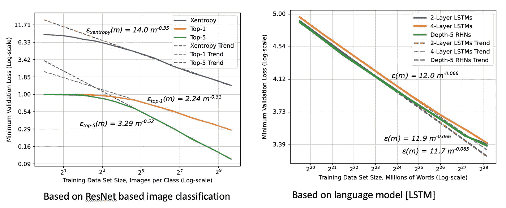*

**图 1:显示了泛化误差和数据集大小(对数标度)之间的关系。图片来自乔尔等人的*。艾尔[2*2*](https://arxiv.org/abs/1712.00409)*

*因此，数据集越大越好，对吗？差不多！以幂律的形式奠定了理论基础，即ε(*m*)≈α*m*β*g*其中 *ε* 是泛化误差， *m* 是训练集中的样本数， *α* 是问题/DL 任务的常数性质， *βg* 是定义学习曲线陡度的标度指数。这里， *βg* ，曲线的陡度描述了一个模型通过向训练集 [2](https://arxiv.org/abs/1712.00409) 添加更多数据可以学习得多好。(见图 2)根据经验， *βg* 在 0.07 和 0.35 之间，尽管理论上认为 *βg* 为 0.5 或 1。尽管如此，对数关系仍然成立。如图 2 所示，增益最终以不可减少的误差递减。*

*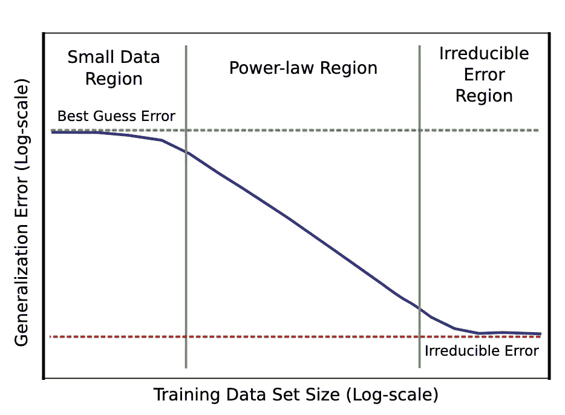*

**图 2:幂律曲线，显示了使用小数据集训练的模型，仅与随机猜测一样好，随着数据集大小的增加而迅速变好，最终稳定在不可减少的误差区域，这由包括导致不完善泛化的不完善数据的因素组合来解释* [*2*](https://arxiv.org/abs/1712.00409) *。图片取自*乔尔等人。al[2](https://arxiv.org/abs/1712.00409)*

*这可归因于几个因素，包括数据的不完善。数据质量和不断迭代的重要性在之前的一些演讲中有所涉及 [a](https://suneeta-mall.github.io/talks/She_Builds_on_AWS_2020.html) 、 [b](https://suneeta-mall.github.io/talks/AWS_ANZ_Commuity_day_2020.html) 、 [c](https://suneeta-mall.github.io/talks/Kafka_Summit_APAC_2021.html) 。数据质量很重要，数据分布也很重要。训练数据集的分布越好，模型就越通用！*

> **数据肯定是新油！**

**那么，我们能在没有太多抱怨的情况下缩放数据大小吗？请记住，61%的人工智能实践组织已经发现数据和数据相关的挑战是他们的首要挑战 [4](https://pages.run.ai/hubfs/PDFs/2021-State-of-AI-Infrastructure-Survey.pdf) 。如果围绕数据集的采购、存储、数据质量和分布/人口统计的挑战还没有包含在内，这篇文章将关注另一系列问题。在数据量增长，计算成本和周转时间随数据增长线性增长的情况下，如何高效训练？然后我们开始问有多少数据是多余的，哪些例子更有影响力，我们如何找到它们？鉴于最近的一项调查 [4](https://pages.run.ai/hubfs/PDFs/2021-State-of-AI-Infrastructure-Survey.pdf) 指出，大约 40%实践人工智能的组织已经在 GPU 和人工智能相关的计算基础设施上每年花费至少 100 万美元，这些是非常重要的问题。这应该关系到我们所有人。不是所有 FAANG 以外的组织(还有，FAANG 中假设的组织，但是省略了缩写！)而那些资产负债表丰厚的公司将能够通过简单地扩展数据集来利用收益。此外，出于环境原因和碳排放影响，这应该关系到我们所有人[更多详情](https://www.forbes.com/sites/robtoews/2020/06/17/deep-learnings-climate-change-problem/?sh=55d621d76b43)。**

> ***训练一只人工智能的碳足迹高达 284 吨二氧化碳当量——是一辆普通汽车一生排放量的五倍* [*来源*](https://www.newscientist.com/article/2205779-creating-an-ai-can-be-five-times-worse-for-the-planet-than-a-car/) *。***

**简单地缩放训练数据集并计算你的幸福的乌托邦状态根本不存在。接下来的问题是，我们在做什么？不幸的是，并不是很多，特别是如果你看看 ML 研究社区在利用大量 GPU 年来获得归因于算法或架构变化的模型性能的微小增加方面的兴奋。但好消息是，这一领域现在正获得越来越多的关注。自 2020 年以来，很少有研究非常有前景，尽管它们还处于起步阶段。我一直在密切关注人工智能(也称为以数据为中心的人工智能)主题中数据使用的文献，因为这是我感兴趣的活跃领域之一。我对这一领域最近的一些发展感到兴奋。在这篇文章中，我将讲述我在这个话题上的一些收获和兴奋。**

**在详细介绍它们之前，让我们先回顾一下基础知识和先验知识:**

# **标签数据:标签的类型**

**这篇文章主要关注计算机视觉的监督学习场景。在这个空间中，有两种类型的标签:**

*   **硬标签**
*   **软标签**

**传统标签是硬标签，其中真实值是离散值，例如 0 和 1，0 代表否，1 代表是。这些离散值可以是任何值，这取决于数据集是如何管理的。值得注意的是，这些值是绝对的，并且清楚地表明了它们的含义。**

**有一种新兴的标签形式被称为软标签，其中接地表示可能性。本质上，这些标签是连续的。举个例子，一个像素是 40%猫 60%狗。在接下来的几节中，这将非常有意义。**

# **以数据为中心的常用数据挖掘技术**

**数据增强和迁移学习是目前深度学习中两种常用的技术，专注于有效地应用数据。这两种技术现在都非常大众化，除非明确省略，否则都被广泛应用。**

# **数据扩充**

**数据扩充包括多种技术来转换数据点，从而增加数据集的多样性。该技术旨在保持数据分布大致相同，但通过增加多样性来增加数据集的丰富性。主要地，通过这种技术的转化是样品内的。仿射变换、对比度调整、抖动或色彩平衡是数据增强技术的一些例子。Imgaug 和 [kornia](https://github.com/kornia/kornia) 对于这样的操作来说是非常好的库，尽管所有的 ML 框架都提供了有限的一组数据扩充例程。**

**最初提出数据扩充技术是为了提高模型的稳健性和实现更好的泛化，但它们也用作综合增加数据大小的技术。在数据获取确实具有挑战性的情况下尤其如此。如今，数据增强技术已经变得更加复杂和丰富，包括也可以应用模型驱动增强的场景。这方面的一个例子是基于 GAN 的技术来增加和合成样品。事实上，数据扩充也是建立对抗敌对攻击的鲁棒性的技术之一。**

**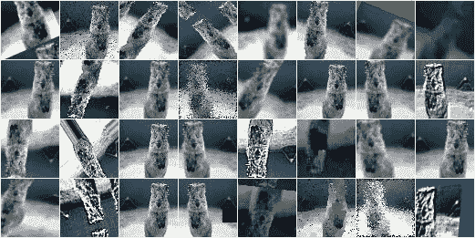**

**增强的例子。*图片取自 ImgAug 库* [src](https://github.com/aleju/imgaug) *示例***

# **迁移学习**

**迁移学习也是一种非常大众化的技术，如果两个任务的问题域是相关的，它源于在一个新任务中重用所学的表征。迁移学习放宽了训练数据必须与测试数据 [5](https://arxiv.org/abs/1808.01974) 独立且同分布(i.i.d .)的假设，允许通过从用另一数据集训练的另一学习模型引导模型权重来解决训练数据不足的问题。**

****

***图 3:有无迁移学习的训练* [*6*](http://citeseerx.ist.psu.edu/viewdoc/download?doi=10.1.1.146.1515&rep=rep1&type=pdf) *。图片取自出版物* [*6*](http://citeseerx.ist.psu.edu/viewdoc/download?doi=10.1.1.146.1515&rep=rep1&type=pdf) *。图片取自* [*6*](http://citeseerx.ist.psu.edu/viewdoc/download?doi=10.1.1.146.1515&rep=rep1&type=pdf) *。***

**使用迁移学习，如果源模型和目标模型的任务有重叠，可以实现更快的收敛。**

# **降维**

**降维技术也适用于大型数据集:**

**这些技术分为两类:**

1.  **一种是试图保持数据集中所有样本之间的成对距离。主成分分析(PCA)就是一个很好的例子。**
2.  **那些在全局距离上保持局部距离的。像均匀流形逼近和投影(UMAP) [23](https://arxiv.org/abs/1802.03426) 和 t-分布式随机邻居嵌入(t-SNE) [24](https://www.jmlr.org/papers/volume9/vandermaaten08a/vandermaaten08a.pdf) 这样的技术就属于这一类。UMAP 可以说保留了更多的全局结构，在算法上比 t-sne 更快。T-SNE 和 UMAP 都使用梯度下降来达到最佳嵌入。**

**然而，DL 空间中的这些技术主要用于理解数据，也用于可视化目的。UMAP 和 T-SNE 在保持全局结构方面比其他嵌入算法做得更好，但有局限性。这篇博客更详细地讨论了这个话题。**

# **主动学习**

**主动学习是一种方法，在这种方法中，训练过程主动要求对特定数据进行标记。它在经典的 ML 技术中更常用，但由于反向传播，它在深度学习中并不十分成功。离线或基于池的主动学习已经被大量研究用于深度学习，但没有多少突破性的成功。由于离群值对训练的负面影响，主动学习的使用也不是很直接[25]。基于池的主动学习将在下一节(修剪)中详细介绍。**

# **为深度学习扩展数据集的挑战**

**除了在[上一节](https://suneeta-mall.github.io/2021/12/31/data-in-deep-learning.html#commonly-used-dl-techniques-centered-around-data)中讨论的技术之外，在以数据为中心的人工智能领域还没有进行大量投资。围绕以数据为中心的人工智能的势头最近有所形成，[吴恩达](https://twitter.com/AndrewYNg)通过他的新创业公司[的落地推动了](https://landing.ai/)[以数据为中心的人工智能](https://landing.ai/data-centric-ai/)的努力。AI 。**

**在我看来，以下是属于以数据为中心的人工智能范围内的一些大类问题:**

1.  **如何在数据集快速增加的情况下高效训练？在 2021 年 [PyTorch 开发者日](https://www.youtube.com/watch?v=vXbbaEZbrOI)期间，Yann LeCun 在与[sou Smith chint ala](https://twitter.com/soumithchintala)的访谈中呼吁，超过 1 周的培训时间是不可接受的。出于实际原因，这是一个非常好的基线，但如果没有一个庞大的 GPU 舰队供其支配，那么在当前的 DL 实践中，这是很难实现的目标。那么，随着数据集规模的增加，还能做些什么来有效地训练呢？**
2.  **所有的样本都同样重要吗？数据集中的样本有多重要？我们能永远利用“重要性因素”吗？**
3.  **样本对更好的概括起什么作用？一些样本带有冗余特征，那么当 DL 中的特征不明确时，如何对数据集进行重复数据删除？**
4.  **数据大小很重要，但是我们能对数据集中的内容进行战略规划吗？**
5.  **巧妙地做到这一点与有效的采样和数据挖掘技术有关。当且仅当我们知道我们的目标是什么时，这些才是容易解决的问题。在我看来，DL 的挑战在于寻找最佳样本？这不是很好理解。**
6.  **我们如何利用更多内在的 DL 技术，如目标函数、反向传播和梯度下降，来构建一个流畅而有效的数据集，从而提供最高的投资回报。**
7.  **数据集中的噪音被视为邪恶。但是他们总是邪恶的吗？一个人能忍受多少噪音？这个怎么量化？**
8.  **如果数据在传统的培训/验证/校准/测试分割中流失，这是多大的罪过。**
9.  **对于级联培训场景的数据分割有什么建议？**
10.  **在回报开始减少之前，人们能对数据增加有多着迷？**
11.  **如果观察到持续学习，如何优化数据的使用？**

# **数据相关技术的最新进展**

**如果我们认为人类是学习机器，他们有无限的数据可以学习。我们的系统已经发展成有效的策略来解析无限的数据流，以选择我们感兴趣的样本。我们的视觉系统如何利用迅速扫视的眼球运动来执行中心凹注视，以对有趣和有用的数据点进行有效的二次采样，这应该是一个很好的动机。当然，我们有时会失败，因为各种原因，我们看不到桌上的笔，尽管它就在我们面前，但大多数时候我们都打对了。格式塔理论的一些概念已经适用于更好地选择数据，即使机器模型是随机的 T2 鹦鹉。根据这一理论，下面列出的八个主要因素决定了视觉系统如何自动将元素分组为图案。**

1.  **邻近性:将彼此靠近的物体或形状视为一组的倾向。**
2.  **相似性:如果物理上相似，例如形状、图案、颜色等，倾向于将物体分组。存在。**
3.  **封闭性:倾向于看到完整的图形/形式，即使图像中呈现的是不完整的。**
4.  **对称性:认为物体对称并围绕一个中心点形成的倾向。50**
5.  **共同命运:倾向于将相似的运动联系为共同运动的一部分。**
6.  **连续性:倾向于将每个物体视为一个单一的不间断的物体，即连续的物体**
7.  **良好的格式塔:如果可以形成一个规则、简单、有序的模式，倾向于聚集在一起**
8.  **过去的经验:根据过去的经验对物体进行分类的倾向。**

**我认为，在这些因素中，邻近性、相似性、共同的命运和过去的经历是相关的。我甚至争论应用闭包的可能性。费尔 [22](https://arxiv.org/abs/2111.06377) 最近的一项工作表明，通过应用自动编码器常用技术的微小变化，机器模型可以填补空白并正确推断缺失的部分。与基于 GAN 的幻觉技术相比，我之所以如此兴奋地提出这个技术，是因为它比 GAN 更容易建造和训练。**

**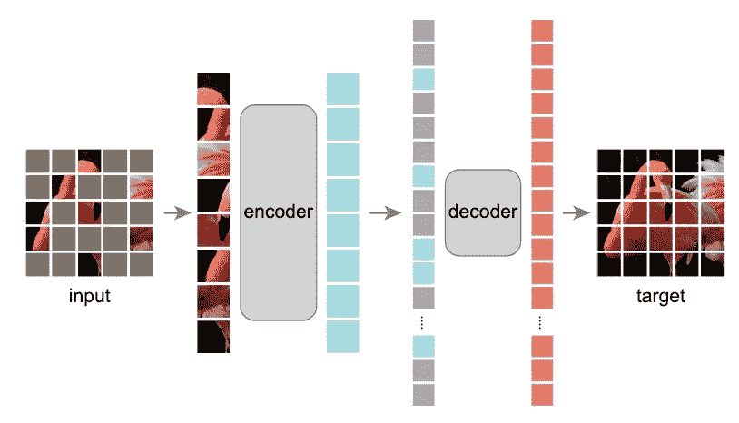**

**屏蔽-显示模型推断缺失补丁的自动编码器 [22](https://arxiv.org/abs/2111.06377) 。*图像取自* [22](https://arxiv.org/abs/2111.06377) 。**

**有趣的是，最近在应对大规模数据挑战方面取得的进展很大程度上是受已知深度学习技术的启发，只是它们现在是通过数据的镜头来应用的。例如修剪、压缩、抽样策略，以及利用灾难性遗忘、知识提炼等现象。**

**技术目前如何用于模型构建提出了以数据为中心的观点运行一种专门的模型压缩技术，通过消除低量级权重来减少大小和计算开销。对泛化贡献不大的样本从训练体系中省略。压缩用于减少大小和计算开销的各种模型压缩技术包括像量化这样的技术，其中预计会有一些信息损失。广泛的数据过滤和压缩技术，在不影响泛化能力的情况下减少数据量。提取从一个更复杂的模型到一个可能更小的模型的学习表示。将较大数据集中的知识提取到较小的综合集中。损失泛函也称为目标函数，是定义问题陈述的 DL 的核心概念之一。如 [22](https://arxiv.org/abs/2111.06377) 所示，并且还可以更广泛地用于填充数据中缺失的信息。规则化 DL 的一个理论原则是通过各种技术来应用的，如批处理、辍学以避免过度拟合。考虑到数据，采用各种技术确保过度拟合，例如标签平滑 [7](https://arxiv.org/abs/1710.09412) 、 [10](https://arxiv.org/abs/1512.00567)**

***表 1:从核心数据挖掘技术混合到以数据为中心的数据挖掘技术的总结***

**让我们从数据的角度深入了解这些技术是如何应用的:**

# **1.正规化**

# **1.1 混淆**

**Mixup 是一种特殊形式的数据扩充技术，它超越了样本内修改，探索了样本间修改。混合的想法是将一对样本线性组合(通过凸几何)成一个样本。**

***x*′=λ*xi*+(1-λ)*xj*，其中，λ∈[0，1]取自贝塔分布，Xi，XJ 为输入/源向量**

***y*′=λ*yi*+(1-λ)*yj*，其中 y_i、yj 为独热标签编码**

**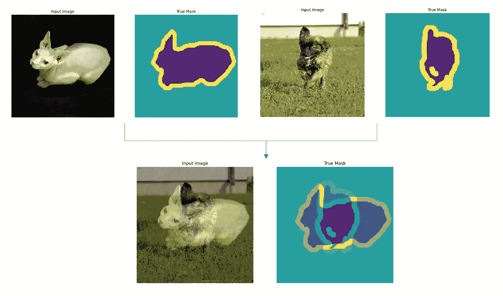**

***图 4:在* [*牛津 Pets 数据集*](https://www.robots.ox.ac.uk/~vgg/data/pets/) *上应用 mix up*[*7*](https://arxiv.org/abs/1710.09412)*产生的样本。图片作者。***

**事实上，Mixup [7](https://arxiv.org/abs/1710.09412) 试图调整神经网络，以支持训练示例之间的简单线性行为。如图 5 所示，混合导致更好的模型和更少的遗漏。已经表明，混合增加了泛化，减少了对错误标签的记忆，增加了对对立例子的鲁棒性 [7](https://arxiv.org/abs/1710.09412) ， [8](https://arxiv.org/abs/1812.01187) 。**

**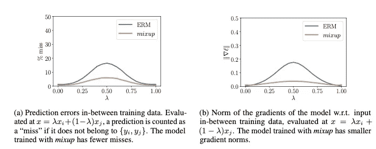**

**图 5:显示使用 mixup [7](https://arxiv.org/abs/1710.09412) ，观察到较低的预测误差和较小的梯度范数。图片取自 [7](https://arxiv.org/abs/1710.09412) 。**

**我认为 mixup 不仅仅是一种增强和正则化技术，也是一种数据压缩技术。根据应用混合的频率(比如α),数据集压缩比(Cr)将:**

***Cr*= 1α/2**

**如果你还没有注意到，应用混合转换标签为软标签。离散值的线性组合将产生连续的标签值，这可以解释前面讨论的例子，其中像素是 40%猫 60%狗(见图 5)。**

# **1.2 标签平滑**

**标签平滑 [10](https://arxiv.org/abs/1512.00567) 是正则化技术的一种形式，通过一个非常小的值ε`ɛ`来平滑地面真实。这样做的一个动机当然是更好的泛化和避免过度拟合。而另一个动机是阻止模型变得过于自信。 [8](https://arxiv.org/abs/1812.01187) 、 [10](https://arxiv.org/abs/1512.00567) 都表明，标签平滑导致更好的模型。**

***齐*I = = k， *K* 否则，其中 k 为班级人数**

**由上述等式指示的标签平滑不会导致标签数据中的任何可见差异，因为`ɛ`非常小。但是，应用混合更改会明显改变源(x)和标签(y)。**

****

**应用标签平滑没有明显的区别。图片来自 [*牛津宠物数据集*](https://www.robots.ox.ac.uk/~vgg/data/pets/) *。图片作者。***

# **2.压缩**

**压缩指的是广泛的数据过滤和压缩技术，以在不牺牲泛化能力的情况下减少数据量。以下是这方面一些令人兴奋的最新进展:**

# **2.1.X-shot 学习:多少才够？**

**由于数据集的增加而导致的高计算成本和长训练时间的问题已经导致了通过少数射击策略进行训练的发展。这种方法背后的直觉是采用一个模型，并指导它仅通过查看几个样本来学习执行一项新任务。这种方法隐含了迁移学习的概念。这条研究路线从仅使用少量样本训练新任务开始，并探索了一次性训练的极端情况，即仅从一个样本学习新任务 [12](https://ieeexplore.ieee.org/document/1597116) 、 [13](https://arxiv.org/abs/1606.04080) 。**

**最近，一种有趣的基于镜头学习的超级极端方法出现了——又名 LO 镜头学习 [11](https://arxiv.org/abs/1904.05046) 。这种方法利用软标签概念，并试图将硬标签 N 类样本合并成 M 个样本，其中 M < N，因此名称小于 1！基于 LO 镜头的技术是数据压缩技术的一种形式，可能感觉非常类似于前面讨论的混合技术。然而，与 Mixup 中样本的凸组合相反，LO Shot 利用距离加权的 k-最近邻技术来推断软标签。他们称为`distance-weighted soft-label prototype k-Nearest Neighbours (SLaPkNN)`的算法实际上是将 k 个最接近目标点 x 的原型的标签向量相加，每个原型的权重与其到 x 的距离成反比。下图显示了使用 SLaPkNN 将 4 个类数据集合并为 2 个样本。**

****

**图 LO-Shot: LO Shot 将 4 个类空间分割成 2 个点 [11](https://arxiv.org/abs/1904.05046) 。图片取自 [11](https://arxiv.org/abs/1904.05046) 。**

**在我的理解中，这是两种技术之间的主要理论差异，另一个差异是 mixup 只使用结合使用`λ`和`1-λ`从 beta 分布中提取的概率将两个样本合并为一个，而 LO 更通用，可以大大压缩。我并不是说 mixup 不能扩展到更多元的情况，而是说这种方法的实证分析是未知的；而对于 [11](https://arxiv.org/abs/1904.05046) 来说，已经表明 SLaPkNN 至少可以将 3M 2 类压缩成 M 个样本。**

**关于这一点的技术解释和代码可以在[这里](https://github.com/ilia10000/LO-Shot/tree/master/Paper1)找到。**

# **2.2.修剪**

**剪枝是压缩技术的一个子类，其中不真正有用或有效的样本被丢弃，而选择的样本保持原样而没有任何内容损失。以下是数据集删减的一些已知技术:**

## **核心集**

**核心集选择技术涉及从大数据集到几乎近似于给定大集的较小集的子采样。这不是一种新技术，已经使用手工设计的功能和更简单的模型(如马尔可夫模型)进行了大量的探索，以逼近更小的集合。这也不是特定于 DL 的技术，在经典 ML 中也有它的位置。一个例子可以是使用朴素贝叶斯为计算量更大的同类(如决策树)选择核心集。**

**在深度学习中，使用类似的概念，可以使用更轻量级的 DL 模型作为代理来选择近似数据集 [15](https://arxiv.org/abs/1906.11829) 。这在不断学习时更容易实现，否则它本身可能是一种非常昂贵的技术，因为代理模型需要首先用完整的数据集进行训练。考虑到代理和目标模型是不同的，并且当数据集中的信息不是集中在几个样本中而是均匀分布在所有样本中时，这就变得特别棘手。这是这种方法不太成功的一些原因。**

## **2.2.2 示例遗忘**

**一项调查 [14](https://arxiv.org/abs/1812.05159) 报告称，一些样本一旦学习就永远不会忘记，并且在各种训练参数和超参数中表现出相同的行为。还有其他类别的样本被遗忘。遗忘事件被定义为当模型预测在随后的时期回归时。对此类遗忘样本的定性和定性(见图 6 和图 7)分析表明，噪声标签、具有“不常见”视觉复杂特征的图像是遗忘示例的主要原因。**

**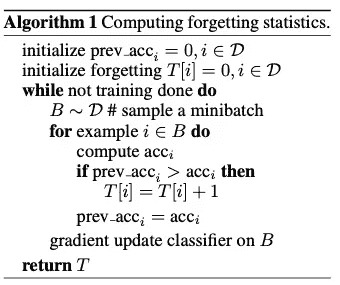**

**图 6:跟踪遗忘样本的算法 [14](https://arxiv.org/abs/1812.05159) 。取自参考文献 [14](https://arxiv.org/abs/1812.05159) 。**

****

**图 7:表明增加噪声样本的比例如何导致遗忘事件增加 [14](https://arxiv.org/abs/1812.05159) 。图像取自 [14](https://arxiv.org/abs/1812.05159) 。**

**这项研究中一个有趣的观察结果是，丢失大部分未遗忘的样本仍然会导致测试集上极具竞争力的性能。形成的假设是，未遗忘的样本信息量不大，而遗忘的样本信息量更大，对训练更有用。在他们的情况下，遗忘分数在 75 个时期后稳定下来(使用 RESNET & CIFAR，但该值将根据模型和数据而变化)。**

**也许几个样本就足以说明一只猫有 4 条腿、一张小脸和尖尖的耳朵，这更多的是关于不同品种的猫看起来如何，尤其是如果它们看起来不同于标准的话，例如 Sphynx 猫。**

## **使用梯度规范**

**损失函数是在数据集中查找感兴趣的样本的一种非常好的方法，无论这些样本是标注不当的样本还是真正的离群样本。[安德烈·卡帕西](https://twitter.com/karpathy/status/1311884485676294151)也强调了这一点:**

> **当你按损失降序排列数据集时，你肯定会发现一些意想不到的、奇怪的、有用的东西。**

**就我个人而言，我发现损失是一个很好的方法来发现标签不好的样品。因此，自然的问题会是“我们是否应该探索如何使用损失作为一种度量来修剪数据集？”。直到 NeurIPS 2021， [21](https://arxiv.org/abs/2107.07075) 才对此进行了适当的调查。这项 Standford 研究调查了单个训练样本的初始损失梯度范数，通过几次权重初始化进行平均，以修剪数据集，实现更好的泛化。这项工作与示例遗忘密切相关，除了不是性能测量，而是更关注在训练早期使用局部信息来修剪数据集。**

**这项工作提出了一个训练样本(x，y)在时间 t 的综合得分，该得分由对该样本计算的损失梯度的 L2 范数和称为 EL2N 的预期损失 L2 范数(下面的等式)给出。这里的推理是，在给定的训练时间内，具有小的大分数的样本对学习如何对训练数据的其余部分进行分类具有丰富的影响。根据经验，这篇论文发现，对多个权重初始化的常模进行平均会产生与遗忘分数相关的分数 [14](https://arxiv.org/abs/1812.05159) ，并导致在训练早期修剪样本的重要部分。他们能够在不影响准确性的情况下从 *CIFAR-10 中剪除 50%的样本*，而在更具挑战性的 CIFAR-100 数据集上，他们剪除了 25%的样本，准确性仅下降了 1%。
χ *t* ( *x* ，*y*)=*Ewt*|*gt*(*x*， *y* )||2 (GraNd eq)**

**χ *t* ( *x* ，*y*)=*E*|*p*(*wt*，*x*)—*y*)| | 2(EL2N eq)**

**这是一种特别有趣的方法，与迄今为止独立处理数据集中样本的其他修剪策略有很大不同。由于 DL 是一个非凸问题 [21](https://arxiv.org/abs/2107.07075) ，基于独立统计的样本丢弃提供了较弱的成功理论保证。我很想知道混合是如何影响大比分的(见图 5b ),使用混合会导致更小的梯度范数(尽管是 l1)。**

**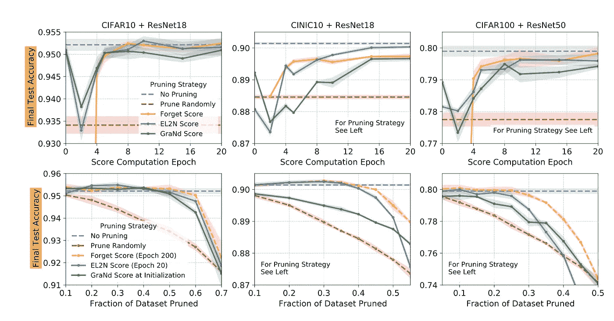**

**使用 GradNd 和 EL2N [21](https://arxiv.org/abs/2107.07075) 进行修剪的结果。图片取自参考文件 [21](https://arxiv.org/abs/2107.07075) 。**

**这项研究的结果如上图所示。尽管这种方法在 CIFAR-10 和 100 数据集上做得很好，但即使使用这种方法，明显的高修剪也是不合算的。当我们丢弃大量样本时，我们是否保留了数据分布？大多数情况下不会，这是唯一有意义的推理。我们又回到了修剪多少才算足够的问题上？数据及其分布是依赖于网络还是更多的属性？这项研究 [21](https://arxiv.org/abs/2107.07075) 声称，GradND 和 EL2N 分数在多次初始化或训练轨迹上平均后，消除了对特定权重/网络的依赖，呈现出更压缩的数据集。如果这个断言在现实中成立，在我看来，这是一个非常有希望的发现，缓解了 DL 的数据相关的挑战。**

**这项工作更令人着迷的是，它揭示了底层数据分布如何塑造训练动态。到目前为止，这一直是个错误。特别感兴趣的是识别在训练中相对稳定的模型数据表示的子空间。**

# **2.3.蒸馏**

**提炼技术是指将复杂或较大集合中的知识提炼为较小集合的方法。[知识或模型提取](https://arxiv.org/abs/1503.02531)是一种流行的技术，它将一个较大模型的学习表示压缩成一个小得多的模型，而性能没有任何显著下降。已经广泛探索了使用学生-教师培训机制，甚至在变压器网络的情况下，变压器网络甚至比更传统的网络更需要数据，例如卷积网络 [DeiT](https://arxiv.org/abs/2012.12877) 。尽管被称为数据高效，但这篇论文采用了师生策略来改造网络，而数据本身仅仅被视为一种商品。**

**最近，这一概念被研究用于数据集提炼的深度学习，目的是从大型数据集 [17](https://arxiv.org/abs/1811.10959) 、 [16](https://arxiv.org/abs/2102.08259) 中合成最佳的较小数据集。提取的数据集被学习和合成，但是在理论上，它们近似于更大的数据集。注意，合成数据可能不遵循相同的数据分布。**

**一些数据集提炼技术也将它们的方法称为压缩。我原则上不同意这一点，因为压缩虽然在这种情况下有损耗，但指的是压缩数据集，而蒸馏是推导/合成数据表示，可能会导致完全不同的样本。也许是适用于这两种技术的压缩系数，也就是压缩比。例如，图 13 显示了提取图像的变化程度。**

**一数据集蒸馏 [17](https://arxiv.org/abs/1811.10959) 论文引用:**

> ***我们提出了一种新的优化算法，用于合成少量的合成数据样本，不仅捕获了大量的原始训练数据，而且仅用几个梯度步骤* [*17*](https://arxiv.org/abs/1811.10959) *为快速模型训练进行了显式定制。***

**他们的问题表述非常有趣！他们将网络权重导出为合成训练数据的可微分函数，并设置训练目标以优化提取图像的像素值。该研究的结果表明，可以低至每个类别一幅合成图像，同时性能不会下降太多。更具体地说，他们将 MNIST 数字数据集的 6 万幅训练图像提取到仅 10 幅合成图像中(每类一幅)，测试时 MNIST 识别性能为 94%，而原始数据集为 99%)。**

**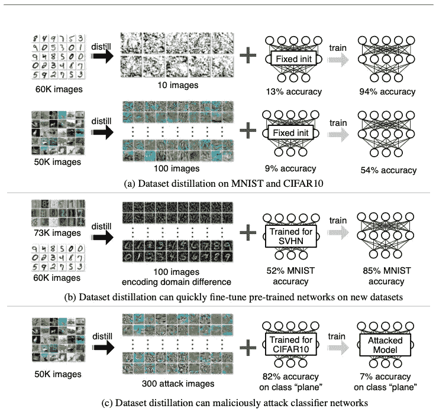**

**图 FAIR 研究的数据集提炼结果 [17](https://arxiv.org/abs/1811.10959) 。图像取自参考文件 [17](https://arxiv.org/abs/1811.10959) 。**

**这里是顶部标记的类别的一些蒸馏样本(图 9)。令人惊讶的是，在这些数据集上训练的 MNIST 表现得如此之好，但 CIFAR one 只达到了随机的水平(54%)，而在完整数据集上达到了 80%(图 8 和图 9)。**

**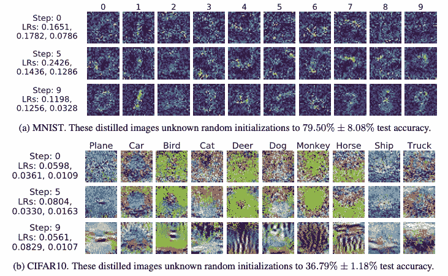**

**图 FAIR 研究的数据集提炼结果 [17](https://arxiv.org/abs/1811.10959) 。图像取自参考文件 [17](https://arxiv.org/abs/1811.10959) 。**

**在这项工作之后，提出了另一种利用核方法的提取技术——更具体地说是核岭回归，以获得原始数据集的ε-近似值 [18](https://arxiv.org/abs/2011.00050) 。这种技术被称为核诱导点(KIP ),并遵循相同的原理来保持目标函数以最大化近似，并反向传播梯度以学习合成的提取数据。 [18](https://arxiv.org/abs/2011.00050) 和 [17](https://arxiv.org/abs/1811.10959) 的区别在于一个 [17](https://arxiv.org/abs/1811.10959) 使用相同的 DL 网络，而另一个 [18](https://arxiv.org/abs/2011.00050) 使用内核技术。使用 KIP，另一个优点是不仅可以合成源样品，还可以选择性地合成标记。在 [17](https://arxiv.org/abs/1811.10959) 中，目标纯粹是学习像素值，从而学习源(X)。本文 [18](https://arxiv.org/abs/2011.00050) 还提出了另一种技术 Label Solve (LS) in，其中 X 保持不变，仅学习 label (Y)。**

**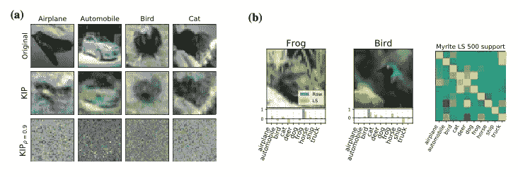**

**图 10:a)带 KIP 和 b)带 LS [18](https://arxiv.org/abs/2011.00050) 的蒸馏样品示例。图像取自参考文件 [18](https://arxiv.org/abs/2011.00050) 。**

**对于 10 个样本，来自 [17](https://arxiv.org/abs/1811.10959) (图 9)的 CIFAR 10 结果约为 36.79%，对于 KIP，在极端压缩的情况下，性能略有提高。这就提出了一个问题:什么样的压缩比才能保证良好的信息保留。对于像 CIFAR(与 MNIST 相比)这样的复杂任务，考虑到这个数据集相对复杂，10(每个样本一个)可能不够。**

**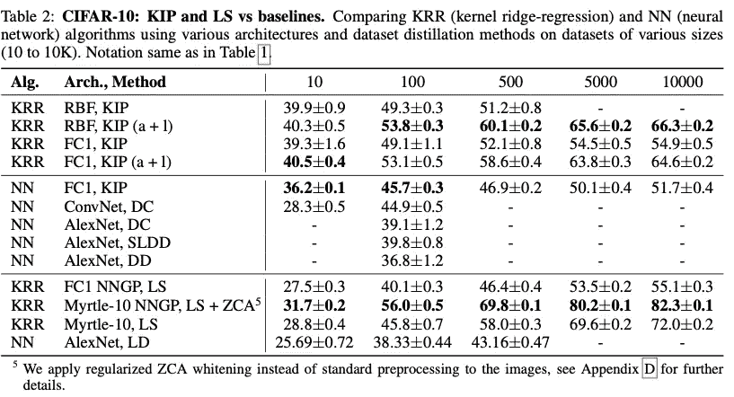**

**图 11:来自 KIP 和 LS [18](https://arxiv.org/abs/2011.00050) 的 CIFAR10 结果。图像取自参考文件 [18](https://arxiv.org/abs/2011.00050) 。**

**实际上，前面讨论过的 LO shot 技术 [11](https://arxiv.org/abs/1904.05046) 也是 X-shot 技术的一种特殊形式，它进行数据集提炼。除此之外，基于梯度的数据集提取技术在过去几年中得到了积极的研究(参考 [16](https://arxiv.org/abs/2102.08259) 、 [17](https://arxiv.org/abs/1811.10959) 、 [18](https://arxiv.org/abs/2011.00050) 、 [19](https://arxiv.org/abs/2006.05929) 、 [20](https://arxiv.org/abs/2107.13034) )。另一种方法探索了称为`Differentiable Siamese Augmentation (DSA)`的连体扩增法，该方法使用匹配损失，并通过反向传播技术 [16](https://arxiv.org/abs/2102.08259) 合成数据集**

****

**图 12:可微分连体增强 [16](https://arxiv.org/abs/2102.08259) 。图像取自参考文献 [16](https://arxiv.org/abs/2102.08259) 。**

**随着中间层中隐藏单元的数量接近无穷大 [20](https://arxiv.org/abs/2107.13034) (图 13)，贝叶斯和梯度下降训练的神经网络收敛到高斯过程(GP)。这对于卷积网络来说是真实的，并且它们收敛到特定的高斯过程，信道极限被延伸到无穷大。因此，这些网络可以被描述为被称为神经正切核(NTK)的核。[基于](https://github.com/google/neural-tangents) [JAX](https://github.com/google/jax) 的神经切线库一个自动微分工具包已经被用于应用这些内核来定义一些最近的蒸馏方法。参考文献 [18](https://arxiv.org/abs/2011.00050) 、 [20](https://arxiv.org/abs/2107.13034) 、 [21](https://arxiv.org/abs/2107.07075) 就是这样一个例子。**

**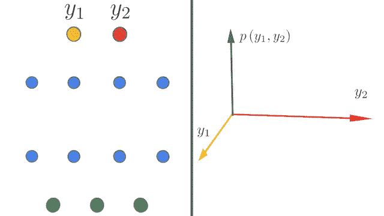**

**图 13:收敛到无穷远的无限宽卷积网络 [20](https://arxiv.org/abs/2107.13034) 。图片取自谷歌神经切线库相关来源 [src](https://ai.googleblog.com/2020/03/fast-and-easy-infinitely-wide-networks.html) 。**

**KIP 和 LS techniques [18](https://arxiv.org/abs/2011.00050) 的作者探讨了如何扩展和加速提取过程，以将这些技术应用于无限宽的卷积网络 [20](https://arxiv.org/abs/2107.13034) 。他们的结果很有希望(见图 14)。**

****

**图 14: KIP ConvNet 结果 [20](https://arxiv.org/abs/2107.13034) 。图像取自参考文件 [20](https://arxiv.org/abs/2107.13034) 。**

**在图 15 中示出了对来自基于无限宽度 CNN 的 KIP 技术的提取数据集的视觉检查。至少可以说，蒸馏结果很奇怪。在这个例子中，经过蒸馏的苹果图像似乎代表一堆苹果，而经过蒸馏的瓶子产生了明显不同的瓶子，同时仍然显示出原始两个瓶子的伪像。而其他类显示高阶特征(带有一些噪声)。**

****

**图 15:蒸馏 CIFAR 装置 [20](https://arxiv.org/abs/2107.13034) 的 KIP ConvNet 示例。图像取自参考 [20](https://arxiv.org/abs/2107.13034) 。**

**图 16 显示了 MNIST 结果，它们不仅非常有趣，而且看起来非常像 mixup(其中 x 和 y 都是混合的)。**

**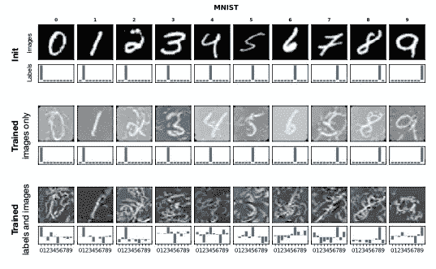**

**图 16:蒸馏 MNIST 套件 [20](https://arxiv.org/abs/2107.13034) 的 KIP ConvNet 示例。图像取自参考文件 [20](https://arxiv.org/abs/2107.13034) 。**

# **3.那么，如果你有嘈杂的数据呢**

**数据集中的噪声被认为是有害的。因为模型持有由数据集表示的知识的压缩形式，所以数据集管理技术仔细地寻找以避免数据集中的噪声。**

**噪声是一种非常强大的技术，可以填补源/图像中缺失的信息。例如，如果只有图像的一部分是已知的，那么代替用默认值(0 或 1 像素值)填充图像，使用随机噪声填充可以是避免与黑色或白色区域相关的实际真实值混淆的有效技术。这在我自己的经历中是真实的。有趣的是，遗忘事件研究实际上是在遗忘事件的分布上添加标签噪声。他们在像素值中添加了噪声，并观察到添加越来越多的噪声会减少令人难忘的样本数量(参见图 7 中使用噪声时的结果)。**

**DL 网络也能很好地处理来自随机性的噪声。我发现图 17 所示的 [22](https://arxiv.org/abs/2111.06377) 的结果非常有趣。看看当缺失的补丁是随机的时，模型做得有多好，当缺失的补丁是系统的时，模型做得有多差，这表明机器是多么强大和蹩脚(两者同时存在)!**

**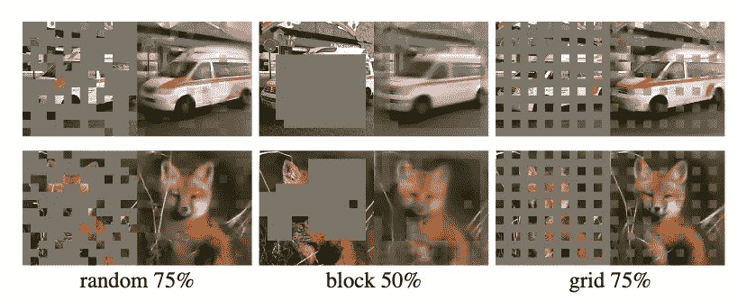**

**图 17:屏蔽自动编码器 [22](https://arxiv.org/abs/2111.06377) 中的噪声补丁。图像取自参考文件 [22](https://arxiv.org/abs/2111.06377) 。**

**grand study[21](https://arxiv.org/abs/2107.07075)，调查了噪声对声源本身的影响，并进行了一系列实验得出结论，当有足够的数据时，保留高分的例子(通常是嘈杂或困难的)不会影响性能，只会有所帮助。**

# **结论**

**总之，过去四年对于 DL 空间中的数据来说是令人难以置信的激动人心，2021 年更是如此！我们可以从像 MixUp 这样的简单技术中获得很多好处，但更令人兴奋的发展是剖析训练动态并探索样本在使用 DL 技术解决特定任务中的重要性。蒸馏方法仍处于早期阶段，它们适用于简单的数据集，但老实说，有多少现实世界的问题有简单的数据集？然而，这一领域出现了一些令人振奋的发展。如 [21](https://arxiv.org/abs/2107.07075) 所示，如果压缩方法适用于广泛的架构，这些技术可能是突破性的。**

# **参考**

1.  **【1707.02968】再论深度学习时代数据的不合理有效性。" 2022 年 1 月 3 日访问。https://arxiv.org/abs/1707.02968[。](https://arxiv.org/abs/1707.02968)**
2.  **赫斯提斯、乔尔、莎兰·纳朗、纽莎·阿达拉尼、格雷戈里·迪亚莫斯、Heewoo Jun、哈桑·基亚尼贾德、莫斯托法·阿里·帕特瓦雷医学博士、杨洋和周燕琪。“根据经验，深度学习的扩展是可预测的，”2017 年 12 月。【http://arxiv.org/abs/1712.00409】T4。**
3.  **[https://www.wired.com/story/no-data-is-not-the-new-oil/](https://www.wired.com/story/no-data-is-not-the-new-oil/)**
4.  **[https://pages . run . AI/hub fs/pdf/2021-AI-State-of-infra structure-survey . pdf](https://pages.run.ai/hubfs/PDFs/2021-State-of-AI-Infrastructure-Survey.pdf)**
5.  **【1808.01974】深度迁移学习调查。2022 年 1 月 5 日接入。[https://arxiv.org/abs/1808.01974](https://arxiv.org/abs/1808.01974)。**
6.  **迁移学习。[http://citeseerx.ist.psu.edu/viewdoc/download?doi = 10 . 1 . 1 . 146 . 1515&rep = re P1&type = pdf](http://citeseerx.ist.psu.edu/viewdoc/download?doi=10.1.1.146.1515&rep=rep1&type=pdf)**
7.  **张、、穆斯塔法·西塞、扬恩·多芬和·帕斯。“混淆:超越经验风险最小化”，2017 年 10 月。https://arxiv.org/abs/1710.09412。**
8.  **[1812.01187]利用卷积神经网络进行图像分类的一系列技巧。2021 年 12 月 30 日访问。[https://arxiv.org/abs/1812.01187](https://arxiv.org/abs/1812.01187)**
9.  **【2009.08449】“不到一个”——Shot Learning:向 M<n samples.="" accessed="" january="" class="ae mw" href="https://arxiv.org/abs/2009.08449" rel="noopener ugc nofollow" target="_blank">https://arxiv.org/abs/2009.08449 学习 N 节课。</n>**
10.  **[1512.00567]重新思考计算机视觉的初始架构。2022 年 1 月 5 日接入。https://arxiv.org/abs/1512.00567[。](https://arxiv.org/abs/1512.00567)**
11.  **[1904.05046]从几个例子中归纳:一项关于少量学习的调查。2022 年 1 月 5 日接入。【https://arxiv.org/abs/1904.05046】T4。**
12.  **李菲菲、r .弗格斯和 p .佩罗娜，“对象类别的一次性学习”， *IEEE 模式分析和机器智能汇刊*，第 28 卷，第 4 期，第 594-611 页，2006 年 4 月，doi:10.1109/tpami . 2006.79 .[https://ieeexplore.ieee.org/document/1597116](https://ieeexplore.ieee.org/document/1597116)**
13.  **[1606.04080]用于一次性学习的匹配网络。2022 年 1 月 5 日接入。[https://arxiv.org/abs/1606.04080](https://arxiv.org/abs/1606.04080)。**
14.  **【1812.05159】深度神经网络学习过程中样例遗忘的实证研究。2021 年 12 月 29 日访问。[https://arxiv.org/abs/1812.05159](https://arxiv.org/abs/1812.05159)**
15.  **[1906.11829]通过代理的选择:深度学习的有效数据选择。2021 年 12 月 29 日访问。https://arxiv.org/abs/1906.11829。**
16.  **[2102.08259]使用可微分连体增强的数据集压缩。2022 年 1 月 5 日接入。[https://arxiv.org/abs/2102.08259](https://arxiv.org/abs/2102.08259)**
17.  **[1811.10959]数据集提取。2022 年 1 月 5 日接入。[https://arxiv.org/abs/1811.10959](https://arxiv.org/abs/1811.10959)。**
18.  **[2011.00050]来自核岭回归的数据集元学习。2022 年 1 月 5 日接入。[https://arxiv.org/abs/2011.00050](https://arxiv.org/abs/2011.00050)。**
19.  **[2006.05929]具有梯度匹配的数据集压缩。2022 年 1 月 5 日接入。[https://arxiv.org/abs/2006.05929](https://arxiv.org/abs/2006.05929)。**
20.  **"[2107.13034]无限宽卷积网络的数据集提取。"2022 年 1 月 5 日接入。[https://arxiv.org/abs/2107.13034](https://arxiv.org/abs/2107.13034)。**
21.  **[2107.07075]基于数据饮食的深度学习:在训练早期找到重要的例子。2021 年 12 月 10 日接入。[https://arxiv.org/abs/2107.07075](https://arxiv.org/abs/2107.07075)。**
22.  **[2111.06377]屏蔽自动编码器是可扩展视觉学习器。2022 年 1 月 5 日接入。https://arxiv.org/abs/2111.06377[。](https://arxiv.org/abs/2111.06377)**
23.  **[1802.03426] UMAP:一致流形近似和降维投影。2022 年 1 月 5 日接入。【https://arxiv.org/abs/1802.03426】T4。**
24.  **作者声明:Geoffrey E. Hinton .“使用 t-SNE 将数据可视化。”《机器学习研究杂志》9(2008):2579–2605。[https://www . jmlr . org/papers/volume 9/vandermaten 08 a/vandermaten 08 a . pdf](https://www.jmlr.org/papers/volume9/vandermaaten08a/vandermaaten08a.pdf)**
25.  **小心你的异常值！探讨离群点对视觉问答主动学习的负面影响。" 2022 年 1 月 8 日访问。[https://arxiv . org/ABS/2107.02331](https://arxiv . org/ABS/2107.02331)**