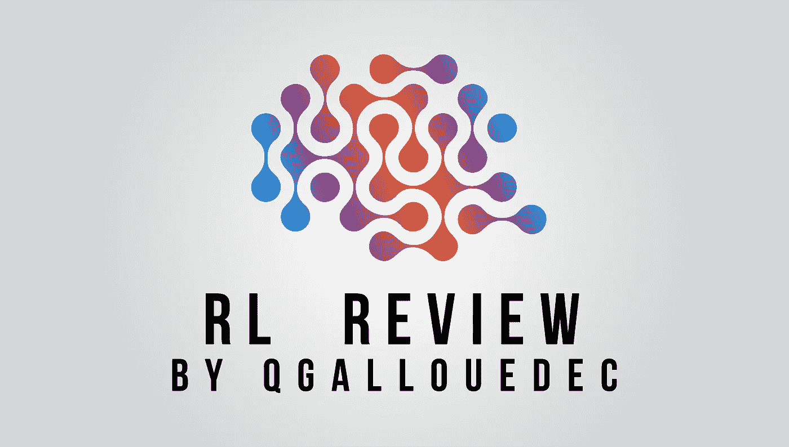
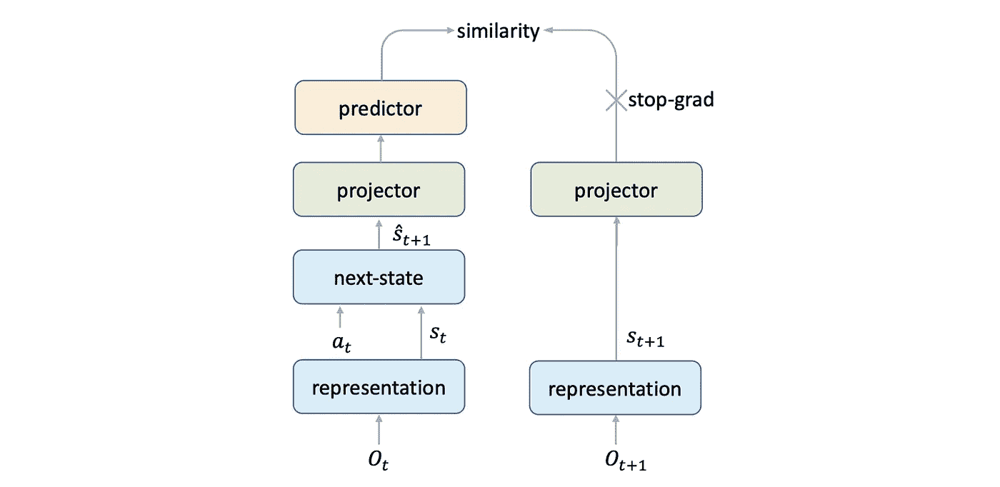
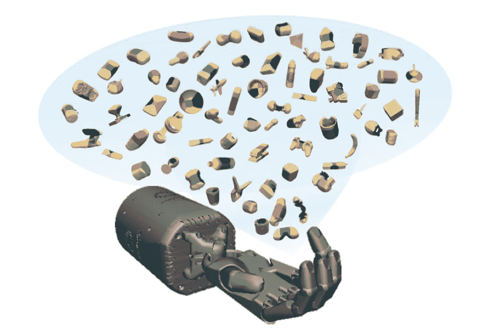
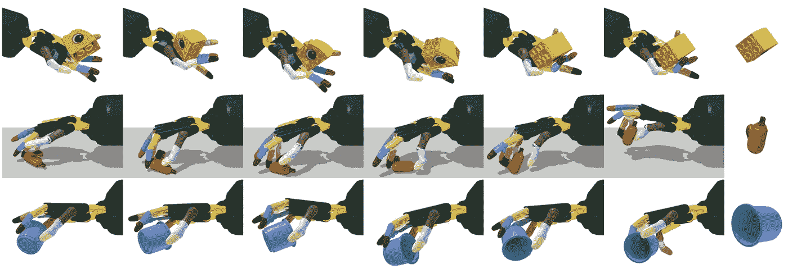

# 复习强化学习试卷#13

> 原文：<https://towardsdatascience.com/review-of-reinforcement-learning-papers-13-24ed69a8fdc2>

# 复习强化学习试卷#13

## 我在我的研究领域发表了 4 篇文章:强化学习。大家讨论一下吧！

作者图片

[ [←上一次回顾](/weekly-review-of-reinforcement-learning-papers-12-9ec3a81720?sk=18228793ad496e86a916a7d890e53634) ][ [下一次回顾→](/review-of-reinforcement-learning-papers-14-70b6772a8100?sk=d5332957a1e08d1ac3bcf82c68d3c94d)

# 论文 1:用有限的数据掌握雅达利游戏

叶文伟，刘，库鲁塔奇，t，阿贝耳，p .，，高，Y. (2021)。[用有限的数据掌握雅达利游戏](https://arxiv.org/abs/2111.00210)。 *arXiv 预印本 arXiv:2111.00210* 。

Eefficient zero 是作者给他们新的强化学习算法起的名字。是什么使它不同于其他许多先进的算法？让我们现在就看。

先说它是基于视觉的算法。基于视觉的强化学习非常复杂，因为观察空间是巨大的，并且环境在大多数时候仍然是部分可观察的。其次，作者在这里关注离线学习，即算法使用已经收集的数据，并且不能与环境交互。测试离线视觉算法最常见的基准是 Atari 100k 基准。顾名思义，它是一个包含与 Atari 2600 游戏的 100k 次交互的基准测试，相当于实时游戏的 2 小时。给你一个数量级的概念，雅达利游戏上的大多数在线强化学习算法都使用了几千万或几亿次的交互。说白了，很少。这里的目标是用很少的数据学习最多的东西。这就是所谓的样本效率。

在我们进入 EfficientZero 如何工作之前，让我们先来讨论一下结果。他们的方法在 Atari 100k 基准上达到了 190.4%的平均人类性能和 116.0%的中值性能。相比之下，这是 DQN 用 500 倍多的数据实现的性能。在 DMControl 100k 基准(类似的基准，但用于控制任务)上，他们的方法获得了比著名的从地面真实状态学习的 SAC 算法更好的结果(从而不会遭受基于视觉的学习的困难)。我们可以肯定地说，他们的算法是样本高效的。

但是，这个算法是如何工作的呢？如果 EfficientZero 这个名字听起来耳熟，那是正常的。这是因为这个算法只不过是 MuZero 的三个重要修改:

第一，*自我监督的一致性损失*。你应该知道，穆泽罗使用了环境的“表征”，这允许它从观察中产生一种状态。这个状态然后被传递给模型，也是在之后，以预测下一个状态。为了一致性，在时间 t 推断的下一个状态必须对应于在 t+1 的表示的状态。考虑到这一点，作者在测量这两种状态之间距离的模型的学习中增加了一个损失:名副其实的自我监督一致性损失

图来自[篇](https://arxiv.org/abs/2111.00210):自我监督的一致性损失

第二，*端到端的预测值前缀。*对于这一条，我只给你直觉。在许多情况下，可以预测某一事件将会发生，但不能准确预测它将在何时发生。通过利用这种直觉，作者修改了要学习的值的形式，以促进这种预测。

最后，*基于模型的偏离策略修正*。就这一点而言，这是一个纠正因使用旧政策获得的数据而导致的差异的问题。通过在收集的数据和来自模型的预测之间添加平衡，可以限制这种差异。

就其取得的结果而言，这种方法值得研究。到目前为止，它还不是开源的，但应该很快就会了。

# 论文 2:通过几何感知多任务学习的灵巧操作

黄，w .，莫达契，I .，阿贝耳，p .，，帕塔克，D. (2021)。[通过几何感知多任务学习实现灵巧操作的泛化](https://arxiv.org/abs/2111.03062)。 *arXiv 预印本 arXiv:2111.03062* 。

n 手操作包括学习用机器人手操纵物体。本文的出发点是以下简单的观察:一个被训练来操纵一个对象的代理不一定知道如何操纵另一个对象。在大多数关于手动操纵的文章中，很少有冒险改变操纵对象的。那又怎样？我们应该学习一个专门用于操纵所有可能对象的策略吗？不，这篇文章的作者通过提议使用一个单一的策略来操作 100 个不同形状的对象，为这个主题提供了一些启示。

图来自[文章](https://arxiv.org/abs/2111.03062):“训练一个可以对大量对象进行手工操作的策略”

本文的关键要素是作者所谓的“几何感知对象表示”。首先，你要知道，大多数时候，我们喜欢用 6 个坐标来表示一个物体:3 代表它的位置，3 代表它的方位。很方便，而且效果很好。但是这种表示并没有抓住物体的形状。所以，当有不同形状的物体时，它就不那么好用了。这就是“几何感知对象表示”的用武之地。它使用对象的点云，而不是仅用位置和方向来表示对象。该点云由第一神经网络编码以构建**对象表示**。具体地说，这个网络被训练来提取 2 样东西:对象的类别(它是哪个对象？)，以及它的方位。正是这种表示作为策略网络的输入。然后可以用任何强化学习方法来训练该策略(他们在文章中使用了 DDPG)。

一旦经过训练，它们表明该策略可以对其数据集中的 100 个对象进行手动操作。
他们还表明，这一政策可以推广到不同大小和形状的看不见的物体。另一个有趣的结果是:当以这种方式学习策略时，学习到的策略似乎比用单个对象(老方法)学习到的策略执行得更好。你认为这是为什么？

# 论文 3:深度强化学习中的概括综述

柯克，r .，张，a .，Grefenstette，e .，& rocktschel，T. (2021 年)。[深度强化学习中一般化的调查](https://arxiv.org/abs/2111.09794)。 *arXiv 预印本 arXiv:2111.09794* 。

强化学习中的泛化研究是一个相当年轻的领域。它包括回答以下问题:学习算法表现好吗，即使是在它从未见过的数据上？举个例子:如果我在瑞士教一个代理开车，他会不会在德国会开车？这项任务在全球范围内保持不变，但交通标志可能会略有变化，一些速度限制或一些规则也会有所变化。

对这个问题的研究是至关重要的，特别是如果我们想在现实世界的场景中部署强化学习算法。在这种情况下，环境是不断演变的，而且是极其多样的。与部署过程中实际遇到的数据相比，学习过程不可避免地会有很小的差异。

定义了这一点，现在让我们转向出版物本身。这篇文章试图为强化学习中的概括研究建立一个通用的框架。它为这一问题的未来工作提出了术语和形式。我不会深入讨论这本书的细节，而是从它的结论中提出七点。

1.  **应该考虑零炮学习**。这是一个设置(在计算机视觉中众所周知，在强化学习中研究较少)，其中代理在一个环境中被训练，但在另一个环境中被评估。代理没有在这个新的环境中完成它的训练，因此术语零射击。
2.  注意，这并不意味着最优策略应该被认为是固定的。相反，我们必须考虑一个不断变化的最优。这意味着持续学习，也就是说在部署期间持续学习。这是整个研究领域的主题:**持续学习**。未来的强化学习系统最有可能部署在这样的场景中。
3.  **纯粹的** **程序化内容生成环境不足以**研究概括。PCG 是一种创造从一集到另一集环境变化的方法。为了理解，想象一个机器人必须学会在一个从一集到另一集改变形状的房间里导航。如果这种方法在迫使智能体适应各种各样的变化方面似乎非常有效，那么作为黑盒工作的 PCG 仍然会带来一个问题:在训练阶段和实验阶段的环境生成策略不能改变。然而，研究非常有趣，例如，如果我们的机器人在训练阶段从未遇到过椅子，它会对椅子做出什么反应。作者的建议是打开这些黑盒来研究这样的场景。
4.  为了部署现实世界问题的模型，必须特别注意**上下文效率**。当环境的动态和回报依赖于隐藏的静态参数时，就使用了上下文这个术语。上下文效率是代理在这些参数被修改时快速学习的效率(因此改变了动态和回报)。
5.  对于**离线学习问题**的泛化需要进一步探索。离线学习包括在不允许代理与环境交互的情况下训练代理。数据是预先固定的，数量有限。
6.  在现实世界的场景中，**动态和奖励函数很可能在学习过程中发生变化**。有必要进一步研究算法在这种情况下的表现。
7.  由于模拟器不能完美地再现真实世界，当模型被部署到真实世界场景中时，不可避免地会有一些特征发生变化。如果我们能够识别这些特征，就有可能从训练输入中消除它们(例如，颜色，用于颜色不相关的任务)。这就是归纳偏差的一个例子。当泛化问题很强时，这些泛化偏差一定是同等重要的。未来的工作应该更加明确这些**归纳偏差**，具体评估它们对结果的影响。

此外，作者提供了许多其他未探索的研究途径。我们有很多工作要做！

# 论文 4:一个通用的手持物体重定向系统

陈，t，徐，j .，，阿格拉瓦尔，P. (2021)。[一个通用的手握物体重定向系统](https://arxiv.org/abs/2111.03043)。 *arXiv 预印本 arXiv:2111.03043* 。

图来自[文章](https://arxiv.org/abs/2111.03043)。

在本文中，作者提出了一个框架的具体学习这一重定向任务。目标不是像许多以前的作品那样学习操纵单个对象，而是操纵广泛的对象，包括代理在学习阶段从未遇到过的对象。此外，他们还对未探索的情况感兴趣，即手不是掌心向上，而是朝下(这是一个更复杂的任务，因为它必须处理重力)。

框架相当巧妙。作者首先指出，在现实世界中，一些描述符比其他描述符更难测量(例如，物体的速度很难测量，而机器人关节的位置很容易测量)。然而，在模拟中，这些组件很容易访问。他们还发现，拥有包含所有这些特征的完整观察的代理比只拥有容易测量的特征的代理学习得更快更好。这就是他们提出的:在完全观察的模拟中学习。以这种方式训练出来的智能体被称为教师。然后，一个学生被训练模仿老师，但来自简化的观察。结果相当好，作者表明这种方法允许用单个代理学习许多对象的操作。这些结果通过他们所谓的重力课程得到了进一步的改进(我让你参考这篇论文了解更多细节)。

他们最后指出，最令人惊讶的观察结果是操纵物体不需要形状信息。对于操作任务来说，视觉可能没有思维重要。这一观察虽然令人惊讶，但当人们意识到闭着眼睛操纵一个物体并不更复杂时，这一观察仍然是自然的。

谢谢你把我的文章看完。我很乐意阅读你的评论。

你们中的一些人可能注意到我拿走了《周刊》。这很正常。写这篇每周文章的工作量太大了，我经常没有素材。从现在开始，这些评论完成后会发表，这取决于我掌握的材料。