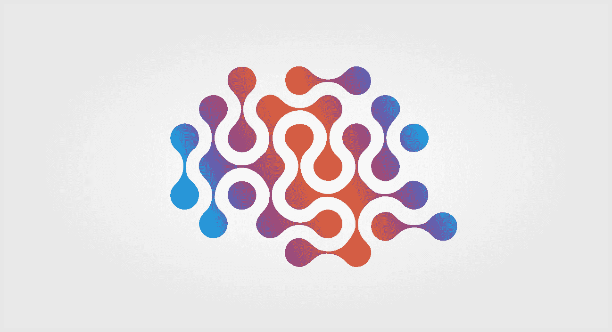
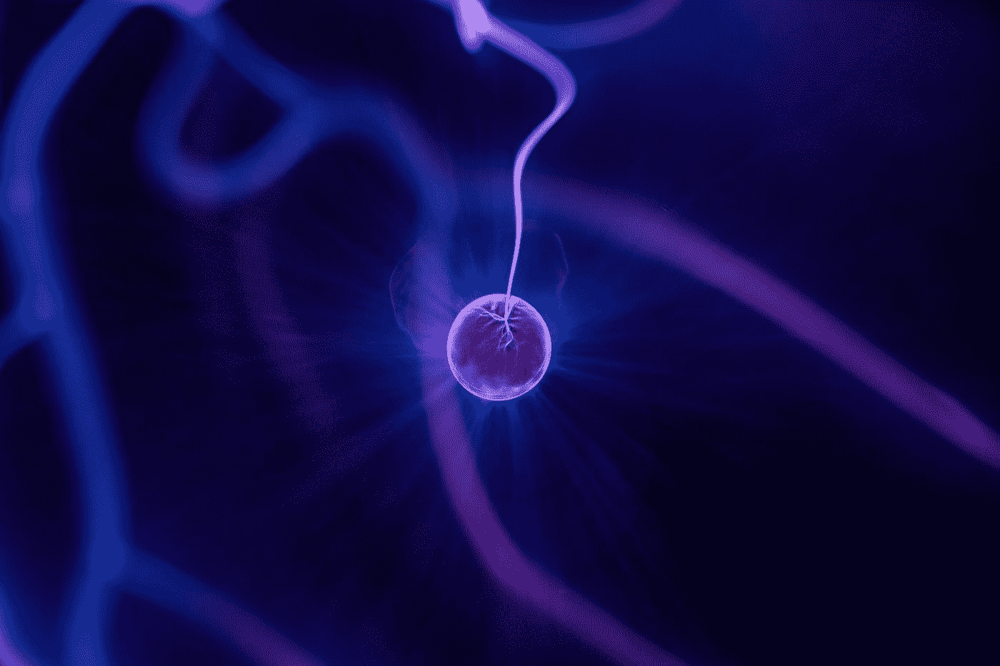
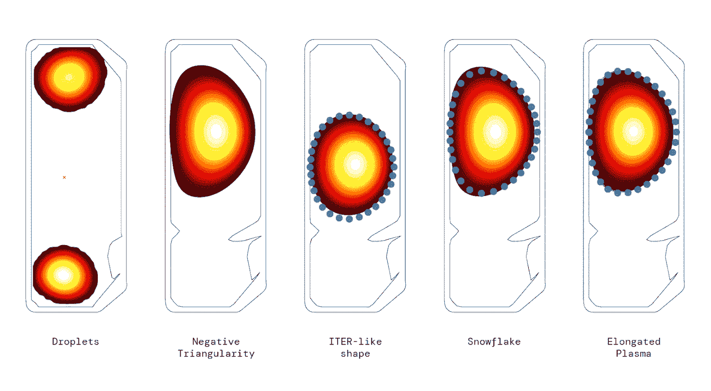
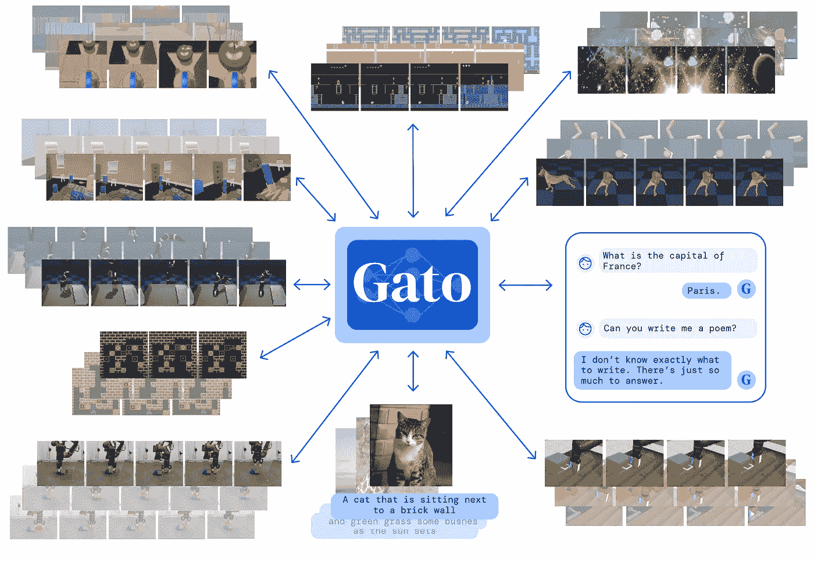

# 复习强化学习试卷#14

> 原文：<https://towardsdatascience.com/review-of-reinforcement-learning-papers-14-70b6772a8100>

## 我在我的研究领域发表了 4 篇文章:强化学习。大家讨论一下吧！

作者图片

【 [←上一次回顾](/review-of-reinforcement-learning-papers-13-24ed69a8fdc2?sk=7b943268ec3a5256ff4cc0f7b48aa81f)】【下一次回顾→】

强化学习是解决复杂控制问题的一个强有力的工具，最近的研究在将它应用到各种领域方面取得了重大进展。在本帖中，我们将回顾四篇论文，展示强化学习在不同领域的潜力，包括能源生产、自我监督学习、机器人和自然语言处理。

# 论文 1:通过深度强化学习对托卡马克等离子体的磁控制

Degrave，j .、Felici，f .、Buchli，J. *等* [通过深度强化学习对托卡马克等离子体进行磁控制](https://www.nature.com/articles/s41586-021-04301-9)。*性质* **602，**414–419(2022)。

照片由[Zoltan·塔斯](https://unsplash.com/@zoltantasi?utm_source=medium&utm_medium=referral)在 [Unsplash](https://unsplash.com?utm_source=medium&utm_medium=referral) 上拍摄

我们时代的主要挑战之一与能源有关。如何为人类生产足够数量的清洁能源？Deempind 最近在这个方向上迈出了新的一步。在《自然》杂志上发表的一篇论文中，他们解释了他们是如何成功应对一项重大物理挑战的:控制托卡马克中氢等离子体的聚变。先说一些背景信息。

挑战:重现恒星中发生的核反应，仅此而已！但是为了发生预期的反应，这些元素必须被加热。厨房烤箱是不够的，因为它必须达到 1.5 亿度！为此，物理学家青睐的方法是让等离子体在一个他们称之为托卡马克的空心圆环中旋转。由于反应不稳定，托卡马克的磁场必须非常精确地调整，每秒钟调整几千次，这样等离子体就不会接触到壁(你知道，在这种温度下，壁不会抵抗很久)。让我们总结一下:根据等离子云的位置，目标是选择施加在托卡马克线圈上的电压，以避免等离子云碰到壁。如果这个提法让你想用强化学习来解决这个问题:太晚了，DeepMind 已经做到了，它就是这篇出版物的主题。

主要的困难是数据的可获得性。你知道，为了训练一个强化学习模型，有必要拥有大量的数据，即使对于简单的任务，也需要与环境进行几个小时的交互。然而，这个星球上为数不多的托卡马克是由许多研究项目共享的，只需运行几分钟就需要很长时间的准备和冷却。为了克服这个问题，研究人员不得不使用模拟模型。虽然所涉及的现象非常复杂，以至于模拟非常缓慢，但研究人员能够获得足够多的数据来学习一个模型。

物理学家对几种形状的等离子体感兴趣。这些形状中的一些已经用学习的模型成功地实现了。特别是，该模型首次实现了液滴(见下图)。

图:产生的等离子体形状。(鸣谢:DeepMind & SPC/EPFL)

我们再一次见证了在物理世界中强化学习的成功。这一次，它允许控制一个复杂的机器，这将允许在未来可能获得一个完全清洁的能源。

# 论文 2:通过行动了解世界

莱文，S. (2022)。[通过行动了解世界](https://proceedings.mlr.press/v164/levine22a.html)。*第五届机器人学习会议论文集*164:1752–1757。

我众所周知，更大的模型和更多的数据会带来更好的学习，对吗？但是由于讨厌的计算能力问题，我们的模型能有多大是有限制的。另一方面，数据集只受到构建它们的人类努力的限制。这就是为什么自我监督学习方法变得如此受欢迎——它们不需要手动注释，尽管它们仍然需要大量的工程工作。

现在，事情变得有趣了。自我监督学习和 RL 之间有很强的联系，在 RL 中，代理可以自己做出决定来增加对环境的了解。但事情是这样的——即使代理人做出了自己的选择，它仍然被奖励信号所强化，奖励信号是由……你猜对了，是一个人。因此，作者认为我们应该探索更多的范例，让代理人设定自己的目标。

其次，他坚持离线学习的相关性，离线学习的优点是允许使用以前收集的数据，这些数据可以来自过去的经验，甚至来自其他代理人的经验。这对于现实世界的应用程序来说尤其重要，因为在现实世界中，数据收集是一个棘手的问题。

简而言之，自我监督学习和 RL 有很多可以互相学习的地方，离线学习是一种聪明的方式，可以充分利用我们的数据收集工作。快乐学习！

# 论文 3:决策转换器:通过序列建模的强化学习

陈，卢，k，拉杰斯瓦兰，a，李，k，格罗弗，a，拉斯金，m，…和莫尔达奇，I. (2021)。[决策转换器:通过序列建模进行强化学习。](https://proceedings.neurips.cc/paper/2021/hash/7f489f642a0ddb10272b5c31057f0663-Abstract.html) *神经信息处理系统进展*，34，15084–15097。

T 这篇论文的作者想出了一种方法来处理强化学习，这完全是关于序列建模的。他们决定使用一种叫做 Transformer 架构的东西，这是目前语言建模中非常流行的东西。他们的模型被称为决策转换器，它采用过去的状态、行动和期望回报(或者奖励，如果你愿意的话)，并使用它们来生成将导致所述期望回报的未来行动。这种方法有几个好处——它避免了“[致命三重奏](/introduction-to-the-deadly-triad-issue-of-reinforcement-learning-53613d6d11db)”和贴现未来奖励，这是 RL 中令人讨厌的问题，它允许使用现有的 transformer 框架和监督学习系统。

但真正的问题是——在各种任务上，Decision Transformer 的表现与最先进的无模型离线 RL 基线一样好，甚至更好。印象深刻吧。作者还深入研究了在任务之间转移知识和使用决策转换器进行在线学习和连续控制的潜力。总而言之，看起来这种模式可能会改变 RL 世界的游戏规则。所以，如果你对这类东西感兴趣，就去读一读吧！

# 论文 4:多面手

Reed，s .、Zolna，k .、Parisotto，e .、Colmenarejo，S. G .、Novikov，a .、Barth-Maron，g .、… & de Freitas，N. (2022 年)。[通才代理](https://arxiv.org/abs/2205.06175)。 *arXiv 预印本 arXiv:2205.06175* 。

A 人工代理仅限于实现单一任务。例如，我们谈到:一个识别图片中交通标志的模型，或者一个总结文本的模型，或者一个自动控制机器人的模型…一个总结文本的模型将无法将该文本翻译成英语，更不用说控制机器人了…直到这篇论文！

DeepMind 的研究人员发表了一篇论文，其中他们描述了第一个能够执行非常多种任务的模型(称为 GATO)。加托可以玩任何雅达利游戏，聊天，图片说明，用真正的机械臂叠积木等等。革命性的是，单个神经网络被用来执行所有这些任务。

来自[出版物](https://arxiv.org/abs/2205.06175)的数字:“加托接受了 604 项不同任务的训练，训练方式、观察和行动规范各不相同”

加托是如何做到这种普遍性的呢？因为代理将几种模态作为输入，包括图像、文本、本体感受、连接对、按钮按压等。并且产生不同类型的连续和离散动作，它必须在所有这些模态之间做出选择。为此，数据被序列化为一系列令牌。这些标记然后由类似于语言模型中使用的转换器神经网络进行处理。

尽管与文献中的专家模型相比，加托在所有这些任务方面都很差，但它是第一个具有如此高的通用性的模型。这大概是未来几年 AI 研究要走的方向:让最广义的智能体成为可能。敬请关注。

# 结论

本文回顾的论文展示了强化学习在解决不同领域的各种问题方面的多功能性和潜力。从控制清洁能源生产的托卡马克等离子体，到提高自主和通用系统的鲁棒性，这些论文展示了强化学习在解决复杂控制问题和实现更加智能和自主的系统方面的力量。所有这些论文还强调了适应不断变化的环境和使用大量数据来提高性能的重要性，展示了强化学习在各个领域做出重大贡献的潜力，并为该领域的未来发展铺平了道路。谁知道未来我们能用强化学习做些什么惊人的事情呢？只有时间(也许还有更多的论文)会告诉我们答案。

谢谢你把我的文章看完。我很乐意阅读你的评论。