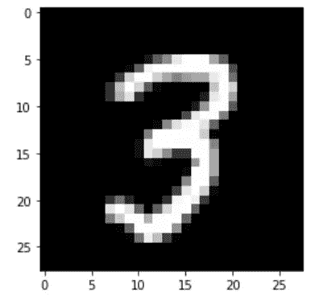
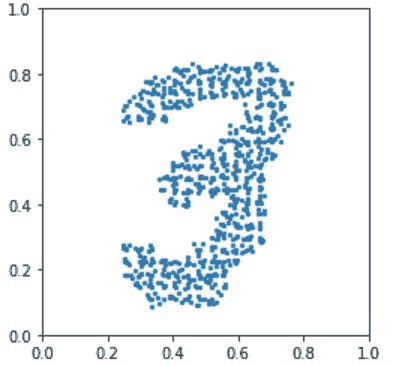
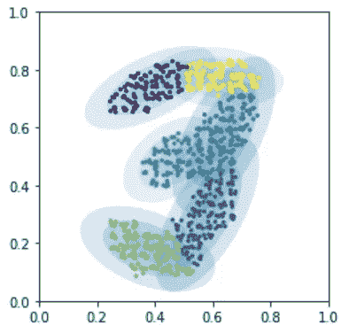
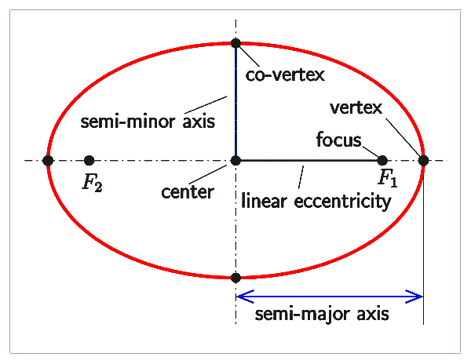
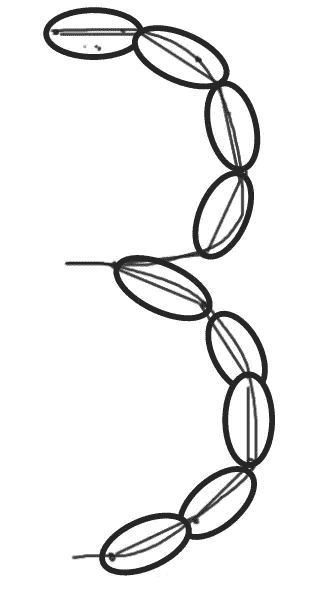
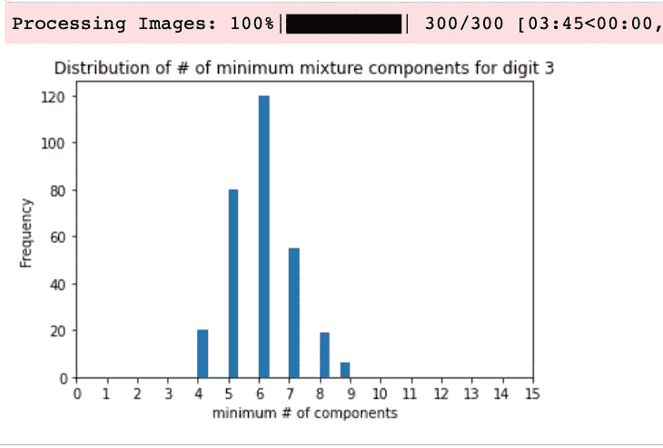
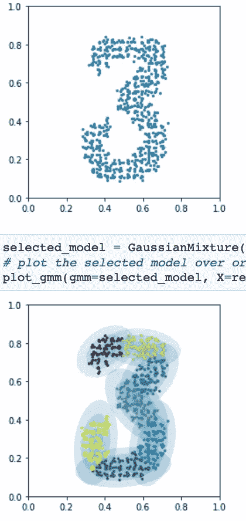

# 用全新的眼光重游 MNIST

> 原文：<https://towardsdatascience.com/revisiting-mnist-with-fresh-eyes-36f9d19a75d1>

## 动手教程；人工智能视角的转变

## MNIST 数据的空间透视，而不是通常的矢量处理


在 [Unsplash](https://unsplash.com?utm_source=medium&utm_medium=referral) 上由 [nine koepfer](https://unsplash.com/@enka80?utm_source=medium&utm_medium=referral) 拍摄的照片

到 2022 年，MNIST 数据集已经成为进入人工智能的人的“Hello-World”数据集。见鬼，可能已经有几年了。

在 MNIST 通常的人工智能处理中——无论是将数据加载到神经网络，逻辑回归，随机森林，插入——人工智能算法——在这里，每个手写数字图像及其像素值都被视为一个*向量*(因此正方形图像被拉长为一个向量)，该向量被馈入算法。对于数千位数字，训练算法意味着将数千个像素拉长的向量作为矩阵输入算法进行处理。


图片来源:[https://medium . com/data man-in-ai/module-6-image-recognition-for-insurance-claim-handling-part-I-a 338d 16 c 9 de 0](https://medium.com/dataman-in-ai/module-6-image-recognition-for-insurance-claim-handling-part-i-a338d16c9de0)

然而，我希望你，精通人工智能的读者，对数字采取不同的观点——你几乎认为这是理所当然的，因为它看起来非常直观——我们的眼睛完全是为这种观点而生的。

与其他类型的数据(如表格记录、NLP 文本数据、音频数据等)相比，图像数据有一个独特的特点。别有–图像中像素的直观*空间*配置。因此，不要试图通过将行合并成一个向量来消除图像数据的空间属性，让我们利用我们的眼睛和大脑直观使用的这一属性！

**将图像像素转换成笛卡尔点**

我们需要采取的第一步是将图像像素转换成笛卡尔(x，y)点。我们拍摄一张图像，并转换这些值，这样我们就可以使用 *xy* 平面中的点来复制它。这是原始的 3:



图片鸣谢:作者。原始样本“3”的 MNIST 图像

上面黑白图像中的每个像素都有一个坐标:(0，27)是左下角，(0，0)是左上角。所以它与通常的笛卡尔 *xy-* 平面有点不同，在笛卡尔平面中(0，0)在*左下方*。首先，我们进行一次转换，将像素坐标转换为笛卡尔坐标，这是在下面的代码中完成的:

```
normalize_image = np.asarray(image).astype('float32')/255.0
    coordinates = list(itertools.product( range(0,28) , range(0,28)))
    ...
    x_values = np.float16(np.asarray([fp[1] for fp in filtered_points]))
    y_values = 27-np.float16(np.asarray([fp[0] for fp in filtered_points]))
```

然后，我们给每个点添加统计噪声(使用正态分布),以便它更多地“填充”像素点之间的空间。每个像素处于整数坐标；所以转换到笛卡尔坐标只能得到整数坐标，这不是一个数据丰富的表示。基本思想是，我们到每个整数笛卡尔坐标(从像素转换而来)并在所选坐标周围采样 4 个新点作为随机噪声*，并将所有 5 个点绘制在一起。代码是这样的:*

```
for i in range(0, data.shape[0]): # this loops thru each Cartesian coordinate
      point = data[i,:]
      mean = point
      cov = np.array( [[0.0001, 0], [0, 0.0001]] )
      ...
      test_x, test_y = np.random.multivariate_normal(mean, cov, 4).T
        ... # this creates the random noise
    return filled_in
```

而完成的笛卡尔，坐标 *xy-* 平面结果看起来是这样的！



图片鸣谢:作者。你可以在这里看到，这张图像由笛卡尔像素-整数坐标(归一化)制成，添加了噪声，看起来真的很像上面的 MNIST 黑白图像！

**机器学习来了！**

好吧，所以你可能会问:为什么我们要经历这整个过程，只是为了让*看起来像另一个*有笛卡尔点的 MNIST 图像？有什么大不了的？

好吧，重要的是:因为我们现在有(x，y)点作为数据，我们可以对它执行机器学习，就像它是任何其他 2D 数据集一样！我们要用的机器学习技术叫做高斯混合模型。基本上，这是一种通过使用高斯*密度*来教导计算机理解点的分布的奇特方式(就把它想象成高斯椭圆；它们看起来真的像椭圆形，你马上就会看到)。

创建它的代码是:(“plot_gmm”是一个定制的可视化函数，这归功于 Jake VanderPlas 可视化集群的代码。他的功能可以在这里找到:[https://jakevdp . github . io/python datascience handbook/05.12-Gaussian-mixes . html](https://jakevdp.github.io/PythonDataScienceHandbook/05.12-gaussian-mixtures.html)

```
selected_model = GaussianMixture(n_components=gaussian_learning( result ), random_state=1, covariance_type='full')# plot the selected model over original image data with a user-defined function. Credit to Jake VanderPlas.
plot_gmm(gmm=selected_model, X=result)
```



图片来源:作者

颜色不错！但是这具体告诉了我们什么呢？嗯，它向我们展示了人工智能算法能够计算出创建“3”形状的点所需的混合块。

但是等一下:这只是针对数据集中一个特定的“3”。难道我们不需要对 MNIST 集合中的每一个“3”进行可视化吗？嗯，是的，但是不要做可视化，让我们关注从这个设置中收集的不同属性:在混合物机器学习过程中使用的混合物*成分*的*号*。

**汇总数据中的有趣属性**

我们再来看看上面的图片。我们可以看到，ML 算法使用 6 个混合分量来导出构成“3”的点的分布。这在集合中的所有“3”中是共同的吗？为什么是 6 个组件？对我们人类的眼睛来说，它看起来就像“3”是由两条简单的曲线在中心连接而成。

为了回答第二个问题——为什么有 6 个组件——在上面的可视化中，我们看到了使用高斯聚类的局限性:每个组件都是一个具有假想垂直轴的椭圆，就像这样:



图片来源:[https://en.wikipedia.org/wiki/Ellipse](https://en.wikipedia.org/wiki/Ellipse)

为什么这很重要？嗯，具有这些垂直轴的椭圆当然可以覆盖像椭圆一样模糊分布的点的“云”。但这带来了一个限制:在上面的图像中，数据点的形状像一个 3，组成“3 的曲线”的点的主要部分看起来像凸弯曲的“软糖”——虽然椭圆也是凸的，但在不改变方程的情况下，它不能像软糖一样强制弯曲或弯曲。并且改变方程，意味着不使用高斯混合学习。

因此，这基本上告诉我们，高斯混合建模，在 MNIST 从这个 2D，空间配置的背景下，真的只能建模图形的“直线部分”。这就好像你的任务是拍一张 3 的照片，把它分解成多边形的直线部分，然后在这些直线周围画椭圆。



图片鸣谢:作者。把一个“3”分段成几个直线，然后用一个椭圆包住每条直线。看起来很像上面的高斯色聚类，不是吗？

所以想象一下，所有来自上面的可视化的组成 3 的数据点，它们中的每一个都属于这些椭圆中的一个。如您所见，这里的直线是椭圆的长轴直径，根据椭圆的大小和数据点的配置，可能会有更多或更少的椭圆。但是高斯混合学习试图将图像分解成这些簇，这解释了为什么一些“3”与 6 个分量聚集在一起。

但是很明显在图中我画了 6 个以上的椭圆组件，那么哪些图需要多于或少于 6 个呢？为此，我们需要可视化组件数量的直方图。我不会在这里显示所有代码，但对于这个示例，我们将从 MNIST 数据集中的 6，000 张“3”图像中随机抽取 300 张图像作为样本(因此，抽取 5%)，将它们输入高斯学习过程，并可视化结果:



图片来源:作者

根据这张图表——并根据*采样正态假设*外推至整个 MNIST 数据集——37%到 43%的“3”需要六个组件——六个分段聚类来创建 3 的图像。同时，24%到 30%的“3”需要五个组件，15%到 20%的“3”需要七个组件。

那么…我们能从这些信息中收集到什么呢？让我们回头看看这些点的直观图示。如果“3”画得很小，很紧凑，那么它就不需要那么多的分段直线来组成图像——因此，五六个高斯分量就足够了。但是如果“3”画得更大，或者说中间有一个循环，这种情况时有发生，那么这个图将需要更多的组件来覆盖。根据直方图的统计，分量的平均#在 6 左右，样本的标准差是 1 分量，所以不难看出需要 7 个分量的例子。事实上，这里有一个例子:



图片鸣谢:作者。你可以数出这里有 7 个部分，因为这个人在 3 的左下端画了一个额外的卷曲，在中间画了一个强调的弯曲。

**最终想法**

无论如何，这不一定是 MNIST 图像的新机器学习算法的途径。MNIST 图像已经像一只老狗一样被人工智能算法训练了*年*。相反，我想呈现给读者的是一个替代的，*空间*启发的视角，将机器学习技术应用于手写数字。

这种高斯混合学习过程不一定比神经网络获得更好的结果；但这里的目标不是结果，而是简单地改变视角。利用像素的空间定位，并转化为数据点，使我们能够使用高斯聚类的视觉几何来查看基本上是什么——一个*几何*结果——一个手写数字。它还允许我们使用甚至来自高中和大学几何的概念！–使用直线将曲线上的*点分段连接的想法，几乎将其视为多边形的边。这个概念并不新鲜；事实上，分段连接在微积分中是用来求曲线的“弧长”的！但在这里，对分段线进行几何上的直观推理，实际上给了我们混合模型内部结构背后的良好推理——并解释了为什么一些相同数字的手写图形比其他图形使用更多的块(组件)。*

非常感谢您的阅读，请继续关注我的下一篇文章！与此同时，请随意查看[我过去写的一些关于我对人工智能的看法的文章](http://www.medium.com/@nonbinarycat97)！