# Rfviz V2:一个交互式可视化软件包，用于解释 R

> 原文：<https://towardsdatascience.com/rfviz-part-2-5dfa5964c638>

## 从随机森林的创造者的原始工作来看，R


图片通过[马修·史密斯](https://unsplash.com/@whale)上的 [Unsplash](https://unsplash.com/)

去年九月我写了[这篇文章](/rfviz-an-interactive-visualization-package-for-random-forests-in-r-8fb71709c8bf)。它引入了 Rfviz:一个用于解释 R 中的[随机森林](https://www.stat.berkeley.edu/~breiman/RandomForests/cc_home.htm)的交互式可视化包。它是 Leo Breiman 和 Adele Cutler 的基于 Java 的[原始可视化包](https://www.stat.berkeley.edu/~breiman/RandomForests/cc_home.htm#cluster)到 R 的翻译(Breiman 和 Cutler，2004)。这个包的后端是使用 R 包 [loon](https://github.com/cran/loon) 和为探索性可视化设计的可扩展交互式数据可视化系统构建的。(奥尔德福德和沃德尔，2018 年)。

此 R 包中使用的三个图之一，[经典度量多维标度近似度](https://www.stat.berkeley.edu/~breiman/RandomForests/cc_home.htm#prox)二维散点图已更新为三维。本文将尝试展示三维散点图的新功能。

此升级的主要功能是可视化随机森林模型如何在树中对数据进行分组。

这里将展示的技术可以应用于一系列问题，如无监督聚类和聚类识别。

**数据**

在本指南中，我们将使用[虹膜数据集](https://archive.ics.uci.edu/ml/datasets/iris)和[鱼市场数据集](https://www.kaggle.com/aungpyaeap/fish-market)。这两者都是多类分类数据集。

Iris 数据集在[知识共享署名 4.0 国际](https://creativecommons.org/licenses/by/4.0/legalcode) (CC BY 4.0)许可下获得许可。这允许为任何目的共享和改编数据集，只要给予适当的信用。鱼市场数据集是免费的，在 GPL2 许可下发布。

Iris 数据集在 R 内自动可用，而 Fish 数据集可在这里下载[。](https://www.kaggle.com/aungpyaeap/fish-market)

**虹膜数据**

```
library(rfviz)
library(tidyverse)
head(iris)
unique(iris$Species)
```

Iris 数据集有 3 种花以及关于萼片和花瓣测量的相应特征。


作者图片


作者图片

```
Fish <- read_csv('Fish.csv')
head(Fish)
unique(Fish$Species)
```

鱼数据集有 7 种鱼，以及相应的重量、长度、高度和宽度测量值。

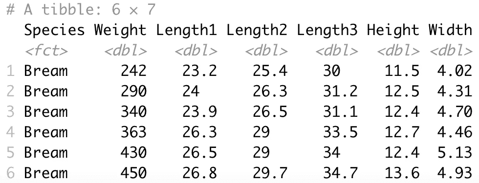

作者图片


作者图片

使用这些数据集，让我们使用随机森林在 R 中进行无监督的聚类，并使用 Rfviz 将其可视化。

[**随机森林**](https://www.stat.berkeley.edu/~breiman/RandomForests/cc_home.htm) [**邻近性**](https://www.stat.berkeley.edu/~breiman/RandomForests/cc_home.htm#prox) **+PCA**

流程如下:

1.  建造 n 个随机的森林树木。
2.  构建树后，将所有数据(包括训练数据和 oob 数据)沿树向下传递，并记录两个观察值在所有树的同一个终端节点中结束的次数。
3.  将两个观察结果出现在同一终端节点的次数除以树的总数。这是这两个观察值之间的接近分数。
4.  对所有观测值对重复此操作，以获得邻近矩阵。
5.  对邻近矩阵应用主成分分析，并取前 3 个主成分。

R 中的 Rfviz 包完成这些步骤，然后在可视化工具中绘制数据。

**虹膜数据示例**

```
set.seed(123)
#Run unsupervised Random Forests and calculate the proximity matrix
rfprep <- rf_prep(x=iris[,1:4], y=NULL)
#Plot the data in the visualization tool
myrfplots <- rf_viz(rfprep, input=TRUE, imp=FALSE, cmd=TRUE)
```

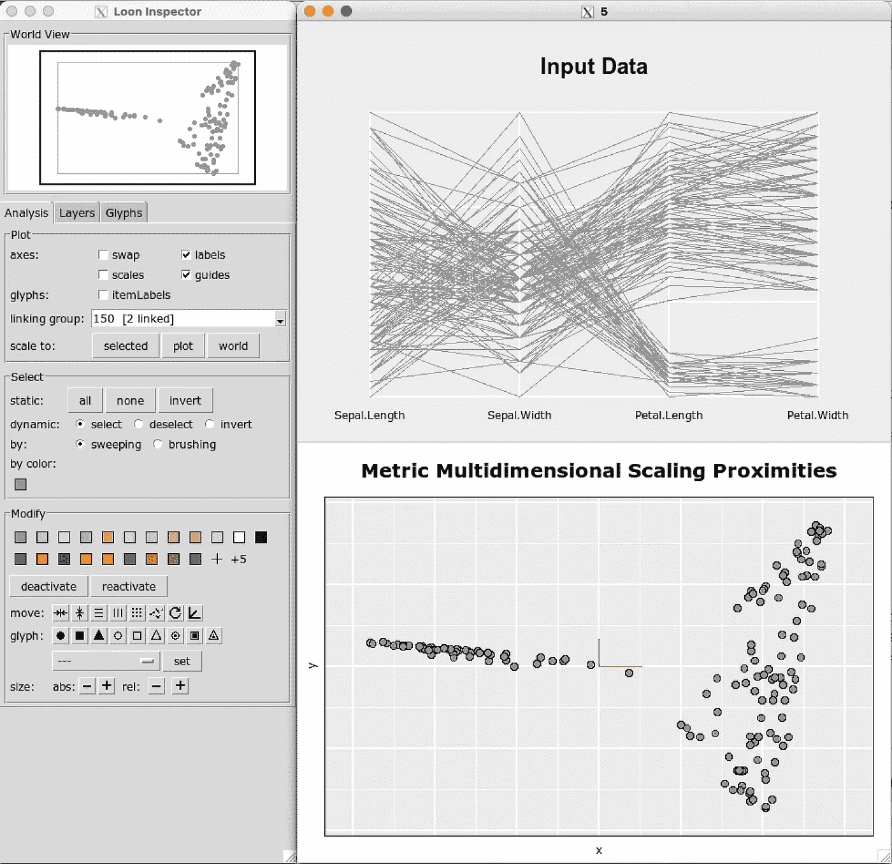

作者图片

这个可视化工具实例由一个 Loon Inspector 工具和两个绘图组成。Rfviz 中还有第三个图，即重要性分数图，但它在这里不用于无监督的随机森林。

1.  **Loon Inspector 工具:**一个帮助与数据交互的实用工具。
2.  **输入数据图:**一个输入数据的平行坐标图。
3.  **度量多维标度邻近图:**邻近矩阵的前 3 个主要分量的图。

接下来，按照以下步骤操作:

1.  单击度量多维标度邻近度图。
2.  按键盘上的“r”进入旋转模式。一个带有“旋转模式”的小文本框将出现在图的顶部。
3.  单击并拖动鼠标以改变图中的位置。
4.  再次按“r”退出旋转模式。

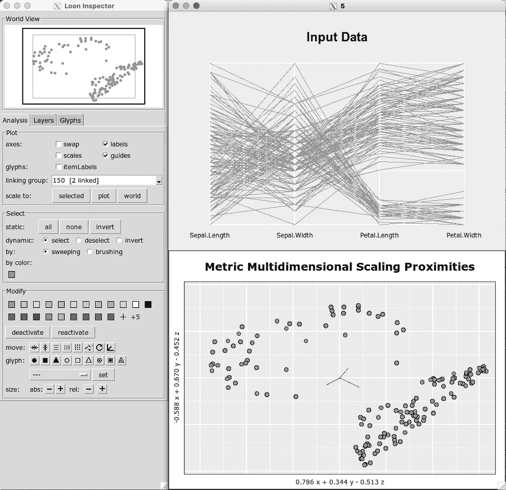

作者图片

5.通过单击并拖动鼠标，选择接近度图顶部的数据分组。

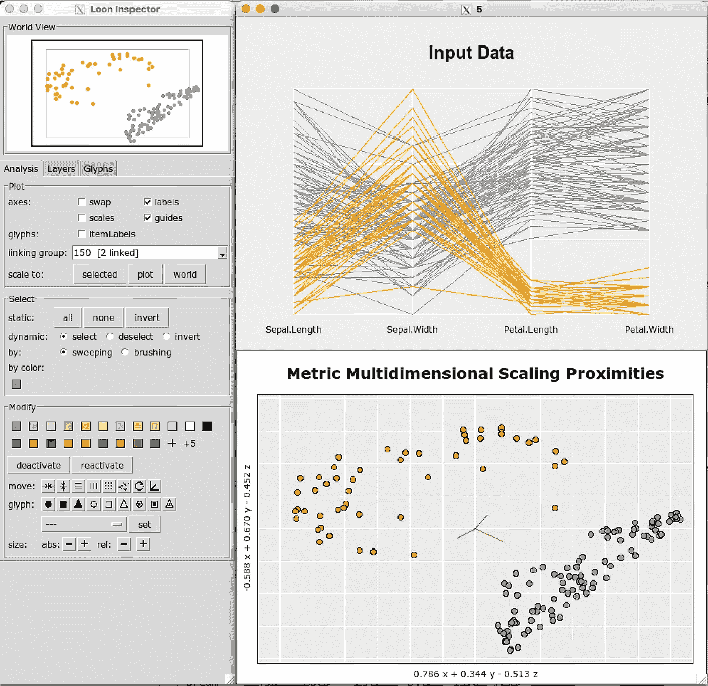

作者图片

7.回到休息状态，运行:

```
group1 <- iris[myplots$cmd['selected'],]
head(group1)
```

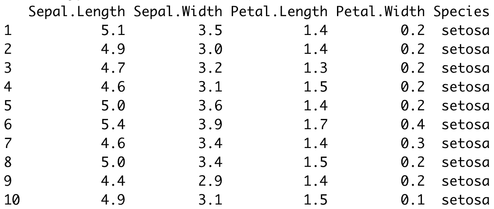

作者图片

```
summary(iris[myplots$cmd['selected'],]) 
#or
summary(group1)
```


作者图片

在事先不知道它是什么物种的情况下，随机森林将 Setosa 物种分组在一起。

8.选中该分组后，单击“修改”部分下的蓝色。

9.再次旋转绘图。

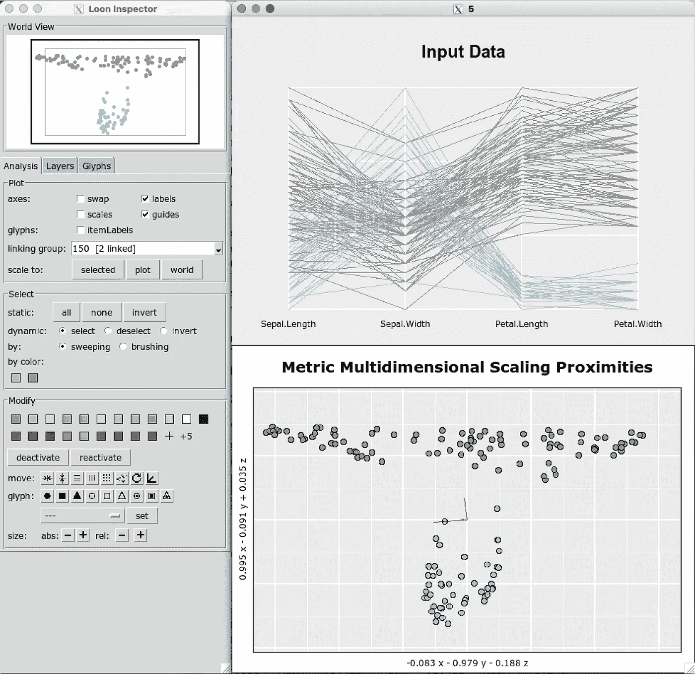

作者图片

10.选择另一个分组。

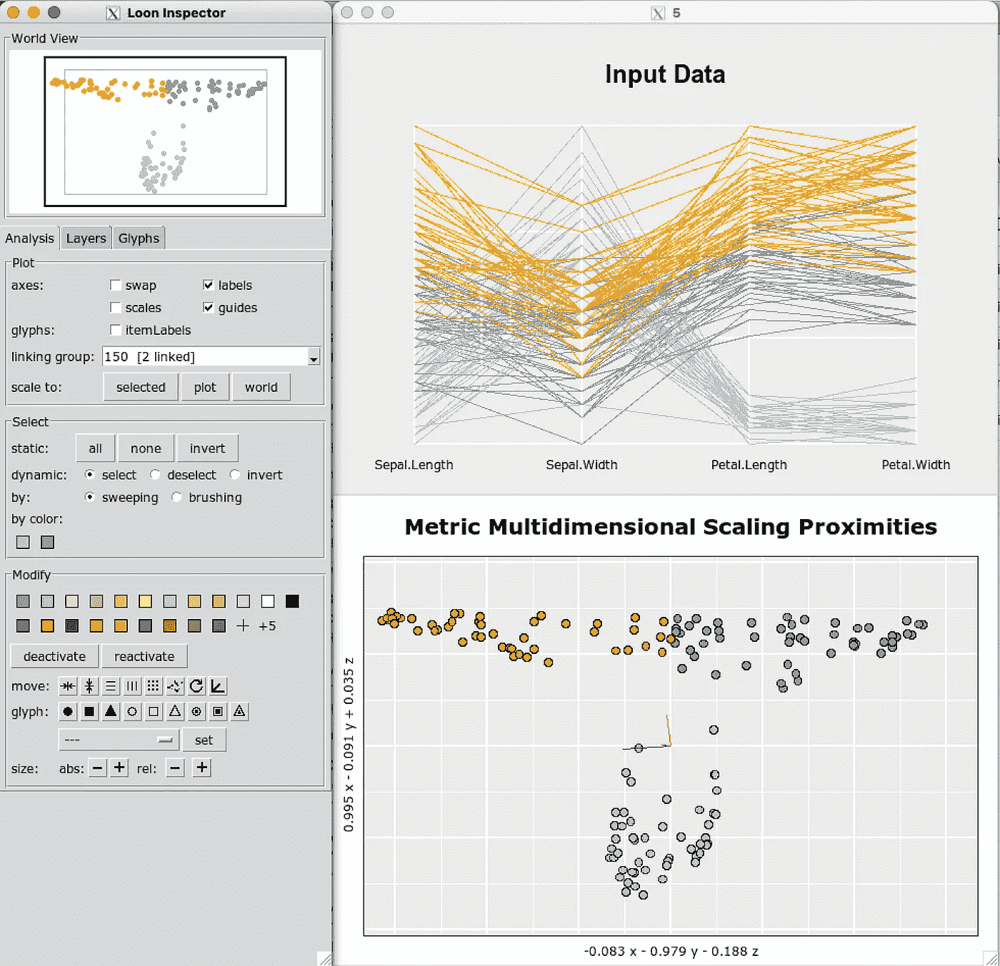

作者图片

11.查看 R 内选定的数据:

```
group2 <- iris[myplots$cmd['selected'],]
summary(group2)
```


作者图片

所以第二组主要是海滨种类。

12.重新着色并选择最后一部分数据。


作者图片

注意:要将图形恢复到原始位置，请单击“移动”部分下检查器工具中最右边的按钮。


作者图片

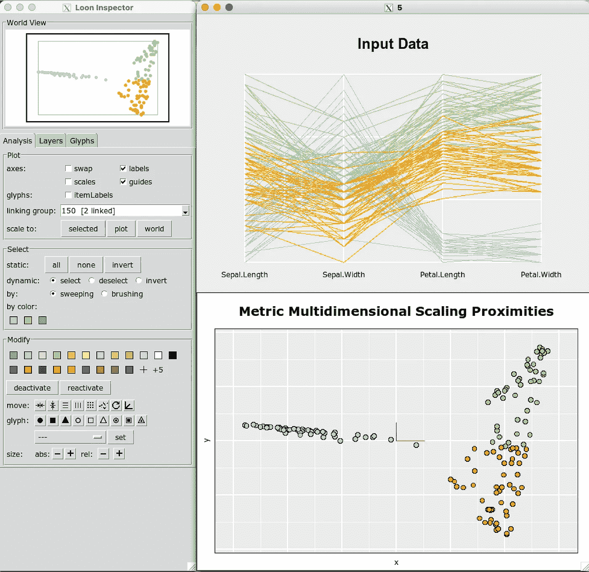

作者图片

13.查看 R 内选定的数据:

```
group3 <- iris[myplots$cmd['selected'],]
summary(group3)
```


作者图片

最后一组数据主要是杂色的。

然后我们可以比较这三个分组。查看组 1、2 和 3 的汇总，我们可以看到在输入数据图中直观看到的数据值的确切差异。

**第一组:**


**第二组:**


作者图片

**第三组:**


作者图片

4 个组别的独特之处:

**第 1 组:**刚毛种，花瓣值较低。长度，花瓣。宽度和萼片。长度和萼片宽度的较高值

**第 2 组:**多为海滨锦鸡儿属植物，花瓣价值较高。长度，花瓣。宽度和萼片长度

**第 3 组:**多数为杂色种，萼片值较低。萼片的宽度和中值。长度，花瓣。长度和花瓣宽度

**虹膜示例结论**

根据无监督随机森林模型对数据进行分组的方式，我们可以直观地识别 Iris 数据集中的三个分组。这些分组最终大多是不同种类的花。在大多数随机森林模型中，我们可以期待相同类型的结果。同样，我们能够在输入数据图上直观地看到三个分组之间的差异。然后我们研究了 r 中这些差异的精确值。

然而，并非每个案例都如此简单。让我们试试鱼的数据集，它有 7 种不同的鱼。

**鱼类数据示例**

```
set.seed(123)
#Calculate Proximity Matrix and prepare for visualization
rfprep <- rf_prep(x=Fish %>% select(-Species), y=NULL)
myrfplots <- rf_viz(rfprep, input=TRUE, imp=FALSE, cmd=TRUE)
```

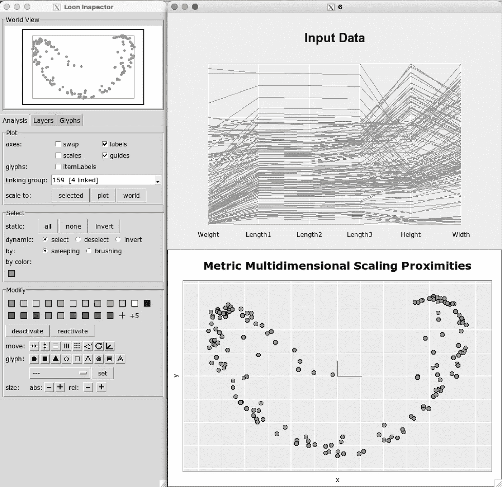

作者图片

旋转邻近图，我们可以看到它看起来像一个螺旋。

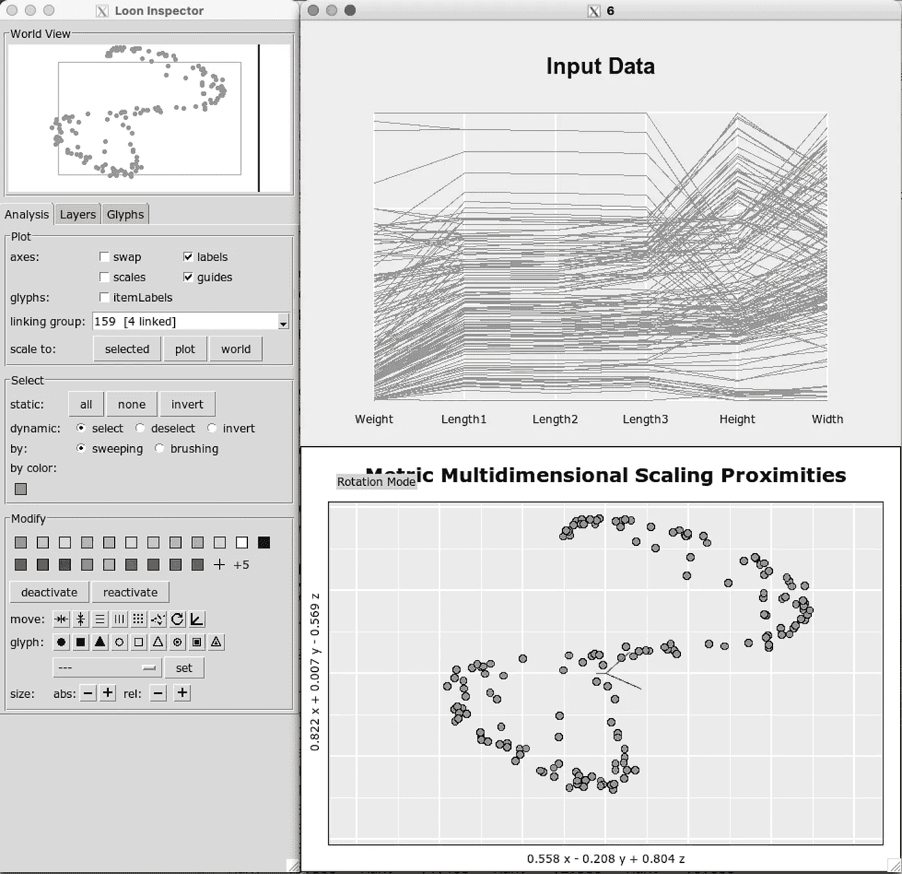

作者图片

我们从哪里开始？让我们在输入数据图上挑选一些明显的分组。

1.  拖动并选择输入数据图上高度数据的较高值
2.  将数据重新涂成绿色。
3.  通过单击 Loon Inspector 的“按颜色”部分下的绿色方块再次选择数据。

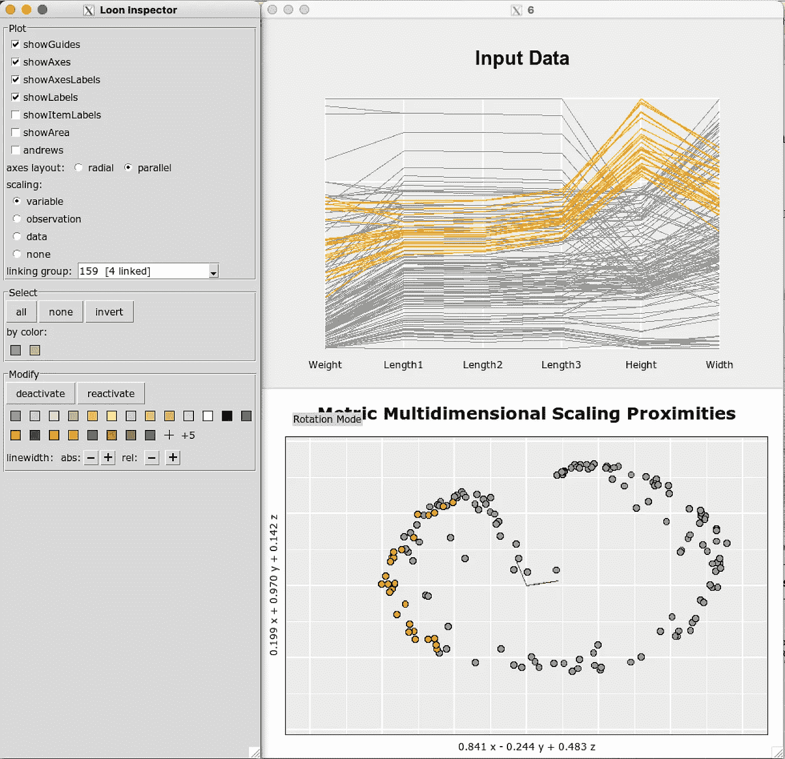

作者图片

我们可以看到，在一些额外的旋转之后，在邻近度图上，数据是如何与其他数据分开分组的。

```
group1 <- Fish[myplots$cmd['selected'],]
summary(Fish[myplots$cmd['selected'],])
```


所选的鱼都是单一品种，鳊鱼。

4.在 Loon Inspector 的“修改”部分点击“停用”。这将暂时忽略图中的数据。在任何时候，您都可以点击“重新激活”,数据将再次出现在图上。

5.选择输入数据图上左侧“宽度”的较高值。


```
group2 <- Fish[myplots$cmd['selected'],]
summary(group2)
```


**鱼数据结论**

通过使用输入数据图选择数据，我们能够识别另一种鱼类。我们不会去分离和查看所有的数据。那将由你自己去尝试。但是，我们可以看到，我们可以很快地从视觉上识别鱼的种类。

**总体结论**

通过使用 Rfviz 和无监督随机森林，我们可以直观地查看数据和随机森林模型的输出，以识别数据中的重要分组。

同样的方法可以应用于各种问题，例如:

1.  根据分组方式直观地确定最佳聚类数。这可以与其他标准的无监督聚类方法一起使用。

2.通过识别客户群来创建用于营销目的的人物角色。

3.快速识别数据集中数据的类或组之间的关键差异。

**总体结论**

总的来说，我希望你能看到这个工具在可视化随机森林方面的价值。幸运的是，利奥·布雷曼和阿黛尔·卡特勒参与了创造随机森林的工作，因为这是一个我们都喜欢的无价模型。感谢你的阅读！

如果你有兴趣的话，这里的[是这个 R 包的另一个用例。](/using-local-importance-scores-from-random-forests-to-help-explain-why-mlb-players-make-the-hall-of-aa1d42649db2)

**参考文献:**

布雷曼，2001 年。“随机森林。”*机器学习*。[http://www.springerlink.com/index/u0p06167n6173512.pdf](http://www.springerlink.com/index/u0p06167n6173512.pdf)

布雷曼，我，和一个卡特勒。2004.*随机森林*。[https://www . stat . Berkeley . edu/~ brei man/random forests/cc _ graphics . htm](https://www.stat.berkeley.edu/~breiman/RandomForests/cc_graphics.htm)。

C Beckett，*Rfviz:R 中随机森林的交互式可视化包*，2018，[https://chriskuchar.github.io/Rfviz.](https://chrisbeckett8.github.io/Rfviz.)

费希尔河..(1988).艾瑞斯。UCI 机器学习知识库。

奥尔德福德和沃德尔出版社(2018 年)。Cran/Loon:这是 cran R 软件包仓库的只读镜像。loon——交互式统计数据可视化。首页:[](http://Https://great-northern-diver.github.io/loon/)**报告此包的 bug:*[*Https://github.com/great-northern-diver/loon/issues*。](http://Https://github.com/great-northern-diver/loon/issues.) GitHub。检索于 2022 年 2 月 23 日，来自[https://github.com/cran/loon](https://github.com/cran/loon)*

*Pyae，A. (2019 年 6 月 13 日)。*鱼市场*。卡格尔。检索于 2022 年 2 月 21 日，来自[https://www.kaggle.com/aungpyaeap/fish-market](https://www.kaggle.com/aungpyaeap/fish-market)*