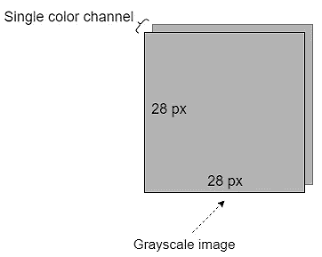
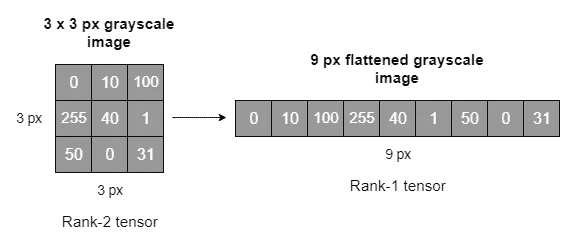
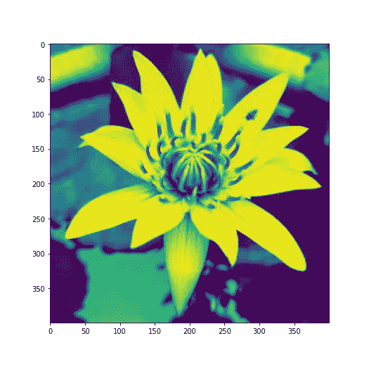
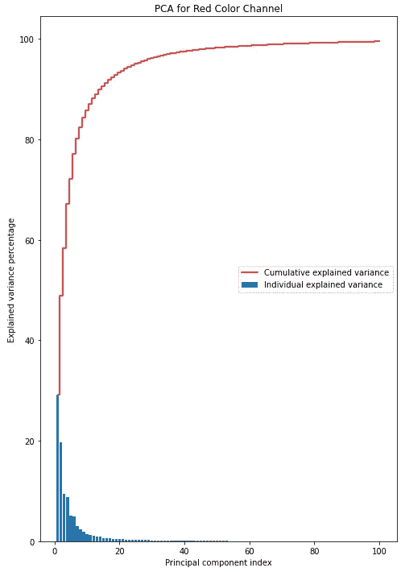
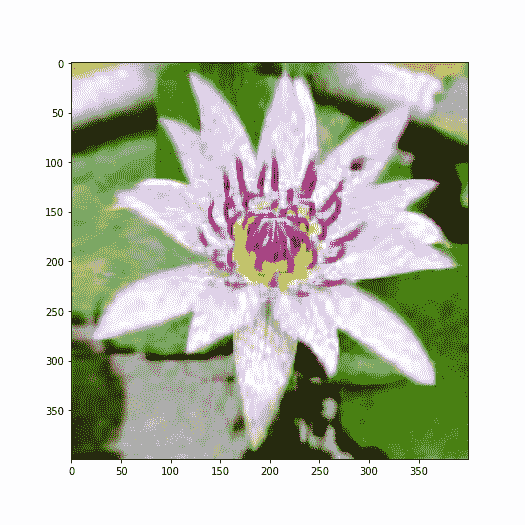
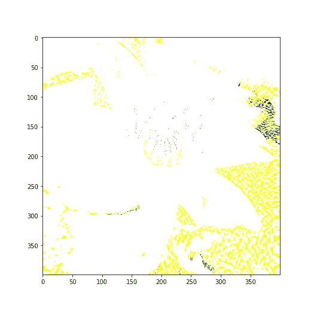

# 基于主成分分析的 RGB 彩色图像压缩

> 原文：<https://towardsdatascience.com/rgb-color-image-compression-using-principal-component-analysis-fce3f48dfdd0>

## 主成分分析在降维中的应用


**(图片作者)**

之前，我们已经讨论了如何使用 PCA 来压缩 MNIST 数字数据集中的灰度图像。你可以在这里阅读那篇文章。

这是之前发表文章的高级版本。这一次，我们应用相同的概念来压缩 RGB 彩色图像，而不是灰度图像。

# RGB 和灰度图像的区别

RGB 和灰度图像之间的主要区别在于图像拥有的颜色通道数量。RGB 图像有三个颜色通道:红色、绿色和蓝色，而灰度图像只有一个颜色通道。


**RGB 图像的红、绿、蓝三色通道**(图片由作者提供)



**灰度图像的单色通道**(图片由作者提供)

另一个区别是用 ML 和 DL 表示 RGB 和灰度图像。灰度图像由二维(2D) NumPy 数组表示。它也可以用一个扁平的一维(1D) NumPy 数组来表示。



**展平灰度** **图像**(图片由作者提供)

RGB 图像由三维(3D) NumPy 阵列表示。由于 RGB 图像中有三个颜色通道，我们需要一个额外的维度来表示颜色通道。拼合 RGB 图像不好，因为它会丢失大量重要信息。

**注:**要通过例子和其他图像基础知识了解更多 RGB 和灰度图像的区别，请参考我写的以下文章。

*   [RGB 和灰度图像如何在 NumPy 阵列中表示](/exploring-the-mnist-digits-dataset-7ff62631766a)
*   [0D、1D、2D、3D、4D 和 5D 张量的真实世界示例](https://rukshanpramoditha.medium.com/real-world-examples-of-0d-1d-2d-3d-4d-and-5d-tensors-100b0837ced4)

# 降维图像压缩的基本思想

图像压缩是一种在尽可能保持图像质量的同时最小化图像字节大小的技术。它适用于降低图像在存储和传输时的成本。

维度缩减是减少数据集中的要素(变量)数量，同时尽可能保留原始数据中的方差的过程。

PCA 是可用于压缩图像的降维技术之一。这里有一个大概的想法。

## 压缩灰度图像

处理灰度图像非常容易，因为它们只包含一个颜色通道。灰度图像由二维(2D) NumPy 数组表示。我们将该阵列作为我们的 2D 数据矩阵，并应用 PCA 来减少矩阵中的列(特征)数量。根据我们选择保留的组件数量，我们会损失一些图像质量。

## 压缩 RGB 图像

处理 RGB 图像并不容易，因为它们包含三个颜色通道。RGB 图像由三维(3D) NumPy 阵列表示。我们不能用 3D 阵列做 PCA。所以，我们必须将原始图像分割成红色、绿色和蓝色通道。每个颜色通道由二维(2D) NumPy 数组表示。然后，我们对每个通道进行主成分分析，最后合并三个通道得到压缩图像。

如果我们从每个通道数据中损失 3%的变化，合并三个颜色通道后我们损失的总变化将是:

```
(3 + 3 + 3)% = 9%
```

大约会损失 9%的图像质量。这不是一个重要的质量。

# 一个压缩 RGB 图像的真实例子

## 关于我们使用的图像

我们使用下图来解释如何应用 PCA 来压缩 RGB 图像。下面的图片是我在母亲的花园里捕捉到的。出于教育目的，可以免费下载。所以，请随意[下载图片](https://drive.google.com/file/d/1P-mHCv7CYnbQQ0Jx23wqiU9Cl3WLP-fv/view?usp=sharing)来练习我们今天讨论的内容。


**Flower.jpg:我们今天使用的图片**(作者图片，取自我母亲的花园)

## 加载图像

让我们使用 matplotlib **imread()** 函数加载图像，假设它保存在当前工作目录中。

```
import matplotlib.pyplot as pltRGB_img = plt.imread("Flower.jpg")
```

下面我们来检查一下。

```
print(type(RGB_img))
print(RGB_img.shape)
```


(图片由作者提供)

我们的图像存储在 3D NumPy 数组中。它有 400 x 400 像素和 3 个颜色通道。

## 显示图像

现在，我们以原始大小显示图像。为此，我们使用 matplotlib **imshow()** 函数。

```
plt.figure(figsize=[7.3, 7.3])
plt.imshow(RGB_img)
```


**原花图**(图片由作者提供)

## 将图像分割成颜色通道

然后，我们将原始图像分成红色、绿色和蓝色通道。为此，我们使用 OpenCV **split()** 函数。

```
import cv2b, g, r = cv2.split(RGB_img)
```

默认情况下，RGB 颜色通道在 OpenCV 中以相反的顺序存储。这就是为什么我们将变量声明为`b, g, r`而不是`r, g, b`。

下面我们来检查一下。

```
print("Red channel")
print(type(r))
print(r.shape)
print("\nGreen channel")
print(type(g))
print(g.shape)
print("\nBlue channel")
print(type(b))
print(b.shape)
```


(图片由作者提供)

每个颜色通道由一个 2D 数字阵列表示。每个通道的高度 x 宽度为 400 x 400。这意味着数组包含 400 行和 400 列(变量)。在这个上下文中，每个通道数据的维数是 400，因为有 400 列。我们应用主成分分析来减少这些列的数量。

## 显示颜色通道

现在，我们展示红色通道。

```
plt.figure(figsize=[7.3, 7.3])
plt.imshow(r)
```



**花图像的红色通道**(图片由作者提供)

同样，我们也可以显示其他两个颜色通道。然而，我不打算在这里展示它们。

## 应用 PCA

现在，我们应用主成分分析。

这里，我们通过使用 Scikit-learn **PCA()** 函数来应用 PCA。在应用 PCA 之前必须进行特征缩放，因为 PCA 方向对特征的相对范围非常敏感。作为可选部分，我将向您展示在应用 PCA 时进行特征缩放的重要性。

我们通常使用 sci kit-learn**standard scaler()**函数进行特征缩放。然而，在这个例子中，我们使用下面的简单方法进行特征缩放。这是因为每个图像像素值由范围从 0 到 255(包括 0 和 255)的数字表示。

```
#(0, 255)/255 ~ (0, 1)r_scaled = r / 255
g_scaled = g / 255
b_scaled = b / 255
```

现在，我们将对红色通道数据运行 **PCA()** 函数。这里，临界超参数是 **n_components** 。首先，最好将其设置为`None`，这样 PCA()函数将保留所有组件(本例中为 400)。但是，我会将其设置为`n_components=100`并创建以下类型的图，帮助我们为 **n_components** 确定正确的整数值。

**对红色通道数据应用 PCA**(作者代码)



**可视化组件的最佳数量**(图片由作者提供)

最高的条显示红色通道数据的最重要组成部分。从上面的图中，只有前 25 到 45 个组件捕获了大部分数据。如果我们忽略 45 岁以后的所有成分，我们将只丢失很少的信息，因为它们在数据中捕捉到非常少量的变化。

这同样适用于其他颜色通道的数据。因此，我们用`n_components=40`和`n_components=25`对每个颜色通道数据进行 PCA。在每种情况下，维度将分别减少 10 倍(400/40)和 16 倍(400/25)。

**当**当`**n_components=40**`

**对 n_components=40 的 RGB 颜色通道应用 PCA**(作者代码)

现在，我们检查以下内容。

(作者代码


(图片由作者提供)

可变性损失的总量可通过下式计算:

```
{(100-97.52) + (100-96.55) + (100-97.17)}% = 8.76%
```

压缩后的图像将损失原始图像质量的 8.76%。

现在，我们运行下面的代码将图像数据恢复到它的原始维度，以便可视化。

```
pca_r_org = pca_r.inverse_transform(pca_r_trans)
pca_g_org = pca_g.inverse_transform(pca_g_trans)
pca_b_org = pca_b.inverse_transform(pca_b_trans)
```

现在，我们使用 OpenCV **merge()** 函数将三个颜色通道合并成一个 3D NumPy 数组。

```
img_compressed = cv2.merge((pca_b_org, pca_g_org, pca_r_org))
```

现在，我们展示压缩的图像。

```
plt.figure(figsize=[7.3, 7.3])
plt.imshow(img_compressed)
```


**n _ components = 40 的压缩花图像**(图片由作者提供)

即使在压缩之后，我们仍然可以识别图像的重要部分。但是，维度降低了 10 倍！

**当**时`**n_components=25**`

这里，程序与前面的相同。因此，我不会向您展示代码。我只给你看用`n_components=25`应用 PCA 后的最终输出。



**n _ components = 25 的压缩花朵图像**(图片由作者提供)

这里，我们仍然可以识别图像的重要部分。但是，维数降低了 16 倍！

# 特征缩放的重要性(可选)

作为可选部分，我将向您展示在我们对数据集应用 PCA 时进行要素缩放的重要性。这里，我们使用 Scikit-learn PCA()函数来应用 PCA。PCA()函数使用协方差矩阵进行奇异值分解。图像数据中特征的相对范围也显著不同。因此，我们需要在应用 PCA 之前对特征进行标准化。

下图显示了在不执行 PCA 的情况下应用 PCA 后的输出。即使我们设置了`n_components=100`，转换后的数据也不能代表原始数据。



**应用 PCA 后输出图像，不进行特征缩放**(图片由作者提供)

PCA 方向对特征的相对范围高度敏感。如果我们没有在相同的尺度上获得所有的特征，PCA 优先考虑由于特征的相对范围而产生的方差，而不是在搜索主成分时数据中存在的真实方差。因此，这些主成分不能代表原始数据。这就是为什么上面的图像不能显示原始的花。

# 摘要

现在，考虑下面的图像网格。


**花卉图像对比**(图片由作者提供)

*   **左上:**400 维的原始花卉图像。
*   **右上:**只有 40 维的压缩花图像。维数减少了 10 倍，同时保持了原始图像 91.24%的质量！我们仍然可以识别图像中的重要部分。
*   **左下:**只有 25 维的压缩花图像。维数减少了 16 倍，同时保持了原始图像 83.41%的质量！我们仍然可以识别图像中的重要部分。
*   **右下:**不做特征缩放应用 PCA 后的花朵图像输出。转换后的数据不能代表原始数据。我在这里向您展示了在应用 PCA 之前进行特征缩放的重要性。

今天的文章到此结束。如果你对这篇文章有任何疑问，请在评论区告诉我。

感谢阅读！

下一篇文章再见！一如既往，祝大家学习愉快！

## 阅读下一篇(推荐)

*主成分分析—回答 18 个问题(关于主成分分析的大多数问题的一站式解决方案)*

<https://rukshanpramoditha.medium.com/principal-component-analysis-18-questions-answered-4abd72041ccd>  

## 成为会员

如果你愿意的话，你可以注册成为会员，以获得我写的每一个故事的全部信息，我会收到你的一部分会员费。

<https://rukshanpramoditha.medium.com/membership>  

## 订阅我的电子邮件列表

订阅我的电子邮件列表，再也不会错过精彩的故事了。我一点击发布按钮，你就会在收件箱里收到每一篇文章。

<https://rukshanpramoditha.medium.com/subscribe>  

[鲁克山·普拉莫蒂塔](https://medium.com/u/f90a3bb1d400?source=post_page-----fce3f48dfdd0--------------------------------)
2022–03–29