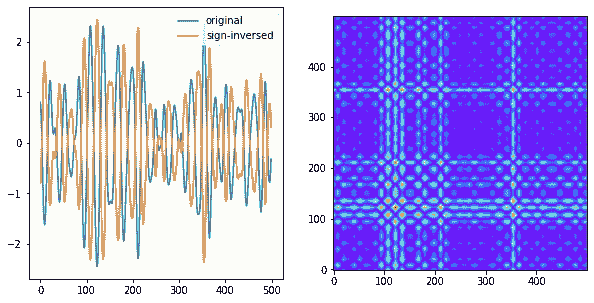
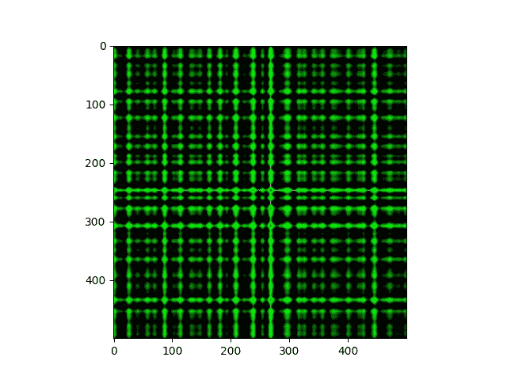

# RGB GAF 图像:解决格拉米角场成像一个弱点的可能方案

> 原文：<https://towardsdatascience.com/rgb-gaf-image-a-possible-solution-to-one-weak-point-of-gramian-angular-field-imaging-ffc6b31edfbe>

## 为什么这种时间序列成像方法是不完美的，并建议解决这个问题


图片作者:左边和中间是简单的 GAF 图像，右边是相应的 RGB GAF 图像

包括我在内的数据科学家在工作中遇到了大量的时间序列。尽管在自然语言处理、语音识别和计算机视觉方面取得了成功，但遗憾的是，从深度学习发展而来的技术未能在时间序列方面取得许多可匹敌的发展。时间序列成像是一个利用计算机视觉的最新发展带来的技术和见解的概念，因此受到了关注，因为它允许机器“视觉识别时间序列”。

GAF 成像是最流行的时间序列成像算法之一。首先由意大利卡利亚里大学数学和计算机科学系的师生团队提出，该方法将时间序列转换为图像，并因此使用 CNN 来识别预测的视觉模式。

然而，当使用 GAF 时，我遇到了一个可能的弱点，这促使我写这篇文章。接下来，你将会读到:

1.  简单介绍一下 GAF 和方法可能有点关系。
2.  我的建议是解决这个问题的一个可能的办法。

# GAF 概述

格拉米角场(GAF)表示极坐标系统中的时间序列，而不是典型的笛卡尔坐标。

假设我们有一个范围在[-1，1]内的重定标时间序列，其形式为(x_1，x_2，…x_n)。将其转换到极坐标系统后，即θ_i=arccos(x_i)，我们可以通过考虑每个点之间的三角和/差来轻松利用角度透视，以识别不同时间间隔内的时间相关性:在 n*n GAF 矩阵中，i-j 元素被定义为第 I 个和第 j 个角度之和的余弦或正弦。上图显示了在 GAF 影像中采用中间极坐标系步长进行笛卡尔坐标变换的时间序列。现在可以通过 [pyts](https://pyts.readthedocs.io/en/0.10.0/index.html) 中的相应功能轻松实现，pyts 是一个 python 包，结合了多种时间序列分类方法。


作者图片:从时间序列到 GAF

将矩阵的 i-j 元素转换回笛卡尔坐标:cos(θ_ I+θ_ j)= cos(θ_ I)cos(θ_ j)+sin(θ_ I)sin(θ_ j)= x _ I x _ j+√( 1-x _ I)√(1-x _ j)我们可以立即看到定义的以下性质:

1.  当且仅当 x_i=x_j 时，元素等于-1。
2.  当且仅当 x_i=x_j=0 时，元素等于 1。
3.  如果 x_i=-x_j 而两者的绝对值都接近-1。这意味着元素的值不能捕捉相关性的符号。

在此快速说明一下，我不是 100%同意“格拉米”角场的名称，因为上面的定义没有给出一个真正的格拉米矩阵，根据线性代数理论，它的元素是由给定向量的内积给出的。

# 弱点

让我们取一个归一化的时间序列(x_1，x_2，…x_n)并用 GAF 方法来想象它。尽管在最初的工作中同时存在正弦和余弦函数，但现在我所回顾的大多数例子只使用余弦函数来获得 GAF 图像。如上一节所述，这种矩阵的 i-j 元素由 cos(θ_i+θ_j)得到，其中θ_i、θ_j 均以[0,𝜋]变化，其中θ_i=arccos(x_i)，θ_j=arccos(x_j)。但是，我想指出的是，这样的转变并不是注射。
注意，对于[0,2𝜋]中的任何θ，我们在[0,2𝜋).]中也有(2𝜋-θ)回想一下，[0,2𝜋]中的余弦函数相对于θ=2𝜋是对称的，因此 cos(θ)等于 cos(2𝜋-θ).回到 GAF 矩阵，我们看到 cos(2𝜋-θ_i-θ_j)=cos(θ_i+θ_j，因此𝜋-θ_i 和𝜋-θ_j 给了我们与 GAF 矩阵的 i-j 元素相同的值。对于[0,𝜋]中的所有θ，我们知道𝜋-θ=arccos(-x)，因此我们可以得到这样的事实，即时间序列(-x_1，-x_2，…-x_n)可以给我们相同的矩阵。重新开始，如果我们颠倒时间序列上每个点的符号，GAF 的变换会产生相同的图像。
下图显示了由两个时间序列获得的相同图像，其符号逐点相反。



作者提供的图片:从两个时间序列转换而来的同一个 GAF 图片

以金融预测为例，忽略迹象可能是一个问题，因为金融产品表现的绝对值不足以描述时间模式。想象一个股票价格在一段时间内上升，如果我们反转符号，我们将得到一个下降的时间序列。尽管两个变换的 GAF 图像是等效的，但是两个时间序列对应于完全相反的表现。

# 一种可能的解决方案:RGB GAF 图像

幸运的是，这个问题很容易解决，因为确实有两种类型的 GAF 形象。单个余弦具有唯一性的问题，但是一对余弦和正弦将消除该问题，因为这两个足以确定角度值。
我想从时间序列中创建一个 RGB 图像，而不是将时间序列编码成灰度图像。考虑创建这样一个 GAF 图像的以下代码:

```
from pyts.image import GramianAngularField
import numpy as npgasf = GramianAngularField(method='summation')
x_train_gasf = gasf.transform(x_train)
gadf = GramianAngularField(method='difference')
x_train_gadf = gadf.transform(x_train)
x_train_gaf=np.concatenate((x_train_gasf,x_train_gadf,np.zeros(x_train_gadf.shape)),axis=-1)
```

下图显示了一幅 RGB 图像，它是根据与上一部分相同的时间序列创建的，您可以看到，我们在同一幅图像中同时考虑了正弦和余弦值。



作者图片:RGB GAF 图片

# 结论

在这篇文章中，我简要地回顾了时间序列成像的 GAF 方法，并指出这种方法可能存在的弱点。然后我建议使用 RGB GAF 图像编码的正弦和余弦函数来解决方法的非唯一性问题。