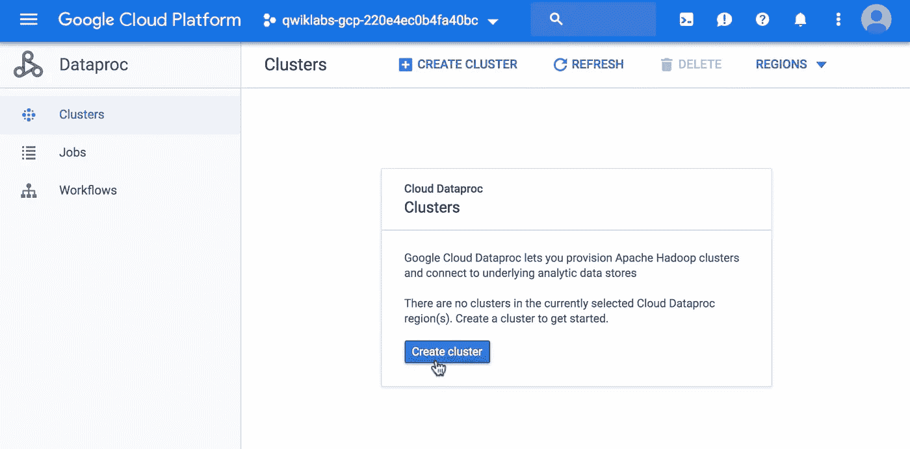
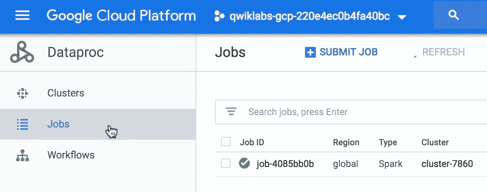

# 在不到 10 分钟的时间内运行 Spark 作业，无需基础架构

> 原文：<https://towardsdatascience.com/running-a-spark-job-in-less-than-10-minutes-with-no-infrastructure-fe79f1c41780>

## 大数据|云计算|数据工程

## 关于使用 Google 云平台设置 Spark 的快速实践教程

泰勒·维克在 [Unsplash](https://unsplash.com?utm_source=medium&utm_medium=referral) 上的照片

Apache Spark 是一个分布式数据处理系统，使我们能够处理高速数据管道。Apache Spark 还为 SQL、机器学习和数据科学以及图形计算提供了库。

Spark 一次可以处理数 Pb 的数据，比 Hadoop 的 MapReduce 快得多(快 100 倍)。

Spark 最常用于 Hadoop 集群之上，设置本地 Hadoop 集群需要相当多的来回操作。这是一个冗长而耗时的过程。

当我在为我的硕士学位进行实验时，我发现自己需要更多的计算能力来执行我的任务。我记得我试图使用我们实验室周围的几台旧 PC 来建立我自己的 Hadoop 集群，但这个过程非常费力，尤其是对于没有基础设施系统背景的人来说。

因此，本教程的目的是帮助那些希望在分布式集群上快速、廉价地执行 spark 任务的人。我想记录下当时对我有很大帮助的过程！

在本文中，我们将讨论如何利用云计算在不到 10 分钟的时间内启动并运行我们的第一个 Spark 作业！我们将使用 GCP 的云数据系统来提高时间和效率。

# 那么，部署 Spark 集群的过程是什么样的呢？

*   **第一步:** *前往 GCP，搜索 Dataproc*
*   **第 2 步:** *调配一个 Apache Hadoop 集群*

GCP Dataproc 集群部分。图片作者。

*   **第三步:** *命名并选择集群属性——对于试点项目，您也可以保留默认属性*
*   **步骤 4:** *在作业部分，点击提交作业*
*   **第五步:** *填写工作详情。将作业类型设置为 Spark，并链接到您的 Spark 类(以及您的。jar 文件)*

作为一个例子，您可以尝试这个近似圆周率值的火花工作。

*   **步骤 6:** *确保 Spark 作业现在在作业部分*下可见

GCP 数据公司工作部门。作者图片

*   **第七步:** *等待作业执行。请注意，您还可以单击集群来监控其资源使用情况，并查看当前正在执行的作业*
*   **步骤 8:** *一旦作业执行完毕，您还可以关闭集群以节省资源——除非您需要持久数据。*

仅此而已。设置集群和 Spark pi 任务，只花了我不到 4 分钟的时间。Spark 作业在 37 秒内执行(使用具有默认属性的集群)。

**你喜欢这篇文章吗？如果是，请考虑订阅我的电子邮件列表，以便在我发布新内容时得到通知。**

  

**此外，考虑成为会员，使用我下面的推荐链接来支持我和你在 Medium 上喜欢的其他作家。每月 5 美元，你就可以无限制地阅读 Medium 上的每一篇文章。**

  

想给我买杯咖啡吗？

  

# 想联系吗？

我很想听听你对这个话题的想法，或者其他什么。如果你想联系我，请发邮件到 davidfarrugia53@gmail.com*给我。*

[Linkedin](https://www.linkedin.com/in/david-farrugia/)——[Twitter](https://twitter.com/davidfarrugia53)