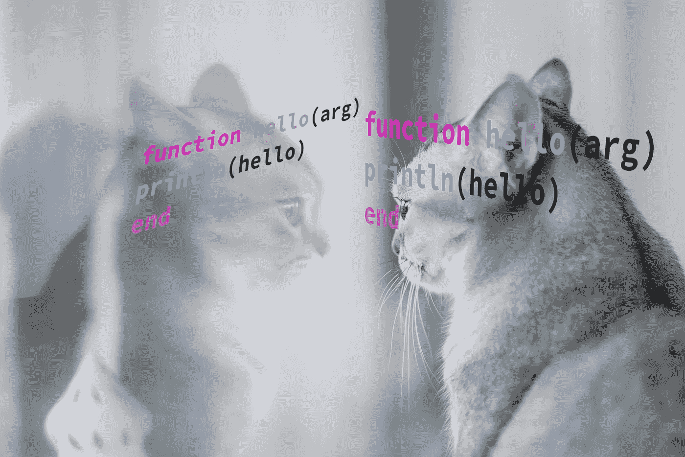
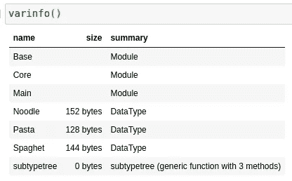

# 运行时自省:Julia 最强大、保守得最好的秘密

> 原文：<https://towardsdatascience.com/runtime-introspection-julias-most-powerful-best-kept-secret-bf845e282367>

## 在 Julia 中使用内省处理类型



(图片由 [Pixabay](http://pixabay.com) 上的 [Skitterphoto](https://pixabay.com/images/id-3118729/) 拍摄)

# 介绍

当谈到最终执行您的代码时，我们经常使用的许多高级编程语言都没有提供很多工具来允许人们在执行时查看语言。当然，我们可以打印值，我们可以有一些输出来告诉我们代码是否工作，但是在执行时使用已定义的类型和名称要困难得多。我的意思是这是有意义的，这不是一个人通常想在执行过程中做的事情，到处剖析类型和定义的字段——在大多数情况下，这根本不值得。

然而，虽然在大多数情况下，自省对你来说可能是不必要的，但对你的语言的编译器来说，为了更好地理解正在发生的事情以及你的环境，自省是必要的。也就是说，在某些情况下，人们可能与编译器一起工作，或者像编译器一样控制作用域。此外，在 Julia 中进行元编程时，自省可以产生非常有效的效果。尽管在 Julia 文档中可以获得这方面的信息，但它是在 Julia 的**开发者文档**中，而不是常规文档中。也就是说，我的假设是，大多数使用 Julia 的人不会开发这种语言本身，但肯定会在他们使用这种语言的某个时候利用自省，因为我认为这是这种语言在许多不同的应用程序中可以做的一件有价值的事情。也就是说，如果你更愿意阅读文档而不是我对这些特性的解释，这里有一个 Julia 文档的链接:

  

此外，对于那些想要自己运行这些示例的人来说，我在这个小概述中使用的代码是笔记本格式的:

[](https://github.com/emmettgb/Emmetts-DS-NoteBooks/blob/master/Julia/runtime%20introspection.ipynb)  

# 数据类型

关于数据类型，我们需要了解的第一件事是，在 Julia 中，它们有称为“字段”的属性。我们可以检查任何给定类型或数据类型的字段。当然，字段有几种不同的属性，但是最重要的两种是字段名和它们的类型。我们可以通过使用同名的方法来获取字段名，

```
mutable struct Noodle
    class::Symbol
    length::Integer
endfieldnames(Noodle)(:class, :length)
```

这将返回一个表示该类型中每个字段名的符号元组。在 Julia 中，你定义的所有东西都有一个对应的符号。也就是说，也有一些符号对应于在你的全球环境中创造的每一个价值。我们还可以使用 getfield()和 setfield 来获取和设置字段！()然而，有许多情况下 setfield！()是行不通的。每当我们使用。，例如

```
Noodle.class
```

我们实际上是在调用 getfield 方法。如果我们使用

```
Noodle.class = :spaghet
```

然后我们调用 setfield 方法。我们可以从模块和类型中获取字段。例如，我们可以从 main 获得一个:

```
getfield(Main, :Noodle)Noodle
```

> Main 只是 Julia 中顶层全局模块的名字。

最后，Julia 中任何类型的参数或数据的一个重要组成部分是它的类型。我们可以使用 fieldtypes()方法或者只使用。添加到 Julia 中每个类型的类型字段。

```
fieldtypes(Noodle)
(Symbol, Integer)Noodle.types

svec(Symbol, Integer)
```

# 子类型

尽管它们不太适合运行时，但在自省给定模块的类型层次结构的组件时，它们仍然很有价值。我们可以通过使用子类型操作符`<:`来识别一个类型是否是某物的子类型。此运算符既用于表示类型在其定义中使用时是抽象类型的子类型，也用于返回一个布尔值，表明所提供的类型是否是抽象类型的子类型。首先，让我们看看如何设置子类型:

```
abstract type Pasta endstruct Spaghet <: Pasta
    length::Integer
end
```

这个新的 Spaghet 类型将继承应用于 Pasta 类型的任何方法。我们现在还可以使用相同的语法来了解 Spaghet 实际上是否是 Pasta 的子类型，这将是正确的:

```
Spaghet <: Pastatrue
```

我们还可以通过使用 subtypes()方法获得给定抽象类型的所有子类型:

```
subtypes(Pasta)
1-element Vector{Any}:
 Spaghet
```

如果你没有接触过朱利安式的等级制度，我有一整篇文章可以更详细地介绍:

[](/overview-abstract-super-type-heirarchies-in-julia-26b7e64c9d10)  

此外，这里有一个子类型树函数，它对于更好地可视化子类型也很有价值。我只是在这里的某个问题上发现了这一点，但我认为对于那些可能想更好地掌握某个类型的人来说，这绝对是非常好的:

```
function subtypetree(t, level=1, indent=4)
           level == 1 && println(t)
           for s in subtypes(t)
             println(join(fill(" ", level * indent)) * string(s))
             subtypetree(s, level+1, indent)
           end
       endsubtypetree(Number)Number
    Complex
    Real
        AbstractFloat
            BigFloat
            Float16
            Float32
            Float64
        AbstractIrrational
            Irrational
        Integer
            Bool
            Signed
                BigInt
                Int128
                Int16
                Int32
                Int64
                Int8
            Unsigned
                UInt128
                UInt16
                UInt32
                UInt64
                UInt8
        Rational
```

# 在后台

我想展示的最后几样东西是为了一些更深入的内省。对于我们的第一个例子，我们将查看@code_llvm 宏，它只给出给定表达式的 llvm 代码:

```
[@code_llvm](http://twitter.com/code_llvm) subtypetree(Number);  @ In[16]:1 within `subtypetree`
define nonnull {}* @japi1_subtypetree_2021({}* %0, {}** %1, i32 %2) #0 {
top:
  %3 = **alloca** {}**, align 8
  **store** volatile {}** %1, {}*** %3, align 8
  %4 = **load** {}*, {}** %1, align 8
;  @ In[16]:2 within `subtypetree`
  **call** void @j_subtypetree_2022({}* nonnull %4, i64 signext 1, i64 signext 4) #1
  **ret** {}* inttoptr (i64 139868392615944 to {}*)
}
```

另一个很酷的类似的小宏是@code_typed。这与 Meta 有相似的用法。@lower，在大多数情况下，我认为这可能是一个更好的选择，除非我们想要获取的信息是一个单独的方法调用，例如，这是行不通的:

```
[@code_typed](http://twitter.com/code_typed) debuginfo = :source begin
    +(1, 1, 5)
    -(7, 3)
endexpression is not a function call, or is too complex for @code_typed to analyze; break it down to simpler parts if possible. In some cases, you may want to use Meta.@lower.
```

相比 Meta。@较低:

```
Meta.[@lower](http://twitter.com/lower) begin
    +(1, 1, 5)
    -(7, 3)
end:($(Expr(:thunk, CodeInfo(
    @ In[24]:2 within `top-level scope`
1 ─      1 + 1 + 5
│   @ In[24]:3 within `top-level scope`
│   %2 = 7 - 3
└──      return %2
))))
```

关于自省，我想分享的最后一件事是 varinfo()方法。这种方法很棒，因为它可以说明不同类型的记忆的用法，也可以很好地描述我们的环境中有什么。

```
varinfo()
```



(图片由作者提供)

# 结论

自省是编程语言的一个重要方面。当我们处理那些我们可能并不真正了解字段的类型时，这真的很方便。我认为，当我们使用动态类型语言时，情况更是如此。此外，对于不允许我们监视或控制内存和其他硬件组件的高级语言来说，在许多情况下尽可能多地使用内省确实很有意义。我认为朱利安的内省方法在大多数情况下是非常恰当的，我可能在内省方面使用最多的是 varinfo()方法。了解事情占用了多少内存真是太好了，尤其是在开发自己的包的时候。感谢您阅读我的文章，我真的很感激，我希望这篇概述有助于阐明一些更好的控制 Julia 语言的方法！