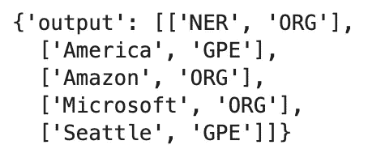

# SageMaker 定制多容器端点

> 原文：<https://towardsdatascience.com/sagemaker-custom-multi-container-endpoints-21123f794c58>

## 自带带有多容器端点的容器

图片来自 [Unsplash](https://unsplash.com/photos/qMehmIyaXvY) 作者[滕玉红](https://unsplash.com/@live_for_photo)

我曾经写过亚马逊 SageMaker 提供的各种[推理选项](https://aws.plainenglish.io/what-sagemaker-inference-option-should-you-use-2e88c8fc70bf)。特别是，[实时推理](https://docs.aws.amazon.com/sagemaker/latest/dg/realtime-endpoints.html)有大量的选项，您可以根据自己特定的机器学习用例进行选择。特别是在这篇文章中，我们将看一个带有 [**多容器端点**](https://docs.aws.amazon.com/sagemaker/latest/dg/multi-container-endpoints.html) 中一个更高级选项的例子。

**多容器端点的用例是什么？**有时你可能有**个不同的框架**来评估或用于推理。例如，您可能有两个模型，一个在 PyTorch 中，另一个在 TensorFlow 中。你不能把它放在[多模型端点](https://docs.aws.amazon.com/sagemaker/latest/dg/multi-model-endpoints.html)上，因为有一个公共框架的严格要求。多容器端点允许您使用 2-15 个不同的容器，您可以在一个端点后托管这些容器。它们也可以在一个叫做[串行推理管道](https://docs.aws.amazon.com/sagemaker/latest/dg/inference-pipelines.html)的东西中链接在一起。要完全理解多模型和多容器端点之间的区别，请查看这篇[文章](/sagemaker-multi-model-vs-multi-container-endpoints-304f4c151540)。

具体到这个例子，我们将看看如何[将自己的定制容器](/bring-your-own-container-with-amazon-sagemaker-37211d8412f4)与两个**不同的定制 NLP 库**在[空间](https://spacy.io/)和[文本块](https://textblob.readthedocs.io/en/dev/)中带到一个多容器端点。SageMaker 的深度学习图像不支持这些框架，所以我们必须为每个框架构建自己的容器，并将其缝合在多容器端点之后。**我们将跳过许多与自带容器相关的步骤，因此我鼓励您查看我在上面**链接的定制容器文章。我们将以此为基础创建多容器端点。

**注意:**对于刚接触 AWS 的人来说，如果你想继续学习，请确保在下面的 [**链接**](https://aws.amazon.com/console/) 中注册账户。部署过程中会产生成本，尤其是如果您让端点保持运行。本文还将假设您对 SageMaker 和 AWS 有一定的了解。

# 目录

1.  设置
2.  构建模型和端点配置
3.  创建端点和调用
4.  其他资源和结论

## 设置

在开始使用多容器端点之前，我们需要在 Spacy 和 Textblob 中为我们的两个框架设置单独的容器。为此，我们需要为两者提供一个 docker 文件。

Textblob Dockerfile

空间文件

文件设置仍然与自带容器(BYOC)方法基本相同。主要的变化是我们需要考虑这样一个事实，即在多容器端点中，容器监听在`SAGEMAKER_BIND_TO_PORT`环境变量中指定的端口。在单个容器中，这被硬编码为 8080，为了反映这一变化，我们更新了容器设置中的 nginx.conf 和 serve 文件。您可以为您的多容器设置原样复制这些文件。你需要做的一个关键改变是添加下面的标签(如上所示)以确保你的容器符合这个要求。

添加到多容器中的 docker 文件

您可以在下面的[文档](https://docs.aws.amazon.com/sagemaker/latest/dg/inference-pipeline-real-time.html)中了解更多信息。现在，确保编辑 predictor.py 文件，以反映您的模型所具有的推理逻辑。将您的定制映像推送到 ECR 后，我们可以设置 [boto3 SageMaker 客户端](https://boto3.amazonaws.com/v1/documentation/api/latest/reference/services/sagemaker.html)，并准备创建我们的多容器端点。

客户端设置

使用这些客户端，我们现在已经准备好完成通常的模型、端点配置和端点创建步骤。

## 构建模型和端点配置

首先，我们为不同的容器指定 ECR 映像 URI，然后指定我们希望在一个[执行配置](https://docs.aws.amazon.com/sagemaker/latest/APIReference/API_CreateModel.html#sagemaker-CreateModel-request-InferenceExecutionConfig)对象中直接调用(这是特定于多容器端点的)。

容器图像 URIs

我们指定的 ContainerHostname 键是我们稍后将用来调用特定容器的名称。使用我们的 SageMaker 客户端，我们可以创建一个模型，指定我们刚刚定义的两个容器。

多容器模型设置

通过在我们的 [create_model](https://boto3.amazonaws.com/v1/documentation/api/latest/reference/services/sagemaker.html#SageMaker.Client.create_model) API 调用中指定 containers 参数，我们告诉 SageMaker 我们正在处理一个多容器端点。然后，我们可以将这个模型提供给我们的端点配置。

端点配置创建

在这里，我们指定端点配置细节，例如实例类型，确保选择适合您的模型和容器大小的实例。

## 创建端点和调用

现在，我们可以采用端点配置并创建我们的端点。

创建端点

在您的端点处于状态之后，您应该能够通过指定 TargetContainerHostName 来调用这两个容器。

空间容器

空间推理(作者截图)

TextBlob 容器

TextBlob 推断(作者截图)

确保删除您的端点和任何您不希望保持挂起状态的资源。

## 其他资源和结论

 [## SageMaker-部署/实时/多容器/MCE-在主服务器上定制…

### SageMaker 推理选项和其他功能的例子汇编。…

github.com](https://github.com/RamVegiraju/SageMaker-Deployment/tree/master/RealTime/Multi-Container/mce-custom) 

要访问示例中的**完整代码**，请查看上方的**链接，还有大量其他 SageMaker 推理示例和资源。如果您已经设置了一个自定义容器，那么将多个引入到多容器端点并不困难，正如您在本例中所看到的。再一次，**确保根据需要调整你的 Dockerfile 和 predictor . py**来反映你的框架。**

多容器端点为复杂的机器学习推理系统提供了极大的灵活性。我希望这篇文章是关于多容器端点和 SageMaker 推理的好入门。

*如果你喜欢这篇文章，请在*[*LinkedIn*](https://www.linkedin.com/in/ram-vegiraju-81272b162/)*上与我联系，并订阅我的媒体* [*简讯*](https://ram-vegiraju.medium.com/subscribe) *。如果你是新来的中号，用我的* [*会员推荐*](https://ram-vegiraju.medium.com/membership) *报名吧。*